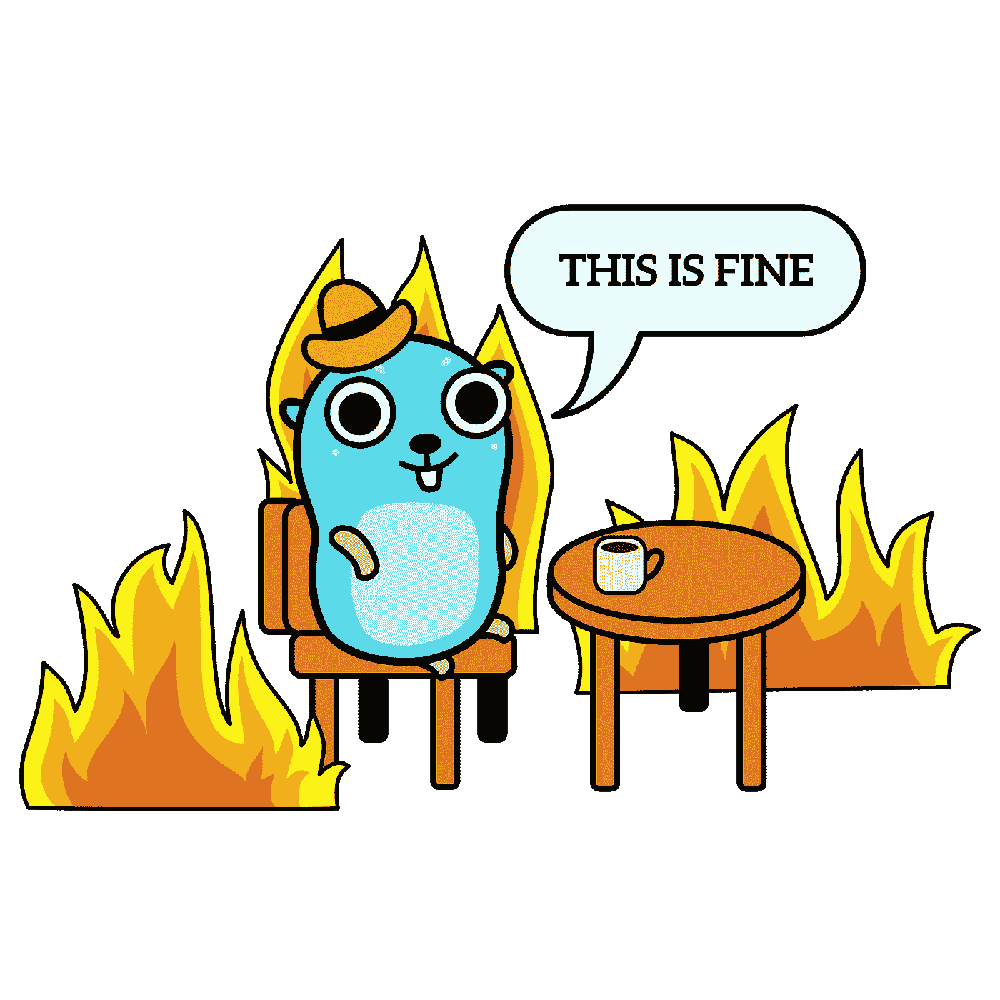

# 如何在 Go (Golang)中编写无 Bug 的 Goroutines

> 原文：<https://itnext.io/how-to-write-bug-free-goroutines-in-go-golang-59042b1b63fb?source=collection_archive---------1----------------------->

## 以下是可预测、可靠且无错误的 Go 代码的并发性最佳实践。

一只不遵守规则的地鼠

# Go 中的并发性

围棋因其并发性而广为人知并受到**的喜爱。go 运行时管理称为 goroutines 的轻量级线程。Goroutines 编写起来既快又简单。**

您只需在另一个线程中，在您想要异步执行的函数前键入`go`。

**听起来够简单吧？**

Goroutines 是 Go 编写异步代码的方式。

理解 goroutine 以及更一般的并发性是如何工作的很重要。Go 提供了管理 goroutines 的方法，使它们在复杂的程序中更易于管理和预测。

> 因为 goroutines 太好用了，所以也太容易误用了。

# 1)不要对异步例程中的执行顺序做出假设

在 Go 中调度并发任务时，记住异步任务的不可预测性很重要。

混合异步和同步计算是可以做到的，但前提是同步任务不对异步任务做任何假设。

初学者经常犯的错误是创建一个 goroutine，然后根据 goroutine 的结果继续执行同步任务。例如，如果 goroutine 要写入其作用域之外的变量，然后在同步任务中使用该变量。

## 假设执行顺序

假设 goroutines 的执行顺序

**这种模式会导致不可预测的行为**。它引入了依赖于我们无法控制的因素的代码；与 go 运行时相关的因素，更具体地说，是它如何管理 goroutines。

> 像这样编写代码意味着您假设 goroutine 将在需要结果之前完成它的任务。

**首先**，如果没有某种管理技术(我们将会讨论)，交错异步和同步代码的成功将取决于 CPU 的可用性。

这意味着，如果有 CPU 密集型进程与 goroutines 同时运行，那么执行时间会有所不同。

**其次**，不同的编译器会对 goroutines 进行不同的调度。因此，最好不要假设 goroutine 会在同步任务中完成。

**你能做些什么来确保 goroutine 已经完成？**

> 使用频道。

## 使用通道通知异步任务完成

通道应该用于接收来自异步任务(如 goroutines)的值。

如果你想防止阻塞进一步的执行，直到最终从通道中读取一个值来释放它，通道可以被**缓冲**。

如果您想要 *1 进 1 出*行为，通道可以是**非缓冲**。

在这个例子中，使用通道，我们可以确保主任务一直等到异步任务完成。当 goroutine 完成其工作时，它将通过通道`done`发送一个值，该值将在对`numbers`数组进行操作之前被读取。

等待 goroutine 结束频道

虽然这是一个虚构的例子，但是您可以看到它的用处:当主线程与 goroutine 并行处理复杂的工作时。这两项任务可以同时完成，没有出现`panic`的可能。

# 2)避免跨并发线程访问可变数据

跨多个 goroutines 访问可变数据是在程序中引入数据竞争的好方法。

数据竞争是指两个或多个线程(或上下文中的 go routine)**同时访问相同的内存位置**。

这意味着跨线程访问同一个变量会导致不可预测的值。如果两个进程同时访问同一个变量，有两种可能:

*   两个线程的值相同(**不正确**)。
*   对于较慢/较晚的线程，该值是不同的。(**纠正**)

如果较慢/较晚的线程读取已被较快/较早的线程修改的更新值，那么它将对该更新值进行操作。**这是预期的行为。**

否则，**如在数据竞争**中所见，两个线程将产生相同的值，因为它们都将对未改变的值进行操作。

## 1000 种可能的数据竞争

在这个例子中，我们使用`sync.WaitGroup`来保持我们的程序运行，直到所有的 goroutine 都完成，但是我们不控制对每个 go routine 中变量的访问。

**根据发生的数据竞争数量，该代码可以打印 0-1000**之间的任何数字。

其工作方式是，两个线程将分别对同一个变量执行 2 次操作，总共将有 2 次读取+ 2 次写入。

> 在两个线程产生相同值的情况下，两(2)次读取都必须发生在对变量的任何写入之前。

## 使用互斥体在不同的例程间共享内存

为了防止 goroutines 中的数据竞争，我们需要同步对共享内存的访问。我们可以使用互斥来实现这一点。互斥体将确保我们不会同时读取或写入相同的值。

它本质上是**暂时锁定对变量的访问**。

使用同步。互斥锁暂时保护对变量的访问

就这么简单。

**该代码将始终产生 1000** ,因为对同一变量的每个后续操作都将基于更新后的值。

# 3)不要编写应该同步的异步任务

Goroutines 通常被认为是后台任务。它们被看作是可以与主程序同时运行的小任务，通过一个 goroutine 将它委托给另一个线程。

当学习 Go 时，你倾向于考虑使用 goroutines 来最小化阻塞操作或使我们的程序更高效。

但是由于对 goroutines 的看法过于简单，**很容易养成把所有东西都做成 goroutine** “以防万一”的习惯。

如果某些任务本质上是同步的，这可能会导致问题，但是你已经异步地使用它们了。

## 不是所有的事情都应该是完美的

有些任务需要**命令**。在许多过程中，下一项任务取决于前一项任务的结果。这些连续的任务会使你的程序出错，并且不可避免地需要使这些区域更加同步。

因此，在有些情况下，您还不如忘记 goroutine，首先让它保持同步。

## 无限循环浪费 CPU

在这个虚构的例子中，我们有一个程序，它将所有事情委托给 goroutines，并使用 for 循环来保持程序运行。

这是一个**如何不**控制围棋程序流程的例子。

最好让事情简单化。你可以通过用主**线程、**线程和额外的**线程来思考你的程序，来防止这种不良行为。您可以让事情以同步的方式在主线程上运行，但是如果需要的话，可以通过 goroutines 将任务委托给另一个线程。**

还有更好的方法可以控制程序的流程，比如通过[**wait groups**](https://gobyexample.com/waitgroups)**或者** [**通道**](https://gobyexample.com/channels) **。**

## 控制 WaitGroup 的流

为了避免浪费宝贵的 CPU 资源，您可以使用 WaitGroup 向运行时表明，您正在等待`n`任务的完成，然后程序才能退出。这不会让 CPU 无限循环。

使用 WaitGroup 控制流

首先，您需要提供等待完成的任务数量作为`wg.Add()`函数的参数。

放置`wg.Wait()`很重要。**这是程序中执行将暂停**的地方，等待所有任务完成。

一旦任务**完成**，你用`wg.Done()`让程序知道。

# 4)不要让 goroutines 挂着

确保处理掉不再使用的食物。持续运行的 Goroutines 将会阻塞并浪费宝贵的 CPU 资源。

如果一个 goroutine 试图发送一个值给一个没有任何阅读器等待接收该值的通道，就会发生这种情况**。这实质上意味着通道将永远被阻塞。**

## 9 悬挂式 Goroutines

在本例中，通道仅读取**一次**。这意味着 9 个 goroutines 正在等待通过通道发送值。

通过阻塞通道悬挂 goroutines

为了避免这种情况，请确保通过处置不再需要的 goroutines 来释放 CPU。

## 使频道缓冲

使通道缓冲意味着您为通道提供了存储额外值的空间。

对于当前的例子，这意味着所有的 goroutines 都将成功执行，并且不会阻塞。

使用缓冲通道防止程序挂起

## 不要在不知道什么时候停止的情况下开始一场战争

在不知道何时停止的情况下启动 goroutine 将导致这种行为，即 goroutine 被阻塞或浪费 CPU 资源。

你应该知道什么时候 goroutine 会停止，什么时候不再需要它。

**你可以通过** `**select**` **语句和**通道来实现

使用通道选择作为退出信号

这本质上是一个带有退出条件的异步 for 循环。

重要的逻辑将在`default`条件下写入。

> 当一个值被发送到`done`通道时，循环将停止，如`done <- true`所示。这将意味着通道读取`<-done`成功并返回。

# Go 中的并发性非常强大

但它也可能是失眠、冒名顶替综合症和脱发的原因。

了解何时以及如何使用 Goroutines 将有助于防止这种情况。

## 感谢阅读！有任何问题，请在评论中告诉我。