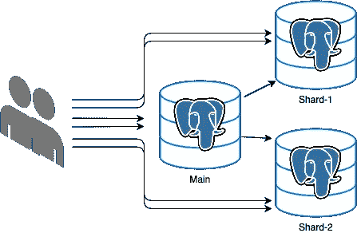

# 如何编写 DDD、可伸缩和类型安全的 NodeJS 后端？

> 原文：<https://itnext.io/how-to-write-ddd-scalable-and-type-safe-nodejs-backends-e0711403a755?source=collection_archive---------0----------------------->

在本文中，我们将介绍一种用 typescript 编写 NodeJS 代码的方法，这种代码是可伸缩的，并且易于推理。此外，我们将应用 CQRS 和领域驱动的设计原则，即使这个领域还不是众所周知的。之后，我们将讨论如何扩展应用程序，以及如何将它分成几个微服务。

# 从写入中拆分读取

几乎每个应用程序的读取次数都远远多于写入次数。因此，扩展读取端应该是我们的首要任务。最初，我们可以从单个数据库实例开始；让我们使用 Postgres 作为一个读(以及后来的写)数据库。为了扩展 Postgres，我们可以很容易地设置一个只读副本集，用于查询数据。然而，数据复制引入了最终一致性，这意味着当查询副本时，数据可能是陈旧的。这应该在您的前端考虑到(使用版本控制)。这就是为什么最好从单个实例开始，并在必要时引入读取副本集。

在 NodeJS 应用程序中，我们只需编写查询任何读取副本的路由/解析器。知道我们应该在查询副本之间有一些负载平衡是很重要的。如果您自己托管数据库，可以使用类似 Pgpool-II 的工具。然而，使用云解决方案来托管数据库可能更好也更便宜。

碎片 1 和 2 是读取副本，用于查询

需要注意的是，在查询和读取数据时，我们不应该引入任何副作用，从而避免数据的内部和外部突变。这是应用 CQRS 的一个基本原则。

另一种方法是使用 Hasura 之类的服务，它将数据库模型映射到 GraphQL 类型和解析器。此外，它们提供现成的授权和身份验证规则。真的推荐给你去看看。如果你想只写 SQL，检查一下 https://github.com/adelsz/pgtyped[的包](https://github.com/adelsz/pgtyped)，它提供了 codegen 工具来运行你的类型安全的查询。对于我个人的项目，我主要使用 Hasura 结合前端的 [GraphQL 代码生成器](https://www.graphql-code-generator.com/)读取/查询数据。

# 改变数据

我发现计算机科学中最难的事情之一是管理状态。因此，这可能是最难掌握的部分。让我们定义一个简单的支付和订单服务，我们将使用它作为一个例子，看看我们会想出什么。

首先，我们将应用一个领域驱动的方法:定义在我们的服务中可能发生的事件(只是一些，我不是领域专家)

*   订单已满
*   订单已取消
*   已下单
*   请求付款
*   付款已付
*   付款已取消

让我们在 typescript 中定义它:

我们将使用带有一些泛型的`*TEvent*`作为基本类型，以确保事件数据有效载荷的相同结构。

现在是时候定义在某些不变量下产生事件的命令了。我们将对命令使用函数方法，而不是集合根或类。因此给出了一个纯粹的函数:

> 命令(状态，有效负载)= >[事件]；

typescript 实现:

这些命令处理程序应该保存业务不变量。如您所见，这些函数是纯函数，因此很容易测试。使用 helper 函数的一个好处是我们将额外拥有类型安全。

我们现在有了基本的应用程序，它有一些业务不变量，没有额外的库/框架作为依赖。

然而，在我们的实现中有一个缺失的特性，那就是工作流，或者更好的称呼，我们案例中的事件流。

当事件 X 发生时，我们在应用程序中给出了下一个事件流，然后事件 Y 也发生了:

*   订单->付款请求
*   付款已付->订单已完成
*   付款取消->订单取消

因为我们只有一个服务，处理付款和订单，我们会做所有的事情。在下一部分中，我将解释如何将其移动到 2 个微服务。

在进行过程中，有几种方法可以解决我们的问题:

*   在我们的控制器中调用多个命令。然而，这带来了一个缺点，当我们在多个地方调用我们的命令时，很容易忘记工作流需求。
*   在命令处理程序中创建事件。例如，place_order 命令创建两个事件，OrderPlaced 和 PaymentRequested。然而，这将使以后更难重构和转移到单独的服务。此外，place_order 的输入应该具有 request_payment 命令的附加数据。
*   为流创建新的命令处理程序，并隐藏(不导出)底层命令。在我看来，这是两全其美。

第一个流是这样的:

有时从命令处理程序返回新的派生状态是有用的，那么我们需要将命令处理程序的签名修改为:

> command(state，payload)= > { newState:derived state，events: [events] }

## 如何保持状态/事件

目前，我们还没有为写端引入任何持久化。有几种方法可以做到这一点。

*   Eventsourcing (ES):存储所有事件并从事件流中创建投影
*   使用(关系)数据库并更新提交中的预测/模型

当你的系统每秒写入次数很少(低于 100 次)时，你真的不应该考虑用**事件源**来存储事件。也许只是出于法律原因，你应该调查一下；否则，它将引入许多新的挑战，例如事件排序和预测的最终一致性。此外，对事件进行版本控制很困难，您需要特定的基础设施来处理它。

> 我强烈建议您不要在系统每秒写入次数很低的时候使用事件源，尤其是在域和事件负载未知或不稳定的时候。

但是，您可以出于审计目的自由使用事件，但要避免进行预测。

## 使用关系数据库

至于阅读方面，我们将再次尝试。我们将应用与 commandHandlers 相同的“映射”方法，但是输入和输出是不同的:

> SQL mapper(event)= >[查询]

类型安全代码:

你可能想知道为什么我们返回一个*查询*对象的数组，那是因为这是**引入副作用或者更新将在事务中运行的读取**的投影的好地方。此外，我们可以使用额外查询来确保跨业务逻辑的一致性，稍后将详细介绍。

我们的控制器看起来会像这样(我只是为这个想法实现了 2):

**使业务规则在并发请求中保持一致**

在当前的实现中，有一个主要问题。当同时调用 payPaymentController 时，可能会两次完成订单，从而两次发出事件。当将来我们将引入副作用/工作时，如邮寄给我们的客户或运送产品，这尤其糟糕。DDD 说，我们应该把保持一致状态的实体分裂成聚合根。然而，这个原则需要对领域有很好的了解(这通常是缺乏的)。在我看来，我们可以确保与其他技术的一致性，基于每个事件。我们可以使用数据库约束来避免每个事件的版本属性的一致性问题。想法如下。当我们有一个应该一致的模型时，我们将在模型上引入一个版本号。对于影响模型的每个事件，我们将版本增加 1。当我们提交数据库时，我们通过使约束无效来确保数据库中不存在该模型的更高版本。我们正在使用乐观锁定，它的优点是性能更好，而不是使用其他锁定机制。如果数据库事务抛出错误，我们只需重试整个`payPaymentController`函数或中止整个请求(最终用户需要重新提交)

如何实施:

*   首先，我们在数据库表的`version`列上定义一个约束:`version ≥ 0`
*   其次，我们为特定事件向 sql 映射器添加一个额外的查询:

确保一致性查询优先于更新查询是很重要的。

为了提高性能，可以在`id + version`列上添加一个索引，以加快更新速度。

最后，理解我们应该在我们的控制器/解析器中只产生一个副作用(可以与许多提交一致)是很重要的。

要创建带有控制器/解析器的 NodeJS 服务器，有许多库，如 ExpressJS 和 FastifyJS。这里就不讨论这些库/框架了。但是，您应该考虑一下哪些是水平扩展的(大多数都是这样)。

# 摘要

我们有一个基本的、可测试的、类型安全的服务实现。这取决于 Postgres 实例的速度，可以扩展很多。这是因为我们在设计中避免使用表锁和行锁，而是使用乐观锁和优化读取。**在下一部分，我们将讨论如何以一致的方式添加额外的功能，如电子邮件作业、空闲通知和任何其他副作用。**我们还将把服务分成两个独立的微服务。

编辑:后续文章[https://medium . com/it next/how-to-create-simple-and-scalable-event-driven-nodejs-services-14e 9 dee 75 a 74](https://medium.com/itnext/how-to-create-simple-and-scalable-event-driven-nodejs-services-14e9dee75a74)

感谢阅读。