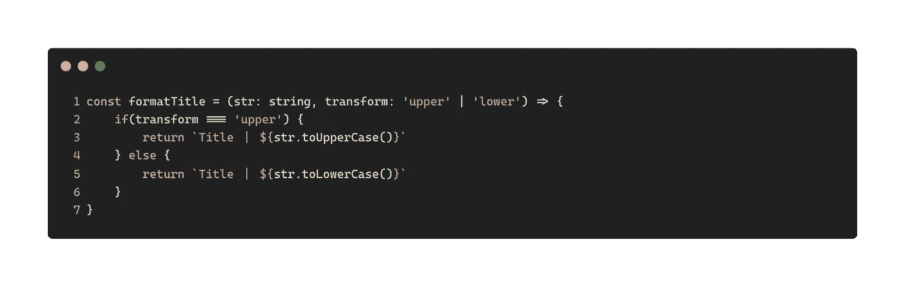
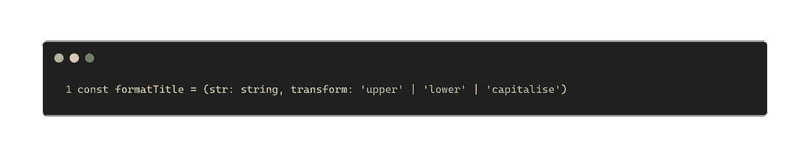
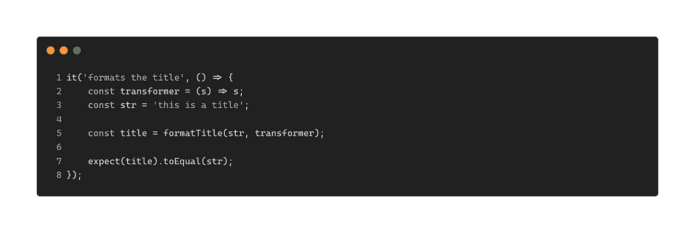
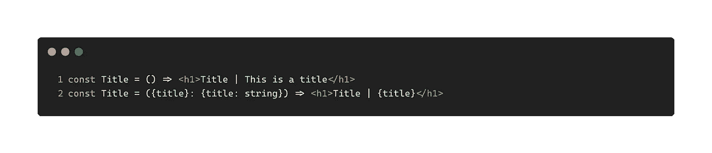
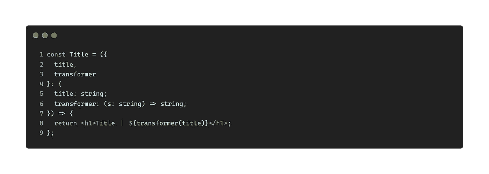
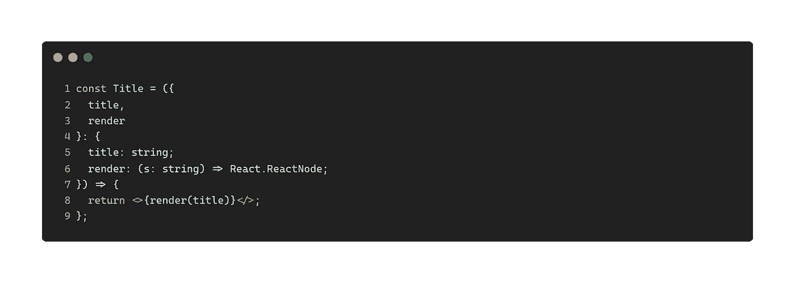
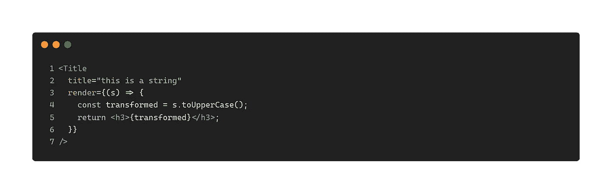
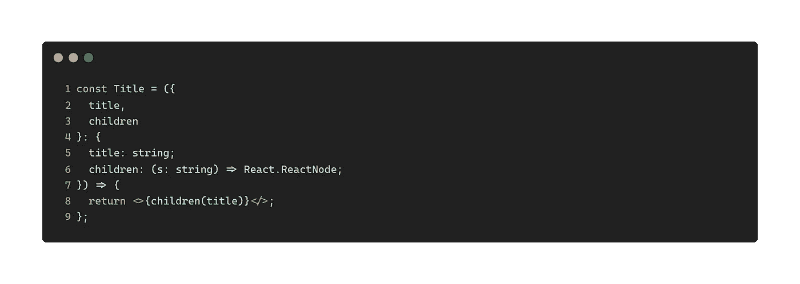
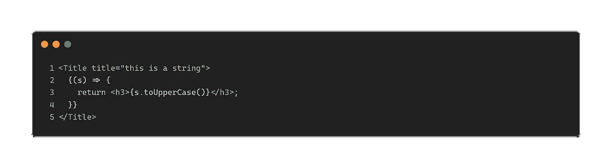
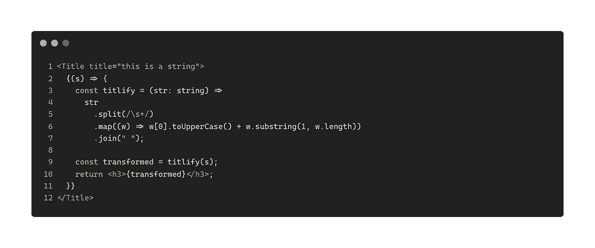

# 如何写出更多可重用的代码？

> 原文：<https://itnext.io/how-to-write-more-reusable-code-73f936283eff?source=collection_archive---------0----------------------->

在以写代码为生多年后，我发现了一些有趣的事情:程序员所做的无非是在抽象和具体之间跳来跳去。他们要么提取一些东西使它们更通用(这样它可以被广泛使用)，要么使用一个抽象的实例来解决一个特定的问题。换句话说，他们将代码抽象为具体的用法(尽管有时他们做得太过了)。

> 需要注意的是，没有一个受过职业道德训练的软件工程师会同意编写一个 `*DestroyBaghdad*` *程序。相反，基本的职业道德要求他编写一个* `*DestroyCity*` *程序，巴格达可以作为一个参数。*
> 
> ——纳撒尼尔·博伦斯坦


[雷尼尔·里道](https://unsplash.com/@rainierridao?utm_source=medium&utm_medium=referral)在 [Unsplash](https://unsplash.com?utm_source=medium&utm_medium=referral) 上拍摄的照片

一般来说，你越抽象，就越容易被重用。如果你发现一些硬代码，提取它作为一个参数。有时候一个参数是不够的，然后你提取一个保存这些参数的对象，甚至是一个可以为你产生这些参数的“函数”(我们将在下面的例子中看到这一点)。

# 好代码，坏代码？

就像俗话说的“浪费只是用错了地方的资源”一样，糟糕的代码本质上只是一些写错了地方的代码。如果你能找到一种方法使现有的代码易于修改和适应新的用途，那么你就有了一个优雅得体的设计——这个过程被称为*重构*。

好了，理论到此为止。让我们来看一些例子，看看我在这里抽象和具体化是什么意思。

# 字符串格式化函数

让我们想象一下页面上的一个小特性:我们需要以一种特殊的方式格式化一个给定的标题——大写。例如，当标题是`this is a string`时，那么我们需要将其转换为:

```
('Title ｜ ' + 'this is a string').toUpperCase()
```

我们很快意识到上面的代码只能处理这个特殊的字符串，所以我们需要让它处理任何给定的字符串。那么我们需要一个功能。

```
const formatTitle = (str: string) => `Title ｜ ${str.toUpperCase()}`
```

这将适用于所有字符串。随着时间的推移，在其他一些情况下，我们需要将标题格式化为小写。再引入一个参数可以解决这个问题:



formatTitle 函数

所以代码现在灵活多了。你可以把它弄得更高或更低。然而，当你想以其他方式转换一个字符串时(比如只大写一个字符串的第一个字母)，我们必须再一次扩展这个参数:



formatTitle 函数

随着转换逻辑的发展，我们还必须在`formatTitle`中放置许多 if-else 分支，直到我们意识到这里需要更多的 ***抽象*** 。更确切地说，我们需要一个**的东西**可以**在这里做**转换。换句话说，`upper`、`lower`和`capitalise`都是某个东西的实例——我们在这里给那个东西起个名字: **transformer** 。


具有高阶函数的格式标题函数

有了这个抽象，我们就把`format`和`transform`分开了，我们可以传入一个 transformer 的任何实例来得到不同的结果。

例如，传入`x.toUpperCase`将字符串转换成大写:

```
const title = formatTitle('this is a title', (x) => x.toUpperCase())
```

并传入`x.toLowerCase`将字符串转换成小写:

```
const title = formatTitle('this is a title', (x) => x.toLowerCase())
```

注意这里我们传入了一个名词，一个可以做动作的东西。即使当我们需要更复杂的逻辑时，我们也不需要改变`formatTitle`的任何东西，而是实现一个新类型的实例。

例如，如果我们想把一个 sting 做成标题格式(`This Is A Title Format`)


它不仅使代码非常灵活，而且使它非常容易测试。例如，在测试中，您只需要创建一个新类型的(抽象的)实例，它易于设置和验证:



请注意，我们是如何逐渐从`formatTitle`中提取出`transform`，并使替换另一个实现变得容易。所以本质上，这就是你如何做软件设计。

附注练习:尝试修改`formatTitle`以使前缀易于替换，同样，用户可以提供*任何东西*作为前缀。

# React 的另一个例子

假设 React 中有一个类似的案例:



React 中的标题组件

第一行`Title`组件基本上是硬编码的，并不真正可重用(除非您想要一个确切的标题，“这是一个标题”)，第二个组件接受一个参数，这要好得多。为了进行奇特的转换，我们有第二个参数:



在属性列表中带有变压器功能

实际上，我们可以用 React 做更多的事情。例如，如果我们不希望`Title`是一个`h1`，而是一个`h3`，我们可以在这里提取一个新的**概念**，一个接受字符串并返回一个 ReactNode 的函数:



使用渲染属性

就像普通组件一样使用它。请注意如何返回 JSX 节点，这为`render`在这里可以做的事情打开了一个全新的世界。你甚至可以在这里返回`header>h3.className`。



使用渲染属性

实际上，在 React 中，你甚至可以将`render`简化为`children`，而不必在道具中传递一个函数:



儿童作为渲染道具

然后你的代码会被简化一点，你可以像个孩子一样通过任何你喜欢的东西:



像孩子一样使用函数

现在，如果我们把它们放在一起，你可以看到这个抽象过程是多么强大。



把它们放在一起

请注意这里的模式:尝试从几个实例中提取一个概念:h2 或 h3 都是`heading`的不同实例，一旦我们提取了`heading`，我们注意到我们不受`heading`的限制，而是一个更广泛的概念:`component` (ReactNode)，然后`render`道具或`children`更有意义。

一旦我们有了一个通用组件(这里有`render`),我们就可以具体地传入该抽象的一个实例。但美妙的是，我们只写一次通用代码，其他地方都只是它的 ***用法***——即使是在单元测试中。

# 摘要

对我来说，*写代码是一个尽量让代码做得少的过程*。换句话说，我们需要确定当前模块的核心职责。对于其余的部分，我们应该总是寻求将它们外包出去或者作为一个单独的模块提取出来(然后在需要的时候使用它们)。

因此，可重用性的关键是尝试根据需要进行抽象，然后将调用位置替换为该抽象的具体实例。一旦你发现抽象还不够，再做一层抽象，重复这个过程。

[**报名我的邮件列表**](https://icodeit.com.au/#subscribe) **。我大概是每周通过博客、** [**书籍**](https://leanpub.com/u/juntao) **和** [**视频**](https://www.youtube.com/@icodeit.juntao) **分享干净代码和重构技巧。**