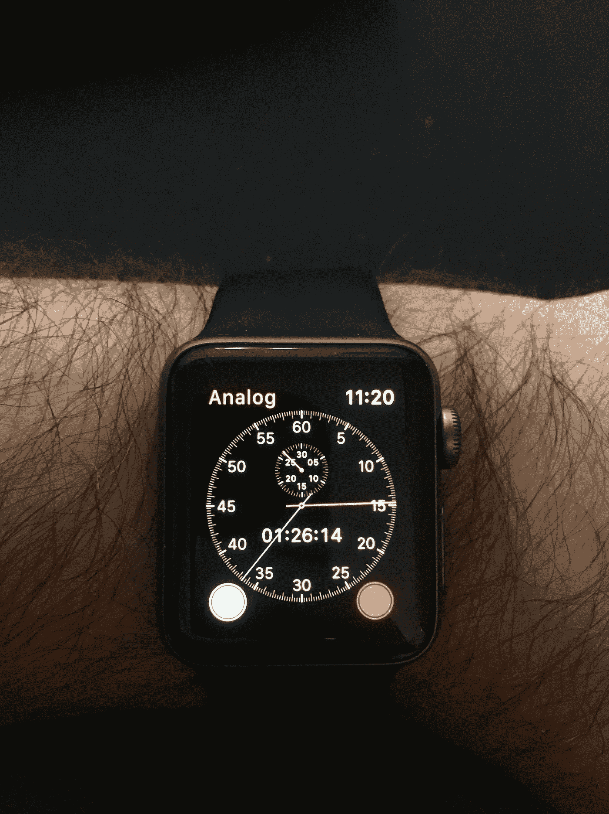
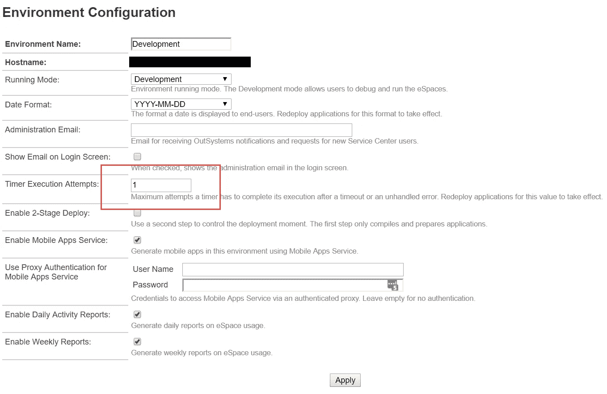

# 如何用外部系统编写安全定时器

> 原文：<https://itnext.io/how-to-write-safe-timers-with-outsystems-b76ad95ca927?source=collection_archive---------4----------------------->

OutSystems 平台中我最喜欢的特性之一是计时器。我不再编写代码，然后使用外部工具来调度和控制它，而是拥有一个构建调度任务的一站式商店。然而，仅仅坐下来为你的定时器一起猛敲代码会在运行时失败的情况下给你带来一些麻烦。让我们来看看如何编写不会给你带来麻烦的计时器。

这是一个字面意义上的外部系统计时器…任何在里斯本参加 NextStep 2017 的人都会知道为什么

# 有什么问题？

你可能想知道“这有什么关系？OutSystems 会自动重试失败的计时器，这没什么大不了的！”

对于某些应用程序，这可能没问题！但是想象一下，你正在开发一个系统，每天晚上查看发票，并试图向客户收取每张到期发票的费用。根据您编写代码的方式，您可能会对失败的发票重复收费多次，或者更糟，对成功的发票重复收费多次。呀！或者，您可能正在导入数据。重新导入相同的数据在最好的情况下会降低性能，在最坏的情况下会产生重复的数据。不太好。

# 跟踪每个记录和每个作业的成功/失败

每次运行计时器时，您应该创建一个记录来跟踪正在执行的“作业”(例如“导入数据”或“为客户开账单”)，并为您正在处理的每个记录创建另一个记录(从电子表格导入的数据行、您正在尝试开账单的发票，等等)。

您绝对需要跟踪的数据是:

*   开始日期/时间
*   停止日期/时间
*   状态(成功、已完成但无错误、已完成但有错误、失败)
*   任何输出或错误消息

# 异常处理

每个记录应该在一个操作中单独处理。该操作应该返回一个成功/失败标志和任何需要的消息，并在其内部处理异常。主定时器应该简单地调用这个动作，处理输出(适当地改变作业的状态)，并且在每个记录被处理后*执行一个 CommitTransaction】。这样，关于作业和记录的所有状态信息总是被保存。如果作业需要重新运行，您将能够筛选出已经处理过的记录。如果发生异常，您也不会被中断循环，并继续处理剩余的记录。请注意，提交事务会对性能产生影响，在某些情况下，假设允许重试，那么每十条或一百条记录提交一次可能会更好。*

当然，如果这个逻辑对您的应用程序没有意义，那么在失败后执行一个 commit 事务(记录记录历史)并抛出一个异常以退出循环，进入计时器的异常处理程序(将作业标记为失败并退出)。

# 不要自动重试

现在您正在跟踪作业的状态，获得安全计时器的下一步是阻止它们自动重试。您可以在 OutSystems 服务中心完成这项工作。将“计时器执行尝试次数”设置为 1。

服务中心->管理

# 如果您需要重试…

但是有时候你真的想在失败的情况下再试一次！在计时器结束时，如果有错误，在您的异常处理程序中，您可以查询您的作业状态历史。如果最近只有几个失败，调用您的计时器的唤醒操作让它重试。您需要为重试次数配置一个合理且安全的设置。例如，如果在过去 15 分钟内失败的作业不超过五个，则重试。

# 在计时器开始时

现在，我们有了大量的数据来显示我们的计时器的历史，我们可以做一个巧妙的技巧:查询并仔细检查失败历史，看看这个计时器是否真的应该立即运行。如果最后一次执行是成功的，那么忽略其他最近的失败，因为问题似乎已经解决了。这确保了如果调度试图重试计时器，我们不会一次又一次地重复相同的失败。

接下来，当您查询工作(要导入的数据、要处理的发票等)时。)，可以过滤掉那些和失败捆绑在一起的。因此，您不会重试将要失败的记录。这在和钱打交道的时候尤其重要！你最不希望的事情就是因为一个问题或者一个 bug 导致你重新尝试付款。即使第二次支付失败，继续重试也是不好的。

# 包装它

OutSystems 为我们提供了一个超级有用的工具，用于在预定的基础上运行代码。但是，如果没有良好的编码实践，我们可能会产生一些大问题。遵循这些步骤将确保数据完整性和业务逻辑的正确应用。

J.是