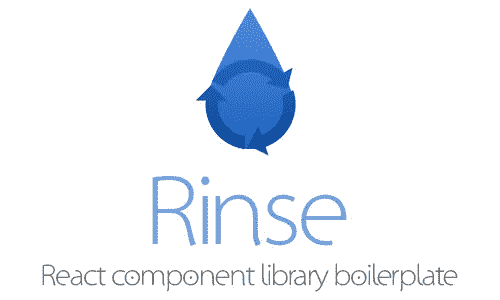

# 如何编写自己的可重用 React 组件库

> 原文：<https://itnext.io/how-to-write-your-own-reusable-react-component-library-a57dc7c9a210?source=collection_archive---------0----------------------->


[Artem Sapegin](https://unsplash.com/@sapegin?utm_source=medium&utm_medium=referral) 在 [Unsplash](https://unsplash.com?utm_source=medium&utm_medium=referral) 上的“棕色马克杯旁的 MacBOok Pro”

您是否发现自己在多个项目中反复使用一些相同的组件？这是非常常见的，花一点时间将它们编译成一个可重用的项目，您可以节省时间并提高您在未来项目中的效率。

在这篇文章中，我将一步一步地创建一个样板文件，你可以用它来启动你自己的组件库。正如我在上一篇文章中提到的那样，[我还将开发需求并在此过程中提出拉取请求。](https://medium.com/@cwlsn/github-personal-project-7d9d40b62e39)

在我们开始编码之前，我对新项目的第一条规则是总是想出一个名字和标志。它帮助我参与到项目中，并完成最后 10%的工作，这可能需要 80%的时间。此外，一个相关的表情符号可以帮助你将来计划做的任何品牌或营销。我的大多数同事认为我拿这种事情开玩笑。我是认真的。

一旦你有了自己酷的名字和 logo，继续在 GitHub 上创建你的库。我把我的叫做冲洗-反应。就像冲洗，反应，重复。



一滴和一个周期图标…漂亮的鼻子。

现在我们可以做这个东西了。第一步是设置 [webpack](https://webpack.js.org/) 来将我们的组件构建到一个可以被其他项目导入的文件中。在本例中，我们将在最后向 [npm](https://www.npmjs.com/) 发布。

# 设置 Webpack

Webpack 可能相当吓人。在使用它几年后，我仍然喜欢尽可能简单的安装文件。这就是我们在这里要做的！您可以查看我的回购第一期[中列出的要求，因此我将只讨论基本目标:](https://github.com/cwlsn/rinse-react/issues/1)

1.  接受一个文件，比如一个`src/index.js`类型的文件，输出一个文件，比如`dist/rinse.js`。
2.  处理所有我们想要的酷文件类型。
3.  偷偷加入一些新的项目管理。
4.  不要忘记`npm init`，因为我们正从零开始！

在[第一次拉取请求](https://github.com/cwlsn/rinse-react/pull/2)中可以找到对我们的基本 repo(只是 GitHub 的 init 中的许可证和自述文件)的更改。

# 创建我们的第一个组件

构建这些配套样式库的好处之一是，我们可以很快开始编写一些真正的代码。我们希望确保我们可以随时扩展这个库，所以我喜欢从一开始就采用一种相当健壮的方法来组织文件夹。你可以在第一期中查看这个任务[的需求，但这里是我通常的做法:](https://github.com/cwlsn/rinse-react/issues/3)

```
src
·· components
···· Button
······ index.js (export file)
······ Button.js (actual component code)
······ README.md (document each component!)
```

最终还会有一些其他的东西在里面，比如单元测试，可能还有一些故事书文件(或者其他可视化测试辅助工具)。一开始，用一个专用的导出文件来导入然后导出一个组件似乎有点大材小用，但是一旦您添加了许多依赖项并将组件封装在翻译和状态中，它就会派上用场。如果您想稍后介绍 TypeScript，这也会有所帮助，但那是另一个话题了。

如果您想仔细阅读第一部分的内容和某些方面的解释，[查看拉动请求](https://github.com/cwlsn/rinse-react/pull/4)。

# 怎样才能看到自己的作品？

开发这些组件时的一个问题是，在其他项目中使用它们会使链接和本地开发变得不可靠。对我们来说幸运的是，有一些方法可以记录和可视化组件，这样你就可以独立于其他项目进行工作。当你完成并推上你的甜蜜共享组件库时，你就可以知道你的应用程序中会有什么了。

有一些方法，一些著名的方法包括 [MDX](https://github.com/mdx-js/mdx) 和 [Styleguidist](https://github.com/styleguidist/react-styleguidist) ，但是对于这个目的，我认为[故事书](https://github.com/storybooks/storybook)最适合。为了开始这段旅程，我一如既往地提出了一个问题。

Storybook 的最新版本 4.0.0 alpha 支持 Babel 7 和 Webpack 4，所以我们将使用现有技术的绝对领先优势。随着时间的推移和版本变得更加稳定，我在这里作为样板文件开始的开源项目将会更新。

要查看 Storybook 是如何配置的，您可以[查看 pull 请求](https://github.com/cwlsn/rinse-react/pull/6)。

# 开发和发布

在这一点上，我们实际上已经拥有了开始制造东西所需的所有工具。我们有一个可以在屏幕上看到的示例组件。我喜欢这个“所有组件的东西都放在同一个文件夹中”的业务的原因之一是因为一个叫做 [Generact](https://github.com/diegohaz/generact) 的工具。这将允许您快速复制和智能重命名组件，包括它们的导出和故事。如果您有其他文件，比如样式或者单元测试，它们将会被类似地复制。

现在，我们如何使用这些新组件？对于这个例子，我已经向 npm 发布了我的回购。你可以在它的 [npm/rinse-react 页面](https://www.npmjs.com/package/rinse-react)上查看。

您可以将此软件包作为依赖项安装:

```
$ npm i -S rinse-react
```

在 React 项目中，尝试放置一个按钮。

```
// In your component
import { Button } from 'rinse-react';// In your render function
<Button type="submit" onClick={this.submit}>Hello!</Button>
```

如果您已经克隆了自己的副本并对其进行了重命名，那么在第一次发布时，您只需运行:

```
$ npm login
# Enter your username, password and email for npmjs.com
$ npm publish
```

对于未来版本，根据您的更改，您可以升级版本:

```
$ npm version [major|minor|patch]
$ npm publish
```

您的库现在位于云中，可以在任何 JavaScript 项目中作为依赖项使用。

# 接下来呢？

在我们新创建的图书馆中，有相当多的地方需要改进。这篇文章的目标(在 Git 中，从 tag 1.0.0 到更早的版本)是建立并运行一个 MVP 组件库。你可以扩大你自己的图书馆，从几件事开始:

*   [打字稿](https://www.typescriptlang.org/)
*   [玩笑](https://jestjs.io/)测试
*   CI 喜欢 [Travis](https://travis-ci.org/) 或 [Circle](https://circleci.com/)
*   一些类似于 [docsify](https://docsify.js.org/#/) 的静态文档

如果你想到一些很酷的东西要添加，请发微博给我！编码快乐！