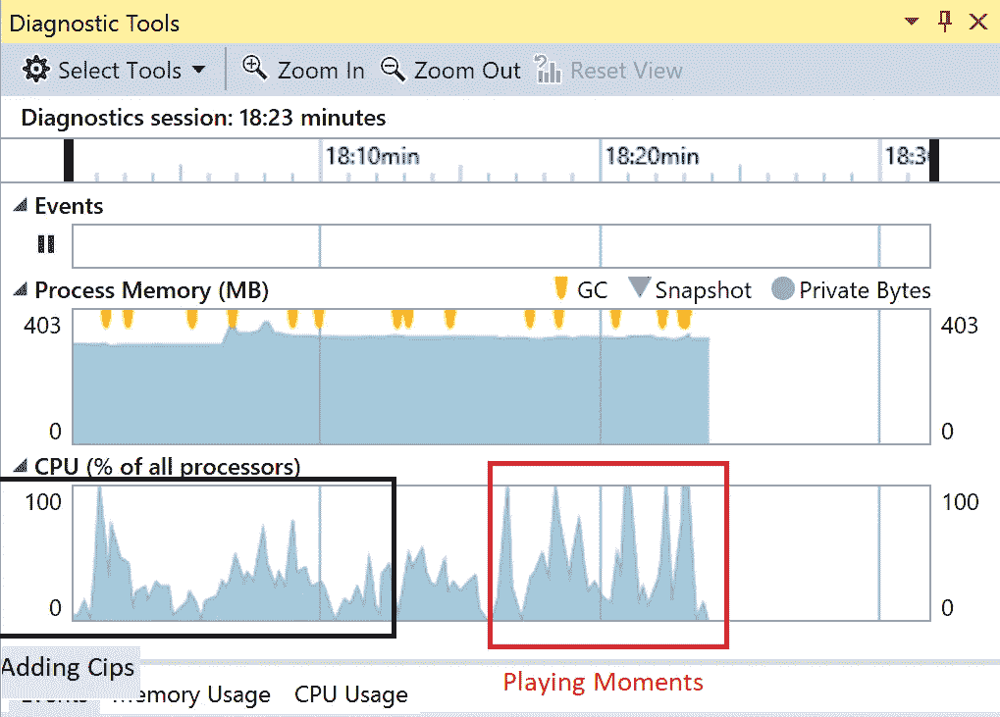
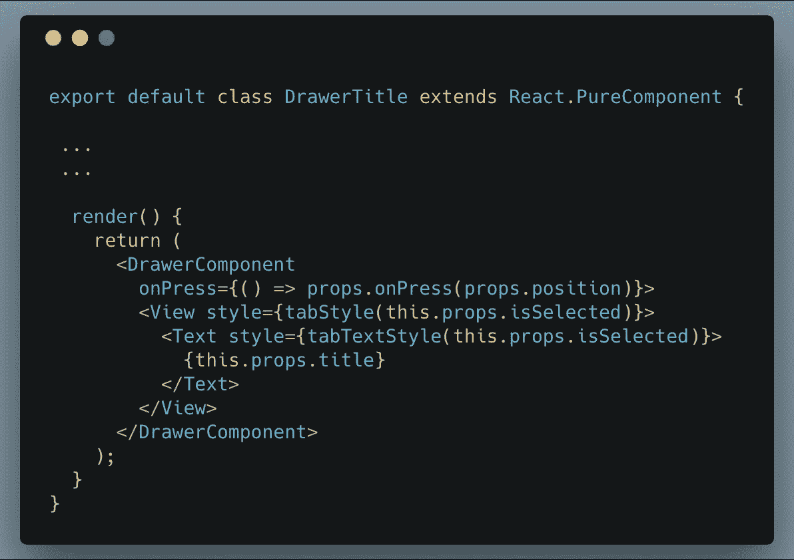
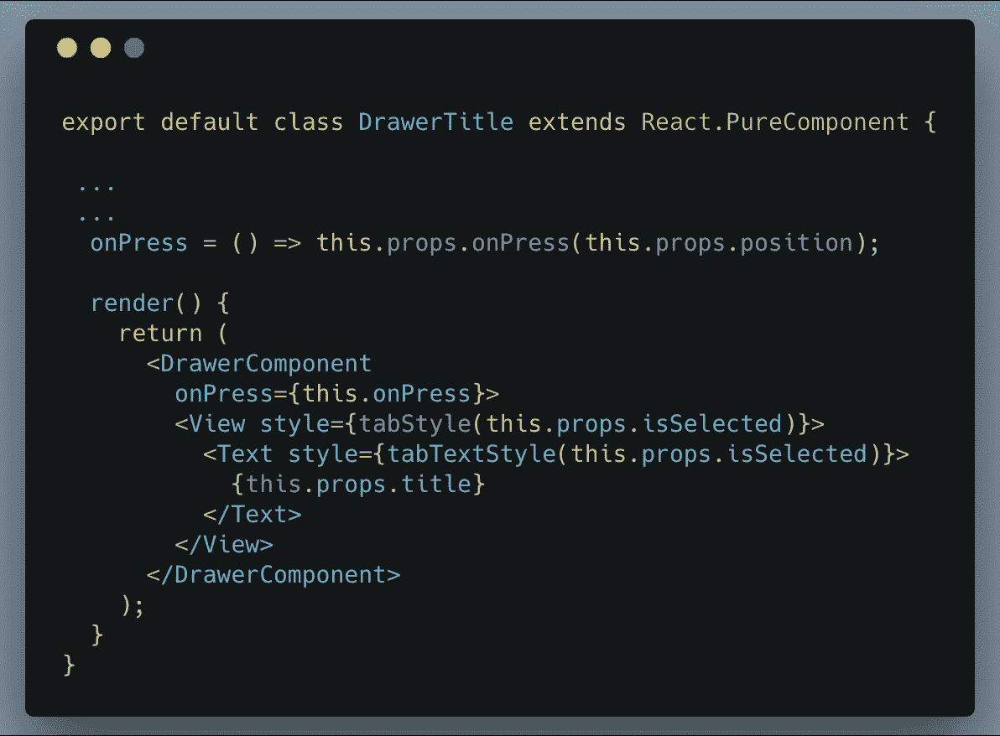
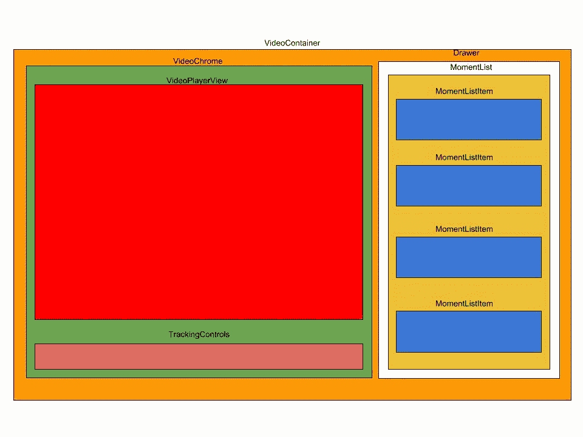

# 我们如何提升 React 原生应用的性能

> 原文：<https://itnext.io/how-we-boosted-the-performance-of-our-react-native-app-191b8d338347?source=collection_archive---------0----------------------->

[Cuentos y Fábulas](http://www.cuentosyfabulas.es/2016/10/la-liebre-y-la-tortuga.html)

这篇文章讨论了 React 原生应用程序为提高 UI 响应性所做的工作。它的目的不是列出你应该遵循的最佳实践，以提高你自己的应用程序的性能，但我们的一些改进确实来自于遵循这些实践。

我们是一个由三名开发人员组成的团队，他们都有很强的 iOS 背景，但只有一个人有之前的 React 本地经验。我们继续现有的 React 本地应用程序的工作，用户可以在该应用程序中看到以瞬间为特色的实时视频。

在我们开始开发这个应用程序后不久，我们就注意到有些地方不太对劲。该应用的性能明显比我们之前在原生项目中看到的要差。我们特别注意到:

1.  在点击任何 UI 控件和执行该动作之间有一个明显的延迟(0.5s+)。
2.  相对于视频会话的长度和时刻的数量，这种滞后经历了线性增长。

准确地说，在使用 20 多分钟后，Hudl 的精英支持负责人会对该应用的响应能力进行评分:

[喜剧城](https://lacomiquera.com/creador-de-this-is-fine-actualiza-su-famosa-tira-esto-no-esta-bien/)

*时刻是视频中感兴趣的区域，例如，如果视频对应于篮球比赛，则某个时刻可能是提示。*

# 评估 UI 响应性的指标

我们必须让我们的产品负责人明白，应用程序的响应能力已经提高了。更重要的是，我们必须证明它不会随着时间的推移而退化。

在解决这个问题时，我们只关注 Windows。React Native 没有正式支持这个平台，这一事实本身就很复杂。最大的一个问题是性能监视器不能在 UWP 上工作(至少不能在 React Native 0.47.2 中工作，这是我们使用的版本)。

我们的第一次尝试使用了 Visual Studio 分析工具。他们提供了一些有用的数据，如应用程序中出现新时刻时的 CPU 峰值，但我们找不到任何可靠的、可量化的指标来很好地关联性能和响应。

Visual Studio 诊断工具的快照

幸运的是，Hudl 有相当多的 React 和 React 本地专家可以依靠，他们建议查看每个组件的渲染计数。我们最终采用了以下流程:

1.  使用不同的工作流和每个组件的预期渲染数量创建文档。
2.  创建一个脚本，在组件中每次调用 *render()* 时进行计数，并将这些计数写入本地 html 文件。
3.  比较 1 和 2。

我们还要求我们的产品负责人和我们支持团队的一名成员在我们工作之前和之后对应用程序的响应性进行评估。虽然这个度量标准不能确保响应性不会随着时间的推移而降低，但是它确实验证了这个可量化的度量标准与响应性有很好的相关性。

所以我们最终得到了**两个关键指标**:

1.  每个组件的 *render()* 计数，检查实际值是否与一组预定义工作流的预期值相匹配。
2.  由一名精英支持成员和我们的产品负责人进行的工作前和工作后评估。

[*米哈伊·凯勒纳鲁*](https://twitter.com/MCirlanaru) *是 Hudl 的 React 专家之一。查看他关于 React 性能优化的* [*演讲*](https://speakerdeck.com/mcirlanaru/react-performance-optimizations-best-practices-hudl-engineering-internal-talk) *。*

# 提高用户界面响应能力

如前所述，当我们加入项目时，React Native 的体验并不好。我们首先必须用关于组件生命周期和行为的知识武装自己。

1.当*道具*或*状态*改变时，React 组件重新渲染。

2.在一个 *PureComponent* 中，在先前和当前*道具*和*状态*的浅层比较中发现一个“变化”。

3.在*组件*中，“改变”是指先前和当前*道具*和*状态*之间的任何参考值或数值差异。

4.实现*shouldcomponentdupdate()*提供了对组件是否应该重新呈现的精细控制。

5.*shouldComponentUpdate()*只能在*组件*中被覆盖，**不能在 *PureComponent 中***被覆盖。

有了这些信息，我们做了不同的迭代来删除代码中不必要的渲染。

## 迭代 1:避免将内联函数作为道具传递

以前

在...之后

快速阅读可能会忽略一个小差异:如何传递 *onPress* prop。

在第一个例子中，在 *DrawerTitle 的每次渲染中都声明了对该内联函数的新引用。*因此， *DrawerComponent* 将始终重新呈现自身，因为它的一个道具将始终改变。

在第二个例子中，对该函数的引用总是相同的，因此 *DrawerComponent* 不会重新呈现(除非其他任何道具发生变化)。

我的同事 Jon Reynolds [几个月前发表了](https://medium.com/in-the-hudl/blip-day-1-9e5e19dd9e4e)关于这个问题更详细的解释。

## 迭代 2:使用 pure component & shouldComponentUpdate()

一旦应用，我们确实看到了一些性能提升。许多组件的预期和实际渲染周期开始匹配。然而，仍然存在一些问题。

1.  我们将这些功能作为银弹。
2.  对于某些组件，给定工作流的预期和实际渲染数量仍然相差甚远。
3.  我们运行应用程序的时间越长，性能就越差(渲染的次数也越多)。大约 20 分钟后，我们就像这样:

[tenor.com](https://tenor.com/view/late-night-seth-lnsm-lnsmgifs-seth-meyers-this-is-not-good-gif-9200958)

很明显，问题出在别的地方。那些*纯组件*仍在重新渲染，所以问题变成了*为什么父母首先要重新渲染？*我们后退一步来分析全貌，并转向最后一次迭代。

## 迭代 3:重构代码

这是我们的应用程序中组件的层次结构图。

我们的应用程序正遭受我们称之为 ***的道具感染。*** 有一个 *prop* 值每秒都在变化，传播到图中几乎所有组件。

最大的影响来自右边的*时刻表*——它可能包含 200 到 1000 个*时刻表*。如果你记得:会话越长，响应性越差。并且会话越长，列表上的*momentl listitem*就越多，使得每个 *render()* 都更加昂贵。

这个“病毒道具”表达了本地视频播放器的视频时长。因为该应用程序播放实时视频，所以该值大约每秒都会改变。

这个迭代中的工作很简单:

1.  从任何不使用持续时间道具组件中移除*持续时间道具【】(有几个)。*
2.  重构一些组件，只接收它们自己呈现时需要的道具，例如，一个*momentl listitem*不需要 *duration* 来呈现自己。

# 结果:前后指标

## 对 render()调用进行计数

在所有的重构工作之后，对感兴趣的组件的预期的和实际的 *render()* 调用确实匹配。

## 由精英支持和产品负责人衡量绩效

在这个项目之前，他们分别给这个应用程序的性能打了 1/5 和 2/5 分。我们做完后，两人都给了 5/5 分。

# 结论

在提高应用程序性能的同时，我们学到了很多经验。

1.  *PureComponent* 和*shouldComponentUpdate()*是任何工具集的好工具。知道何时使用它们。
2.  确保只传递组件需要的*道具*。特别是，如果它是一个表示组件，确保它只接收自己需要呈现的*道具*。
3.  在适当的时候利用 redux store 或其他类似的机制，例如，当孩子可以直接从 redux store 获得某个*道具*时，不要通过三个组件将该道具传递给孩子。
4.  如果您发现自己过于频繁地使用*Component+shouldComponentUpdate()*，这可能是一种代码味道。问问你自己，父组件首先要求这个组件呈现是否有意义。
5.  没有经验法则。权力大责任大*组件*、*纯组件*、*功能组件*、、*、*给你权力大。默认使用 PureComponent 可能是事实上的标准，但是一定要权衡你的选择。可能有更适合你的情况。

## 一些警告

*   当你的对象包含复杂的数据结构时，*shouldComponentUpdate()*的内部实现可能会导致误判。来自 [React 的文档](https://reactjs.org/docs/react-api.html#reactpurecomponent):

> 如果这些包含复杂的数据结构，可能会对更深层次的差异产生假阴性。只有当您期望有简单的属性和状态时，才扩展 PureComponent，或者当您知道深层数据结构已经改变时，才使用 forceUpdate()。或者，考虑使用不可变对象来促进嵌套数据的快速比较。

*   *shouldcomponentdupdate()*实现应该很简单。您可能会遇到这样的情况，执行函数的成本比重新渲染组件的成本还要高。
*   如果父组件更新，*功能组件*将始终更新。

评论？请吧。 [@JuanjoRamos82](https://twitter.com/JuanjoRamos82)

*本文原贴于 Hudl* 中的