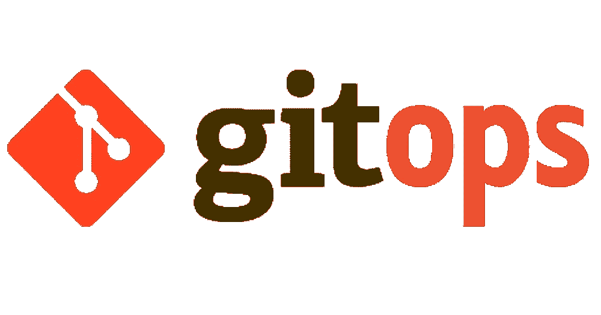
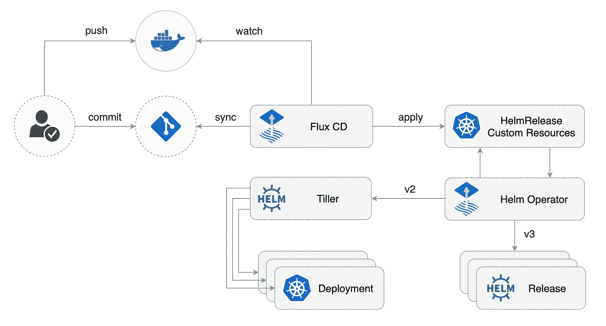

# 我们如何尽最大努力

> 原文：<https://itnext.io/how-we-do-gitops-mettle-4cc771a6c029?source=collection_archive---------0----------------------->



> 平台团队的最大原则之一是让我们的平台为工程师提供自助服务。GitOps 让我们有可能做到这一点。

在 Mettle，我们充分利用 GitOps 将一切部署到我们的集群中，我们选择使用 Flux CD(【https://github.com/fluxcd/flux】)作为我们的 GitOps 控制器。

Flux 是一个工具，可以自动确保集群的状态与 git 中的配置相匹配。它使用集群中的一个操作符来触发 Kubernetes 内部的部署，这意味着您不需要单独的 CD 工具。Flux 监控所有相关的映像存储库，检测新的映像，触发部署，并基于此更新所需的运行配置(以及可配置的策略)。



焊剂工作原理概述(参考[https://github.com/fluxcd/helm-operator-get-started](https://github.com/fluxcd/helm-operator-get-started)

# 我们如何使用 Flux @ Mettle

我们的集群中运行着许多 flux 实例，每个实例都与 GitHub 中的一个特定存储库相协调。具体来说，关于工作负载，整个过程使用三个主要的存储库，我将在下面详细解释。

## k8s-舵-图表

这是我们所有的自定义舵图表所在的地方，在合并到`master`分支时，我们创建一个新的图像标签容器，包含现有的图表以及作为拉请求的一部分而创建的任何新版本。

我们从运行在集群内部的 Helm 注册表中提供这些图表，该注册表可通过`[http://k8s-helm-charts.flux.svc.cluster.local](http://k8s-helm-charts.flux.svc.cluster.local).`访问

我们的 helm registry 的部署规范有以下注释，以便 Flux 自动部署新创建的 images 标签。

```
annotations:    
  flux.weave.works/automated: "true"    
  flux.weave.works/tag.k8s-helm-charts: semver:~1.1
```

现在我们在集群中有了 helm 注册表，但是我们如何部署呢？

## kubernetes-资源

这个存储库混合了原始的 Kubernetes 清单(`yaml`文件)和`HelmReleases`。资源包括 RBAC 策略和 PodSecurityPolicy 清单，以及 NGINX 入口控制器和 Istio 等实用程序的 HelmReleases。

我想花一点时间来深入了解利用我们的自定义图表之一的 HelmRelease 的构成(参见下面的 Prometheus):

```
spec:
  chart:
    name: prometheus
    repository: http://k8s-helm-charts.flux.svc.cluster.local
    version: 2.6.43
  releaseName: prometheus
```

您可以从上面看到指定的 helm 图表版本，位置是在集群内部本地运行的 helm 注册表。显然有一个竞争条件，我将在这篇文章的后面介绍。

我们将为每个环境创建一个目录，其中包含该环境部署我们定义的“普通集群”所需的所有资源。过去的目录结构看起来像下面这样:

```
.
├── environments
│   ├── sbx
│   ├── dev
│   └── stg
│   ├── prd
```

我们使用 bootkube([https://github.com/kubernetes-sigs/bootkube](https://github.com/kubernetes-sigs/bootkube))引导我们的集群，并且作为我们 boot kube 资产的一部分，我们部署了一个 Flux 实例，在特定的环境路径中查看这个存储库(见下文)。

```
- --[git-url=git@github.com](mailto:git-url=git@github.com):example/kubernetes-resources
- --git-branch=master
- --git-path=environment/prd
- --git-sync-tag=flux-sync-prd
```

一旦一个完整的协调循环完成,“普通集群”就可以接收定制工作负载了。

## k8s-发布-勇气

存储库只包含构成 Mettle 的每个微服务的`HelmRelease`定义，每个环境一个。目前，我们在每个环境中部署了大约 100 个微服务。下面可以看到其中一个 HelmReleases 的片段:

```
apiVersion: helm.fluxcd.io/v1
kind: HelmRelease
metadata:  
  annotations:    
    flux.weave.works/automated: "true"  
  name: account-balance  
  namespace: eevee
spec:  
  chart:    
    name: backend    
    repository: http://k8s-helm-charts.flux.svc.cluster.local 
    version: 2.0.43 
  releaseName: account-balance
```

为了保持一致性，我们所有的后端微服务都是从两个`backend`特定导航图中的一个派生出来的，以确保标签分类等方面的一致性。同样，与`kubernetes-resources`一样，我们将为每个环境创建一个包含所有`HelmRelease`定义的目录。

# 加入 Kustomize

在早期，我们在`kubernetes-resources`和`k8s-releases-mettle`的环境中有很多重复，这是我们开始密切关注 Kustomize([https://github.com/kubernetes-sigs/kustomize](https://github.com/kubernetes-sigs/kustomize))的时候。

平台团队从`kubernetes-resources`开始，因为我们想在这里证明 Kustomize 我们自己，并且不影响工程自助服务工作流。此外，我们没有看到对基础资源的很多更改，所以我们觉得使用这个存储库作为测试平台很舒服。

我们从创建以下目录开始

```
.
└── kustomize
    ├── base
    ├── dev
    ├── prd
    ├── sbx
    ├── stg
```

## 基本目录

`kustomize/base`中包含的所有内容都是非特定于环境的配置，并围绕集群的各个区域进行调整(例如入口或单点登录)。这方面的一个例子如下:

```
cluster
├── helmreleases
├── namespaces
├── priorityclasses
├── psps
├── rbac
└── storageclasses
```

`kustomize/base`中的示例`HelmRelease`如下所示:

```
---
apiVersion: helm.fluxcd.io/v1
kind: HelmRelease
metadata:
  annotations:
    flux.weave.works/automated: "false"
    flux.weave.works/tag.chart-image: semver:~1.17
  name: cluster-autoscaler
  namespace: kube-system
spec:
  chart:
    name: cluster-autoscaler
    repository: https://kubernetes-charts.storage.googleapis.com/
    version: 6.3.0
  releaseName: cluster-autoscaler
  values:
    autoDiscovery:
      tags:
        - k8s.io/cluster-autoscaler/enabled
    awsRegion: eu-west-2
    image:
      repository: k8s.gcr.io/cluster-autoscaler
      tag: "v1.17.0"
    nodeSelector:
      node.kubernetes.io/role: critical
    podAnnotations:
      iam.amazonaws.com/role: cluster-autoscaler
    priorityClassName: system-cluster-critical
    tolerations:
      - key: node.kubernetes.io/role
        value: critical
        operator: Equal
        effect: NoSchedule
```

注意这里没有应用特定于环境的入口注释。

## “特定于环境”的目录

特定于环境的目录结构与`base`目录中的目录结构一致。但是，它只包含其环境所需的目录。例如，每个环境都继承`base/cluster`目录，但不一定继承`tools`目录。让我们深入了解一下环境目录的构成…

在顶层，我们有一个单独的`kustomization.yaml`文件，它引用其中的子目录(见下文)

```
apiVersion: kustomize.config.k8s.io/v1beta1
kind: Kustomization
bases:
  - cert-manager
  - cluster
```

这些子目录中包含以下目录和文件:

```
cluster
├── helmreleases
└── kustomization.yaml
```

这个`kustomization.yaml`略有不同，它继承自`base`中的相应目录，但这里是我们修补特定于环境的配置的地方。

```
apiVersion: kustomize.config.k8s.io/v1beta1
kind: Kustomization
bases:
  - ../../base/cluster
patches:
  - helmreleases/cluster-autoscaler.yaml
  - helmreleases/kiam.yaml
```

`cluster-autoscaler`的补丁如下所示:

```
apiVersion: helm.fluxcd.io/v1
kind: HelmRelease
metadata:
  name: cluster-autoscaler
  namespace: kube-system
spec:
  values:
    autoDiscovery:
      clusterName: dev
```

## “kustomize build”的使用

要查看哪个 Flux 将进行协调，我们可以执行以下命令:

```
kustomize build kustomize/dev > dev.yaml
```

上述操作将创建一个文件，其中包含要部署到集群的所有资源，并且还应用了特定于环境的补丁。

## 这给了我们什么？

这为我们提供了`kustomize/base`中 95%的资源定义，并允许我们轻松地看到环境之间的差异。

此外，这意味着直接对`base`进行的更改会在所有环境中传播(例如，在`HelmRelease)`中升级到新的图表版本)。

相反，我们可以很容易地对单个环境进行更改以进行测试，例如升级所用图表的版本。

重要的是，它允许我们通过 CI 在应用到集群的资源到达集群之前执行验证，以确保这些资源符合规范。我们利用了 rego 策略和使用 Kubeval 的严格模式林挺。

有关这方面的更多信息，请参见下面的链接

*   参见[https://github.com/swade1987/deprek8ion](https://github.com/swade1987/deprek8ion)
*   [https://bit.ly/2RjyvCU](https://bit.ly/2RjyvCU)

## k8s-发布-勇气

平台团队随后与工程团队合作，将`k8s-releases-mettle`移到`Kustomize`，因为我们已经吸取了教训。他们与我们的顶级目录结构保持一致:

```
.
└── kustomize
    ├── base
    ├── dev
    ├── prd
    ├── sbx
    ├── stg
```

他们的子目录结构类似于`kubernetes-resources`，但是范围在`namespace`级别。工程师定义了这种结构，因为他们是负责存储库的人，所以它需要对他们有意义。

# 应用推广

我觉得很重要的一点就是要讲一下微服版本是如何通过我们的环境来推广的。

让我们从查看`k8s-releases-mettle:`的`base`目录中的一个`HelmRelease`开始

```
apiVersion: helm.fluxcd.io/v1
kind: HelmRelease
metadata:
  annotations:
    flux.weave.works/automated: "true"
  name: account-balance
  namespace: eevee
spec:
  chart:
    name: backend
    repository: http://k8s-helm-charts.flux.svc.cluster.local
  releaseName: account-balance
  values:
    application:
      replicaCount: 3
      image:
        repository: quay.io/example/account-balance
```

上面要注意的关键点是图表版本和图像标签没有指定，因为它们是特定于环境的配置。

现在我们来看看`dev`目录中对应的`HelmRelease`:

```
apiVersion: helm.fluxcd.io/v1
kind: HelmRelease
metadata:
  annotations:
    flux.weave.works/tag.application: 'glob:dev-*'
  name: account-balance
  namespace: eevee
spec:
  values:
    dependsOn:
      schemaRegistry:
        enabled: true
    application:
      image:
        tag: dev-305a3cf56ef6d9505838bdf779e4173f0bad25jg
  chart:
    version: 2.0.34
```

这里重要的部分是从`dev-`开始专门寻找图像标签的`flux.weave.works/tag.application`注释。这是我们向环境推广新形象的方式。在提交 SHA 之前，我们用环境前缀重新标记图像。

工程师们在 Concourse 中有一个脚本，它使用`kubectl`来等待发布成功，如下所示:

```
echo "Testing kubeconfig works against environment";
echo "Checking for replica set creation"attempt_counter=1;
max_attempts=60;

until [[ $(kubectl get replicaset -n "${NAMESPACE}" -l app_name="${SERVICE}",app_version="${APP_VERSION}" | wc -l) -gt 1 ]]; doif [ ${attempt_counter} -eq ${max_attempts} ]; then
  echo "Max attempts reached";
  exit 1;
fi
  attempt_counter=$(($attempt_counter+1));
  sleep 10;
done;echo 'Replica OK';

echo 'Waiting for deployment to rollout';
kubectl rollout status -n "$NAMESPACE" deployment/"$SERVICE" --watch=true --timeout=10m;
```

# 摘要

总之，利用 GitOps，我们为工程师创建了一个自助服务平台，使他们能够专注于交付业务价值，而不完全需要平台团队的帮助。他们专注于构建容器映像和管理其微服务的测试，Flux 处理部署。

# 还能做什么？

这一旅程尚未结束，我们需要做出一些改变:

## 集群 helm 注册表外

目前，当对我们的自定义 helm 图表进行更改时，我们必须等待新的注册表映像在我们的集群中部署，这需要时间，并最终导致 HelmReleases 失败，因为指定的图表版本没有出现在注册表容器映像中。

因此，我们将把我们的 helm 注册表存储在一个 Google 云平台桶中。这对我们有两个好处:

*   以相对低廉的成本实现无限存储
*   在所有环境中立即提供新的舵图版本。

最后，在集群重建时，这意味着 HelmReleases 不会因为尚未部署 helm 注册表映像而进入挂起或失败状态。

## 头盔 v3

我们仍然需要升级到头盔 3，我们将在未来一两周内完成。幸运的是`HelmRelease`让这变得微不足道，我会确保再写一篇关于我们如何管理它的博文。

# **寿师爷**

首先，我个人要感谢斯蒂芬·普罗丹([https://twitter.com/stefanprodan](https://twitter.com/stefanprodan))过去和将来的帮助，他总是愿意听取我的想法和建议，这是我的荣幸！

更广泛地说，我要感谢 Flux 社区在整个旅程中的持续帮助，我希望我们在 Mettle，特别是我自己，能够继续回馈社区我们已经学到的教训，并在未来继续学习。

# 现在是你自己尝试的时候了😊

在问了很多关于如何构建 GitOps 库的问题后，我实际上创建了一个例子，可以在[https://github.com/swade1987/gitops-with-kustomize](https://github.com/swade1987/gitops-with-kustomize)找到。

另外，我强烈推荐去 https://github.com/fluxcd/multi-tenancy 的[看看。](https://github.com/fluxcd/multi-tenancy)