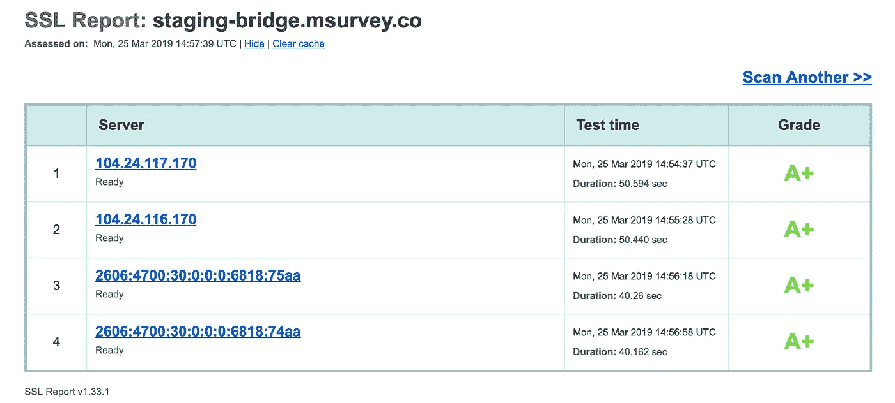
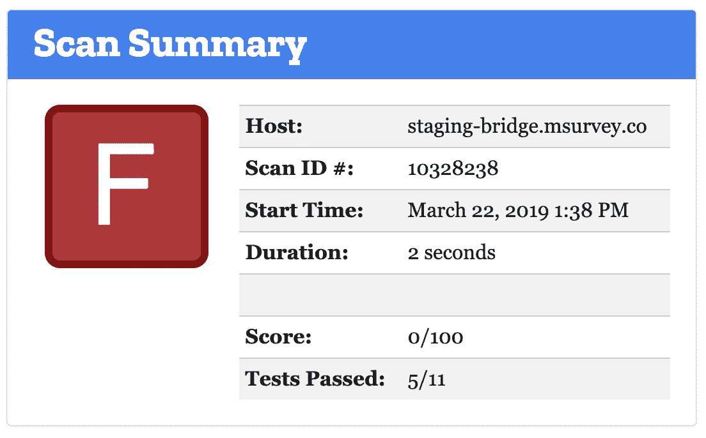
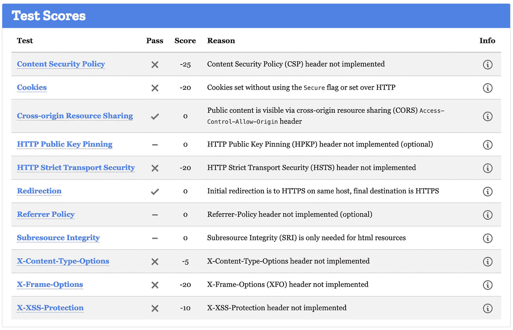
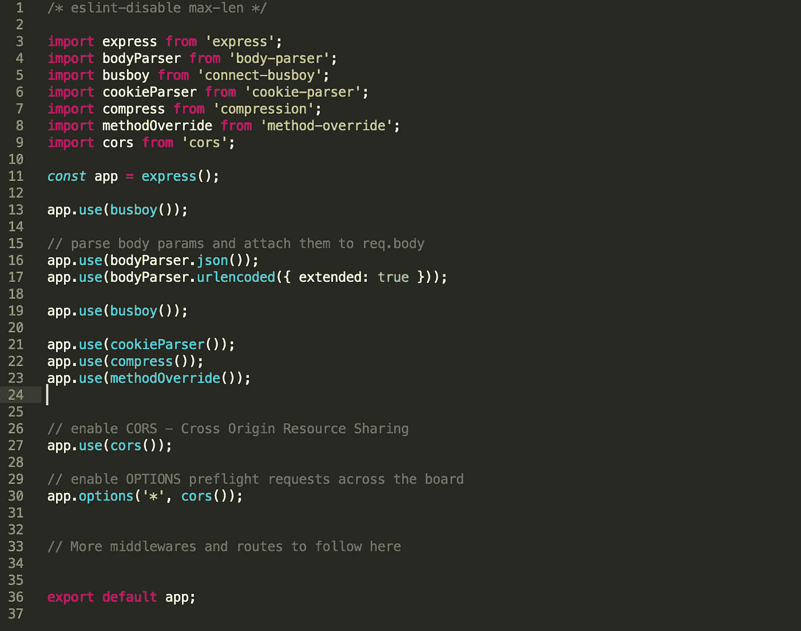
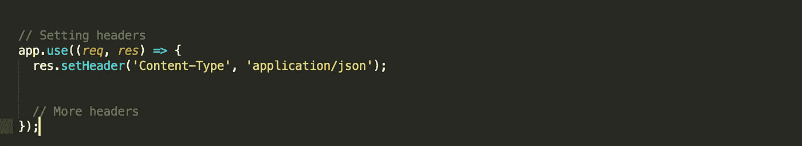
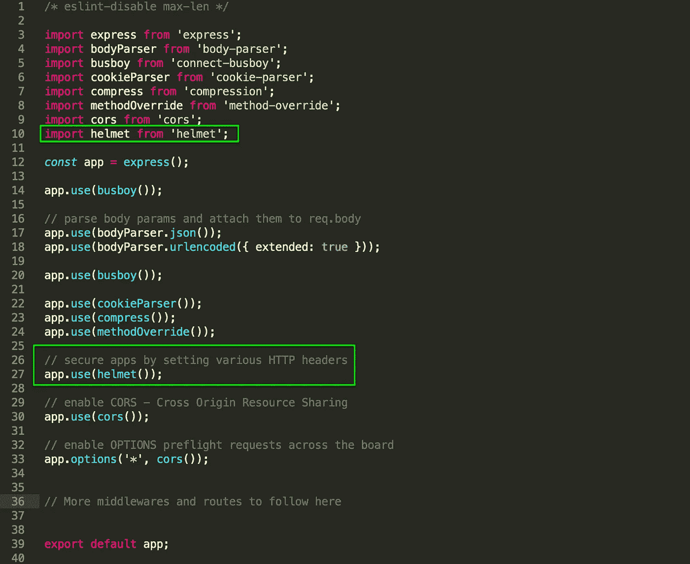
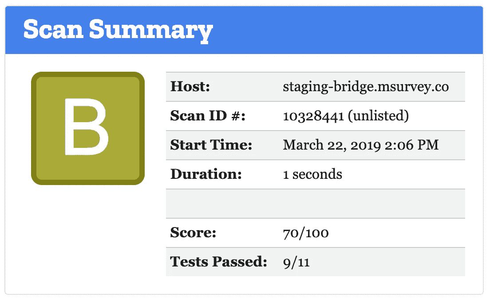
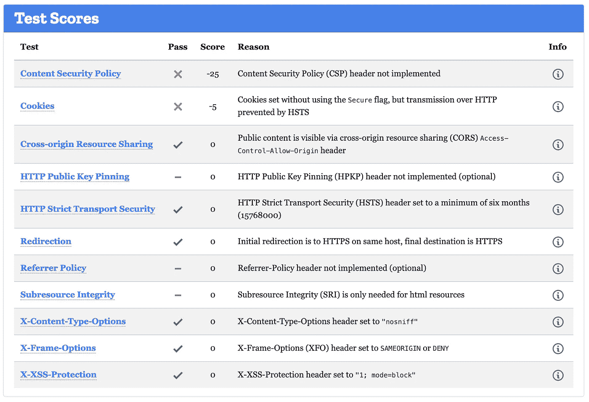
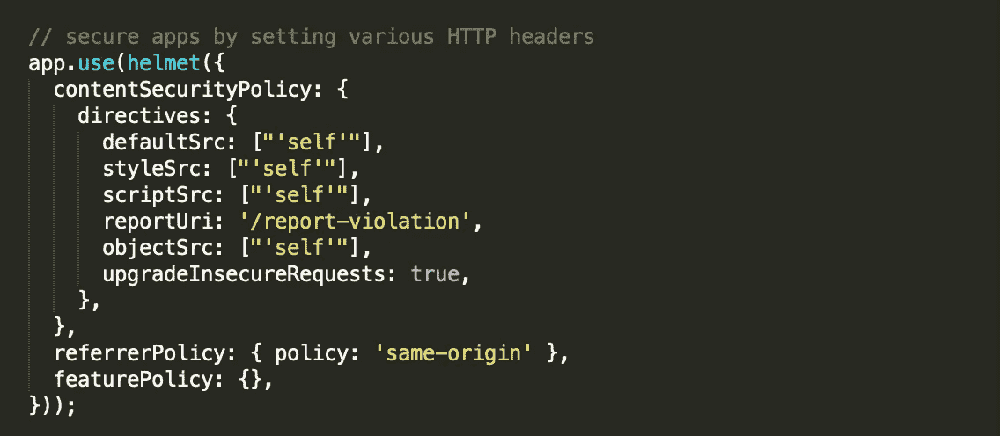
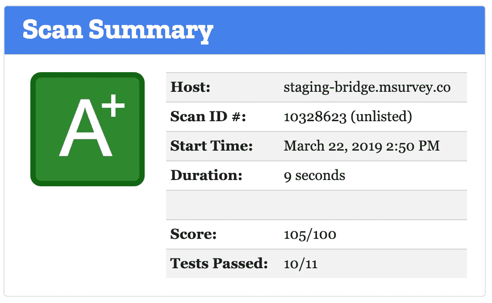

# 我们如何将 Node.js 应用程序的安全等级从 F 级提高到 A 级

> 原文：<https://itnext.io/how-we-improved-our-node-js-application-security-grade-from-f-to-a-cd42b48192e3?source=collection_archive---------0----------------------->

在客户端和服务器端安全地配置应用程序与开发应用程序一样重要，甚至更重要。因此，我和我的队友开始着手解决应用程序中的安全基础问题。像 [SSL 实验室](https://www.ssllabs.com/)、[安全头](https://securityheaders.com/)和[观察站](https://observatory.mozilla.org/)这样的在线服务是测试你的应用的好地方，这也是我们开始的地方。全副武装，精神饱满，我们一头扎了进去！

# 标杆管理

我们的第一次考试分数高得惊人！SSL 实验室的 A+。🎉 🎉 🎉

> SSL 实验室是一项免费的在线服务，它对公共互联网上的任何 SSL web 服务器的配置进行深度分析。

来自 SSL 实验室的 SSL 报告

SSL 证书创建加密连接，并在服务器和客户端之间建立信任。为了向网站用户保证他们的连接是安全的，浏览器会提供某些提示，例如绿色挂锁。SSL 实验室验证所提供的证书是有效的和可信的。它们扫描服务器配置，如协议支持、密码支持和密钥交换支持。作为最佳实践，建议从可靠的证书颁发机构(CA)获取证书。

所以回到安全测试…

到目前为止我们做得很好。我们非常高兴。下一步是扫描我们的应用程序的响应头…结果是惊人的！！！😱😱😱

扫描摘要

一个 F！一个骇人听闻的 F！这几乎是可笑的。但抛开骄傲不谈，这将是一次很好的学习机会。幸运的是，扫描总结结果详细分析了我们的应用程序在每个单独的安全测试中的表现。

# 理解问题

要找到解决方法，你必须知道问题。所以我们开始这样做。我们首先必须理解所有这些响应头的重要性。以下是我们调查结果的总结:

1.  **内容安全策略(CSP)** :授权网站运营商控制从何处加载他们网站上的资源。通过这种方式，它可以防止跨站点脚本(XSS)漏洞。也可用于将 HTTP 升级到 HTTPS。
2.  **Cookies** :所有的 Cookies 都应该尽可能地限制访问。这有助于将跨站点脚本(XSS)漏洞造成的损害降至最低，因为这些 cookies 通常包含会话标识符或其他敏感信息。
3.  **跨源资源共享**:限制哪些外来源被允许通过脚本访问您的域上的页面内容。用例包括为 JavaScript/CSS 库和公共 API 端点提供托管的内容交付网络(cdn)
4.  **HTTP 公钥密码(HPKP)** :小心！这个响应头应该在非常小心的情况下实现，并且只有在你真的需要的时候。HPKP 指示用户代理将站点绑定到特定的根证书颁发机构、中间证书颁发机构或终端实体公钥。这可以防止证书颁发机构为给定域颁发未经授权的证书，而该域仍然是浏览器信任的。
5.  **HTTP 严格传输安全(HSTS)** :指示 web 浏览器仅通过 HTTPS 访问您的站点，即使选择的方案是 HTTP。
6.  **重定向**:指示通过 HTTP 侦听的站点重定向到 HTTPS。一旦发生重定向，CSP/HSTS 应该确保以后所有通过 HTTP 访问该站点的尝试都直接发送到安全的站点。
7.  Referrer 策略:授权站点运营商控制浏览器如何以及何时通知目标站点请求的来源。
8.  **子资源完整性(SRI)** :防止远程资源文件的内容修改，最常见的是内容交付网络(cdn)。这种修改的主要原因可能是在所有使用该托管资源的网站中产生漏洞。
9.  **X-Content-Type-Options** :指示浏览器不要猜测 web 服务器正在传送的文件的 MIME 类型。如果没有这个响应头，浏览器可能会错误地将文件检测为脚本和样式表，从而导致 XSS 攻击。
10.  **X-Frame-Options** :通过控制如何在 iframe 中构建站点来保护站点免受点击劫持攻击。点击劫持是一种实用的攻击，它允许恶意站点欺骗用户点击您站点上的链接，即使这些链接看起来根本不在您的站点上。值得注意的是，这是在 CSP 的祖先指令之前。
11.  **X-XSS 保护**:防止反射跨站脚本(XSS)攻击。这也已经被 CSP 取代。

# 样本 Node.js 条目文件

下面是 starter Express 应用程序入口文件的精简代码。这将是我们研究各种解决方案的起点。

# 解决方案 1 — response.setHeader(名称，值)

这是一个绑定到 Node.js 中请求的 response 对象的函数，它为隐式头设置了一个头值。需要注意的是，如果这个头已经存在于待发送的头中，它的值将被覆盖。

示例:

手动设置响应标头

我们可以很容易地使用这种方法，并像这样设置所有的响应头。它让我们能够更好地控制我们有意声明的响应头。

# 解决方案 2 —头盔

> 头盔通过设置各种 HTTP 头来帮助您保护您的 Express 应用程序。*不是银弹*，但是能帮上忙！

头盔是一个 NPM 库，它提供了中间件功能，自动为我们设置一些现成的 HTTP 响应头。很容易覆盖这些头的默认值，或者扩展它们以包含额外的值。

将头盔库安装到 Node.js 应用程序中。

导入库并应用它。

开箱即用，这个简单的两步程序将扫描结果从 F 级提高到 b 级。考虑到头盔几乎为我们做了所有的事情，这还不算太坏。

扫描结果

回应标题测试分数

默认情况下，头盔不会包含所有这些中间件功能。我们现在可以将扫描结果从 B 级提升到 A 级，方法是根据上面的分数确定缺少的标题，并扩展头盔配置以包含它们。在这种情况下，最引人注目的是 CSP 报头。下面是一个如何将额外的响应头传递给头盔的例子。

将额外的响应头传递给中间件

# 喜悦

女士们先生们，这就是我们从 F 到 a 的过程。

# 收拾东西

关于应用程序的安全性，还有很多内容没有在本文中介绍。编写安全的应用程序必须是有意识的。有许多库提供现成的安全实现，但是要真正控制漏洞攻击，必须清楚地了解它们所防范的威胁的种类和性质。