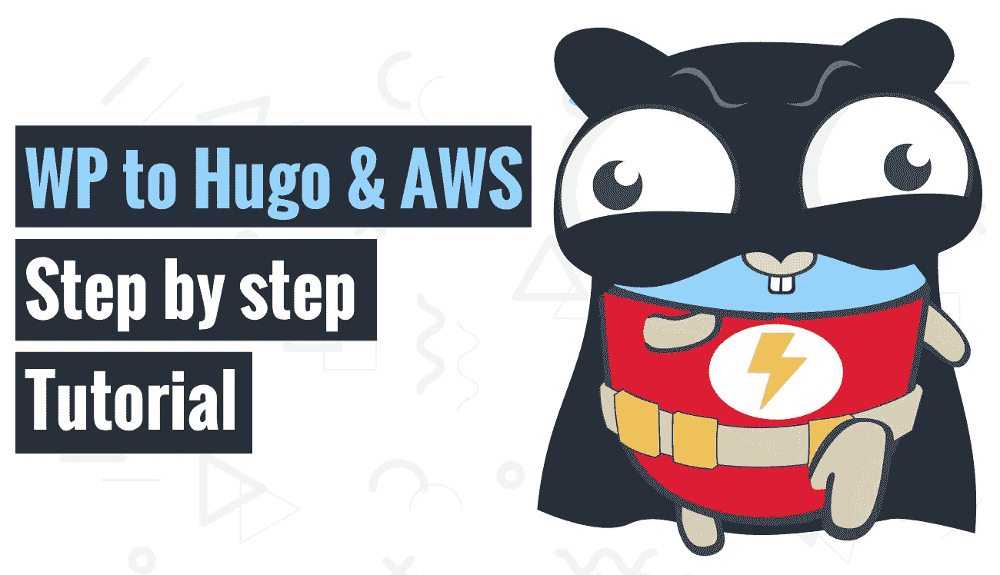

# 我们如何通过迁移到雨果、S3 和 AMP 逐步教程来提高性能并获得 100/100 分

> 原文：<https://itnext.io/how-we-improved-performance-and-scored-100-100-by-migrating-to-hugo-s3-and-amp-step-by-step-d59283f8ae4b?source=collection_archive---------6----------------------->



[如何在 Google pagespeed insights 上获得 100 分](https://www.blog.duomly.com/how-to-build-website-with-hugo-and-amp-tutorial)

本文原载:
[https://www . blog . duomly . com/how-to-build-website-with-Hugo-amp-tutorial](https://www.blog.duomly.com/how-to-build-website-with-hugo-and-amp-tutorial)

# 介绍如何用 Hugo 和 amp 教程建立网站

今天我们将关注如何用 Hugo 和 amp 建立一个网站，接下来我们将在 S3 上主持它。

关于性能的最后一集，你可以在这里找到:

[React.js 性能教程](https://www.blog.duomly.com/react-js-performance-tutorial/)

最近几天，我们注意到我们的博客变得越来越大，而性能却在下降。

作为最大的慢速 3g，我们甚至有 7 到 LCP 惩罚我们的搜索引擎优化，访问量下降了三倍。

我们必须找到如何提高我们的表现，让我们的博客飞速发展的方法。

我们对静态页面生成器和 AMP 框架有了一些想法。

现在博客加载速度低于 1s，我们有了灯光图标。

作为主机，我们决定以 CDN 的身份加入 AWS S3 和 Cloudflare。

我将分享一篇单独的文章和一个关于如何设置 AWS S3 和 Cloudflare 的教程，以将其用作一个非常快速、安全和廉价的网站托管。

在今天文章的下一部分，我将一步一步地向你展示我们是如何做到这一点的，以及如何去做。

开始吧！

这是一个循序渐进的视频，我是如何做到这一切的:

如何获得 100 的 google pagespeed insights 分数

# 1.如何从 WordPress 迁移到 Hugo

作为第一步，我们需要将我们的帖子导出为 markdown 格式。

要做到这一点，我们需要下载 wordpress-to-hugo-exporter 并在你的页面/wp-content/plugins 中解压。

以下是 GitHub 回购的链接:

[https://github.com/SchumacherFM/wordpress-to-hugo-exporter](https://github.com/SchumacherFM/wordpress-to-hugo-exporter)

接下来，我们应该运行出口商。

为此，你需要进入 wp-content/plugins 并输入:

```
php hugo-export-cli.php
```

你需要记得使用 PHP 来启动你的 WordPress。

接下来，创建一个与项目相关的目录，并将导出的文章移动到这个文件夹中。

作为最后一步，您应该解包您已经创建的归档。

我们将在使用 Hugo 创建一个项目后使用这个档案。

# 2.如何安装 hugo

在 Mac OS 和 Linux 上，我们可以像这样使用 brew:

```
brew install hugo
```

在 windows 上，我们可以使用 chocolatey 或 scoop:

巧克力:

```
choco install hugo -confirm
```

独家新闻:

```
scoop install hugo
```

# 3.如何用 Hugo 创建一个新项目

用 Hugo 创建一个项目非常容易。你只需要打开终端，输入:

hugo 新网站快速页面

进入目录:

```
cd fastpage
```

开始雨果:

```
hugo server -D
```

还没有什么，但它会在我们实现一个模板和职位。

添加或修改文件时，有时需要重启服务器。

# 4.如何选择和安装 hugo 模板

为了配合安培，我会去与主题安培，它看起来很好，你可以很容易地修改模板。

接下来，我们需要进入我们的主题目录:/yourblog/themes

在目录中，我们需要克隆模板:

```
git clone [https://github.com/asurbernardo/amperage.git](https://github.com/asurbernardo/amperage.git)
```

# 5.如何配置 Hugo 模板

为了启动这个项目，我们不需要做这么多。

当然，在您的项目中，您需要在 config.toml 中设置 URL、网站名称或徽标等内容。

但是现在我们可以从/your blog/themes/example 站点中取出全部内容，并将其复制到我们的博客目录中。

您需要记住替换“config.toml”文件。

在这个文件中，你可以指定你的博客/网站的所有全局信息。您可以指定姓名、描述或您的社交媒体。

花些时间在那里添加你所有的信息是很好的。

# 6.添加和配置内容

你需要在新博客中加入两件东西。

首先，你需要将你的文章从导出器中取出，并转移到你的博客/内容/文章目录中。

第二个是把你的照片从 wp-content 里拿出来，搬到两个地方。

主要的图片应该在你的博客/资产中，图片来自你的博客/静态目录中的文章。

现在，我们可以进入内容。

从出口商的内容基本上是好的，但这一个模板需要小的变化。

第一个是引入“image”作为带有“url”属性的对象。

为此，我们需要打开 visual studio 代码，将“featured_image:”替换为:

```
img:
 url:
```

我们需要做的下一件事是将作者的形式从“作者:”改为:

```
author:
 name:
```

这对于开始来说应该足够了，但是如果您有像图像或 iframes 这样的内容，您应该将其指定为 AMP 元素。

作为一种 SEO 提升，为元描述添加描述道具也是有用的。

# 7.如何构建静态页面

建造雨果很容易。您只需打开终端并键入:

```
hugo -D
```

这将在 yourblog/public 目录中创建构建的内容。

看看这些文件，尤其是以多种尺寸创建的图像。

这将有助于放大器渲染正确的，这取决于设备的大小，这是完美的性能。

不要忘记在改变之后重建公众。

# 8.部署到 S3

在下一集，我将一步一步地向您展示如何配置 AWS S3 和 Cloudflare，以实现高速、安全、廉价的虚拟主机。

今天我将告诉你如何上传建成的网站或博客到 AWS S3。

要做到这一点，你需要从你的博客/公共目录中取出所有的文件，并把它们放到被配置为主机的 S3 桶中。

请记住，要让公众能够读取您上传的所有文件，以使其可见。

否则，其他用户将无法访问您的网站，谷歌也看不到它。

# 总结如何用 Hugo 和 amp 教程建立网站

恭喜你，你的新博客已经准备好了！

你可以在谷歌中重新索引所有这些页面，看看它们是如何用亮灯图标开始索引的。

AMP 对于移动设备来说很方便，网页可以在搜索结果中显示更好的位置。

在下一个 web 性能教程中，我们将讨论如何使用 Cloudflare 在 AWS S3 上托管静态网站。

我等不及要给你看那些令人兴奋的东西了！

现在，让我们知道在这些操作之后你的性能提高了多少。对此很好奇，希望你的博客或网站受益匪浅！


[编程课程宣传片](https://www.duomly.com?code=lifetime-80)

感谢您的阅读，
来自 Duomly 的 Radek