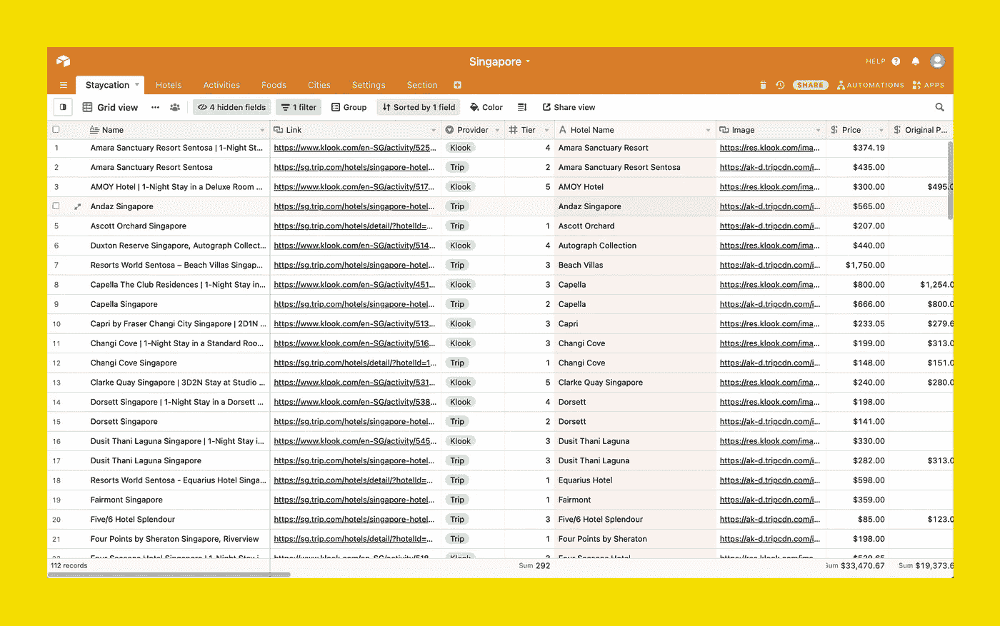
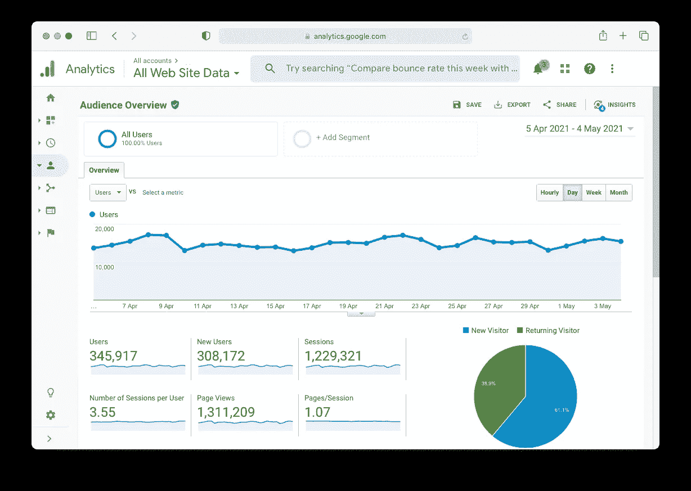
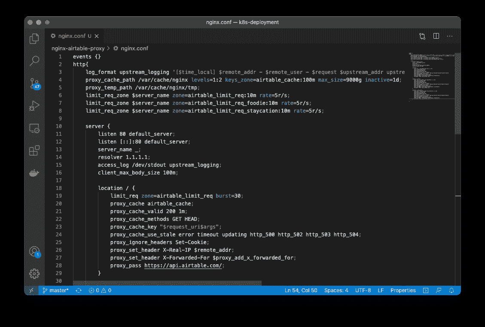

# 我们如何使用 NodeJS Airtable 代理服务数百万的页面浏览量

> 原文：<https://itnext.io/how-we-serve-millions-of-pageviews-using-a-nodejs-airtable-proxy-fdb4ec693720?source=collection_archive---------2----------------------->

## 我们寻求一个无头 CMS 来取悦内容团队和开发团队



# 为什么是 Airtable

Airtable 是一个类似 Google Sheet 的在线服务，它拥有数据库的能力和熟悉的电子表格。它具有灵活的关系数据模型的所有功能，我们可以添加附件、长文本注释、复选框、下拉列表和链接等字段。

Airtable 附带了一个易于使用的图形界面和 REST APIs，允许我们以图形和编程方式创建、读取、更新和销毁记录。这就是为什么对于小规模项目来说，Airtable 通常是一个很好的无头 CMS。

# 问题

## 不是真正的数据库

很明显，Airtable 并不是一个我们无法编写 SQL 来查询数据和连接表的“真正的数据库”。它有一个简单的备份功能，但远不及数据库复制和事务日志功能。

## 限速

它的 REST API 也有每秒 5 个请求的限制，这在高流量时很容易达到。

我们使用 Airtable 作为一个每天有 40，000 次页面浏览量的居家活动策划内容网站的 CMS /数据库。现在假设每个页面视图需要 5 个对 Airtable 的请求，我们总共需要对 Airtable 发出 200，000 个请求！



对于香港本地的小型定向初创企业来说，每天 4 万的页面浏览量已经不错了

## 访问权限有点麻烦

在 Airtable 中，每个用户只能有一个 API 访问键。它可以访问你所有的空军基地和记录。为了获得更好和有限的权限，您需要创建一个新用户(这意味着如果您选择付费计划，您还需要支付额外的席位，我们就是这样做的)，并为其分配特殊权限。

为了避免潜在的安全问题，我们从不在客户端使用 API 访问密钥。我们只在服务器上做。

# 解决办法

为了解决我们所面临的问题，我们想到了用代理服务来代理我们对 Airtable 的所有请求。

## Nginx 的首次尝试

我们的第一个尝试是用 Nginx 开发代理。我们编写了一个简单的 Dockerfile，添加了一个定制的 Nginx 代理和限速配置。



我们的 Nginx 配置如下所示

它有点工作，它可以缓存来自 Airtable 的数据，但我们最终限制了自己的速率，而不是 Airtable 的。

## NodeJS 的第二次尝试

这一次，我们使用 ExpressJS 和 Airtable 的 NodeJS 库。Airtable 的 JS 库带有内置逻辑来处理速率限制，这是一个解决的问题。

对于缓存，我们实现了一个非常简单的内存缓存服务。显然，这里不需要库，只需要一个简单的 30 行代码的类。

为了配置的灵活性和方便性，它使用一个配置文件来确定路由、Airtable 的基础、表和视图表、过滤器、要获取的字段、字段，甚至是可定制的字段映射函数。

下面是使用 Airtable 的 NodeJS 库从 Airtable 获取数据的实际代码。

存储库位于此处:

[](https://github.com/mkhmylife/airtable-proxy) [## mkhmylife/airtable-proxy

### 在 GitHub 上创建一个帐户，为 mkhmylife/airtable-proxy 开发做贡献。

github.com](https://github.com/mkhmylife/airtable-proxy) 

# 我们的使用案例

运行一个精选的内容网站，我们对我们的 Airtable 数据进行大量的内容过滤和排序。我们不是在客户端进行获取和过滤，而是在服务器端进行并缓存。为了便于配置，我们在我们的`airtableConfig.ts`配置文件中定义它们。

假设我们想要从 Airtable 中获取特色酒店，我们将创建以下配置:

```
export const ***airtableConfigs***: Array<AirtableConfig> = [
    {
        route: "hotels-featured",
        base: "app123456",
        table: "Hotels",
        filter: "Status = 'Featured'",
        fields: [
            'ID',            
            'Name',        
        ],        
    },
];
```

要获得经过过滤和代理的数据，只需向`/hotels-featured`发送一个`GET`请求。

更复杂的逻辑也可以通过利用`filter`和`fieldMappings`来完成。例如，我们可以这样做:

```
export const airtableConfigs: Array<AirtableConfig> = [    
    {        
        route: "users",        
        base: "app123456",        
        table: "Table Name",        
        filter: "Status = 'Approved'",        
        fields: [            
            'ID',            
            'First Name',
            'Last Name',            
            'Age',        
        ],        
        fieldMappings: ((records: any[]) => {            
            return records.map( (record: any) => {                  
                 return {                    
                     id: record.ID,                    
                     name: `${record['First Name']} ${record['Last Name']}`,                    
                     gea: record.Age,                
                 }            
             })        
         }),    
      },
]
```

我们还希望我们的代理尽可能快地返回数据，因此即使缓存过期，它仍然会首先服务过期的缓存，然后尝试在后台从 Airtable 和缓存中获取数据。

# 两全其美

在切换到 Airtable 之前，我们探索了像 Laravel Nova 这样的选项，以缩短构建 CMS 的开发时间，该 CMS 易于我们的内容团队使用，同时功能强大，速度足够快，可以为我们的网站提供 API。

是的，从开发者的角度来看，Laravel + Nova 是强大的，但对于内容团队来说，批量管理数据是一场噩梦。对于他们来说，以“关系”的方式思考和处理数据也是没有意义的，默认的用户界面对他们来说太难管理了。

改用 Airtable，化乱为安，我们内容团队开心，我们也开心，双赢！

[](https://www.buymeacoffee.com/edwardmok)