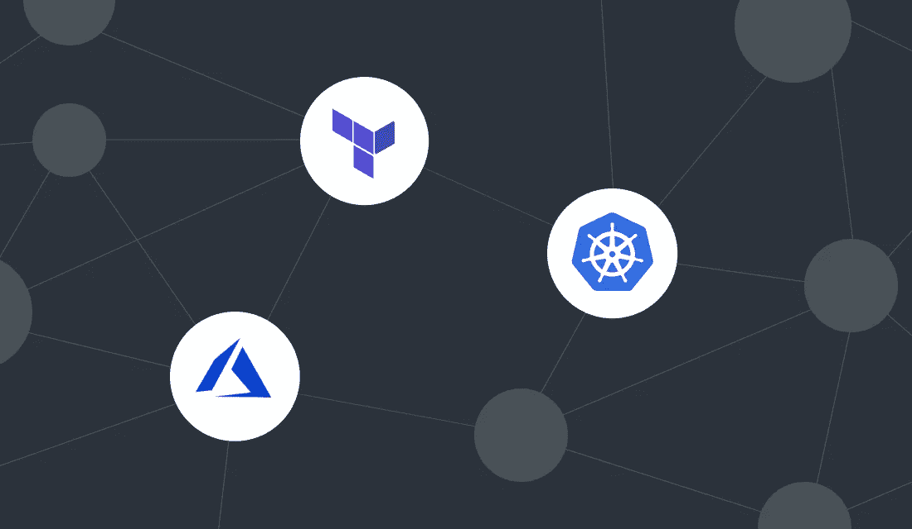
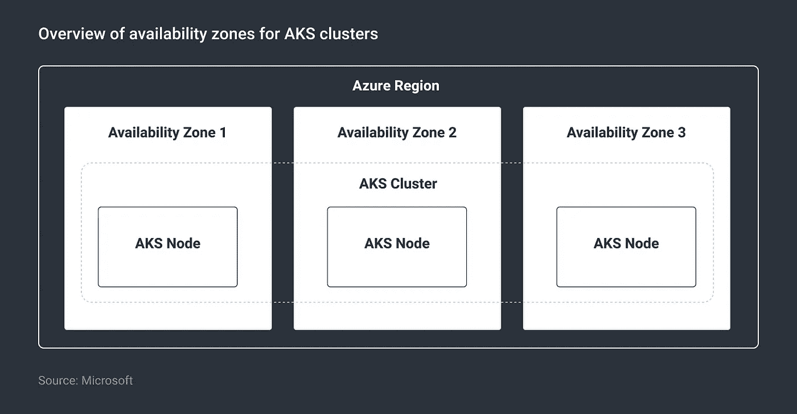
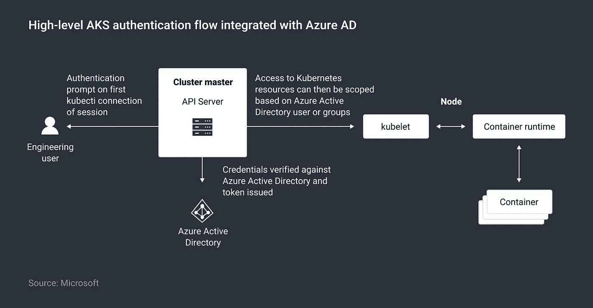
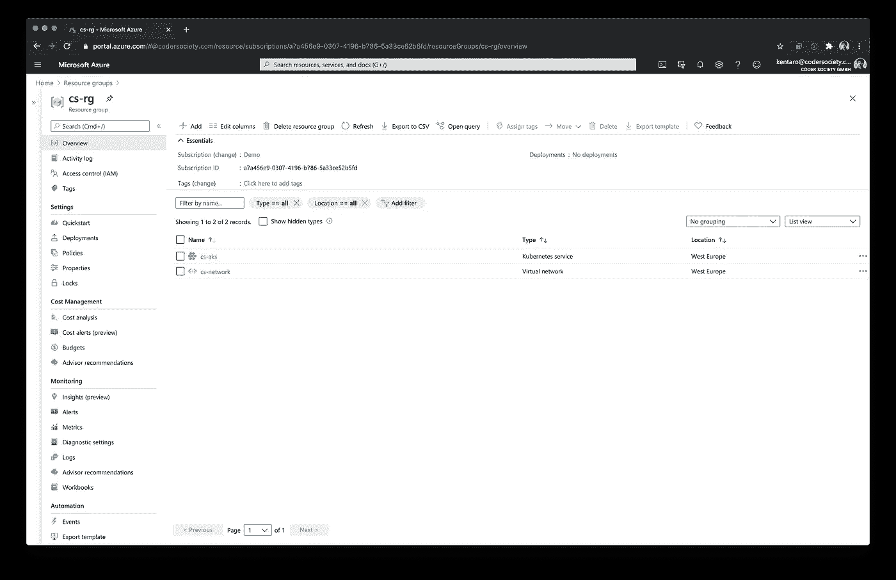

# 我们如何使用 Terraform 在 Azure 中创建和管理 HA AKS Kubernetes 集群

> 原文：<https://itnext.io/how-we-used-terraform-to-create-and-manage-a-ha-aks-kubernetes-cluster-in-azure-812f64896c08?source=collection_archive---------1----------------------->

## 了解如何使用 Terraform 管理启用了 Azure AD 集成和 Calico 网络策略的高可用性 Azure AKS Kubernetes 集群。



> [文章最初发表在 Coder Society 这里](https://codersociety.com/blog/articles/terraform-azure-kubernetes)。

# 什么是 Azure Kubernetes 服务(AKS)

Azure Kubernetes Service (AKS)是 Azure 中的托管 Kubernetes 产品，可让您快速部署生产就绪的 Kubernetes 集群。它允许客户专注于应用程序开发和部署，而不是 Kubernetes 集群管理的细节。群集控制平面由 Microsoft 部署和管理，而部署应用程序的节点和节点池由客户处理。

AKS 集群部署可以使用 Terraform 完全自动化。Terraform 使您能够安全、可预测地创建、更改和改进基础设施。它还支持高级 AKS 配置，如可用性区域、Azure AD 集成和 Kubernetes 的网络策略。

让我们来看看我们将在本文中涉及的关键 AKS 特性。

# 跨多个可用性区域的 AKS 部署

确保部署的高可用性是企业工作负载的必备条件。Azure 可用性区域通过将资源分布在 Azure 区域中的一个或多个数据中心来保护资源免受数据中心级故障的影响。

AKS 集群也可以部署在可用性区域中，其中节点部署在一个区域的不同区域中。在数据中心发生故障的情况下，部署在集群中的工作负载将继续从不同区域中的节点运行，从而保护它们免受此类事件的影响。



*AKS 集群可用区域概述*

# Azure 活动目录集成

随着身份被视为新的安全边界，客户现在选择使用 Azure AD 对云原生部署进行身份验证和授权。AKS 集群可以与 Azure Active Directory 集成，以便用户可以使用他们现有的 Azure AD 凭据获得对集群或集群级资源中的名称空间的访问权限。这消除了在 AKS 集群中部署和管理工作负载时对多个凭证的需求。

这在混合云部署中有更大的好处，在混合云部署中，内部 AD 凭据会同步到 Azure AD。它为身份验证和授权提供了一致、统一的体验。下面的图 1 显示了与 Azure Active Directory 集成时的高级 AKS 身份验证流程。



*与 Azure AD 集成的高级 AKS 认证流程*

# 通过网络策略实现的 Pod 流量控制

默认情况下，AKS 集群中的所有 pod 可以不受任何限制地相互通信。但是，在生产中，出于安全原因，客户可能希望限制这种流量。这可以通过在 Kubernetes 集群中实现网络策略来实现。网络策略可用于定义一组规则，根据匹配的标签允许或拒绝 pod 之间的流量。

AKS 支持两种类型的网络实现:Kubenet(基本网络)和 Azure CNI(高级网络)。客户还可以在两种类型的网络策略之间进行选择:Azure(原生)或 [Calico](https://www.projectcalico.org/) 网络策略(开源)。虽然 Azure 网络策略仅在 Azure CNI 受到支持，但 Calico 在基于 Kubenet 和 Azure CNI 的网络实现中都受到支持。

# 部署先决条件

以下是部署 AKS 集群的先决条件:

*   **Azure 订阅访问:**建议拥有贡献者权限的用户运行 Terraform 脚本。在部署过程中，会为 AKS 节点创建一个额外的资源组。受限的权限可能会导致部署失败。
*   **Azure AD 服务器和客户端应用:** OpenID Connect 用于集成 Azure Active Directory 和 AKS 集群。要做到这一点，需要两个 Azure AD 应用程序:一个服务器应用程序和一个客户端应用程序。服务器应用程序充当身份请求的端点，而客户端应用程序在用户试图通过 kubectl 命令访问 AKS 集群时用于身份验证。微软为[创建这些 Azure 广告应用](https://docs.microsoft.com/en-us/azure/aks/azure-ad-integration-cli)提供了分步指南。
*   **云壳中的 Terraform 用法:** [Azure 云壳](https://docs.microsoft.com/en-us/azure/cloud-shell/overview#:~:text=Azure%20Cloud%20Shell%20is%20an,work%2C%20either%20Bash%20or%20PowerShell.&text=Try%20from%20Azure%20portal%20using%20the%20Cloud%20Shell%20icon.)在 bash 环境中默认安装了 Terraform。你可以使用你最喜欢的文本编辑器，比如 vim，或者使用 Azure Cloud Shell 中的代码编辑器来编写 Terraform 模板。参考微软的[Azure 云壳中 Terraform 入门指南](https://docs.microsoft.com/en-us/azure/cloud-shell/example-terraform-bash)。

# 创建 Terraform 模板

为了创建模板，Terraform 使用 HashiCorp 配置语言(HCL ),因为它被设计为机器友好和人类可读。要更深入地了解 Terraform 语法，请参考 [Terraform 文档](https://www.terraform.io/docs/configuration/index.html)。跨部署变化的值可被定义为[变量](https://www.terraform.io/docs/configuration/variables.html)，并通过变量文件或在运行时应用 Terraform 模板时提供。

在本节中，我们将描述用于创建集群的 Terraform 模板的相关模块。

注意:本次部署的 Terraform 模板以及变量和[输出文件](https://www.terraform.io/docs/configuration/outputs.html)都可以在 [GitHub 库](https://github.com/coder-society/terraform-aks-azure)中找到。

# 网络安装程序

应使用以下 Terraform 代码块来创建 Azure VNet 和子网，这是 Azure CNI 网络实施所需的:

```
resource "azurerm_virtual_network" "demo" {
  name                = "${var.prefix}-network"
  location            = azurerm_resource_group.demo.location
  resource_group_name = azurerm_resource_group.demo.name
  address_space       = ["10.1.0.0/16"]
}

resource "azurerm_subnet" "demo" {
  name                 = "${var.prefix}-akssubnet"
  virtual_network_name = azurerm_virtual_network.demo.name
  resource_group_name  = azurerm_resource_group.demo.name
  address_prefixes     = ["10.1.0.0/22"]
}
```

**var.prefix:** 在 Terraform 变量文件中将定义一个前缀，用于区分部署。

**演示:**这是 Terraform 用来引用已定义资源(如 Azure VNet 和子网)的[本地名称](https://www.terraform.io/docs/configuration/resources.html)。可以根据您的使用情况对其进行重命名。

**地址空间和地址前缀:**这是指虚拟网络和子网的地址空间。您可以用自己喜欢的私有 IP 地址块替换这些值。

# Azure 广告集成

为了实现 Azure AD 集成，我们需要提供服务器应用程序、客户端应用程序和 Azure AD 租户详细信息。应在 AKS 群集定义中使用以下代码块，以便为 AKS 群集启用 RBAC，并使用 Azure AD 进行 RBAC 身份验证。

```
role_based_access_control {
    azure_active_directory {
      client_app_id     = var.client_app_id
      server_app_id     = var.server_app_id
      server_app_secret = var.server_app_secret
      tenant_id         = var.tenant_id
    }    
    enabled = true
  }
```

**var.client_app_id:** 此变量指的是前提条件部分提到的 Azure AD 客户端应用程序的客户端应用程序 id。

**var.server_app_id:** 此变量指的是先决条件部分提到的 Azure AD server 应用程序的服务器应用程序 id。

**var.server_app_secret:** 这个变量是指为 Azure AD server 应用程序创建的秘密。

**var.tenant_id:** 该变量指的是与将部署集群的订阅相关联的 Azure AD 租户 id。这个值可以从 Azure 门户或者通过 [Azure CLI](https://docs.microsoft.com/en-us/azure/aks/azure-ad-integration-cli#deploy-the-cluster) 获得。

# 网络策略配置

以下 Terraform 代码将用于 AKS 集群定义中，以启用 Calico 网络策略。请注意，这只能在群集部署期间进行配置，任何更改都需要重新创建群集。

```
network_profile {
    network_plugin     = "azure"
    load_balancer_sku  = "standard"
    network_policy     = "calico"
  }
```

**网络插件:**该值应设置为`azure`以使用 CNI 网络。

**load_balancer_sku:** 该值应该设置为`standard`，因为我们将使用虚拟机规模集。

**network_policy:** 该值应该设置为`calico`，因为我们将使用 Calico 网络策略。

# 节点池和可用性区域配置

以下代码将用于配置节点池和可用性区域。

```
default_node_pool {
    name                = "default"
    node_count          = 2
    vm_size             = "Standard_D2_v2"
    type                = "VirtualMachineScaleSets"
    availability_zones  = ["1", "2"]
    enable_auto_scaling = true
    min_count           = 2
    max_count           = 4

    # Required for advanced networking
    vnet_subnet_id = azurerm_subnet.demo.id
  }
```

**node_count:** 节点池中部署的初始节点数量。

本例中使用了**VM _ size:**`Standard_D2_v2`；它可以替换为您喜欢的 SKU。

**类型:**应该设置为`VirtualMachineScaleSets`，这样虚拟机就可以跨可用性区域分布。

**availability_zones:** 列出可使用的区域。

**enable_auto_scaling:** 应设置为`true`以启用自动缩放。

应该设置变量`min_count`和`max_count`来定义节点池中的最小和最大节点数。此处的值应该介于 1 和 100 之间。

# 部署 HA AKS 集群

将 Terraform 文件从 [GitHub 存储库](https://github.com/coder-society/terraform-aks-azure)下载到您的云 Shell 会话，并根据您的 AKS 集群部署需求编辑配置参数。上一节提供的指导可用于更新这些值。

1 /运行以下命令在 CloudShell 中克隆 GitHub 存储库:

```
git clone https://github.com/coder-society/terraform-aks-azure.git
Cloning into 'terraform-aks-azure'...
remote: Enumerating objects: 12, done.
remote: Counting objects: 100% (12/12), done.
remote: Compressing objects: 100% (10/10), done.
remote: Total 12 (delta 1), reused 12 (delta 1), pack-reused 0
Unpacking objects: 100% (12/12), done.
Checking connectivity... done.
```

2/进入`/terraform`目录，运行`terraform init`命令初始化 Terraform:

```
terraform initInitializing the backend...Initializing provider plugins...
- Finding hashicorp/azurerm versions matching "~> 2.0"...
- Installing hashicorp/azurerm v2.28.0...
- Installed hashicorp/azurerm v2.28.0 (signed by HashiCorp)Terraform has been successfully initialized!You may now begin working with Terraform. Try running "terraform plan" to see
any changes that are required for your infrastructure. All Terraform commands
should now work.If you ever set or change modules or backend configuration for Terraform,
rerun this command to reinitialize your working directory. If you forget, other
commands will detect it and remind you to do so if necessary.
```

3 /导出要在运行时使用的 Terraform 变量，用特定于环境的值替换占位符。您也可以在变量文件中定义值。

```
export TF_VAR_prefix=<Environment prefix>
export TF_VAR_client_app_id=<The client app ID of the AKS client application>  
export TF_VAR_server_app_id=<The server app ID of the AKS server application>
export TF_VAR_server_app_secret=<The secret created for AKS server application>
export TF_VAR_tenant_id=<The Azure AD tenant id>
```

4 /通过执行`terraform plan -out out.plan`创建地形图。

```
terraform plan -out out.plan
Refreshing Terraform state in-memory prior to plan...
The refreshed state will be used to calculate this plan, but will not be
persisted to local or remote state storage. ------------------------------------------------------------------------An execution plan has been generated and is shown below.
Resource actions are indicated with the following symbols:
  + createTerraform will perform the following actions: # azurerm_kubernetes_cluster.demo will be created
  + resource "azurerm_kubernetes_cluster" "demo" {
      + dns_prefix              = "cs-aks"
      + fqdn                    = (known after apply)
      + id                      = (known after apply)
      + kube_admin_config       = (known after apply)
      + kube_admin_config_raw   = (sensitive value)
      + kube_config             = (known after apply)
      + kube_config_raw         = (sensitive value)
      + kubelet_identity        = (known after apply)
      + kubernetes_version      = (known after apply)
      + location                = "westeurope"
      + name                    = "cs-aks"
      + node_resource_group     = (known after apply)
      + private_cluster_enabled = (known after apply)
      + private_fqdn            = (known after apply)
      + private_link_enabled    = (known after apply)
      + resource_group_name     = "cs-rg"
      + sku_tier                = "Free"
      + tags                    = {
          + "Environment" = "Development"
        } + addon_profile {
          + aci_connector_linux {
              + enabled     = (known after apply)
              + subnet_name = (known after apply)
            } + azure_policy {
              + enabled = (known after apply)
            } + http_application_routing {
              + enabled                            = (known after apply)
              + http_application_routing_zone_name = (known after apply)
            } + kube_dashboard {
              + enabled = (known after apply)
            } + oms_agent {
              + enabled                    = (known after apply)
              + log_analytics_workspace_id = (known after apply)
              + oms_agent_identity         = (known after apply)
            }
        } + auto_scaler_profile {
          + balance_similar_node_groups      = (known after apply)
          + max_graceful_termination_sec     = (known after apply)
          + scale_down_delay_after_add       = (known after apply)
          + scale_down_delay_after_delete    = (known after apply)
          + scale_down_delay_after_failure   = (known after apply)
          + scale_down_unneeded              = (known after apply)
          + scale_down_unready               = (known after apply)
          + scale_down_utilization_threshold = (known after apply)
          + scan_interval                    = (known after apply)
        } + default_node_pool {
          + availability_zones   = [
              + "1",
              + "2",
            ]
          + enable_auto_scaling  = true
          + max_count            = 4
          + max_pods             = (known after apply)
          + min_count            = 2
          + name                 = "default"
          + node_count           = 2
          + orchestrator_version = (known after apply)
          + os_disk_size_gb      = (known after apply)
          + type                 = "VirtualMachineScaleSets"
          + vm_size              = "Standard_D2_v2"
          + vnet_subnet_id       = (known after apply)
        } + identity {
          + principal_id = (known after apply)
          + tenant_id    = (known after apply)
          + type         = "SystemAssigned"
        } + network_profile {
          + dns_service_ip     = (known after apply)
          + docker_bridge_cidr = (known after apply)
          + load_balancer_sku  = "standard"
          + network_plugin     = "azure"
          + network_policy     = "calico"
          + outbound_type      = "loadBalancer"
          + pod_cidr           = (known after apply)
          + service_cidr       = (known after apply) + load_balancer_profile {
              + effective_outbound_ips    = (known after apply)
              + idle_timeout_in_minutes   = (known after apply)
              + managed_outbound_ip_count = (known after apply)
              + outbound_ip_address_ids   = (known after apply)
              + outbound_ip_prefix_ids    = (known after apply)
              + outbound_ports_allocated  = (known after apply)
            }
        } + role_based_access_control {
          + enabled = true + azure_active_directory {
              + client_app_id     = "f9bf8772-aaba-4773-a815-784b31f9ab8b"
              + server_app_id     = "fa7775b3-ea31-4e99-92f5-8ed0bac3e6a8"
              + server_app_secret = (sensitive value)
              + tenant_id         = "8f55a88a-7752-4e10-9bbb-e847ae93911d"
            }
        } + windows_profile {
          + admin_password = (sensitive value)
          + admin_username = (known after apply)
        }
    } # azurerm_resource_group.demo will be created
  + resource "azurerm_resource_group" "demo" {
      + id       = (known after apply)
      + location = "westeurope"
      + name     = "cs-rg"
    } # azurerm_subnet.demo will be created
  + resource "azurerm_subnet" "demo" {
      + address_prefix                                 = (known after apply)
      + address_prefixes                               = [
          + "10.1.0.0/22",
        ]
      + enforce_private_link_endpoint_network_policies = false
      + enforce_private_link_service_network_policies  = false
      + id                                             = (known after apply)
      + name                                           = "cs-subnet"
      + resource_group_name                            = "cs-rg"
      + virtual_network_name                           = "cs-network"
    } # azurerm_virtual_network.demo will be created
  + resource "azurerm_virtual_network" "demo" {
      + address_space       = [
          + "10.1.0.0/16",
        ]
      + guid                = (known after apply)
      + id                  = (known after apply)
      + location            = "westeurope"
      + name                = "cs-network"
      + resource_group_name = "cs-rg"
      + subnet              = (known after apply)
    }Plan: 4 to add, 0 to change, 0 to destroy.------------------------------------------------------------------------This plan was saved to: out.planTo perform exactly these actions, run the following command to apply:
    terraform apply "out.plan"
```

5 /使用`terraform apply out.plan`命令应用该计划。

成功部署后，集群、网络等的详细信息。将在命令行中显示:

```
terraform apply out.plan
azurerm_resource_group.demo: Creating...
azurerm_resource_group.demo: Creation complete after 1s [id=/subscriptions/a7a456e9-0307-4196-b786-5a33ce52b5fd/resourceGroups/cs-rg]
azurerm_virtual_network.demo: Creating...
azurerm_virtual_network.demo: Still creating... [10s elapsed]
azurerm_virtual_network.demo: Creation complete after 15s [id=/subscriptions/a7a456e9-0307-4196-b786-5a33ce52b5fd/resourceGroups/cs-rg/providers/Microsoft.Network/virtualNetworks/cs-network]
azurerm_subnet.demo: Creating...
azurerm_subnet.demo: Creation complete after 2s [id=/subscriptions/a7a456e9-0307-4196-b786-5a33ce52b5fd/resourceGroups/cs-rg/providers/Microsoft.Network/virtualNetworks/cs-network/subnets/cs-subnet]
azurerm_kubernetes_cluster.demo: Creating...
azurerm_kubernetes_cluster.demo: Still creating... [10s elapsed]
azurerm_kubernetes_cluster.demo: Still creating... [20s elapsed]
azurerm_kubernetes_cluster.demo: Still creating... [30s elapsed]
azurerm_kubernetes_cluster.demo: Still creating... [40s elapsed]
azurerm_kubernetes_cluster.demo: Still creating... [50s elapsed]
azurerm_kubernetes_cluster.demo: Still creating... [1m0s elapsed]
azurerm_kubernetes_cluster.demo: Still creating... [1m10s elapsed]
azurerm_kubernetes_cluster.demo: Still creating... [1m20s elapsed]
azurerm_kubernetes_cluster.demo: Still creating... [1m30s elapsed]
azurerm_kubernetes_cluster.demo: Still creating... [1m40s elapsed]
azurerm_kubernetes_cluster.demo: Still creating... [1m50s elapsed]
azurerm_kubernetes_cluster.demo: Still creating... [2m0s elapsed]
azurerm_kubernetes_cluster.demo: Still creating... [2m10s elapsed]
azurerm_kubernetes_cluster.demo: Still creating... [2m20s elapsed]
azurerm_kubernetes_cluster.demo: Still creating... [2m30s elapsed]
azurerm_kubernetes_cluster.demo: Still creating... [2m40s elapsed]
azurerm_kubernetes_cluster.demo: Still creating... [2m50s elapsed]
azurerm_kubernetes_cluster.demo: Still creating... [3m0s elapsed]
azurerm_kubernetes_cluster.demo: Still creating... [3m10s elapsed]
azurerm_kubernetes_cluster.demo: Still creating... [3m20s elapsed]
azurerm_kubernetes_cluster.demo: Still creating... [3m30s elapsed]
azurerm_kubernetes_cluster.demo: Still creating... [3m40s elapsed]
azurerm_kubernetes_cluster.demo: Still creating... [3m50s elapsed]
azurerm_kubernetes_cluster.demo: Still creating... [4m0s elapsed]
azurerm_kubernetes_cluster.demo: Still creating... [4m10s elapsed]
azurerm_kubernetes_cluster.demo: Still creating... [4m20s elapsed]
azurerm_kubernetes_cluster.demo: Still creating... [4m30s elapsed]
azurerm_kubernetes_cluster.demo: Still creating... [4m40s elapsed]
azurerm_kubernetes_cluster.demo: Still creating... [4m50s elapsed]
azurerm_kubernetes_cluster.demo: Still creating... [5m0s elapsed]
azurerm_kubernetes_cluster.demo: Still creating... [5m10s elapsed]
azurerm_kubernetes_cluster.demo: Creation complete after 5m16s [id=/subscriptions/a7a456e9-0307-4196-b786-5a33ce52b5fd/resourcegroups/cs-rg/providers/Microsoft.ContainerService/managedClusters/cs-aks]Apply complete! Resources: 4 added, 0 changed, 0 destroyed.The state of your infrastructure has been saved to the path
below. This state is required to modify and destroy your
infrastructure, so keep it safe. To inspect the complete state
use the `terraform show` command.State path: terraform.tfstateOutputs:client_certificate =
kube_config = apiVersion: v1
clusters:
- cluster:
    certificate-authority-data: LS0tLS1CRUdJTiBDRVJUSUZJQ0FURS0tLS0tCk1JSUV5akNDQXJLZ0F3SUJBZ0lSQU01eXFucWJNNmoxekFhbk8vczdIeVV3RFFZSktvWklodmNOQVFFTEJRQXcKRFRFTE1Ba0dBMVVFQXhNQ1kyRXdJQmNOTWpBd09USXlNakEwTWpJeFdoZ1BNakExTURBNU1qSXlNRFV5TWpGYQpNQTB4Q3pBSkJnTlZCQU1UQW1OaE1JSUNJakFOQmdrcWhraUc5dzBCQVFFRkFBT0NBZzhBTUlJQ0NnS0NBZ0VBCnc5WlYwd0hORkJiaURUcnZMQ1hJU2JoTHdScFZ1WVowMVJ5QzU0QWo1WUJjNzZyRXZIQVZlRXhWYlRYc0wrdDEKMVJPOG85bVY2UG01UXprUzdPb2JvNEV6ampTY2RBcjUvazJ4eC9BLzk0ZFl2Q20wWHZQaktXSWxiS08yaDBuNQp4VW03OFNsUks4RFVReUtGWmxTMEdXQ0hKbEhnNnpVZU8xMVB5MTQvaXBic1JYdTNFYVVLeWFJczgrekxSK2NNCm5tSU5wcHFPNUVNSzZKZVZKM0V0SWFDaFBNbHJiMVEzNHlZbWNKeVkyQmZaVkVvV2pRL1BMNFNFbGw0T0dxQjgKK3Rlc3I2TDBvOW5LT25LVlB0ZCtvSXllWnQ1QzBiMnJScnFDU1IyR09VZmsvMTV3emFiNTJ6M0JjempuV0VNOApnWWszZlBDU3JvNGE5a0xQVS9Udnk1UnZaUjJsc09mUWk3eGZpNm91dzJQeEkxc1ZPcmJnRWdza2o5Qmc4WnJYCk5GZjJpWlptSFM0djNDM1I4Q25NaHNRSVdiSmlDalhDclZCak1QbzVNS0xzNEF5U1M2dU1MelFtSjhNQWVZQlEKSHJrWEhZa21OeHlGMkhqSVlTcTdjZWFOVHJ1dTh2SFlOT2c3MGM5aGEvakZ0MXczWVl4N3NwbGRSRGpmZHZiQgpaeEtwbWNkUzY3RVNYT0dtTEhwZis1TTZXMVI3UWQwYk1SOGRQdFZJb1NmU2RZSFFLM0FDdUxrd1ZxOWpGMXlnCiswcklWMC9rN0F6bzNnUlVxeFBIV0twcHN2bFhaZCtsK0VqcTRLMnFMRXd4MlFOMDJHL1dGVUhFdGJEUXAvZWYKZGxod3Z0OHp1VklIbXE0ejlsMGZSOU9QaGN6UFpXR0dyWnUrTlQ2cm5RTUNBd0VBQWFNak1DRXdEZ1lEVlIwUApBUUgvQkFRREFnS2tNQThHQTFVZEV3RUIvd1FGTUFNQkFmOHdEUVlKS29aSWh2Y05BUUVMQlFBRGdnSUJBQjQ0CmRzbExhRzFrSzFHaFZiR1VEbWtWNndsTHJ1a1F3SHc2Vkt2azJ0T0UwMU1Hbng5SkJwVFFIL2FMdWYxUTN0WVAKaVhWSnp1bGsxOWg2MjUrcEs0ekpQcDZSWkhMV3htK2M0a1pLejlwV3F3RERuNmZqTVlKOEdMNVZFOUwvQUdSRgpscEI5ZTZNOVNGY20ra2lMVVlLazg3VG1YaGd4dzFXYXhtaDEwd01DNlZPOGNuZlVRQkJJQkVMVXhNZy9DRE9SCjZjSGFTdU5ETlg0UG80eFF3NnV4c0d1R2xDbHltOUt4Z2pIYjQ5SWp2NnN5clRIcGkrVkxmQ3d4TmdLZUwxZ1cKNURVR3ZoMmpoTVJqNDhyV3FoY3JjUHI4aWtoeVlwOXMwcFJYQVlUTk52SlFzaDhmYllOcTIzbDZwVW16dUV0UwpQS2J2WUJDVmxxa29ualZiRkxIeXJuRWNFbllqdXhwYy94bWYvT09keHhUZzlPaEtFQTRLRTQySFJ2cW1SZER5CkFldVhIcUxvUm54TXF1Z0JxL0tTclM2S0tjQW11eVJWdkhJL21MUlhmY1k1VThCWDBXcUF0N1lrWm54d1JnRkQKQndRcnEvdDJrUkMySSsxR1pUd2d1Y3hyc0VrYlVoVG5DaStVbjNDRXpTbmg5anBtdDBDcklYaDYzeC9LY014egpGM0ZXNWlnZDR4MHNxYk5oK3B4K1VSVUlsUmZlMUxDRWg3dGlraVRHRGtGT05EQXBSQUMycnUrM0I5TlpsR0hZCm9jWS9tcTlpdUtXTUpobjFHeXJzWGZLZXQrakliZzhUNzZzaEora0E4djU3VmdBdlRRSEh1YTg2SHl6d1d2Z0QKQ2ZaZFhpeURvZGlWRXhPNGlGaG00T1dhZld5U0ltSUsrOCs1Z2daZwotLS0tLUVORCBDRVJUSUZJQ0FURS0tLS0tCg==
    server: https://cs-aks-f9e8be99.hcp.westeurope.azmk8s.io:443
  name: cs-aks
contexts:
- context:
    cluster: cs-aks
    user: clusterUser_cs-rg_cs-aks
  name: cs-aks
current-context: cs-aks
kind: Config
preferences: {}
users:
- name: clusterUser_cs-rg_cs-aks
  user:
    auth-provider:
      config:
        apiserver-id: fa7775b3-ea31-4e99-92f5-8ed0bac3e6a8
        client-id: f9bf8772-aaba-4773-a815-784b31f9ab8b
        config-mode: "1"
        environment: AzurePublicCloud
        tenant-id: 8f55a88a-7752-4e10-9bbb-e847ae93911d
      name: azure
```

6 /浏览到 Azure 门户中的资源池，以查看由部署创建的群集和网络:



7 /使用 Azure 客户端检索 admin kubeconfig:

```
az aks get-credentials --resource-group $prefix-rg --name $prefix-aks --admin --overwrite-existing
```

8 /运行以下命令列出节点和可用性区域配置:

```
kubectl describe nodes | grep -e "Name:" -e "failure-domain.beta.kubernetes.io/zone"
Name:               aks-default-36042037-vmss000000
                    failure-domain.beta.kubernetes.io/zone=westeurope-1
Name:               aks-default-36042037-vmss000001
                    failure-domain.beta.kubernetes.io/zone=westeurope-2
```

`failure-domain.beta.kubernetes.io/zone`是一个与 Kubernetes 节点相关联的标签，表示它被部署的区域。输出显示节点部署在西欧的两个可用性区域。

# 配置 Azure Active Directory 集成

1.  在 Azure AD 中创建群。

```
GROUP_ID=$(az ad group create --display-name dev --mail-nickname dev --query objectId -o tsv)
```

2 /检索 AKS 集群的资源 ID

```
AKS_ID=$(az aks show \
    --resource-group $prefix-rg \
    --name $prefix-aks \
    --query id -o tsv)
```

3 /创建一个 Azure 角色分配，这样`dev`组的任何成员都可以使用`kubectl`与 Kubernetes 集群交互。

```
az role assignment create \
  --assignee $GROUP_ID \
  --role "Azure Kubernetes Service Cluster User Role" \
  --scope $AKS_ID
```

4 /将您自己添加到`dev`广告组。

```
USER_ID=$(az ad signed-in-user show --query objectId -o tsv)
az ad group member add --group dev --member-id $USER_ID
```

5 /使用 admin kubeconfig，创建一个`development`和`production` Kubernetes 名称空间。`kubectl create namespace development kubectl create namespace production`

6 /用之前创建的组的资源 ID 替换`groupObjectId`并应用`rolebinding.yaml`文件。

```
sed -i '' "s/groupObjectId/$GROUP_ID/g" rolebinding.yaml
kubectl apply -f rolebinding.yaml
```

7 /在测试 Azure AD 集成之前，运行以下命令获取群集凭据。

```
az aks get-credentials --resource-group $prefix-rg --name $prefix-aks --overwrite-existing
```

8 /运行下面的 kubectl 命令来查看 Azure AD 集成的运行情况:

```
kubectl get pods --namespace development
To sign in, use a web browser to open the page https://microsoft.com/devicelogin and enter the code DSFV9H98W to authenticate.
No resources found in development namespace.
```

在设备登录页面中输入代码，然后输入您的 Azure AD 登录凭据:


请注意，只有`dev`组中的用户才能通过此过程登录。

9 /尝试访问`production`名称空间中的资源:

```
kubectl get pods --namespace production
Error from server (Forbidden): pods is forbidden: User "kentaro@codersociety.com" cannot list resource "pods" in API group "" in the namespace "production"kubectl get pods --namespace development
To sign in, use a web browser to open the page https://microsoft.com/devicelogin and enter the code DSFV9H98W to authenticate.
No resources found in development namespace.
```

# 使用 Calico 配置网络策略

1 /为了测试 Calico 网络策略，使用 [k8s/httpbin.yaml](https://github.com/coder-society/terraform-aks-azure/blob/master/k8s/httpbin.yaml) 在名称空间中创建一个 httpbin 服务和部署。

```
kubectl apply -f httpbin.yaml --namespace development
```

2 /使用 [k8s/networkpolicy.yaml](https://github.com/coder-society/terraform-aks-azure/blob/master/k8s/networkpolicy.yaml) 创建一个网络策略，限制对部署的所有入站访问。我们只允许标签为`app: webapp`的 pod 进行网络访问。

```
kubectl apply -f networkpolicy.yaml --namespace development
```

3 /创建一个新的 pod 并测试对 httpbin 服务的访问。在 pod 的命令提示符下，尝试通过端口 8000 访问 httpbin 服务。访问将超时。测试后，您可以键入“exit”退出并删除 pod。

```
kubectl run --rm -it --image=alpine frontend --namespace development
If you don't see a command prompt, try pressing enter.
/ # wget --timeout=2 http://httpbin:8000
Connecting to httpbin:8000 (10.0.233.179:8000)
wget: download timed out
/ # exit
```

4 /创建一个新的测试盒，但这次标签要符合入口规则。然后运行 wget 命令检查通过端口 8000 对 httpbin 服务的访问。

```
kubectl run --rm -it --image=alpine frontend --labels app=webapp --namespace development
If you don't see a command prompt, try pressing enter.
/ # wget --timeout=2 http://httpbin:8000
Connecting to httpbin:8000 (10.0.233.179:8000)
saving to 'index.html'
index.html           100% |************************************************************************************|  9593  0:00:00 ETA
'index.html' saved
```

您可以看到，现在可以检索 index.html，这表明 pod 可以访问 httpbin 服务，因为 pod 标签与入口策略相匹配。

# 删除演示资源

进入`terraform`目录并运行`terraform destroy`。当您通过输入`yes`确认时，系统会询问您是否真的想要删除资源。

# 摘要

可用性区域、Azure AD 集成和 Calico 网络策略都有助于为部署在 AKS 中的应用程序实现高可用性、无缝身份管理和高级网络流量管理。

可用性区域有助于保护您的工作负载免受 Azure 数据中心故障的影响，并确保生产系统的弹性。Azure AD 集成对于统一集群的身份管理至关重要，因为客户也可以继续利用他们在 Azure AD 上的投资来管理 AKS 工作负载。Calico 网络策略通过确保只有合法流量到达您的工作负载，帮助增强部署在 AKS 中的业务线应用程序的安全状况。

这些功能是确保您的 AKS 集群生产就绪的关键。

作为下一步，本文中涉及的 AKS 集群的自动化部署也可以与您现有的基础设施即代码 DevOps 管道集成，用于生产规模的部署。

*原载于*[*https://codersociety.com*](https://codersociety.com/blog/articles/terraform-azure-kubernetes)*。*