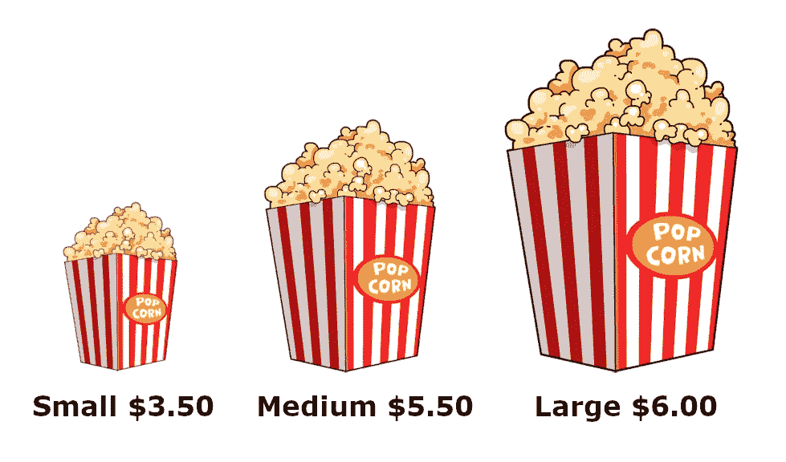

# 网络应用如何成为让你安装原生应用的诱饵

> 原文：<https://itnext.io/how-web-apps-became-decoys-to-get-you-to-install-native-apps-31cc5a9c4462?source=collection_archive---------1----------------------->

网络现在是一个无关紧要的替代品，我们必须做得更好

你知道电影院的爆米花价格表吗？那里大桶的爆米花只比中号的稍微贵一点点。

中号只是引诱你买大号的诱饵。

如果你能多花 50 美分买到一个大桶，你为什么要买中号的呢？

你当然不会。*没人做*。

故意放在那里让你买大的。

看看上面的图片，想象一下没有中号选项，只有小号和大号。你会选哪一个？

很难选择，对吧？

这被称为*诱饵效应*。它故意提供一个几乎没有人会选择的不相关的选择，只是为了让一个更贵的选择看起来更有吸引力。

# Web 应用程序是不相关的替代品

网络应用越来越多地被公司用作诱饵，让你安装他们的原生应用。

怎么会？

故意提供比他们的原生应用差得多的劣质用户体验。

通过用应用程序轰炸你，在他们的网络应用程序中安装横幅。

通过告诉你你需要应用程序“为了最好的体验”。

消息是网络不能提供本地应用程序可以提供的用户体验，坦白地说，这是一个过时的观点。

对这些公司来说，他们的网络应用程序是一个中等大小的爆米花桶，放在稍微贵一点的大桶旁边，让你去买。

这就像一个销售漏斗，顶部是他们的 web 应用程序，底部是他们的本机应用程序。

但是为什么呢？现在网络比以往任何时候都更强大？

# 无知、不愿意和特征差距

从历史上看，web 应用程序总是动力不足，无法提供本机应用程序所提供的功能。

但是网络已经发生了巨大的变化，这种功能差距正在快速缩小。

PWA 现在能做的事情令人惊讶许多(如果不是大多数)原生应用现在也可以成为 PWA。

虽然不是每个人都意识到了这一点，但可悲的是，网络应用的普遍形象是它们仍然不如本地应用。

更可悲的是，许多公司并没有对此进行调查，甚至似乎也不关心他们的 web 应用程序。

他们的网络应用不仅缺少某些功能，还存在一些问题，这些问题只能被描述为不愿意改进他们的网络应用，因为它只是原生应用的一个无关紧要的替代品:在你接触到“真正的东西”之前，它只是一个简化的试用版。

我说的是:

*   由于无法触及的按钮而无法在移动设备上使用的 web 应用程序
*   不能关闭的弹出窗口，因为关闭按钮在视窗之外，不能滚动
*   网络应用只是桌面网站的缩小版，所以你需要放大才能阅读文本，因为开发者懒得调整字体
*   在事情发生之前，你总是需要点击两次按钮
*   完全缺乏响应式设计

我可以继续一段时间…

在某种程度上，如果你把一个网络应用仅仅看作是一种推广本地应用的手段，那么提供更少的功能是有意义的，但是提供一个彻头彻尾的蹩脚用户体验就不是这样了。

# 公司把钱留在桌子上

统计数据显示，PWAs [持续改善用户参与度、加载时间、跳出率](https://www.pwastats.com/)并因此增加收入。

更快的网络应用=更多的收入，就这么简单，忽视网络应用的公司是*把钱留在桌子上*。

即使你不想走完整的 PWA 路线，你也应该*至少*给你的网络应用添加一个服务人员，这可以，不，*将*极大地提高它的性能*。*

*尽管有这样的好处，全球排名前 10k 的 web 应用中只有不到 6%真正使用了服务人员，而本地应用默认离线工作。*

*我们可以而且应该做得更好。*

# *但是…但是… iOS！*

*iOS 仍然是 PWA 房间里的大象，而且可能在一段时间内都是。*

*苹果通过不允许竞争对手的浏览器引擎出现在他们的平台上，有效地向 iOS 用户隐藏了 PWA 革命，但即使是他们也在取得进展，不会永远保持这种势头。*

*虽然 Safari 缺乏对现代网络功能的支持仍然是一个问题，但许多*都得到*支持，并可以在今天*中使用。**

**但对于某些用例，原生应用可能仍然是更好的选择。PWAs 可能不会很快取代原生应用，但我预见到一个光明的未来，如果我们不再把 web 应用视为原生应用的简化试用版。**

**网络应用对这一点来说太强大了。**

**渐进式网络应用甚至更加强大:**

*   **一款适用于网络、桌面、安卓和 iOS 的应用**
*   **自动更新**
*   **轻量级，只有 HTML，CSS 和 JavaScript**
*   **安装摩擦小，一键安装**
*   **安全，在浏览器沙箱内运行**
*   **脱机工作**
*   **通过 URL 轻松共享**
*   **不需要应用程序商店，但如果你愿意，你可以添加你的 PWA**

**在 Twitter 上关注我，在那里我写了现代网络能做什么，PWAs，和网络组件。**