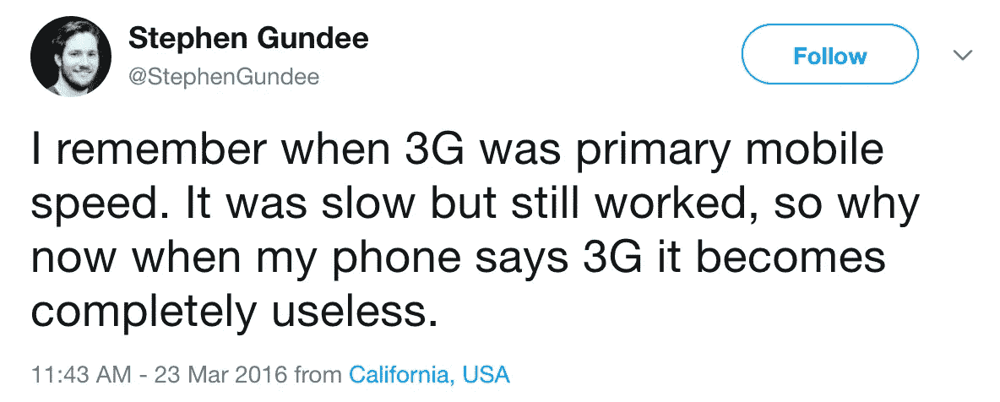
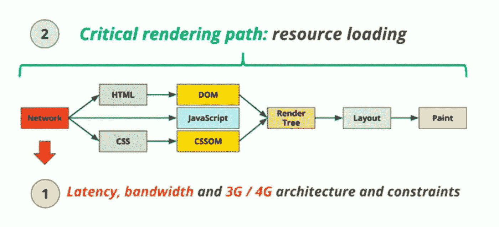
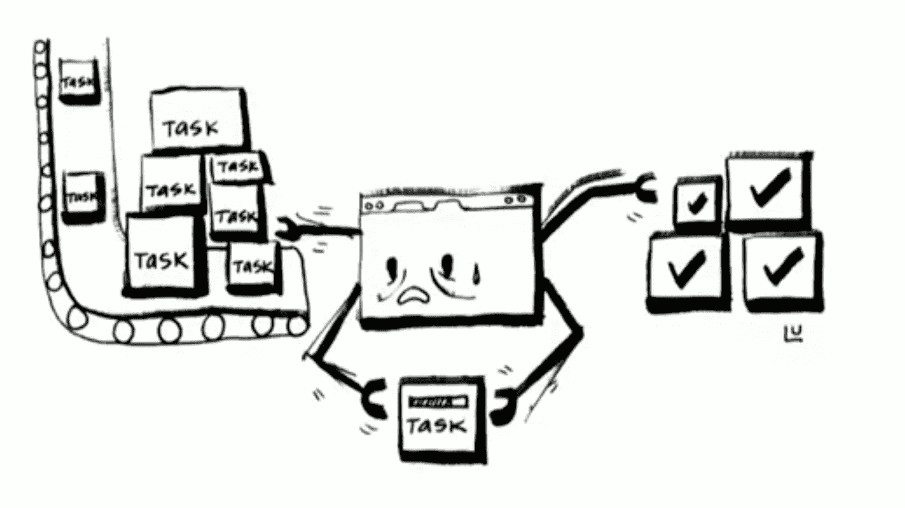
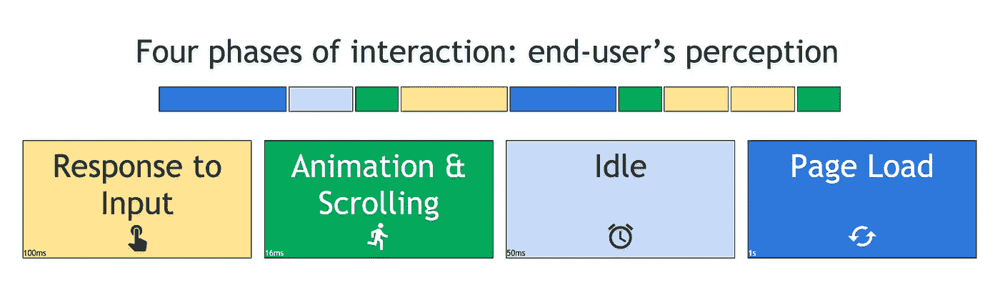
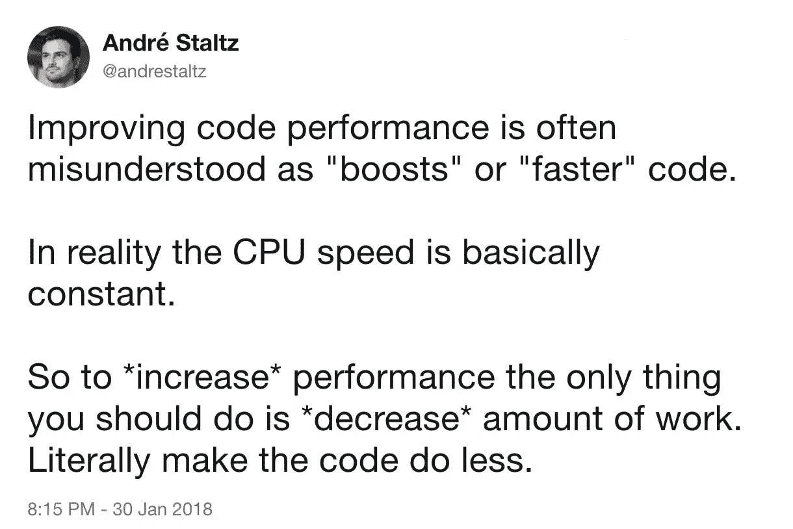
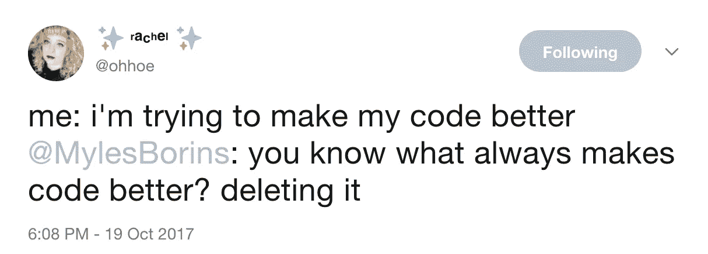
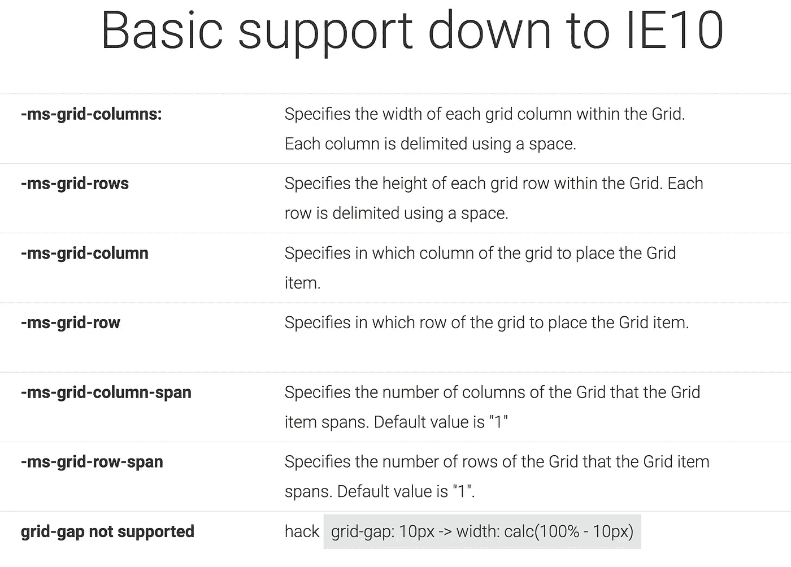

# web 性能、CSS 网格和 PWA 是如何关联的

> 原文：<https://itnext.io/how-web-performance-css-grid-and-pwa-are-related-873c68f385a9?source=collection_archive---------1----------------------->


照片由[麦科·阿莫林](https://unsplash.com/photos/SJWPKMb9u-k?utm_source=unsplash&utm_medium=referral&utm_content=creditCopyText)在 [Unsplash](https://unsplash.com/?utm_source=unsplash&utm_medium=referral&utm_content=creditCopyText) 上拍摄

[*点击这里在 LinkedIn 上分享这篇文章*](https://www.linkedin.com/cws/share?url=https%3A%2F%2Fitnext.io%2Fhow-web-performance-css-grid-and-pwa-are-related-873c68f385a9)

与网络一起工作是非常令人兴奋的，因为它在不断发展，我们总是有新的东西要学。谈到网络软件工程，最重要的事情之一就是性能，在这篇文章中，我将描述这些新技术如何提高你的应用程序的性能。

由于这些技术不是很新(在网络中老化比在现实生活中稍快)，它们有很好的浏览器支持，这意味着你可以在今天的软件中实现它们。

# 网络性能

关于网络性能已经说了很多。你必须缩小你的 JS 和 CSS 文件以方便下载，你必须压缩你的图像，你必须启用 gzip，你必须启用缓存等，但没有太多的话对什么是好的做之后。



[来自@StephenGundee 的推文](https://twitter.com/StephenGundee/status/712650972133138433)

让我们来理解当您在浏览器中请求一个页面时[会发生什么。给出一个简短的响应，如果请求成功并且您请求了一个 HTML 对象，浏览器将:](https://github.com/alex/what-happens-when)

*   获取 HTML
*   解析 HTML 并识别外部资源；
*   下载(服务器或缓存)资源:图像，字体，JS，CSS…
*   解析/呈现这些资源(其中一些任务是并发的，这可能会阻碍呈现)



图片取自@jaffathecake 幻灯片(视频:[https://vimeo.com/254947206](https://vimeo.com/254947206))

当您在浏览器地址栏中点击 enter 时，这个关键的呈现路径负责让您看到一个空白页面。这个名字很好听，因为它是一个**路径**，从浏览器从服务器接收文本开始，识别它为 HTML 文档，解析它，遇到资源，下载它们，构建渲染树，然后挂载页面布局并绘制它。

它是关键的 T4，因为如果它没有被优化，它会在向用户展示之前做额外的工作。等待所有的 CSS 都被应用以向用户显示页面是有意义的，因为否则用户会以某种方式看到内容，然后当 CSS 被应用时它会突然改变。字体也一样。但是对于 Javascript 来说，这没有意义。这就是为什么你应该总是`defer`或`async`你的`script`标签。

事情是在浏览器的主线程中完成的，所以当你的 JS 被执行时，它占用了主线程，并且阻塞了用户与页面的交互。有两篇关于 JS 如何在浏览器中工作的精彩演讲，一篇由[菲利普·罗伯茨](https://www.youtube.com/watch?v=8aGhZQkoFbQ)发表，另一篇由[杰克·阿奇博尔德](https://vimeo.com/254947206)发表。



浏览器与所有的任务斗争(我不记得我从哪里得到这个图像)

有很多技术可以减少关键路径上的工作，例如*延迟加载*不在用户视图中的图像，内嵌必要的 CSS 来渲染网站 fold 部分上方的*和*延迟加载*其余部分(通过 JS)，延迟加载或异步加载网站的 JS，等等。正如开头提到的，这些都是非常著名的技术，但是接下来呢？*

下载资源后，仍然需要对它们进行解析和应用/执行。所以你的 JavaScript 越大，浏览器就越能工作，不管你有多懒。在您的笔记本电脑中解析/评估这么多代码可能没什么问题，但是移动设备(以及一般的旧设备)可能会有困难。

虽然您的台式机可能有 8 GB 以上的 RAM，但如果使用 i5 或 i7 非常强大的 CPU，您的三星设备将有 2 到 4 GB 的 RAM，如果使用不那么强大的 CPU，iPhone 就更少了，您需要与打开的应用程序、操作系统以及移动设备共享这一能力:

*   未插电(JS 耗尽电池)；
*   拥有更少的存储、更少的内存、更弱的 CPU
*   不太可靠的连接
*   然而，他们有非常强大的(通常是最新的)浏览器

# 感知性能

我相信现在你已经注意到了清理关键路径的重要性。短而平滑的关键路径的结果是提高用户的感知性能:

*   人们主要通过视觉来消费网络；
*   我们必须专注于用户首先看到的内容(所谓的*在折叠*之上)；
*   延迟/异步/推迟下载资源:图像、字体、JS 和 CSS
*   担心渲染阻塞:JS 和 CSS
*   [小心解析&绘画](https://vimeo.com/254947206)

[保罗·爱尔兰](https://twitter.com/paulirish)在 2015 年就[用户如何看待网速](https://www.youtube.com/watch?v=2ksXo2_Lfl0)做了一个简短的演讲。在这次演讲中，他提到了铁路模型。



[保罗·爱尔兰](https://twitter.com/paulirish)——[用户如何看待网络速度(2015)](https://www.youtube.com/watch?v=2ksXo2_Lfl0)

首先页面加载(理想情况下大约一秒钟)，用户花一些时间看屏幕上的内容，然后他们通过滚动与屏幕互动，然后他们点击或执行一些动作，这可能会转到另一个页面，节奏会一直持续下去。

您可能无法在 1 秒内完成页面的渲染和交互，但您应该衡量一下哪些地方可以做得更好，或者您的网站在几次发布后是否变得更差，这里有一些工具:

*   [网页测试](http://www.webpagetest.org/)
*   [GTmetrix](https://gtmetrix.com/)
*   [页面重量(imgix)](https://pageweight.imgix.com/)
*   [灯塔](https://developers.google.com/web/tools/lighthouse/)
*   开发工具(即 Chrome >开发工具>性能标签)
*   [PWA 清单](https://developers.google.com/web/progressive-web-apps/checklist)

请记住:

> 虽然您可能不支持非 JavaScript 用户，但是您的用户在下载、解析和执行您的 JS 文件时基本上是非 JS 用户
> 
> [Estelle Weyl — JS 框架](http://estelle.github.io/jsframeworks)

# 少写代码

当我说“少写代码”时，就像“如果没有代码，就没有 bug”，这感觉像是在试图逃避问题，但这种说法也有一定的道理。你可能不需要 jQuery 或者你包含的其他库来执行一个小任务。

JavaScript 在过去的几年里已经有了很大的发展，并且已经实现了很多东西，所以在添加代码到你的应用之前要三思。

还有另一种方法，并不是写更少的代码，而是交付更少的代码。假设你从事电子商务，你很可能不需要在你的商品详情页面中使用 JS 代码结账，或者在你的主页中使用搜索/过滤代码。这是 Katie Hempenius 在[她关于 Smashing Conf(伦敦 2018)](https://vimeo.com/254858694) 的演讲中提到的一种技术，可能对你来说很容易实现。



[来自@andrestaltz](https://twitter.com/andrestaltz/status/958463667422539777) 的推文

当然，“没有代码就没有错误”是通过编写更少的代码获得的好处。你的团队需要关心的事情更少了。这个代码也可能是死代码，所以用户下载它是为了永远不使用它，一个新加入者可能认为它没有死，试图使用它，但不明白为什么它不能正常工作。



[来自@ohhoe 的推文](https://twitter.com/ohhoe/status/921105811849535488)

如果您想检查有多少代码正在被交付但没有被使用，请尝试`Chrome > More Tools > Coverage`。

# 网格布局

(以及 flexbox)

如果你已经了解了网格布局(我推荐你 [cssgrid.io](https://cssgrid.io/) )，你应该知道你可以抛弃任何网格框架，使用本地解决方案。因此，规则*通过利用 native* 编写更少的代码也可以应用于 CSS。

决定使用 display grid 或 flex 的黄金法则是，如果您需要在一维中布局元素，您可以使用 flexbox，如果您需要在二维中控制元素，那么最好使用 grid。

当然它比那更深，但是你可以从问你自己这个开始。此外，它们并不自我排斥，您可以将这两种类型的显示器结合起来，并且您可以用它们做[令人难以置信的事情](http://labs.jensimmons.com/)。

Grid/flexbox 可以替代 CSS 框架，但也可以替代一些 JS 代码，比如[基础均衡器、](https://foundation.zurb.com/sites/docs/equalizer.html)(或者任何[均衡器脚本](https://css-tricks.com/snippets/jquery/equalize-heights-of-divs/)、[砖石](https://masonry.desandro.com/)。[我知道](https://twitter.com/rachelandrew/status/912694518574665728) [网格布局不能替代砖石，](https://rachelandrew.co.uk/archives/2017/01/18/css-grid-one-layout-method-not-the-only-layout-method/)但是我已经看到一些网站使用砖石，我很确定他们可以使用网格来代替。

支持呢？嗯，你可以制定一些后备策略，但是如果你的主要敌人是 Internet Explorer，你可以使用一些前缀来完成基本的工作:



[IE10 和 IE11 的网格布局](https://msdn.microsoft.com/en-us/library/hh673533(v=vs.85).aspx)

到目前为止，这对我来说还不错。我用 SASS 来做一些混音，让我的生活更轻松

```
@mixin grid { display: -ms-grid; display: grid;}@mixin grid-template-columns($value) { -ms-grid-columns: $value; grid-template-columns: $value;}@mixin grid-template-rows($value) { -ms-grid-rows: $value; grid-template-rows: $value;}@mixin grid-column($value, $span: null) { -ms-grid-column: $value; @if ($span) { -ms-grid-column-span: $span; grid-column: #{$value} / span #{$span}; } @else { grid-column: $value; }}@mixin grid-row($value, $span: null) { -ms-grid-row: $value; @if ($span) { -ms-grid-row-span: $span; grid-row: #{$value} / span #{$span}; } @else { grid-row: $value; }
}/**** in the elements ****/.container {
  @include grid-template-columns(1fr 1fr 1fr);
}
```

[我目前正在我妻子的博客](https://github.com/sheldonled/mariaquerviajar/blob/master/src/sass/_mixins.scss)中使用它，如果你想在你的设备中查看它，这里有链接:[https://mariaquerviajar.com](https://mariaquerviajar.com)(葡萄牙语内容)。

去掉负责布局的 Javascript 不仅是好的，因为我们减少了代码库，还因为我们执行了更少的 Javascript。砖石和均衡器在窗口调整大小事件上有监听器。其他库甚至更糟，在窗口滚动上有监听器。通过去除这样的代码，我们也使互动和流动更加流畅。

# 渐进式网络应用

渐进式 web 应用程序是一个术语，用于定义通过 Web 服务的应用程序，这些应用程序利用新浏览器带来的技术，而不会失去对旧浏览器的支持。

这是渐进的，因为你可以渐进地添加新功能，而不会破坏不支持它的浏览器的体验。它是**网络**因为它是通过一个链接通过互联网提供的，就像任何网站一样。它是**应用**，因为它在支持它的浏览器和操作系统上表现得像一个应用。

如果你看了两个以上关于 PWAs 的演讲，你可能会看到“最好的网络与最好的应用相结合”的定义，但这确实是一个非常好的定义。从 PWA 开始，你首先需要的是 **HTTPS。**这是一个拦截器，即使您不打算将您的网站转变为 PWA，也应该优先考虑。

启用 HTTPS 带来了安全之外的好处，比如 PWA(当然)和新的浏览器 API。这些浏览器 API(稍后会提到一些)只在 HTTPS 下被允许，这很好，因为它们功能强大，需要在更安全的环境中工作。

PWA 是一套技术，你可以选择实现什么，什么时候实现。有一些会谈分享了一些策略，如[从网站到渐进式网络应用(GDD 欧洲](https://www.youtube.com/watch?v=KRSTpo6gqqU) '17)或[快速默认:现代加载最佳实践(Chrome Dev Summit 2017)](https://www.youtube.com/watch?v=_srJ7eHS3IM) 。

如果你想了解更多关于 PWA 的知识，在 Udacity 上有一个免费的[介绍课程，但是我想在这篇文章中提到的特色是](https://eu.udacity.com/course/intro-to-progressive-web-apps--ud811)[服务人员](https://developers.google.com/web/fundamentals/primers/service-workers/)。Service Worker 基本上是一个可编程的网络 API，它让您能够控制应用程序上的请求。它在后台运行，是浏览器和网络之间的桥梁。

借助 Service Worker，您不仅可以获得更好的缓存策略，还可以获得更可靠的体验，从而提高感知性能和实际性能。

## 是时候让你的旧代码着火了

拥有如此多的新事物让我们觉得需要在代码库上放把火，从头开始一切，不是吗？嗯，没有这个必要，我们可以逐步增强我们的应用程序，就像网络上的任何东西一样。但是使用单词 FIRE(大写)的意图是 PWAs 使用另一个首字母缩略词来指示体验应该是怎样的:

F

I **集成**:通过添加 [Web 应用清单](https://developers.google.com/web/fundamentals/web-app-manifest/)你可以让你的 Web 应用表现得像一个已安装的应用。

R **eliable** :通过发掘[服务工作者的全部力量，](https://developers.google.com/web/fundamentals/primers/service-workers/)管理缓存、连接缓慢和网络错误。

通过推送通知，你可以引导用户回到你的应用。

# HTTPS

[通过启用 HTTPS，您不仅可以提供更安全的体验](https://security.googleblog.com/2018/02/a-secure-web-is-here-to-stay.html)，还可以启用浏览器中的多个 API，例如 PWA:

*   [地理定位 API](https://developer.mozilla.org/en-US/docs/Web/API/Geolocation)
*   [媒体捕获和流 API](https://developer.mozilla.org/en-US/docs/Web/API/Media_Streams_API) ( [访问用户的视听输入](https://developers.google.com/web/fundamentals/media/video))
*   [加密媒体扩展](https://developers.google.com/web/fundamentals/media/eme)
*   [蓝牙 API](https://developers.google.com/web/updates/2015/07/interact-with-ble-devices-on-the-web)
*   [剪贴板 API](https://developer.mozilla.org/en-US/docs/Web/API/Clipboard_API)
*   [推送通知](https://developers.google.com/web/ilt/pwa/introduction-to-push-notifications)
*   [支付 API](https://paymentrequest.show/)
*   [凭证 API](https://developer.mozilla.org/en-US/docs/Web/API/Credential_Management_API)

# 结论

我希望这篇文章扩展了你对 web 性能的视野，超越了众所周知的应用程序对网络的障碍，并帮助你重新思考或改进你的应用程序架构。这是事后清单:

*   做好所有的功课来提高你的前端表现；
*   *清除关键路径*；
*   *编写更少的 Javascript* :通过移除死代码，用原生 JS 功能替换库，拆分你的 *app.min.js* ，只交付特定页面需要的东西；
*   *少写 CSS* :通过用新的 CSS 特性重构旧代码，用原生 CSS 替代框架；
*   *使用服务人员*:更好地管理你的缓存，在网络中断或坏的时候有一个后备。利用 PWA 改善您的用户体验；
*   *拆分你的代码库*。它更容易阅读、推理、维护，并且不太可能引入错误。

每天都在进步。你可以像我之前说的那样，把一切都付之一炬，重新开始，但更有可能的是，在你的团队中有一个升级策略，并且每天努力进行技术改进。

让团队中的每个人都与最佳实践和新技术保持一致也很好，这样他们就可以在日常工作中实现它们，同时开发应用程序中的任何功能或解决任何 bug。

> 提高绩效是一个旅程。许多小变化会带来大收获。[阿迪奥斯马尼](https://www.youtube.com/watch?v=_srJ7eHS3IM)。

# 参考资料和有用的链接

*   [ViewSource Conf —伦敦 2017](https://viewsourceconf.org/london-2017/)
*   雷切尔·安德鲁在[上进入 CSS 布局的](https://vimeo.com/254679499)——[幻灯片](https://rachelandrew.co.uk/speaking/event/smashing-london-2018)
*   杰克·阿奇博尔德谈[事件循环](https://vimeo.com/254947206)
*   菲利普·罗伯茨:[到底什么是事件循环？](https://www.youtube.com/watch?v=8aGhZQkoFbQ) | [JSConf EU 2014](https://2014.jsconf.eu/speakers/philip-roberts-what-the-heck-is-the-event-loop-anyway.html)
*   保罗·爱尔兰— [用户如何看待网络速度(2015)](https://www.youtube.com/watch?v=2ksXo2_Lfl0)
*   凯蒂·亨佩纽斯谈[提高现代网络应用的页面性能](https://vimeo.com/254858694)—[幻灯片](https://docs.google.com/presentation/d/1hBIb0CshY9DlM1fkxSLXVSW3Srg3CxaxAbdocI67NCQ/edit#slide=id.g32e52b1ea6_1_0)
*   珍·西蒙斯— [革新你的页面:真正的网络艺术方向](https://air.mozilla.org/jen-simmons/)。(ViewSource 2016)
*   [珍·西蒙斯的实验布局实验室](http://labs.jensimmons.com/)
*   [https://gridbyexample.com](https://gridbyexample.com/)
*   [https://cssgrid.io](https://cssgrid.io/)
*   瑞秋·安德鲁— [电网“后退”并覆盖](https://rachelandrew.co.uk/css/cheatsheets/grid-fallbacks)
*   [MSDN—IE10 和 IE11 的网格布局](https://msdn.microsoft.com/en-us/library/hh673533(v=vs.85).aspx)
*   [Eric Elliott——本地应用注定要失败](https://medium.com/javascript-scene/native-apps-are-doomed-ac397148a2c0)
*   [渐进式网络应用— MDN](https://developer.mozilla.org/en-US/Apps/Progressive)
*   [PWA 清单(谷歌开发者)](https://developers.google.com/web/progressive-web-apps/checklist)
*   真理子小坂— [服务人员，你是什么？](https://kosamari.com/notes/Service-Worker-what-are-you)
*   [渐进式网络应用简介— Udacity](https://eu.udacity.com/course/intro-to-progressive-web-apps--ud811)
*   [流言终结者 HTTPS(2016 年进步网络应用峰会)](https://www.youtube.com/watch?v=e6DUrH56g14)
*   [从网站到渐进式网络应用(GDD 欧洲 17)](https://www.youtube.com/watch?v=KRSTpo6gqqU)
*   [默认快速:现代加载最佳实践(Chrome Dev Summit 2017)](https://www.youtube.com/watch?v=_srJ7eHS3IM)
*   [付款申请 API](https://developers.google.com/web/fundamentals/payments/)
*   [PaymentRequest.show()](https://paymentrequest.show/)

## 开玩笑地

*   [http://www.flexboxdefense.com](http://www.flexboxdefense.com/)
*   [http://flexboxfroggy.com](http://flexboxfroggy.com/)