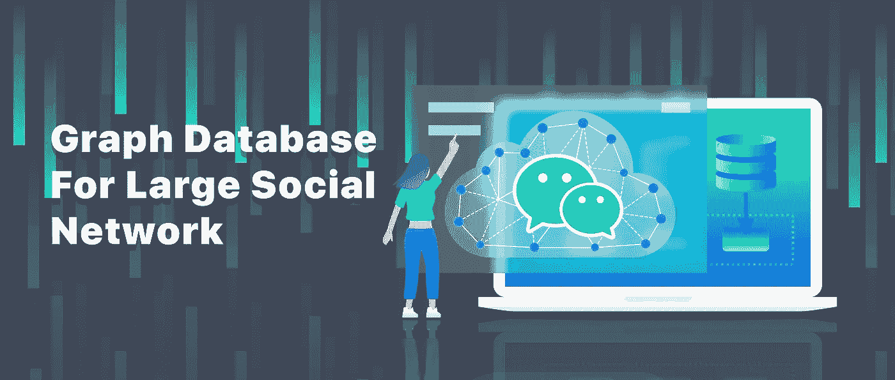
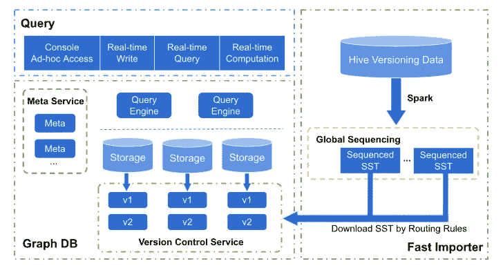
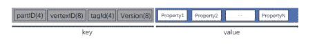
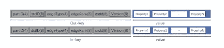

# 微信如何用 NebulaGraph 数据库存储一万亿社交连接

> 原文：<https://itnext.io/how-wechat-stores-one-trillion-social-connections-with-nebulagraph-database-393f5d634319?source=collection_archive---------2----------------------->

微信是世界上处理大规模异构图的社交网络应用之一。要处理的数据集包含以下内容:

*   一万亿个边/连接
*   总共 150TB 的数据集
*   每小时更新 1000 亿次连接

这是一个巨大的挑战。微信的团队发现了 [NebulaGraph](https://nebula-graph.io) ，这是一个开源的分布式图形数据库，通过数据库中的深度定制能力，终于实现了一些有用的按需功能。包括大数据存储、大数据集快速性能的数据导入、版本控制、秒级回滚、毫秒级的数据库访问。

# 巨型互联网公司面临的挑战

大多数知名的图数据库需要更有能力处理真正的大数据。例如 [Neo4j](https://neo4j.com/) 的社区版提供单主机服务，在知识图谱领域被广泛采用。然而，当涉及到非常大的数据集时，这个解决方案需要修改。在当今的商业世界中，大型数据集越来越常见。

此外，如果您选择多拷贝实施，还需要考虑数据一致性和灾难恢复问题。[骏利图](https://janusgraph.org/)通过使用外部元数据管理、kv 存储和索引，解决了大数据存储问题。然而，这种表现受到了广泛的批评。因此，微信团队评估的大多数图形数据库解决方案在性能方面都比 Janus Graph 好很多倍。

一些互联网公司建立自己的数据库。这些自主开发的解决方案迎合了他们自己的业务需求，而不是一般的图形场景。因此，它们只支持有限比例的查询语法。

# 蚂蚁金服的 GeaBase

GeaBase 是另一种选择，主要用于金融行业。它具有自主开发的查询语言、下推计算和毫秒级延迟。它的主要应用场景包括金融机构中的风险管理。为此，它支持拥有数万亿条边/关系的交易网络，存储实时交易数据，以及实时欺诈检测。

对于推荐引擎也很有用。这包括股票和证券推荐等应用。它的 Ant Forest 具有存储数万亿个节点的能力、强大的数据一致性和低延迟查询。它还具有动态图形 CNN 的 GNN 特性，用于基于动态图形的在线推理。

# 阿里巴巴的图片

还有 iGraph，一个图形索引和查询系统。它存储用户行为信息，作为阿里巴巴四大骨干中间平台之一。iGraph 采用 Gremlin 作为其图形查询语言，用于电子商务关系的实时查询。

# 来自字节跳动的 ByteGraph(又名抖音)

通过向 kv 层添加缓存层，ByteGraph 将关系拆分为 B+树，以便高效访问边和数据采样。结构就像脸书的道。

# 微信大数据解决方案的架构

微信团队想出了以下架构来解决大数据存储和处理问题。

# 为什么是星云图数据库？

从上面的架构可以看出，图形数据库是解决方案的主要组成部分。微信最终选择了 NebulaGraph 作为其探索图形数据库之旅的起点。

微信发现 NebulaGraph 最有潜力**处理基于数据集分区和独立关系存储能力的海量数据集存储需求**。它还具有基于强一致性存储引擎的下推计算和 MPP 优化。最后，该团队在图形数据库领域拥有丰富的经验，并拥有成熟的大数据抽象模型。

# 实践中的问题

# 内存不足

微信团队遇到了内存问题。本质上，这是一个性能与资源的问题。在处理大规模数据集的应用中，内存占用是一个不可忽视的问题。RocksDB 中有几个组件会影响内存的使用。有块缓存、索引和布隆过滤器。还有迭代器钉住的内存表和内存块。因此，微信团队开始优化内存利用率。它始于块缓存优化。为此，它采用全局 LRU 缓存来控制机器中所有 RocksDB 实例的缓存占用。

然后团队做了一个 bloom filter 优化。edge 被设计为一个键值对，存储在 RocksDB 中。如果所有密钥都存储在 bloom 过滤器中，并且每个密钥占用 10 位，那么整个过滤器所需的内存将大大超过机器内存。

该团队观察到，大多数情况下，请求是为了获取特定节点的边列表。因此，该团队采用了前缀布隆过滤器。另一个优化是为顶点上的属性创建索引，为大多数请求提供加速。最后，单主机过滤器的内存占用是千兆字节级的，而不会牺牲大多数请求的速度。

# 版本控制

对于版本控制，实际上有几个业务需求。它提供图形数据快速回滚、定期完整数据导入和对最新版本数据的自动访问。该小组将数据源分为两类。

比如循环数据，按天生成相似用户列表，数据导入成功后生效。然后是历史数据和实时数据。例如，按天刷新历史数据，团队将历史数据与实时数据结合起来作为要导入的完整数据。

以下是 RockDB 中的数据存储模型。

顶点存储模型:

边缘存储模型:

时间戳用作实时数据的版本控制方法。手动指定导入数据的版本。在实践中，团队有三个版本控制选项。第一个是 reverse_versions，其中的版本列表是为了回滚而保存的。第二个是 active_version，用户请求访问该版本。最后是 max_version，在某个版本之后数据被反转。反向数据是历史数据和实时数据的结合。

使用这三个选项，团队可以有效地管理离线和在线数据。下次压缩时，不再使用的数据将从磁盘中清除。这样，应用程序无需在后台就可以更新数据版本。数据回滚可以在几秒钟内完成。

以下是一些例子:

*   保留三个版本的数据并激活其中一个

`alter edge friend reserve_versions = 1 2 3 active_version = 1`

*   数据来源是历史数据和实时书面数据

`alter edge friend max_version = 1592147484`

# 快速完整数据导入

进行大规模的数据导入是一种常见的做法。没有任何优化的导入请求不仅会影响生产中的请求，而且需要一天以上的时间才能完成。因此，提高进口速度成为迫切要求。SST 摄取是实现快速导入的常用方法。微信团队采用了类似的东西。

该团队通过调度 Spark 任务离线生成 SST 文件。存储节点提取所需的数据，并将数据接收到图形数据库中。然后，可以通过版本控制请求访问最新的版本数据。导入过程需要几个小时才能完成，速度很快。并且它不影响对图形数据库的请求，因为计算主要是离线的。

# 共享-无

无共享架构是一种被广泛讨论的确保水平可伸缩性的方法。在实践中实现该架构需要编程技能。元缓存用`shared_ptr`封装，并且被频繁访问，这使得它成为原子操作冲突的温床。为了实现无共享，微信团队将每个元缓存复制为一个本地线程。这个[拉动请求](https://github.com/vesoft-inc/nebula/pull/2165)提供了细节。

实现图形数据库的利用是一个漫长的过程。这是一个在很大程度上通过克服障碍继续取得成功的过程。

# 探索图形数据库？

查看 [**星云图数据库**](https://nebula-graph.io/) ，加入**开源**社区，在 [Slack](https://bit.ly/3SmvFu2) 发掘更多图形数据库的实际用例。