# 如何为 OSS 做出贡献

> 原文：<https://itnext.io/how-you-can-contribute-to-oss-1a74363e0d49?source=collection_archive---------4----------------------->

所以你很好奇如何为开源做贡献？很好，这是一个很好的心态。开源的东西可以被我们所有人使用，所以花费你所有的额外时间是一件非常好的事情。

为开源做贡献是有一些规则的，这些规则是有原因的。想象一下，一群开发人员都想做出贡献，我们需要有一种方法来确保他们的更改是以负责任的方式完成的。负责任可能意味着这样的事情:

*   **林挺，**代码坚持林挺规则或在其他方面遵循某种风格指南
*   **测试**，根据您建议的变更，有更新的测试或增加的测试
*   **提交**要么被压缩，要么被分成许多小的提交，其中每个提交只改变一件事。为了更好地工作，每个提交都应该遵循某种命名标准，例如，[语义提交](https://seesparkbox.com/foundry/semantic_commit_messages)

# 入门指南

大多数项目不会让你直接将你的分支推向回购，而是你需要分叉存储库。fork 仅仅是一个项目的副本，意味着您不会直接影响您想要帮助的项目。这为您在分叉的存储库上自由试验留下了空间。那么，我们如何对真正的回购协议做出这些改变呢？为此，我们需要创建一个 PR，一个 pull 请求。然后我们只需要让 PR 通过评审人员和他们的 CI(持续集成)系统，BOOM，你就可以称自己为贡献者了。让我们写下我们需要采取的具体步骤，并详细展示每个步骤:

*   **叉子**储存库
*   **在本地创建**分支
*   **添加**代码，并可选地对您的本地分支进行测试
*   **提交**更改到您的本地分支
*   **按下**代码并提出一个请购单

## 派生存储库


这一步相当简单。只需点击 Fork 按钮，它就会在你的 GitHub 帐户上创建一个库的副本。

# 创建分支

所以现在我们在本地为我们的代码创建一个分支。您可以创建一个分支并在一个动作中将其检出:

```
git checkout -b feature/name-of-my-feature
```

现在，您可以根据需要修改代码了。

# 试验

你应该，最好是，在你开始编码之前，想想你将如何测试你的改变，你需要增加一个集成测试还是单元测试？查看您的具体项目，了解如何构建和运行该库/框架，尤其是如何运行附带的测试。一旦您开始添加代码，您将会看到是否有任何测试因此而中断。如果没有测试中断，你要么是幸运的/好的，要么你可能需要自己添加一些测试。确保您从命名和代码风格的角度来看项目中的其他测试是如何编写的。

# 犯罪

这里我的建议是，不要一次添加太多改动。根据它们所做的事情，有一些小的集中提交，它们被很好地命名。例如:

```
feat: adding pagination to product list
```

或者

```
test: adding tests for pagination of product page
```

# 推动变革

一旦你实现了你想要实现的目标，是时候推动改变了。您可以通过键入以下命令来完成此操作:

```
git push origin master
```

# 提高公关

在这里，你进入 GitHub 上的 fork，选择`New pull request`按钮。

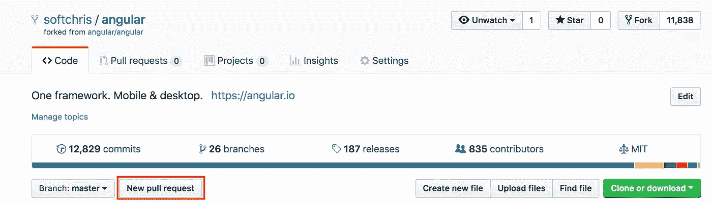

选择后，您将进入下一页，如下所示:

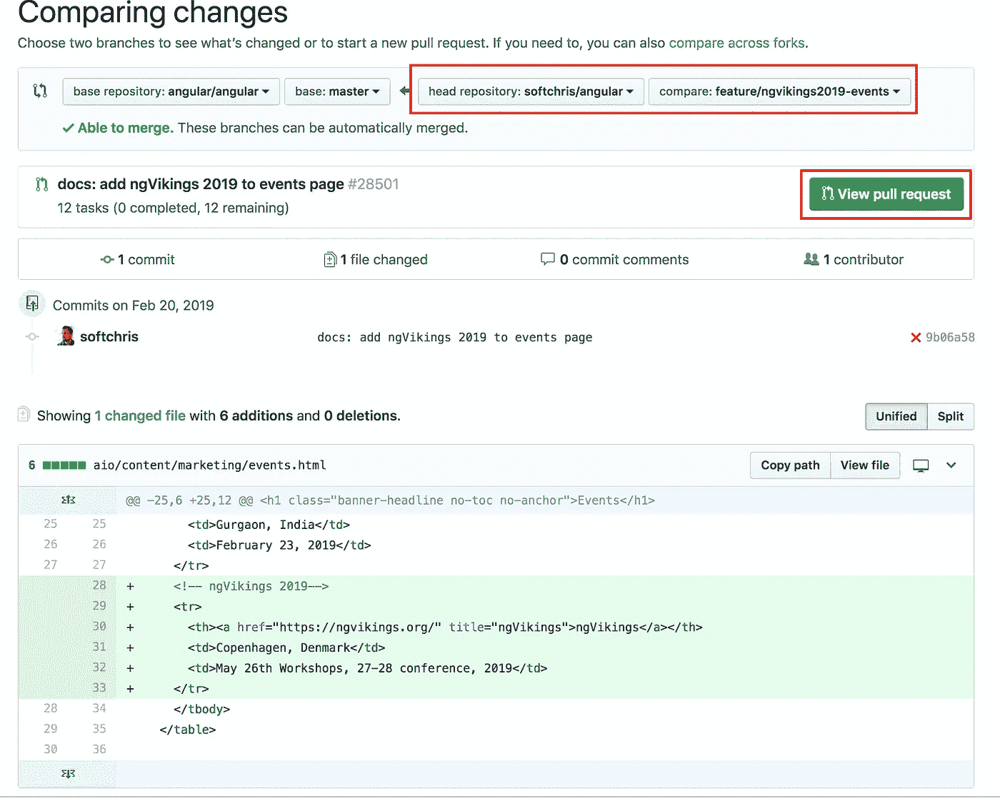

在上面，我们需要在右边选择我们的存储库以及推送的分支。然后我们需要点击绿色按钮，如果您还没有创建 PR，应该说`Create new pull request`。在这一点上，你可以给你的公关一个名字，你也应该看看是否有一些复选框，你应该检查告诉维护者你的公关是什么。一旦你的公关被创建，按钮将改变其文本为`View pull request`。点击此按钮将带您进入有问题的实际拉取请求。

现在，PR 依赖于您正在尝试更改的实际回购，看起来应该是这样的:

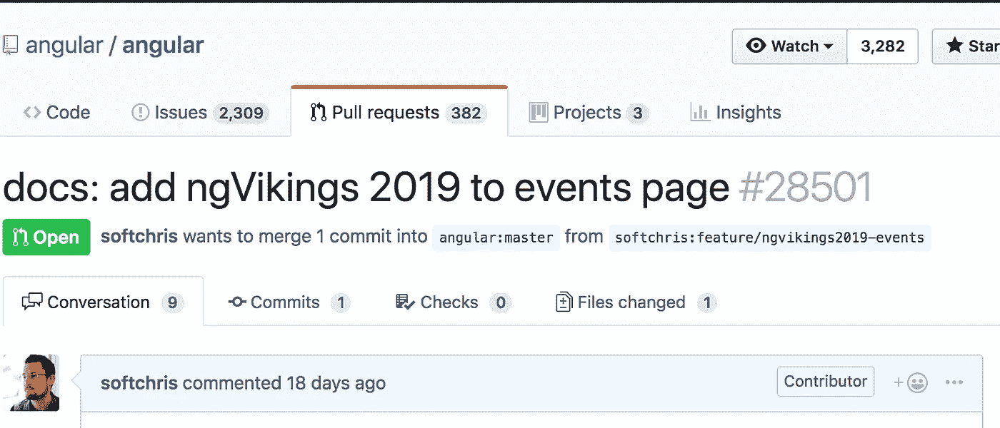

请注意本页的评论，因为核心维护人员会告诉你是否有什么需要改变。此外，CI 系统可能会告诉您是否有问题，并有望为您提供有用的错误消息:

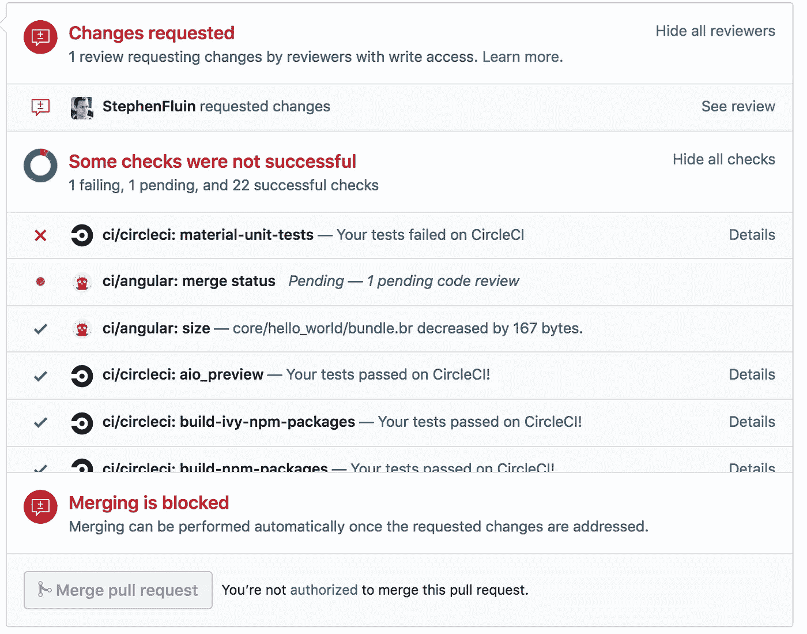

# 处理变更请求

这是一个可能需要几次迭代才能做好的过程。可能是这样的事情:

*   你的公关标题需要改变
*   你的提交不是小而集中的，如果太多的话，需要分开或者压缩
*   一个测试失败了(你应该在本地发现测试，但是糟糕的事情发生了:)

## 更改 PR 标题

这种变化的原因是你的头衔可能不符合某个标准。请务必检查回购中提供的示例，看看这应该是什么样子。

## 挤压提交

在这一点上，一个维护者说你的许多提交可以被合并成一个提交。他们通常会告诉你哪些应该组合在一起。挤压意味着许多提交现在将被一个提交取代。那么我们如何做到这一点呢？这个链接会告诉你所有的[步骤](https://github.com/wprig/wprig/wiki/How-to-squash-commits)，但是让我们来浏览一下。让我们从第一个命令开始:

```
git rebase -i master
```

此时，您将看到以下内容”

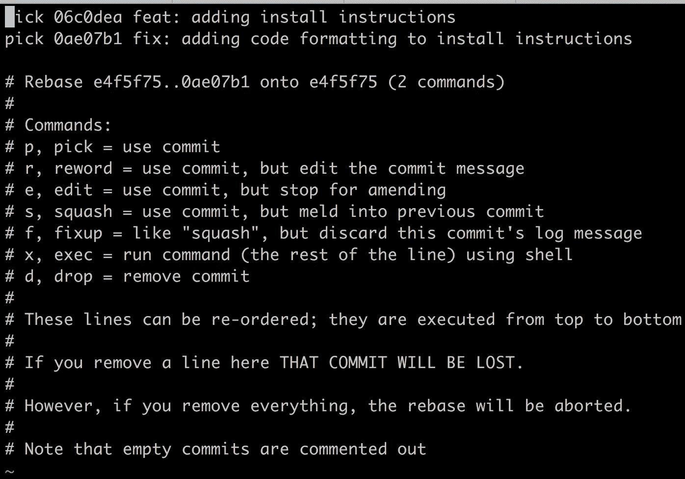

此时，我们可以看到所有的提交。所有提交都以`pick`开始，后面是提交 ID，然后是提交消息。你想保留的提交什么都不用做，也就是说你保留了`pick`关键字。在这种情况下，我们希望确保最近的提交被挤到顶部提交中。为此，我们将第二个提交更改如下:

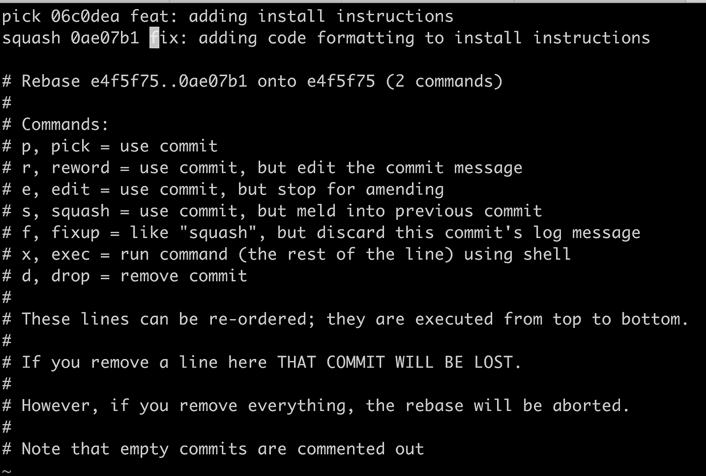

上面我们按下`i`结束插入模式，因为这是 VIM，是的，我知道如何退出；)现在我们已经完成了我们想要的更改，让我们保存它。按下`Esc`离开插入模式，然后键入`:`和`:wq`，这将写入更改并保持 VIM。

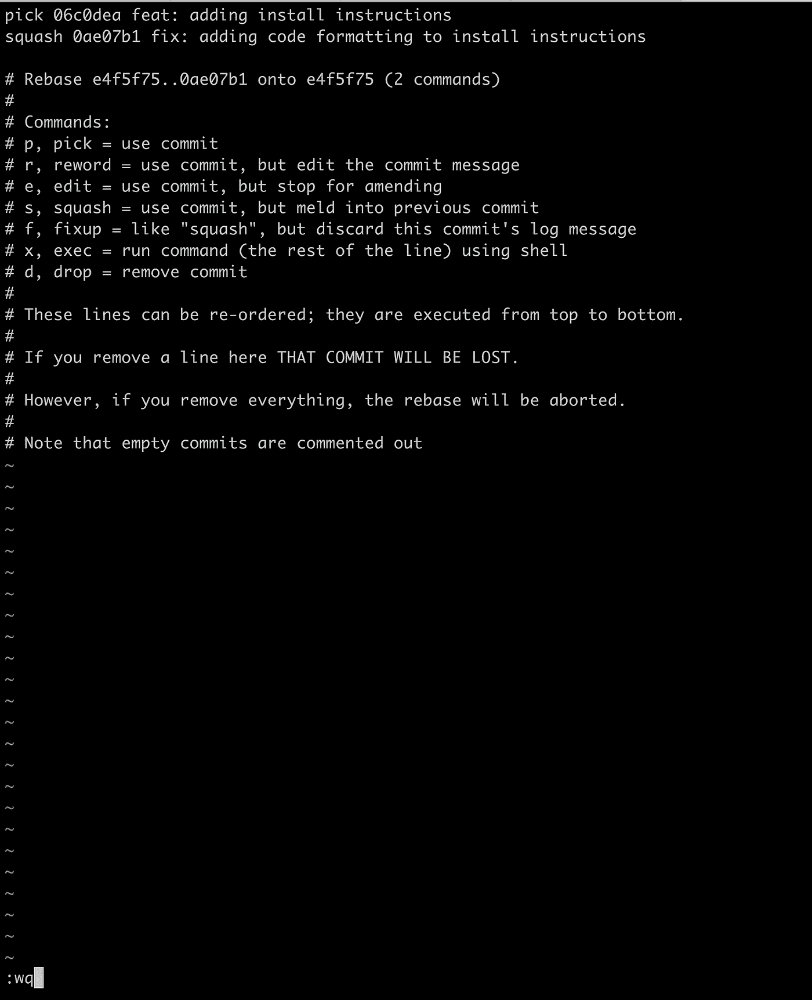

不，你以为退出 VIM 就这么简单吗？；)现在您将看到一个页面，要求您调整提交消息。它将包含所有提交消息，如下所示:

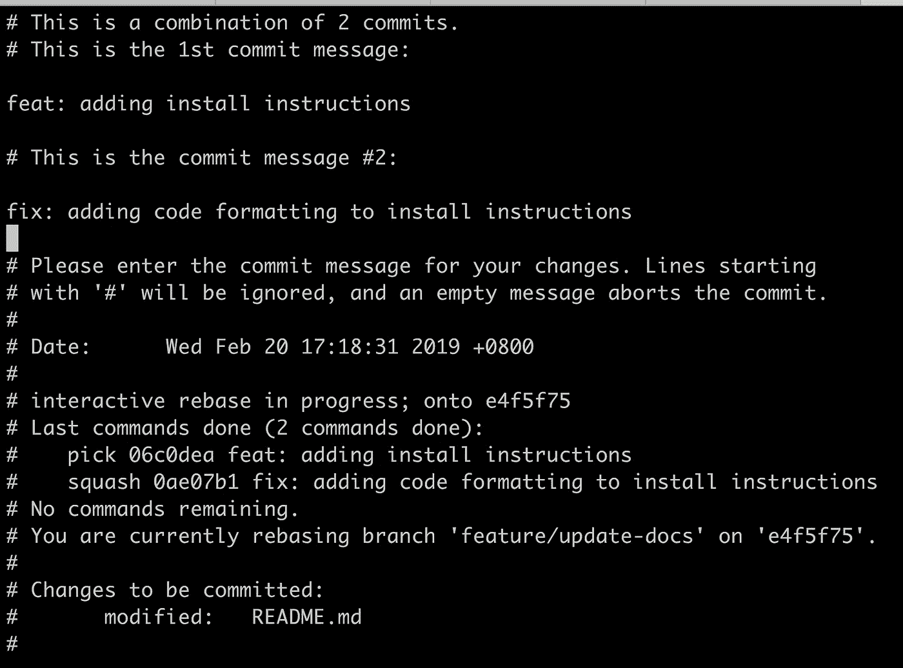

字符#将被忽略，因此调整其他文本，很可能您希望保留第一个提交消息，如下所示:

我们按下`i`进入插入模式，我们编辑文本，这样我们就有了:

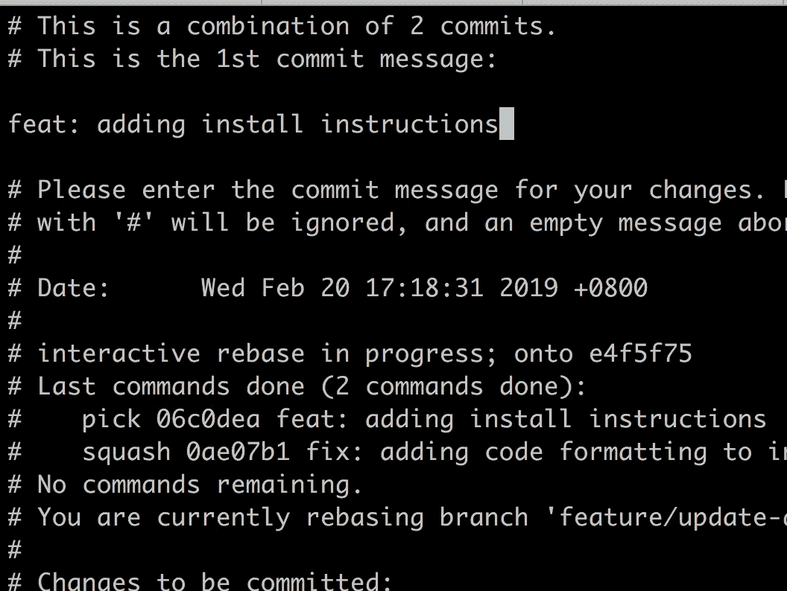

现在让我们尝试用`:wq`再次退出 VIM。这次我们做到了，看起来应该是这样的:

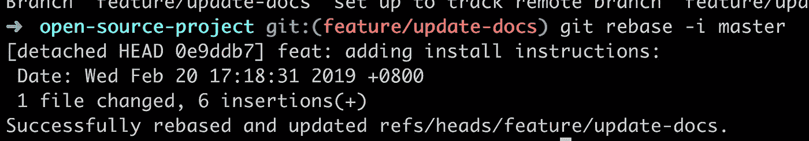

现在我们需要将它推送到存储库。我们需要用力推动它，所以我们输入:

```
git push -f
```


看看我们的公关，现在看起来是这样的:

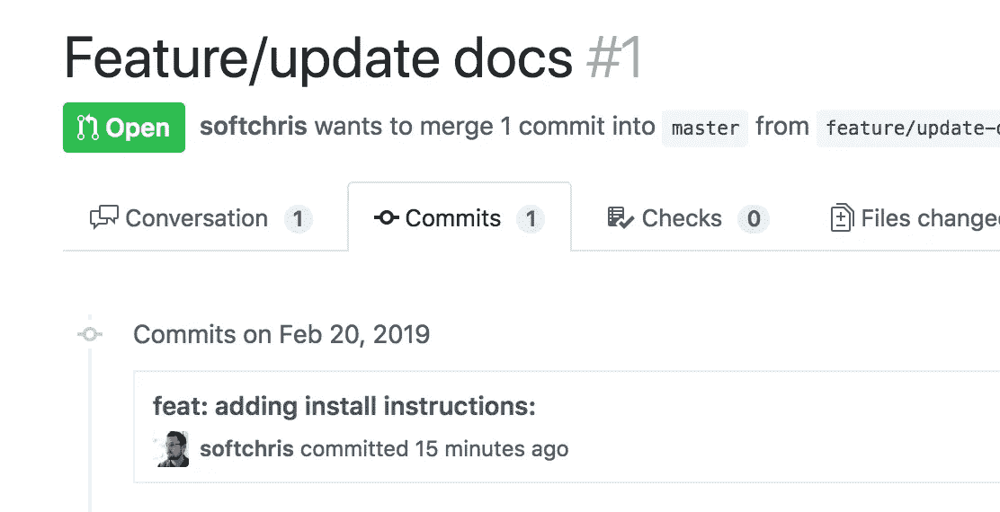

只有一个承诺，成功。

# 重命名您的提交

好吧，所以这次维护者似乎更高兴了。但是，他们希望您将提交重命名为`feature: adding install instructions`。好吧，我们可以这么做。为此，我们使用以下命令:

```
git commit --amend
```

这给了我们更新提交消息的机会，它应该是这样的:

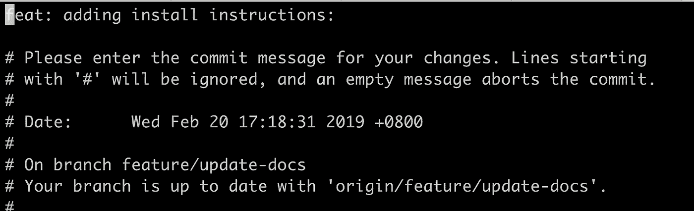

现在您已经知道了进入插入模式并适当更改消息的步骤`i`:

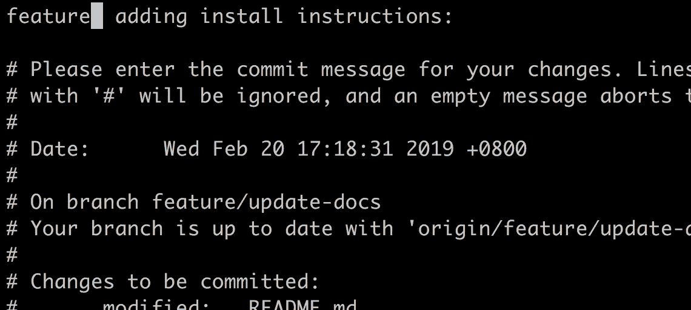

然后按`Esc`退出插入模式，接着按`:wq`。现在，检查 git 日志，您的提交已经被相应地更改:

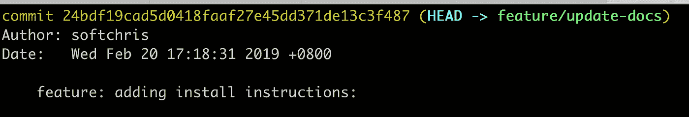

好极了，我们的提交已经更改了名称，至少在本地是这样。让我们把它推到我们的仓库。因为您在本地对此进行了更改

```
git pull // make sure you do this one first
git push
```

好了，现在，您的存储库将在 git 日志中创建一个合并条目，这实际上意味着您将有两个条目。让我们再次开始这场疯狂的马戏:

```
git rebase -i master
// change some commits to squash
git push -f
```

最后，我们有了这个:

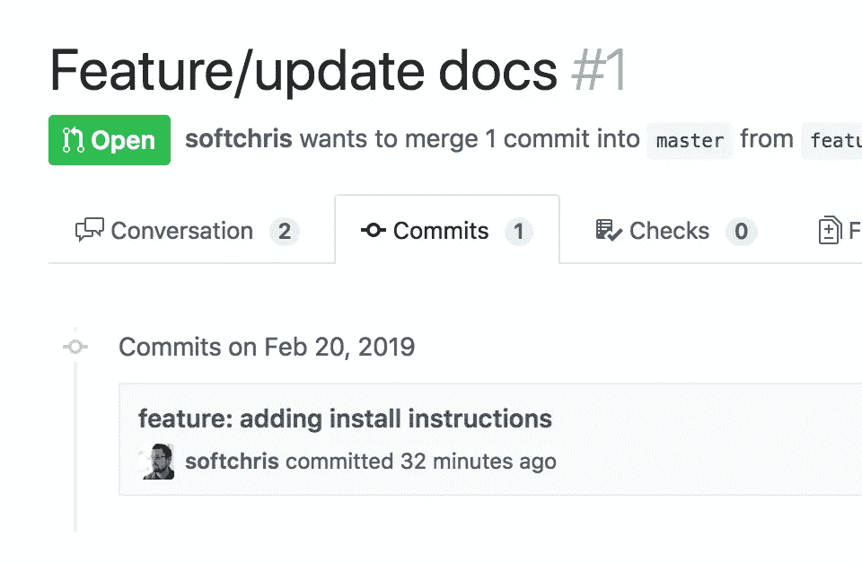

# 摘要

希望你现在已经有了你的第一份公关合同。恭喜你是一个贡献者，你刚刚帮助了整个编码社区。感觉工作量很大吗？嗯，有很多 OSS 维护者将此作为一项真正的工作，你所做的工作有望被很多开发人员使用，所以你应该很高兴没有什么困难可以确保质量。