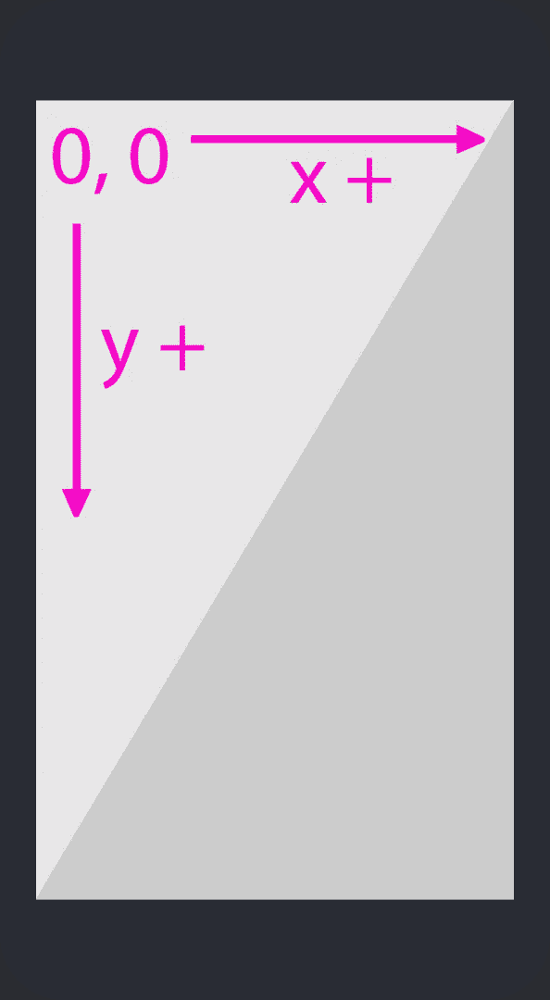
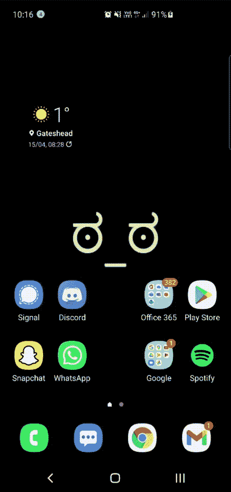

# 如何用 Python 控制你的 Android 设备

> 原文：<https://itnext.io/how-you-can-control-your-android-device-with-python-45c3ab15e260?source=collection_archive---------0----------------------->


卡斯帕·卡米尔·鲁宾在 [Unsplash](https://unsplash.com/s/photos/phone-code?utm_source=unsplash&utm_medium=referral&utm_content=creditCopyText) 上的照片

# 介绍

不久前，我在想办法给我的朋友发几分钟的垃圾信息，以此来激怒他们，在做一些研究时，我发现了 Android 调试桥。在这篇快速指南中，我将向你展示如何使用 Python 与它交互，以及如何创建 2 个快速脚本。

ADB (Android Debug Bridge)是一个命令行工具(CLI ),可用于控制 Android 设备并与之通信。你可以做许多事情，如安装应用程序，调试应用程序，找到隐藏的功能，并使用外壳直接与设备接口。要启用 ADB，您的设备必须首先解锁开发者选项并启用 USB 调试。要解锁开发者选项，您可以转到设备设置，向下滚动到“关于”部分，找到设备上当前软件的内部版本号。点击*构建号* 7 次，开发者选项将被启用。然后，您可以进入设置中的开发者选项面板，并从那里启用 USB 调试。现在你唯一需要的是一根 USB 线来连接你的设备和电脑。

以下是今天的旅程:

1.  安装需求
2.  入门指南
3.  编写脚本的基础
4.  创建自拍定时器
5.  创建定义搜索器

# 安装需求

我们需要安装的两件东西中的第一件是我们电脑上的 ADB 工具。这是自动与 Android Studio 捆绑在一起的，所以如果你已经有了，也不用担心。否则，你可以前往[官方文档](https://developer.android.com/studio/command-line/adb)，在页面顶部应该有如何安装的说明。

安装 ADB 工具后，您需要获得 python 库，我们将使用该库与 ADB 和我们的设备进行交互。您可以使用`pip install pure-python-adb`安装 pure-python-adb 库。

**可选**:为了让我们在开发脚本时更容易，我们可以安装一个名为 scrcpy 的开源程序，它允许我们使用鼠标和键盘在电脑上显示和控制我们的 android 设备。要安装它，你可以去 [Github repo](https://github.com/Genymobile/scrcpy) 下载适合你的操作系统(Windows、macOS 或 Linux)的正确版本。如果您在 Windows 上，那么将 zip 文件解压缩到一个目录中，并将该目录添加到您的路径中。这样我们就可以从系统的任何地方访问该程序，只需在终端窗口中键入 scrcpy。

# 入门指南

既然所有的依赖项都已安装，我们就可以启动 ADB 并连接我们的设备了。首先，用 USB 线把你的设备连接到你的电脑，如果 USB 调试被激活，那么会弹出一条信息，询问你的电脑是否可以控制设备，简单的回答是。然后在你的电脑上，打开一个终端窗口，输入 adb start-server 启动 ADB 服务器。这将打印出以下消息:

```
* daemon not running; starting now at tcp:5037
* daemon started successfully
```

如果您也安装了 scrcpy，那么您只需在终端中键入`scrcpy`就可以启动它。然而，这只有在您将它添加到您的路径中时才有效，否则您可以通过将您的终端目录更改为您安装 scrcpy 的目录并键入`scrcpy.exe`来打开可执行文件。如果一切顺利的话，你应该可以在你的电脑上看到你的设备，并且可以用你的鼠标和键盘控制它。

现在，我们可以创建一个新的 python 文件，并检查是否可以使用该库找到我们连接的设备:

这里我们导入 AdbClient 类并使用它创建一个客户机对象。然后我们可以得到连接的设备列表。最后，我们从列表中取出第一个设备(如果只连接了一个设备，它通常是唯一的一个)。

# 编写脚本的基础

我们与设备交互的主要方式是使用外壳，通过它我们可以发送命令来模拟特定位置的触摸或从 A 到 b 的滑动。要模拟屏幕触摸(点击),我们首先需要了解屏幕坐标是如何工作的。为了帮助解决这些问题，我们可以在开发者选项中激活指针位置设置。一旦激活，无论你触摸屏幕上的什么地方，你都可以看到该点的坐标出现在顶部。坐标系是这样工作的:



显示坐标系如何工作的图表

显示屏的左上角分别有 *x* 和 *y* 坐标(0，0)，右下角的坐标是 *x* 和 *y* 的最大可能值。

现在我们知道了坐标系是如何工作的，我们需要检查我们可以运行的不同命令。我在下面列出了一些命令以及如何使用它们，以供快速参考:

```
Input tap x yInput text “hello world!”Input keyevent eventIDHere is a list of some common eventID’s:3: home button4: back button5: call6: end call24: volume up25: volume down26: turn device on or off27: open camera64: open browser66: enter67: backspace207: contacts220: brightness down221: brightness up277: cut278: copy279: paste
```

如果你想找到更多，这里有一个长长的列表[这里](https://forum.xda-developers.com/t/q-adb-input-keyevent-for-long-press-on-power-button.2063741/post-64890206)。

# 创建自拍定时器

现在我们知道我们能做什么，让我们开始做吧。在第一个例子中，我将向你展示如何创建一个快速自拍定时器。首先，我们需要导入我们的库并创建一个连接函数来连接到我们的设备:

您可以看到，connect 函数与前一个如何连接到您的设备的示例是相同的，只是这里我们返回了设备和客户端对象供以后使用。

在我们的主代码中，我们可以调用 connect 函数来检索设备和客户端对象。在那里，我们可以打开相机应用程序，等待 5 秒钟，然后拍照。真的就这么简单！正如我之前所说的，这只是简单地复制你通常会做的事情，所以思考如何做事情是最好的，如果你先自己手动做，并写下步骤。

# 创建定义搜索器

我们现在可以做一些更复杂的事情，那就是让浏览器找到一个特定单词的定义，并截图保存在我们的电脑上。

该计划的基本流程如下:

```
1\. Open the browser2\. Click the search bar3\. Enter the search query4\. Wait a few seconds5\. Take a screenshot and save it
```

但是，在我们开始之前，您需要在默认浏览器中找到您的搜索栏的坐标，您可以使用我之前建议的方法轻松找到它们。对我来说他们是(440，200)。

首先，我们必须像以前一样导入相同的库，并且我们还将拥有相同的连接方法。

在我们的主函数中，我们可以调用 connect 函数，并为搜索栏的 *x* 和 *y* 坐标分配一个变量。注意这是一个字符串，而不是一个列表或元组，这样我们可以很容易地将坐标合并到 shell 命令中。我们还可以接受用户的输入，看看他们想得到什么词的定义:

我们会将该查询添加到一个完整的句子中，然后进行搜索，这样我们就可以随时获得定义。之后，我们可以打开浏览器，在搜索栏中输入我们的搜索查询，如下所示:

这里我们使用 eventID 66 来模拟按下 enter 键来执行我们的搜索。如果你愿意，你可以根据需要改变等待时间。

最后，我们将使用 screencap 方法对我们的设备对象进行截图，并将其保存为*。png* 文件:

这里我们必须以写字节模式打开文件，因为 screencap 方法返回代表图像的字节。

如果一切按计划进行，您应该有一个搜索特定单词的快速脚本。这是我的手机:



一个 GIF 展示了如何在我的手机上使用定义搜索器的例子

# 最后的想法

希望你今天学到了一些新的东西，就我个人而言，在我做一些研究之前，我甚至不知道这是一件事。酷的是，你可以做任何你平常能做的事情，甚至更多，因为它只是模拟你自己的触摸和动作！

我希望你喜欢这篇文章，并感谢您的阅读！💖