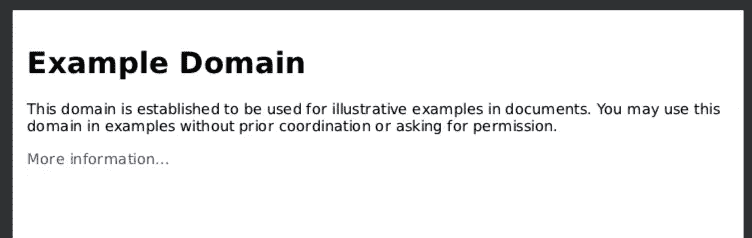
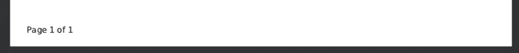

# 在云中使用 Chrome 傀儡将 HTML 转换为 PDF

> 原文：<https://itnext.io/html-to-pdf-using-a-chrome-puppet-in-the-cloud-de6e6a0dc6d7?source=collection_archive---------0----------------------->

我将带您了解设置一个无头 chrome 浏览器的过程，您可以在 AWS 上运行该浏览器，并使用 API 来做浏览器可以做的大多数事情。我们今天的目标是让 chrome 导航到一个 URL，等待页面完全加载，然后创建一个 PDF。

chromium 团队已经发布了无头 chrome 节点 API 木偶师。

[](https://github.com/GoogleChrome/puppeteer) [## 谷歌色素/木偶师

### 无头 Chrome 节点 API。在 GitHub 上创建一个帐户，为 Google chrome/木偶师的发展做出贡献。

github.com](https://github.com/GoogleChrome/puppeteer) 

> Puppeteer 是一个节点库，它提供了一个高级 API 来控制 Chrome 或通过 [DevTools 协议](https://chromedevtools.github.io/devtools-protocol/)的 Chrome。木偶师默认运行无头的[，但可以配置为运行全(无头)铬或铬。](https://developers.google.com/web/updates/2017/04/headless-chrome)

还有一个非常有用的网站，你可以去试试木偶戏:[https://try-puppeteer.appspot.com/](https://try-puppeteer.appspot.com/)。他们提供的创建 pdf 的示例代码如下所示:

```
const browser = await puppeteer.launch();
  const page = await browser.newPage();
  await page.goto('[https://news.ycombinator.com'](https://news.ycombinator.com'), {waitUntil: 'networkidle2'});
  await page.pdf({
    path: 'hn.pdf',
    format: 'letter'
  });await browser.close();
```

上面使用的 API 在这里有很好的记录。看一下 page.pdf，我们看到该函数接受一组选项，并返回一个用 PDF 缓冲区解析的承诺。这些选项给了你很好的控制。如果您不想消耗缓冲区、控制页眉、页脚和页面格式等，您可以设置保存 pdf 的路径。

# 构建和部署到 AWS

在我们开始之前，您需要在您的机器上安装 node8.10 和 npm，并且您需要一个 AWS 帐户来部署您的代码。AWS Lambda 有一个相当慷慨的免费层—参见 [AWS Lambda 定价](https://aws.amazon.com/lambda/pricing/)

## 无服务器

我将使用无服务器框架，我发现这是部署到 AWS 的最简单的方法。如果您以前没有使用过无服务器，请从安装 cli 开始:

```
npm install -g serverless
```

然后，您需要设置您的 AWS 凭证:

如何创建 AWS 访问键

完成设置后，创建您的项目。

```
serverless create --template aws-nodejs --path ./lambda-puppeteer
```

这将创建 lambda-puppeter 文件夹，其中包含一个基本的 javascript lambda 部署项目。

我的偏好是使用 typescript 而不是普通的 javascript，所以我们将把项目转换成下面的 typescript。上面可以使用无服务器模板`aws-nodejs-typescript`,但是它创建了一个遗漏了许多有用注释的项目，并且它包含了我们不需要的 webpack。

```
cd lambda-puppeteer
```

yml 文件包含了部署项目所需的所有配置，模板创建了一个可以直接部署和测试的项目。

```
serverless deploy -v
```

现在用以下命令测试您的函数并查看日志:

```
serverless invoke -f hello -lserverless logs -f hello -t
```

## 铬和木偶核心

Lambda 有 50Mb 的部署限制(除非使用[层](https://docs.aws.amazon.com/lambda/latest/dg/configuration-layers.html)),但是社区提供了一种简单的方法来部署大约 35Mb 的包中所需的一切。我们将使用这个库获得我们需要的 chromium 依赖项:

[](https://github.com/alixaxel/chrome-aws-lambda) [## alix axel/chrome-AWS-λ

### AWS Lambda 的铬二进制。通过在 GitHub 上创建一个帐户，为 alixaxel/chrome-aws-lambda 开发做出贡献。

github.com](https://github.com/alixaxel/chrome-aws-lambda) 

初始化节点程序包管理器:

```
npm init
```

接受项目设置的默认值即可。

添加铬:

```
npm i chrome-aws-lambda --save
```

以及 puppeteer-core，这是一个默认情况下不下载 Chromium 的 puppeteer 版本:

```
npm i puppeteer-core --save
```

## 使用 typescript

有很多方法可以为 typescript 配置项目，比如使用`serverless-plugin-typescript`。在这种情况下，我们将分五步手动转换项目:

1.安装 typescript

```
npm i --save-dev typescript
```

2.将`handler.js`更名为`handler.ts`

3.安装节点类型:

```
npm i @types/node
```

4.添加一个包含以下内容的`tsconfig.json`文件:

5.将这两个脚本添加到`package.json`:

```
"scripts": {
  "build": "tsc",
  "deploy": "npm run build && serverless deploy",
  ...
},
```

这里我们添加了一个 deploy 命令，该命令将编译 typescript 并执行无服务器部署。您还可以通过定义一个测试脚本并将 deploy 更改为`npm run build && npm run test && serverless deploy`，将测试作为部署的一部分来运行。

# 实现服务

我们的 pdf 服务将有以下界面:

```
export interface PdfService {
  getPdf(url: string): Promise<Buffer>;
}
```

我们公开了一个函数，它接受一个 URL 参数并返回一个包含 URL 内容的 PDF 的缓冲区。

创建一个名为`pdf-service.ts`的文件，并将上面的接口代码添加到其中。

该接口的实现如下所示:

将上面的实现代码添加到`pdf-service.ts`中，使其包含接口和实现。

这段代码扩展了本文开头附近的简单示例。需要注意的一点是我已经包括的`waitUntil`选项。该设置决定何时认为导航成功，默认为`load`。当指定事件字符串数组时，在所有事件都被激发后，导航被认为是成功的。

*   `load` -当`load`事件触发时，认为导航完成。
*   `domcontentloaded` -当`DOMContentLoaded`事件被触发时，认为导航完成。
*   `networkidle0` -当至少`500`毫秒没有超过 0 个网络连接时，认为导航结束

因此，在这三项中的最后一项完成之前，捕获 pdf 不会继续进行。

## 连接到 https 端点

为了使我们的服务可调用，我们将处理程序代码改为:

这里我们将从我们的`PdfService`返回的缓冲区转换成一个 base64 字符串。

最后，我们添加一个 https 端点`/pdf`来调用我们的函数，将`serverless.yml`的函数部分替换为:

```
functions:
  pdfReport:
    handler: lib/handler.pdfReport
    events:
     - http:
        path: pdf
        method: get
        integration: lambda
```

注意`lib`的处理程序路径与上面`tsconfig.json`中指定的`outDir`相匹配。

使用我们在`package.json`中定义的部署脚本来部署您的服务:

```
npm run deploy
```

部署完成后，我们可以通过访问无服务器部署分配的 url 来调用我们的 pdf 服务，例如:

```
https://<your project id and region>.amazonaws.com/dev/pdf?url=https://example.com
```

如果一切正常，这应该会返回一个很长的 base64 文本响应。如果我们使用一个在线 base64 到 pdf 转换器(例如 [base64.guru](https://base64.guru/converter/decode/pdf) )将回复的文本转换成 pdf，我们可以看到结果。



## 返回应用程序/pdf

通过更改 API gateway 中的一些设置，您可以让您的端点返回正确的`Content-Type`以显示为 PDF。有一个无服务器插件可以自动完成这些设置:

[](https://www.npmjs.com/package/serverless-plugin-custom-binary) [## 无服务器插件定制二进制

### 为 API 网关启用二进制支持

www.npmjs.com](https://www.npmjs.com/package/serverless-plugin-custom-binary) 

我不能让它工作，但它可能对你有用。然而，我能够按照这些说明手动进行更改，但是在您的无服务器部署之外进行配置并不理想。

**更新:**在发表这篇文章几周后，无服务器框架 v1.42.0 增加了对二进制媒体类型响应的支持。见这篇[无服务器博文](https://serverless.com/blog/framework-release-v142/)。

## 添加页眉和页脚

您可以添加自己的 HTML 标记来创建自定义页眉和页脚。需要注意的一点是，页面中没有样式表可用，因此任何样式都需要内联完成。

页眉和页脚标记可以包含以下用于向其中注入打印值的类:

*   `date`格式化打印日期
*   `title`文档标题
*   `url`文件位置
*   `pageNumber`当前页码
*   `totalPages`文档总页数

以下是添加包含页码的页脚的示例:

这是它在页面上的外观:



当然，使用`page.pdf`只是使用木偶师 API 在 chrome 上做的许多事情中的一个例子。

今天的帖子到此结束。当您使用完`serverless remove`时，记得删除您的 AWS 资源。

在我的下一篇文章[中，我们将使用命令行工具添加 PDF 密码保护，在本系列的第三篇文章中，我将介绍从 AWS step 函数调用 PDF 服务。](https://medium.com/@keith.coughtrey/running-arbitrary-executables-in-aws-lambda-encrypting-a-pdf-afea47e3c345?source=friends_link&sk=22d11f9a7e4a759c51f09368a4974b30)

该系列的所有代码都可以在[这里](https://github.com/keithcoughtrey/LambdaPuppeteer)找到。