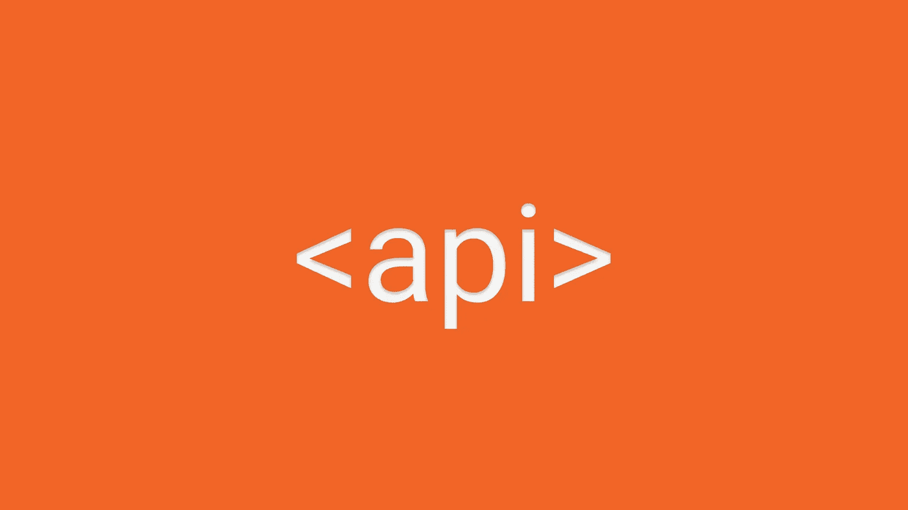
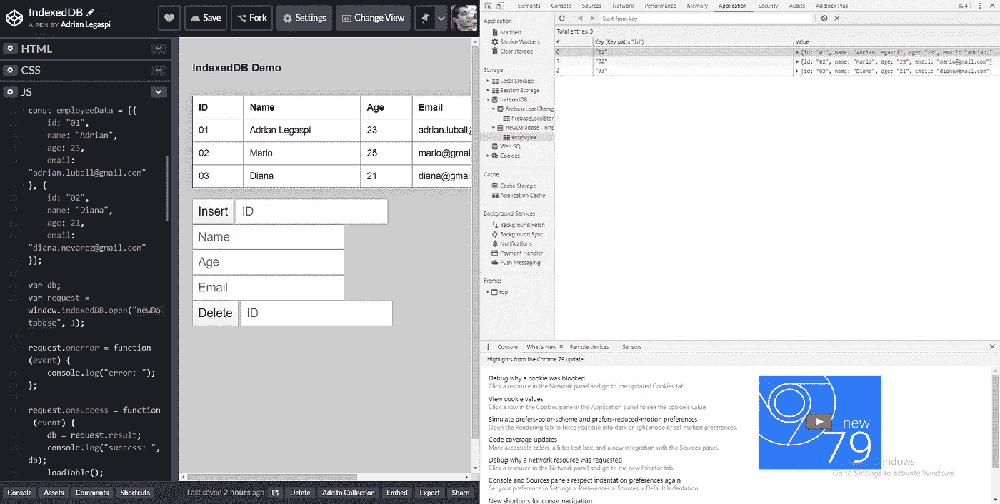

# HTML:被低估的 API

> 原文：<https://itnext.io/html-underrated-apis-7a156607608d?source=collection_archive---------7----------------------->

## 本地 API 没有被广泛使用

正如我们已经看到的[被低估的 html 标签](/html-underrated-tags-119ef3e45b94)，现在我将向你展示一些在 web 应用中没有被广泛使用的 API。



# 颤动

老实说，你最后一次使用[振动 API](https://developer.mozilla.org/en-US/docs/Web/API/Vibration_API) 是什么时候？。这个 API 可以给用户体验带来如此强大的力量，但不幸的是，我最后一次看到它的使用是在那些欺诈性的虚假广告页面上，据说谷歌会给你一些礼物。

在许多情况下，当用户与你的应用程序交互或者发生重要事情时，你可以非常依赖这个 API 来给用户更好的反馈。当一个进度条被加载，一些东西被上传，一个点击被完成时，你可以在界面中使用它。

```
window.navigator.vibrate(milliseconds);
```

【https://codepen.io/adrian-legaspi/pen/yLyzPRG 

vibrate 方法只接收一个参数，这个参数可以是一个数字或数字数组，用来表示振动持续的毫秒数，或者用数组来表示振动的完整模式。这个例子只能在支持振动的设备上测试，也许你的鼠标和键盘不能振动，但如果不能，你最好在你的手机上试试。

记住要给出一个真实而重要的用途，如果你的首要任务之一是节省电池，也许你应该跳过这个 API 的使用，因为它会反映额外的电池使用。

# 设备方向和运动

我不认为你不知道这些 API，但我肯定你从来没有花时间去了解更多。你必须有基本的几何知识，这实际上不是一个问题相比，UX 的好处，这个 API 可以给你的网页应用程序或网页游戏。

设备方向演示

[https://codepen.io/adrian-legaspi/pen/gObGZbX](https://codepen.io/adrian-legaspi/pen/gObGZbX)

方位和运动 API 的详细信息

[https://codepen.io/bantic/pen/qbxgBd](https://codepen.io/bantic/pen/qbxgBd)

设备[方向](https://developer.mozilla.org/en-US/docs/Web/API/Detecting_device_orientation)和[运动](https://developer.mozilla.org/en-US/docs/Web/API/DeviceMotionEvent)有一个很大的问题，那就是没有通过浏览器以 100%标准化[，所以编写相同的代码可能不会在所有显示中产生相同的结果。这一点被低估了，因为它甚至对初创公司也有潜力。想象一下，你创建了一个虚拟现实应用程序，用家具装饰虚拟空间，用户自己位于一座大楼内，并帮助他在里面导航，或者许多游戏可以利用这种输入。许多想法可能会成为现实，当这成为最终完全适应。](https://caniuse.com/#search=device%20orientation)

真正的指南针笔

[https://codepen.io/barzik/pen/WpbJWM](https://codepen.io/barzik/pen/WpbJWM)

# 电池

假设您的用户已经将设备电池电量耗尽，那么[这个 API](https://developer.mozilla.org/en-US/docs/Web/API/Navigator/getBattery) 可以让您知道状态，现在您知道用户的电池电量即将耗尽，您可以动态加载一个使用更少电池的低电量电池模板，或者终止一些稍后可能会恢复的后台进程，甚至您可以抛出一条消息来提醒用户为他们的设备充电。这个 API 非常有用，可以提供更好的用户体验，你的想象力是极限。

```
navigator.getBattery().then(function(battery){
    console.log(battery); 
}) 
```

[https://codepen.io/Donyagholiha/pen/vwwPJa](https://codepen.io/Donyagholiha/pen/vwwPJa)

这是最被低估的一个，因为它在 Firefox 或 Safari 等许多浏览器中不可用。对于一些糟糕的开发者对 API 的滥用，好消息是你仍然可以在 Chrome 或 Samsung 浏览器中使用它，至少在最大市场份额的浏览器中可用。

# 索引 b

当我们谈到 web 本地数据时，我们所有人首先想到的是用于持久化的 [localStorage](https://developer.mozilla.org/en-US/docs/Web/API/Window/localStorage) 或用于会话的 [sessionStorage](https://developer.mozilla.org/en-US/docs/Web/API/Window/sessionStorage) ，这两者都很棒，也很简单，也许比它更简单。当我们有复杂的数据库和数据模式，而每个数据只有一个键无法管理时，我们该怎么办？，调用 [IndexedDB API](https://developer.mozilla.org/en-US/docs/Web/API/IndexedDB_API) 来拯救我们。

```
var idb = window.indexedDB;
```

[https://codepen.io/adrian-legaspi/pen/QWwqQRv?editors=1010](https://codepen.io/adrian-legaspi/pen/QWwqQRv?editors=1010)

本地数据库的存在是我们应该高兴的，因为它让我们以一种标准化的方式管理整个数据库。创建 PWA 可以有一个数据库，而不需要连接到服务器，甚至更好的是，您可以在应用程序中本地存储数据，以便在用户恢复连接时进行同步。

在 Chrome 中，如果你进入 DevTools (F12) > Application 选项卡> Storage section > IndexedDB，你会看到该域下的所有数据库。在那里，您甚至可以检查另一个 API 接口，如通知或服务人员。



存储在 Codepen 浏览器中的数据库

我知道为什么它被低估了，它是一个[大而复杂的 API](https://developer.mozilla.org/en-US/docs/Web/API/IndexedDB_API) ，仍然没有太多的开发人员熟悉管理数据的 [NoSQL](https://www.mongodb.com/nosql-explained) 概念，然而这似乎是一个糟糕的借口，因为今天我们有非常好的包装器，为我们提供了一种更好更容易的方式来与 API 交互，如 [Dexie.js](https://dexie.org/) 或 [PouchDB](https://pouchdb.com/) ，它们可以更快地配置和使用来与服务器同步本地数据。

无论您的情况如何，下次需要在本地存储数据时，请考虑使用 IndexedDB，而不是使用 localStorage 键创建完整的数据库。

# 结论

Web 技术每天都在发展，最近我们在标准中加入了新的语言，新的 API 也不断出现，所以下一次当你有新的 API 的时候，试一试吧。你能创造的所有新事物都受到你想象力的限制。

> *参考文献:*
> 
> 网络今天能做什么→【https://whatwebcando.today/ 
> 
> *MDN 网络文档*→[*https://developer.mozilla.org/*](https://developer.mozilla.org/)
> 
> *我自己*→[https://twitter.com/ImLuyou](https://twitter.com/ImLuyou)