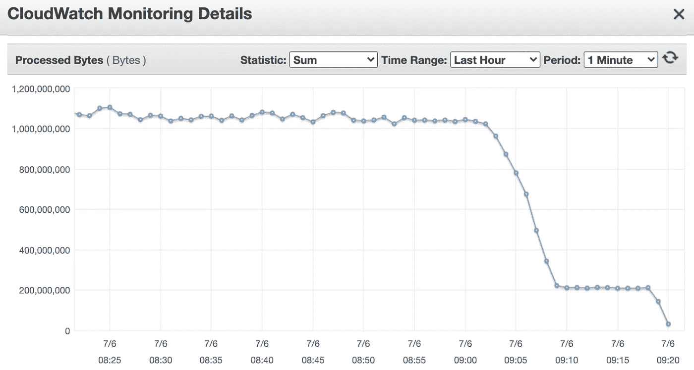
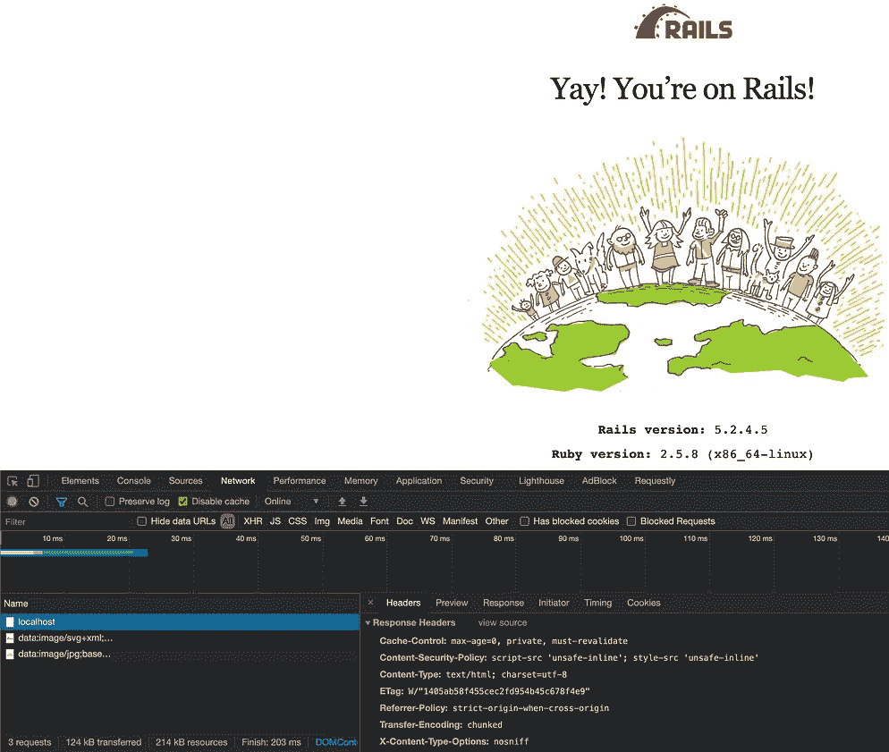
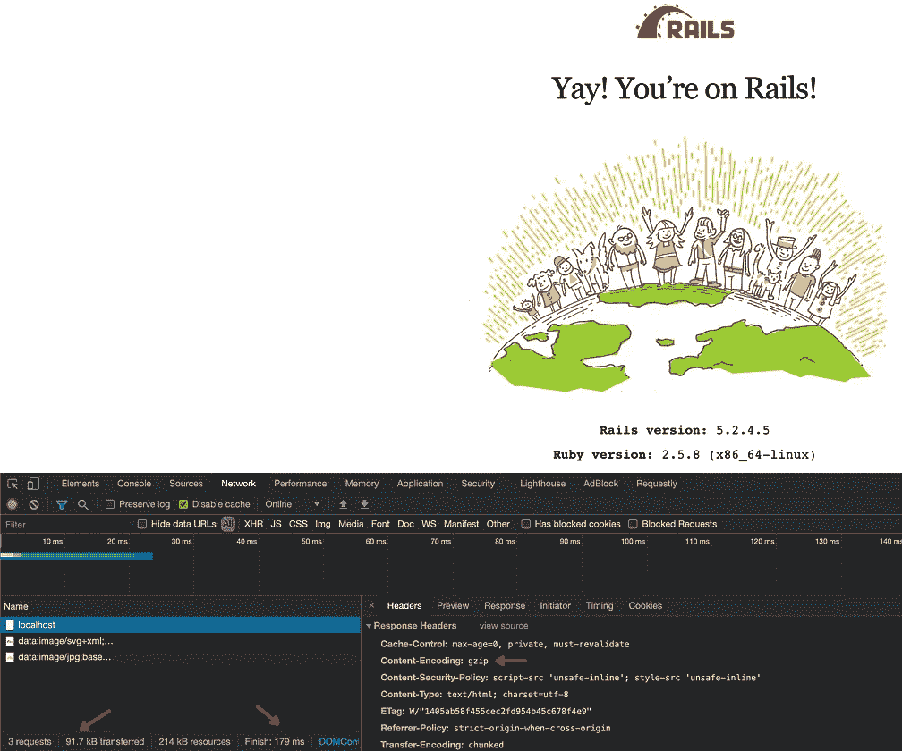

# HTTP 压缩-提高服务器的速度

> 原文：<https://itnext.io/http-compression-boost-your-servers-speed-a5bad6403452?source=collection_archive---------1----------------------->


马库斯·斯皮斯克在 [Unsplash](https://unsplash.com?utm_source=medium&utm_medium=referral) 上的照片

## 通过启用 web 服务器压缩来降低延迟和成本

我们都在非常努力地工作以产生影响，偶尔也有机会通过非常小的努力产生巨大的影响。读完这篇文章后，你将能够对你的网络服务器产生快速的影响，并提高你的网站的性能！

[REST](https://en.wikipedia.org/wiki/Representational_state_transfer)API(HTTP 的子集)是最流行的 API 之一。如果你在 SaaS 的一家公司工作，你可能会把它作为与客户交流的外部 API，也可能在你的服务内部使用它。在 [Dynamic Yield](https://www.dynamicyield.com/) 中，我们每秒处理数千个 HTTP 请求，我们努力争取轻松获胜，例如延迟改善和成本优化。压缩是通过简单地减少线路上的字节来帮助我们的方法之一。

今天大多数现代网络浏览器都默认支持 gzip 和 Brotli 等压缩格式。

事实证明，默认情况下，大多数 web 服务器框架不支持" *Accept-Encoding: gzip"* 头，我们需要主动启用这个压缩特性。我们将在下面介绍几个框架。

启用压缩有助于降低延迟和成本，因为通过网络传输的字节更少。以下是我们得到的结果:

*   更低的内部延迟，通过目标响应时间指标在 AWS 负载平衡器中测量。
*   往返时间更短，因为需要通过互联网传输给最终用户的字节更少。
*   降低成本:云提供商对可用性区域内/外/跨可用性区域的[数据传输](https://aws.amazon.com/ec2/pricing/on-demand/#Data_Transfer)收费。更少的字节意味着你节省更多的钱。

如果你在谷歌上搜索每个程序员都应该知道的数字，你会发现压缩数据比通过网络发送数据包要快得多。这意味着压缩数据将节省延迟。



应用压缩时处理的字节数改进(图片由作者提供)


应用压缩时的响应时间改进(图片由作者提供)

您可以在上面的图表中看到，启用压缩后，我们每分钟处理的字节数减少了 **~80%** ，我们的延迟提高了 **~15%！**

# 真实世界的服务器示例

让我们看看不同框架/语言中的几个例子:

## 龙卷风(蟒蛇)

```
import tornado.ioloop
import tornado.web

class MainHandler(tornado.web.RequestHandler):
    def get(self):
        self.write("x" * 1024)

def make_app():
    return tornado.web.Application([
        (r"/", MainHandler),
    ], compress_response=True)

if __name__ == "__main__":
    app = make_app()
    app.listen(8888)
    tornado.ioloop.IOLoop.current().start()
```

[Tornado](https://www.tornadoweb.org/)(6.1 版本测试)是一个 Python web 框架和异步网络库。上面的片段是从他们的“Hello，world”[示例](https://www.tornadoweb.org/en/stable/#hello-world)中复制的，略有改动:

1.  Tornado 对长度为 1024 及以上的内容[进行压缩。因此，在本演示中， *"Hello，world"* 字符串被替换为 *"x" * 1024* 。](https://github.com/tornadoweb/tornado/blob/master/tornado/web.py#L3083)
2.  *compress_response=True* 被添加到应用程序的构造函数中。

现在我们来测试一下！首先，让我们使用 *curl* 发送一个没有压缩的请求:

```
~ $ curl -vs [http://127.0.0.1:8888](http://127.0.0.1:8888)
> GET / HTTP/1.1
> Host: 127.0.0.1:8888
>
< HTTP/1.1 200 OK
< Content-Type: text/html; charset=UTF-8
< Content-Length: 1024
< Vary: Accept-Encoding
<
xxxxxxxxxxxxxxxxxxxxxxxxxxxxxxxxxxxxxxxxxxxxxxxxxxxxxxxxxxxxxxxxxxxxxxxxxxxxxxxxxxxxxxxxxxxxxxxxxxxxxxxxxxxxxxxxxxxxxxxxxxxxxxxxxxxxxxxxxxxxxxxxxxxxxxxxxxxxxxxxxxxxxxxxxxxxxxxxxxxxxxxxxxxxxxxxxxxxxxxxxxxxxxxxxxxxxxxxxxxxxxxxxxxxxxxxxxxxxxxxxxxxxxxxxxxxxxxxxxxxxxxxxxxxxxxxxxxxxxxxxxxxxxxxxxxxxxxxxxxxxxxxxxxxxxxxxxxxxxxxxxxxxxxxxxxxxxxxxxxxxxxxxxxxxxxxxxxxxxxxxxxxxxxxxxxxxxxxxxxxxxxxxxxxxxxxxxxxxxxxxxxxxxxxxxxxxxxxxxxxxxxxxxxxxxxxxxxxxxxxxxxxxxxxxxxxxxxxxxxxxxxxxxxxxxxxxxxxxxxxxxxxxxxxxxxxxxxxxxxxxxxxxxxxxxxxxxxxxxxxxxxxxxxxxxxxxxxxxxxxxxxxxxxxxxxxxxxxxxxxxxxxxxxxxxxxxxxxxxxxxxxxxxxxxxxxxxxxxxxxxxxxxxxxxxxxxxxxxxxxxxxxxxxxxxxxxxxxxxxxxxxxxxxxxxxxxxxxxxxxxxxxxxxxxxxxxxxxxxxxxxxxxxxxxxxxxxxxxxxxxxxxxxxxxxxxxxxxxxxxxxxxxxxxxxxxxxxxxxxxxxxxxxxxxxxxxxxxxxxxxxxxxxxxxxxxxxxxxxxxxxxxxxxxxxxxxxxxxxxxxxxxxxxxxxxxxxxxxxxxxxxxxxxxxxxxxxxxxxxxxxxxxxxxxxxxxxxxxxxxxxxxxxxxxxxxxxxxxxxxxxxxxxxxxxxxxxxxxxxxxxxxxxxxxxxxxxxxxxxxxxxxxxxxxxxxxxxxxxxxxxxxxxxxxxxxxxxxxxxxxxxxxxxxxxxxxxxxxxxxxxxxxxxxxxxxxxxxxxxxxxxxxxxxxxxxxxxxxxxxxxxx
```

现在让我们添加*压缩的*标志(以模拟网络浏览器):

```
~ $ curl -vs --compressed [http://127.0.0.1:8888](http://127.0.0.1:8888)
> GET / HTTP/1.1
> Host: 127.0.0.1:8888
> Accept-Encoding: deflate, gzip
>
< HTTP/1.1 200 OK
< Content-Type: text/html; charset=UTF-8
< Content-Length: 29
< Vary: Accept-Encoding
< Content-Encoding: gzip
<
xxxxxxxxxxxxxxxxxxxxxxxxxxxxxxxxxxxxxxxxxxxxxxxxxxxxxxxxxxxxxxxxxxxxxxxxxxxxxxxxxxxxxxxxxxxxxxxxxxxxxxxxxxxxxxxxxxxxxxxxxxxxxxxxxxxxxxxxxxxxxxxxxxxxxxxxxxxxxxxxxxxxxxxxxxxxxxxxxxxxxxxxxxxxxxxxxxxxxxxxxxxxxxxxxxxxxxxxxxxxxxxxxxxxxxxxxxxxxxxxxxxxxxxxxxxxxxxxxxxxxxxxxxxxxxxxxxxxxxxxxxxxxxxxxxxxxxxxxxxxxxxxxxxxxxxxxxxxxxxxxxxxxxxxxxxxxxxxxxxxxxxxxxxxxxxxxxxxxxxxxxxxxxxxxxxxxxxxxxxxxxxxxxxxxxxxxxxxxxxxxxxxxxxxxxxxxxxxxxxxxxxxxxxxxxxxxxxxxxxxxxxxxxxxxxxxxxxxxxxxxxxxxxxxxxxxxxxxxxxxxxxxxxxxxxxxxxxxxxxxxxxxxxxxxxxxxxxxxxxxxxxxxxxxxxxxxxxxxxxxxxxxxxxxxxxxxxxxxxxxxxxxxxxxxxxxxxxxxxxxxxxxxxxxxxxxxxxxxxxxxxxxxxxxxxxxxxxxxxxxxxxxxxxxxxxxxxxxxxxxxxxxxxxxxxxxxxxxxxxxxxxxxxxxxxxxxxxxxxxxxxxxxxxxxxxxxxxxxxxxxxxxxxxxxxxxxxxxxxxxxxxxxxxxxxxxxxxxxxxxxxxxxxxxxxxxxxxxxxxxxxxxxxxxxxxxxxxxxxxxxxxxxxxxxxxxxxxxxxxxxxxxxxxxxxxxxxxxxxxxxxxxxxxxxxxxxxxxxxxxxxxxxxxxxxxxxxxxxxxxxxxxxxxxxxxxxxxxxxxxxxxxxxxxxxxxxxxxxxxxxxxxxxxxxxxxxxxxxxxxxxxxxxxxxxxxxxxxxxxxxxxxxxxxxxxxxxxxxxxxxxxxxxxxxxxxxxxxxxxxxxxxxxxxxxxxxxxxxxxxxxxxxxxxxxxxxxxxxxxxxxxx
```

正如您在上面看到的，请求中添加了" *Accept-Encoding: deflate，gzip"* 头，我们的服务器用" *Content-Encoding: gzip"* 头进行响应。结果，我们的内容被压缩为"*内容长度:29"* (相比之下，第一个请求中的"*内容长度:1024"* )。

## Aiohttp (Python)

[AIOHTTP](https://docs.aiohttp.org/en/stable/) (在 3.7.4 版本上测试)是用于 [asyncio](https://docs.aiohttp.org/en/stable/glossary.html#term-asyncio) 的异步 HTTP 服务器。下面的代码片段是从他们的[服务器示例](https://docs.aiohttp.org/en/stable/#server-example)中复制的，稍有改动；我们添加了一个压缩中间件，在将响应发送回用户之前对其进行压缩:

```
from aiohttp import web

@web.middleware
async def compression_middleware(request, handler):
    response = await handler(request)
    response.enable_compression()
    return response

async def handle(request):
    return web.Response(text="x" * 128)

app = web.Application(middlewares=[compression_middleware])
app.add_routes([web.get('/', handle)])

if __name__ == '__main__':
    web.run_app(app)
```

注意，这里没有最小内容长度，每个请求都将被压缩(但是，您可以通过在上面的 *compression_middleware* 函数中添加一个条件来应用最小长度规则)。

## Express (node.js)

[Express](https://expressjs.com/) (在 4.17.1 版本上测试)是一个快速的、非个性化的、极简的 node . js web 框架。下面的代码片段复制自 [hello-world 示例](https://expressjs.com/en/starter/hello-world.html)，并调整为使用[压缩中间件](http://expressjs.com/en/resources/middleware/compression.html)。在 express 的[生产最佳实践页面](https://expressjs.com/en/advanced/best-practice-performance.html)上建议启用压缩。

```
const compression = require('compression')
const express = require('express')
var app = express()
app.use(compression())
const port = 3000

app.get('/', (req, res) => {
    res.send("x".repeat(1024))
})

app.listen(port, () => {
    ***console***.log(`Example app listening at http://localhost:${port}`)
})
```

正如我们在第一个示例(Tornado)中看到的，快速压缩也有一个最小的阈值 1024 ，您可以在实例化中对其进行调整。与上面 Tornado 的 curl 示例相反，响应中缺少了 *Content-Length* 头，但是我们确实看到了 *Content-Encoding: gzip* 头:

```
~ $ curl -vs --compressed [http://127.0.0.1:3000](http://127.0.0.1:3000)
> Accept-Encoding: deflate, gzip
>
< HTTP/1.1 200 OK
< Content-Type: text/html; charset=utf-8
< Content-Encoding: gzip
<
xxxxxxxxxxxxxxxxxxxxxxxxxxxxxxxxxxxxxxxxxxxxxxxxxxxxxxxxxxxxxxxxxxxxxxxxxxxxxxxxxxxxxxxxxxxxxxxxxxxxxxxxxxxxxxxxxxxxxxxxxxxxxxxxxxxxxxxxxxxxxxxxxxxxxxxxxxxxxxxxxxxxxxxxxxxxxxxxxxxxxxxxxxxxxxxxxxxxxxxxxxxxxxxxxxxxxxxxxxxxxxxxxxxxxxxxxxxxxxxxxxxxxxxxxxxxxxxxxxxxxxxxxxxxxxxxxxxxxxxxxxxxxxxxxxxxxxxxxxxxxxxxxxxxxxxxxxxxxxxxxxxxxxxxxxxxxxxxxxxxxxxxxxxxxxxxxxxxxxxxxxxxxxxxxxxxxxxxxxxxxxxxxxxxxxxxxxxxxxxxxxxxxxxxxxxxxxxxxxxxxxxxxxxxxxxxxxxxxxxxxxxxxxxxxxxxxxxxxxxxxxxxxxxxxxxxxxxxxxxxxxxxxxxxxxxxxxxxxxxxxxxxxxxxxxxxxxxxxxxxxxxxxxxxxxxxxxxxxxxxxxxxxxxxxxxxxxxxxxxxxxxxxxxxxxxxxxxxxxxxxxxxxxxxxxxxxxxxxxxxxxxxxxxxxxxxxxxxxxxxxxxxxxxxxxxxxxxxxxxxxxxxxxxxxxxxxxxxxxxxxxxxxxxxxxxxxxxxxxxxxxxxxxxxxxxxxxxxxxxxxxxxxxxxxxxxxxxxxxxxxxxxxxxxxxxxxxxxxxxxxxxxxxxxxxxxxxxxxxxxxxxxxxxxxxxxxxxxxxxxxxxxxxxxxxxxxxxxxxxxxxxxxxxxxxxxxxxxxxxxxxxxxxxxxxxxxxxxxxxxxxxxxxxxxxxxxxxxxxxxxxxxxxxxxxxxxxxxxxxxxxxxxxxxxxxxxxxxxxxxxxxxxxxxxxxxxxxxxxxxxxxxxxxxxxxxxxxxxxxxxxxxxxxxxxxxxxxxxxxxxxxxxxxxxxxxxxxxxxxxxxxxxxxxxxxxxxxxxxxxxxxxxxxxxxxxxxxxxxxxxxxx
```

## Ruby on Rails

Ruby on Rails(在 5.2.4.5 版本上测试)是一个用 Ruby 编写的服务器端 web 应用程序框架。添加*紧缩器*中间件将在这里发挥神奇的作用:

```
require_relative 'boot'
require 'rails/all'

Bundler.require(*Rails.groups)

module *Myapp* class *Application* < Rails::Application
    config.load_defaults 5.2
    config.middleware.insert_after ActionDispatch::Static, Rack::Deflater
  end
end
```



添加压缩中间件(图片由作者提供)

# 真实世界的客户示例

如果您的客户端是 web 浏览器，启用服务器端压缩就足够了。如果您使用 HTTP 在其他内部组件之间进行通信，您需要通过添加“ *Accept-Encoding: deflate，gzip* ”请求头来明确地请求来自服务器的压缩响应。

## 弹性搜索客户端(Python)

[Elasticsearch](https://www.elastic.co/elasticsearch/) 是一个分布式的、 **RESTful** 搜索和分析引擎。如果您正在使用 [Python Elasticsearch 客户端](https://elasticsearch-py.readthedocs.io/en/stable/)，您可以[在客户端实例化中启用](https://elasticsearch-py.readthedocs.io/en/stable/#compression)压缩:

```
**from** **elasticsearch** **import** Elasticsearch
es = Elasticsearch(hosts, http_compress=**True**)
```

## 其他客户

请求压缩响应的最简单方法是在请求中添加“ *Accept-Encoding: deflate，gzip* ”头字段。一些客户端在默认情况下会这样做，大多数客户端也会自动为您解压缩响应。

# 一周后回到我们的服务

一张图胜过千言万语，所以这里有一些我们的负载平衡器的截图:


(图片由作者提供)


(图片由作者提供)

# 观察

1.  压缩级别— gzip 支持从 1(最小压缩)到 9(最大压缩)的压缩级别。调整该级别是在压缩时间和结果大小之间的权衡。压缩是 CPU 密集型工作，因此请确保您也在监控 CPU 利用率。比如在 Elasticsearch 中，你可以通过 [HTTP 设置](https://www.elastic.co/guide/en/elasticsearch/reference/current/modules-http.html#_http_settings)中的 *http.compression_level* 进行配置。所有其他网络服务器也允许配置这个值。
2.  Brotli 是(相对)镇上的新人，最初的[于 2013 年](https://en.wikipedia.org/wiki/Brotli)上映。另一方面，gzip 从 90 年代早期的[到现在](https://en.wikipedia.org/wiki/Gzip)。虽然很多基准测试表明 Brotli 甚至可以比 gzip 做得更好，但是在你的 web 服务器框架上配置 Brotli 可能更棘手，需要更多的工作。
3.  我们需要区分静态内容和动态内容，前者可以预先以更高的压缩级别进行压缩，后者就像我们的 RESTful API 一样，会为每个请求生成不同的响应，并且需要尽可能快地提供服务。
4.  对于带宽有限或互联网连接速度较慢的区域，压缩最为有效。在这种情况下，最终用户体验将是最佳的！
5.  如果您使用 CDN，请确保它配置正确，并且支持压缩算法。如果你正在使用一个反向代理(例如 nginx ),你可能想把 gzip 编码委托给它。
6.  遵循 REST 原则和最佳实践，在需要获取数据时使用 GET。在 GET 方法中，您将享受到 HTTP **304 未修改的**响应代码，它节省了数据传输，最终节省了时间&金钱(更多细节[在此](https://devcenter.heroku.com/articles/increasing-application-performance-with-http-cache-headers#conditional-requests))。

# 摘要

在这篇文章中，我们看到了为 HTTP web 服务器和客户端启用压缩支持是多么容易。默认情况下，所有现代 web 浏览器都要求压缩响应，这是有原因的。虽然它带来了更高的 CPU 利用率，但在你的网站上没有什么比快速的用户体验更好的了。