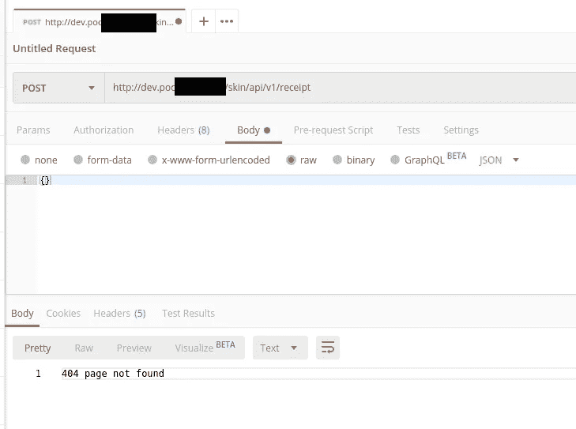
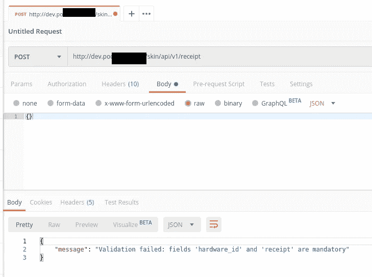
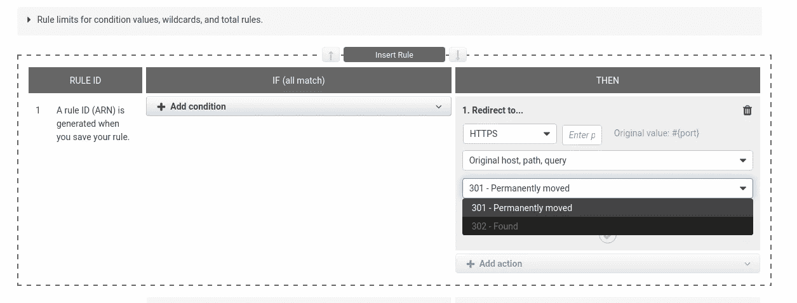

# HTTP:重定向、POST 和 GET 请求，以及“丢失”的数据

> 原文：<https://itnext.io/http-redirects-post-and-get-requests-and-lost-data-e432e7260cbb?source=collection_archive---------2----------------------->


我们有一个 web 应用程序，它必须接受来自客户端的 POST 请求。

在这个应用程序的前面，有一些代理服务，不管是哪一种——最初，我们在 AWS 的应用程序负载平衡器上遇到了问题，然后我用 NGINX 重现了这些问题，它将“适用于”任何其他代理系统。

除了代理之外，该服务还执行 HTTP (80)到 HTTPS (443)的重定向。

在这种重定向过程中，问题会准确地出现:

1.  客户端通过 HTTP 发送一个`POST`请求
2.  代理返回 **301** 或 **302** 重定向到 HTTPS
3.  然后，客户端通过 HTTPS 发送请求，但是:
4.  在某些情况下，这个`POST`变成了`GET`
5.  或者它仍然是`POST`，但是它的所有数据都将“丢失”

## 测试环境设置

出于测试目的，让我们使用下面的配置:

1.  NINGX 接受 API 请求
2.  NGINX 通过 HTTP 将 via `proxy_pass`传递给后端服务

*   为了重现`POST`到`GET`的问题——将使用 Docker 容器中带有 Go 应用程序的后端
*   为了重现“丢失的”数据和空的`Сontent-length`-Python 脚本将被用来作为网络服务器运行

## NGINX

只是一个普通的配置——NGINX，监听 80，重定向到 HTTPS:

```
server {

    listen 80;

    server_name dev.poc.example.com;

    location / {

        return 302 [https://dev.poc.example.com$request_uri;](https://dev.poc.example.com$request_uri;)
    }
}
...
```

和一个`server 443 {}` -也是常见配置，在 8081 端口上有一个到后端的`proxy_pass`:

```
...
server {

    listen       443 ssl;
    server_name  dev.poc.example.com;

    ...

    location / {

        proxy_pass [http://localhost:8081;](http://localhost:8081;)

        proxy_set_header Host $host;
        proxy_set_header X-Real-IP $remote_addr;
        proxy_set_header X-Forwarded-For $proxy_add_x_forwarded_for;
        proxy_set_header X-Forwarded-Proto $scheme;

    }
}
```

## Docker 中的 Go-app

我们在堆栈中有多个容器，但目前，我们感兴趣的是一个带有本地 NGINX 的*队列消费者*(整个初始系统现在仍处于概念验证状态，所以不要担心这里有太多的 NGINX)。

我们只是对使用`POST`或`GET`方法的日志感兴趣。

## Python 网络服务器

另一个 web 服务器扮演后端角色来查看数据长度问题——快速搜索 Python 脚本:

```
#!/usr/bin/env python3
"""
Very simple HTTP server in python for logging requests
Usage::
    ./server.py [<port>]
"""
from http.server import BaseHTTPRequestHandler, HTTPServer
import logging

class S(BaseHTTPRequestHandler):
    def _set_response(self):
        self.send_response(200)
        self.send_header('Content-type', 'text/html')
        self.end_headers()

    def do_GET(self):
        logging.info("GET request,\nPath: %s\nHeaders:\n%s\n", str(self.path), str(self.headers))
        self._set_response()
        self.wfile.write("GET request for {}".format(self.path).encode('utf-8'))

    def do_POST(self):
        content_length = int(self.headers['Content-Length']) # <--- Gets the size of data
        post_data = self.rfile.read(content_length) # <--- Gets the data itself
        logging.info("POST request,\nPath: %s\nHeaders:\n%s\n\nBody:\n%s\n",
                str(self.path), str(self.headers), post_data.decode('utf-8'))

        self._set_response()
        self.wfile.write("POST request for {}".format(self.path).encode('utf-8'))

def run(server_class=HTTPServer, handler_class=S, port=8081):
    logging.basicConfig(level=logging.INFO)
    server_address = ('', port)
    httpd = server_class(server_address, handler_class)
    logging.info('Starting httpd...\n')
    try:
        httpd.serve_forever()
    except KeyboardInterrupt:
        pass
    httpd.server_close()
    logging.info('Stopping httpd...\n')

if __name__ == '__main__':
    from sys import argv

    if len(argv) == 2:
        run(port=int(argv[1]))
    else:
        run()
```

## 示例:重现问题

## 重定向后`POST`的数据丢失

我们面临的第一件事是，在 HTTP 到 HTTPS 重定向之后，我们的 POST 请求丢失了数据。

为了重现它，让我们使用上面提到的 Python 脚本。

在 8081 端口上运行它:

```
root@ip-10–0–15–118:/home/admin# ./test_post.py 8081
INFO:root:Starting httpd…
```

用`POST`和`--data`中的一些数据运行`curl`:

```
curl -vL -X POST [http://dev.poc.example.com/](http://dev.poc.example.com/) -d “param1=value1&param2=value2”
…
* Trying 52.***.***.224:80…
…
> Content-Length: 27
…
< HTTP/1.1 302 Moved Temporarily
…
< Content-Length: 161
< Connection: keep-alive
< Location: [https://dev.poc.example.com/](https://dev.poc.example.com/)
…
> POST / HTTP/1.1
> Host: dev.poc.example.com
> User-Agent: curl/7.67.0
> Accept: */*
>
* Mark bundle as not supporting multiuse
< HTTP/1.1 502 Bad Gateway
< Server: nginx/1.10.3
…
< Content-Type: text/html
< Content-Length: 173
```

让我们看看这里发生了什么:

1.  通过 HTTP 发送一个`POST`请求， *Content-Length: 27*
2.  一个 **302 重定向**发给 HTTPS
3.  并且经由 HTTPS 发送`POST`请求，*内容长度:173*

在 NGINX 日志中，我们可以看到一个标准的 HTTP `POST`:

```
…
==> /var/log/nginx/dev.poc.example.com-error.log <==
2019/11/23 09:52:41 [error] 19793#19793: *51100 upstream prematurely closed connection while reading response header from upstream, client: 194.***.***.26, server: dev.poc.example.com, request: “POST / HTTP/1.1”, upstream: “http://127.0.0.1:8081/", host: “dev.poc.example.com”
==> /var/log/nginx/dev.poc.example.com-access.log <==
194.***.***.26 — — [23/Nov/2019:09:52:41 +0000] “POST / HTTP/1.1” 502 173 “-” “curl/7.67.0”
…
```

但是让我们看看 Python 服务器运行的 stderr:

```
…
Exception happened during processing of request from (‘127.0.0.1’, 38224)
Traceback (most recent call last):
File “/usr/lib/python3.5/socketserver.py”, line 313, in _handle_request_noblock
self.process_request(request, client_address)
File “/usr/lib/python3.5/socketserver.py”, line 341, in process_request
self.finish_request(request, client_address)
File “/usr/lib/python3.5/socketserver.py”, line 354, in finish_request
self.RequestHandlerClass(request, client_address, self)
File “/usr/lib/python3.5/socketserver.py”, line 681, in __init__
self.handle()
File “/usr/lib/python3.5/http/server.py”, line 422, in handle
self.handle_one_request()
File “/usr/lib/python3.5/http/server.py”, line 410, in handle_one_request
method()
File “./test_post.py”, line 22, in do_POST
content_length = int(self.headers[‘Content-Length’]) # ←- Gets the size of data
TypeError: int() argument must be a string, a bytes-like object or a number, not ‘NoneType’
…
```

注意这几行:

```
…
content_length = int(self.headers[‘Content-Length’])
TypeError: int() argument must be a string, a bytes-like object or a number, not ‘NoneType’
```

例如，应用程序得到一个空的/缺失的*内容长度*字段。

尽管如此，如果直接通过 HTTP(NGINX 禁用了重定向)或通过 HTTPS 发出一个新请求，一切都会正常工作，正如预期的那样:

```
$ curl -vL -X POST [https://dev.poc.example.com/](https://dev.poc.example.com/) -d “param1=value1&param2=value2”
…
> POST / HTTP/1.1
> Host: dev.poc.example.com
> User-Agent: curl/7.67.0
> Accept: */*
> Content-Length: 27
> Content-Type: application/x-www-form-urlencoded
>
* upload completely sent off: 27 out of 27 bytes
* Mark bundle as not supporting multiuse
< HTTP/1.1 200 OK< Server: nginx/1.10.3
< Date: Sat, 23 Nov 2019 09:55:07 GMT
< Content-Type: text/html
< Transfer-Encoding: chunked
< Connection: keep-alive
<
* Connection #0 to host dev.poc.example.com left intact
POST request for /
```

Python 的应用程序 stdout:

```
…
INFO:root:POST request,
Path: /
Headers:
Host: dev.poc.example.com
X-Real-IP: 194.***.***.26
X-Forwarded-For: 194.***.***.26
X-Forwarded-Proto: https
Connection: close
Content-Length: 27
User-Agent: curl/7.67.0
Accept: */*
Content-Type: application/x-www-form-urlencoded
Body:
param1=value1&param2=value2
127.0.0.1 — — [23/Nov/2019 09:55:07] “POST / HTTP/1.0” 200 -
```

现在，我们来看下一个第二题。

## 一个`POST`变成了`GET`

在调试上面讨论的问题期间，当后端在`POST`期间没有接收到数据时，我发现在 HTTP-redirects 期间请求的另一个“令人兴奋”的行为。

让我们看看我们的`POST`请求会变成什么样...一个`GET`请求！

细节和根本原因将在本文后面讨论，现在让我们使用两个 HTTP 客户端— `curl`和 Postman 来重现这个问题。

`**curl**`

通过带有`-L`的 HTTP 运行一个带有`POST`类型的请求，然后重定向到 HTTPS。

在这种情况下，我们使用的不是上面使用的 Python 脚本，而是我们真正的后端 Docker 容器来演示它的工作并检查它的日志。

数据本身以及任何错误在这里都没有价值——我们只对使用的请求方法— `POST`和`GET`感兴趣。

```
$ curl -vL -X POST [http://dev.poc.example.com/skin/api/v1/receipt](http://dev.poc.example.com/skin/api/v1/receipt) -d “{}”
…
> POST /skin/api/v1/receipt HTTP/1.1
> Host: dev.poc.example.com
> User-Agent: curl/7.67.0
> Accept: */*
>
* Mark bundle as not supporting multiuse
< HTTP/1.1 400 Bad Request
< Server: nginx/1.10.3
< Date: Sat, 23 Nov 2019 10:07:37 GMT
< Content-Type: application/json; charset=utf-8
< Content-Length: 58
< Connection: keep-alive
<
* Connection #1 to host dev.poc.example.com left intact
{“message”:”Validation failed: unable to parse json body”
```

同样，不要在这里查看错误，而是让我们查看 NGINX 的日志:

```
==> /var/log/nginx/dev.poc.example.com-access.log <==
194.***.***.26 — — [23/Nov/2019:10:07:37 +0000] “POST /skin/api/v1/receipt HTTP/1.1” 400 58 “-” “curl/7.67.0”
```

这里一切都好吗？发送了一个`POST`-收到了一个`POST`。

只是为了检查一下——让我们用显式指定的`GET`类型运行`curl`,看看后端的响应和 NGINX 日志，在这种情况下:

```
curl -L -X GET [http://dev.poc.example.com/skin/api/v1/receipt](http://dev.poc.example.com/skin/api/v1/receipt) -d “{}”
404 page not found
```

和 NGINX 日志与此`GET`:

```
==> /var/log/nginx/dev.poc.example.com-access.log <==
194.***.***.26 — — [23/Nov/2019:10:07:37 +0000] “POST /skin/api/v1/receipt HTTP/1.1” 400 58 “-” “curl/7.67.0”
194.***.***.26 — — [23/Nov/2019:10:09:57 +0000] “GET /skin/api/v1/receipt HTTP/1.1” 404 18 “-” “curl/7.67.0”
```

一切都很好，一切似乎都是正确的——一点问题都没有，嗯？

**邮递员**

但是现在，让我们使用 Postman 向同一个端点发送相同的请求:a `POST`通过 HTTP 触发并跟随重定向到 HTTPS:



然后呢。…

现在让我们来看看 NGINX 日志:

```
==> /var/log/nginx/dev.poc.example.com-access.log <==
194.***.***.26 — — [23/Nov/2019:10:07:37 +0000] “POST /skin/api/v1/receipt HTTP/1.1” 400 58 “-” “curl/7.67.0”
194.***.***.26 — — [23/Nov/2019:10:09:57 +0000] “GET /skin/api/v1/receipt HTTP/1.1” 404 18 “-” “curl/7.67.0”
194.***.***.26 — — [23/Nov/2019:10:11:44 +0000] “GET /skin/api/v1/receipt HTTP/1.1” 404 18 “http://dev.poc.example.com/skin/api/v1/receipt" “PostmanRuntime/7.19.0”
```

呃…

什么？！？

但是我发送了一个明确指定的`POST`请求？

再一次:

1.  用`curl`做个请求，HTTP = > HTTPS 重定向发出，`POST`日志——都好
2.  向邮递员发出请求，HTTP => HTTPS 重定向已发出，但日志中的`GET`-**WTF**？？？

## POST、GET 和一个“丢失”的数据

好了，现在我们可以知道我们的数据去了哪里——因为我们的`POST`变成了`GET`。

## 根本原因、3xx 重定向和 HTTP RFC

其实这两个问题都是同一个原因造成的。

让我们通过阅读 RFC 2616—[https://tools.ietf.org/html/rfc2616#section-10.3.2](https://tools.ietf.org/html/rfc2616#section-10.3.2)中的 **301** 代码描述开始我们的调查，尤其是它的 ***注释*** :

> 注意:当
> 收到 301 状态码后自动重定向 POST 请求时，**一些**已有的 HTTP/1.0 **用户代理**
> **会错误地将其更改为 GET 请求**。

即，一些客户端在发送`POST`和接收 *301* 之后，会将请求的类型更改为`GET`。

但这仅仅是开始！

在进一步阅读过程中，在同一个 RFC 2016—[https://tools.ietf.org/html/rfc2616#section-10.3.3](https://tools.ietf.org/html/rfc2616#section-10.3.3)中的 **302** 代码描述处，我们会看到另一个 ***注释*** :

> 注意:RFC 1945 和 RFC 2068 规定**客户端不允许**
> **改变重定向请求上的方法**。然而，**大多数**
> **现有用户代理**实现**将 302 视为 303**
> 响应，**对位置字段值执行 GET，而不管原始请求方法**的
> **。添加了状态代码 303 和 307
> ,用于希望明确表明客户端期望哪种
> 反应的服务器。**

**RFC 1945** 关于 **3хх** 重定向—[https://tools.ietf.org/html/rfc1945#section-9.3](https://tools.ietf.org/html/rfc1945#section-9.3)

**RFC 2068** 关于 **3хх** 重定向—[https://tools.ietf.org/html/rfc2068#section-10.3.2](https://tools.ietf.org/html/rfc2068#section-10.3.2)

即 RFC 1945 和 RFC 2068 声明客户端没有重定向请求的变更类型，但它们中的大多数会将 **302** 代码视为… **303** ！

让我们进入下一部分，阅读关于 **303** 代码—[https://tools.ietf.org/html/rfc2616#section-10.3.4](https://tools.ietf.org/html/rfc2616#section-10.3.4):

> 对请求的响应可以在不同的 URI 和
> **下找到，应该使用该资源上的 **GET** 方法检索**。

即当客户端认为它收到了 **303** 代码时，它**总是**会执行 **GET** 。

因此，我们从 Postman 案例中看到了什么(以及我们最初遇到这个问题的移动应用程序客户端):

1.  客户端通过 HTTP 执行`POST`
2.  用 *301* 或 *302* 获得到 HTTPS 的重定向
3.  认为是 *303*
4.  并将自己通过 HTTPS 发送的请求类型从更改为`GET`，从而“丢失”所有原始数据

## 解决方案

我在阅读了 Mozilla 的文档后找到了解决方案(尽管在针对 302 的 [RFC 2016 注释中有一个提示)，其中提到了关于 **301** 和 **302** 重定向:](https://tools.ietf.org/html/rfc2616#section-10.3.3)

> 因此，建议仅将 **302 代码设置为 GET 或 HEAD** 方法的响应，并建议**使用 307 临时重定向代替**，因为在这种情况下，方法更改是明确禁止的。

好的——让我们更新我们的 NGINX 并将代码 *302* 改为 *307* :

```
server {

    listen 80;
...
    location / {

        # return 302 [https://dev.poc.example.com$request_uri;](https://dev.poc.example.com$request_uri;)
        return 307 [https://dev.poc.example.com$request_uri;](https://dev.poc.example.com$request_uri;) 
    }
}
...
```

重新加载配置，并重复来自`curl`的请求:

```
$ curl -L -X POST [http://dev.poc.example.com/skin/api/v1/receipt](http://dev.poc.example.com/skin/api/v1/receipt) -d “{}”
{“message”:”Validation failed: fields ‘hardware_id’ and ‘receipt’ are mandatory”}
```

我们从后端得到了一个有效的响应，现在只需要一个正常的数据。

重定向成功，收到了一个`POST`请求。

NGINX 日志:

```
==> /var/log/nginx/dev.poc.example.com-access.log <==
194.***.***.26 — — [23/Nov/2019:10:07:37 +0000] “POST /skin/api/v1/receipt HTTP/1.1” 400 58 “-” “curl/7.67.0”
194.***.***.26 — — [23/Nov/2019:10:09:57 +0000] “GET /skin/api/v1/receipt HTTP/1.1” 404 18 “-” “curl/7.67.0”
194.***.***.26 — — [23/Nov/2019:10:11:44 +0000] “GET /skin/api/v1/receipt HTTP/1.1” 404 18 “http://dev.poc.example.com/skin/api/v1/receipt" “PostmanRuntime/7.19.0”
194.***.***.26 — — [23/Nov/2019:10:35:51 +0000] “POST /skin/api/v1/receipt HTTP/1.1” 422 81 “-” “curl/7.67.0”
194.***.***.26 — — [23/Nov/2019:10:36:00 +0000] “POST /skin/api/v1/receipt HTTP/1.1” 422 81 “-” “curl/7.67.0”
```

重复邮递员的请求:



NGINX 日志:

```
==> /var/log/nginx/dev.poc.example.com-access.log <==
194.***.***.26 — — [23/Nov/2019:10:07:37 +0000] “POST /skin/api/v1/receipt HTTP/1.1” 400 58 “-” “curl/7.67.0”
194.***.***.26 — — [23/Nov/2019:10:09:57 +0000] “GET /skin/api/v1/receipt HTTP/1.1” 404 18 “-” “curl/7.67.0”
194.***.***.26 — — [23/Nov/2019:10:11:44 +0000] “GET /skin/api/v1/receipt HTTP/1.1” 404 18 “http://dev.poc.example.com/skin/api/v1/receipt" “PostmanRuntime/7.19.0”
194.***.***.26 — — [23/Nov/2019:10:35:51 +0000] “POST /skin/api/v1/receipt HTTP/1.1” 422 81 “-” “curl/7.67.0”
194.***.***.26 — — [23/Nov/2019:10:36:00 +0000] “POST /skin/api/v1/receipt HTTP/1.1” 422 81 “-” “curl/7.67.0”
194.***.***.26 — — [23/Nov/2019:10:37:57 +0000] “POST /skin/api/v1/receipt HTTP/1.1” 422 81 “http://dev.poc.example.com/skin/api/v1/receipt" “PostmanRuntime/7.19.0”
```

一切正常，不出所料。

## AWS 应用程序负载平衡器重定向

不幸的是，在使用 AWS ALB 时，我无法找到如何设置 307:



就这些了，伙计们！

## 有用的链接

## 其他网站上的问题

*   [POST 请求重定向到 Nginx 代理和 NodeJS](https://www.digitalocean.com/community/questions/post-request-redirects-to-get-in-nginx-proxy-and-nodejs)
*   [通过 proxy_pass 传递 POST 请求时出现问题](https://trac.nginx.org/nginx/ticket/248#comment:1)
*   [如何代理 _ 传递带标题的帖子](https://www.ruby-forum.com/t/how-to-proxy-pass-post-with-headers/216170)
*   [Nginx 删除分块内容的内容长度头](https://serverfault.com/questions/482875/nginx-removes-content-length-header-for-chunked-content)
*   [响应为 302 且内容长度为 0 的 POST 请求导致 nginx 崩溃](https://trac.nginx.org/nginx/ticket/588)
*   [反向代理发布问题](https://www.hiawatha-webserver.org/forum/topic/1537)
*   [HTTP POST 重定向—无内容长度](https://stackoverflow.com/questions/58938233/http-post-redirect-no-content-length)

## 帮助找到了解决方案

*   [POST 请求不遵循 301/ 302 重定向](https://github.com/sindresorhus/got/issues/568)
*   [HTTP 为什么没有 POST 重定向？](https://softwareengineering.stackexchange.com/questions/99894/why-doesnt-http-have-post-redirect#99966)

*最初发布于* [*RTFM: Linux、DevOps 和系统管理*](https://rtfm.co.ua/en/http-redirects-post-and-get-requests-and-lost-data/) *。*