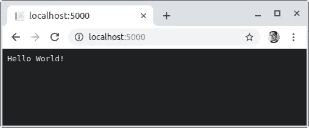

# 。网芯很性感，你应该知道的

> 原文：<https://itnext.io/https-medium-com-buisson-jeremy-net-core-is-sexy-and-you-should-know-it-a3d0c2eeedc4?source=collection_archive---------1----------------------->


> 本文是关于。NET Core，以及它现在如何像 Node 或 Rails 等任何其他堆栈一样简单高效地创建现代应用程序。
> 
> **T1。网芯性感你要知道 **
> 
> [。NET Core 性感—命令行应用](https://medium.com/@jbuisson/net-core-is-sexy-real-world-part-1-command-line-application-953f48394c83)
> 
> [。NET Core 很性感——构建 Web API](/net-core-is-sexy-building-a-web-api-cdb470cc8222)

我一直认为我的第一篇博文应该是一个详细的教程，讲述一个具有多种服务的无服务器平台，使用 GitLab CI 在 AWS 上使用单个命令行进行部署。或者甚至是一个赞扬朋友或同事之间玩龙与地下城(D&D)游戏的好处的帖子。我太天真了…

几天前，我偶然听说一些招聘机构和专门从事开发人员的公司原则上拒绝任何希望与之合作的候选人或公司。NET，原因如下:

> 这是一个旧的封闭和专有的生态系统，完全不同于其他更灵活和开放的开发平台，如 NodeJS 或 RubyRails。实际上有点像 Java。但是 Java，不被邪恶的微软所支持，仍然被这些机构和公司所容忍。

与此同时，我正在使用 **C#** 和**开发网络应用。NET Core** 放在我个人的 **MacBook** 上，我用 **GitLab** 部署在 **AWS** 上，使用 **Lambdas** functions **、** **Linux** EC2 和 **Docker** 容器。我甚至在**官方开源 Github** 资源库、 [5 年前](https://github.com/dotnet/corefx/pull/34)上推送过一些代码和测试，现在还在上面。

不用说，听到这个我开始感到不舒服。然后，在讨论我的另一个爱好:D&D 时，我有一种似曾相识的感觉，听说角色扮演游戏是名声不好的精英游戏，非常难以接近。但是我会在另一个时间谈论 D&D。

所以我在这里，爬上我最高贵的战马，穿上我最闪亮的盔甲，开始了一项任务，不是为了保护寡妇和孤儿，而是为了支持那些。NET Core 平台的口碑，目标是让你相信我们可以在 **C#** 和**中**轻松**和**快速**开发。NET Core** ，就像我们在 JavaScript 和 NodeJS 中能做的一样。

# 是什么？网芯平台？

当我们谈论到。NET 核心平台，所以我就引用一下[官方文档](https://docs.microsoft.com/fr-fr/dotnet/core/about#composition):

*   [。NET Core runtime](https://github.com/dotnet/coreclr) 提供了类型系统、程序集加载、垃圾收集器、原生互操作等基本服务。[。NET 核心框架库](https://github.com/dotnet/corefx)提供了原始数据类型、应用组合类型和基础工具。
*   [ASP.NET 运行时](https://github.com/aspnet/home)提供了一个框架，用于构建现代基于云的互联网连接应用，如 web 应用、物联网应用和移动后端。
*   [。NET Core CLI 工具](https://github.com/dotnet/cli)和语言编译器( [Roslyn](https://github.com/dotnet/roslyn) 和 [F#](https://github.com/microsoft/visualfsharp) )支持。NET 核心开发者体验。
*   [点网工具](https://github.com/dotnet/core-setup)用于启动。NET 核心应用程序和 CLI 工具。它选择并托管运行时，提供程序集加载策略并启动应用程序和工具。

综上所述:

*   运行库允许执行。NET 核心二进制文件。
*   ASP。NET Core 是一个框架和一组库，可以用来构建 web 应用程序和 API。
*   。NET Core CLI 类似于其他平台 CLI，因为它允许您创建、构建、发布、设置和搭建项目以及其他操作。

# 我们来编码吧！

闲聊够了。我在这里的目标是向您展示开始使用是多么的快速和简单。NET Core 来创建应用程序和网站，就像使用 NodeJS 或 RubyRails 一样——所以让我们开始吧。

Linux 安装相当简单；只需[点击此链接](https://dotnet.microsoft.com/download/linux-package-manager/rhel/sdk-current)并选择您的发行版。大约需要三四个命令来注册 Microsoft key 和 feed 以安装必要的软件包。

在 Ubuntu 上，这是它在终端上的样子:

在安装过程中检查最新的 SDK 版本，在编写本文时，它恰好是版本 2.2。

当然，您只需要这样做一次，然后一个简单的命令就会确认一切正常:

```
dotnet --version
> 2.2.300
```

在 MacOs 或 Windows 上的安装甚至更简单:只需从微软官方门户[下载，让安装程序为你完成这项工作。应该只需要几分钟。](https://dotnet.microsoft.com/download/dotnet-core/2.2)

# 你好世界！

按照一个众所周知的惯例，让我们创建一个控制台应用程序，其唯一目的是显示 ***Hello World！*** 。对于不耐烦的读者，这里是 Git 库:

[](https://gitlab.com/jbuisson/hello-world) [## 杰米·比松/ hello-world

### GitLab.com

答。网络核心 Hello World 控制台应用程序](https://gitlab.com/jbuisson/hello-world) 

首先创建一个新文件夹，然后从中初始化您的项目:

```
mkdir hello-world
cd hello-world
dotnet new console
```

您将拥有以下文件和文件夹:

```
hello-world
├── bin
├── obj
├── hello-world.csproj
├── Program.cs
```

您已经可以忽略 ***bin*** 和 ***obj*** 文件夹，它们只用于构建和调试步骤，因此您永远不必查看它们。事实上，我在 VSCode 和 Git 上都忽略了它们。

的。csproj 文件包含关于运行时、包、版本和其他项目配置属性的信息。默认真的很小。

最后，我们最重要的文件:Program.cs。

同样，没有什么是棘手的——您有自己的默认名称空间。通过静态方法 Main() 声明主入口点的类。类或名称空间可以根据您的需要进行更改，不需要是公共的， **Main** 方法也不需要。这里的类是[内部](https://docs.microsoft.com/fr-fr/dotnet/csharp/language-reference/keywords/internal)，方法是[私有](https://docs.microsoft.com/fr-fr/dotnet/csharp/language-reference/keywords/private)。

唯一的约束是至少要有这个静态 Main 方法。甚至参数也是可选的，但是它们的存在是为了通过命令行执行来提供对参数的访问。

现在，让我们运行应用程序:

```
dotnet run
> Hello World!
```

就这么简单。获取应用程序的发布版本，该版本可部署在任何具有。NET Core runtime(此处为 2.2 版)，只需如下发布应用程序:

```
dotnet publish -c Release -o dist
```

由此产生的 ***dist*** 文件夹应该是这样的:

```
dist
├── hello-world.deps.json
├── hello-world.dll
├── hello-world.pdb
├── hello-world.runtimeconfig.json
```

可以删除***hello-world . pdb***而不会出现问题，因为它只对调试有用，但它是默认生成的，即使在发布模式下也是如此。您可以通过将此代码片段添加到您的***hello-world . csproj***(在<项目/ >标签下)来禁用此行为。

那么***【hello-world.dll】***就是你编译好的代码，使用这个运行时命令可执行:

```
dotnet hello-world.dll
```

***deps.json*** 和***runtime config . JSON***文件分别用于处理对其他包的依赖和配置运行时。

最后，在发布应用程序时，您可以使用[运行时标识符目录](https://docs.microsoft.com/fr-fr/dotnet/core/rid-catalog)轻松地针对特定平台进行构建:

```
dotnet publish -c Release -r win-x64 -o dist/win-x64
dotnet publish -c Release -r osx-x64 -o dist/osx-x64
dotnet publish -c Release -r linux-x64 -o dist/linux-x64
```

# 你好，韦伯！

好吧，这很酷，我们很容易地在控制台上写了一行，但一些网络的东西呢？好吧，这也很容易做到！

首先，让我们为 ASP.NET 核心添加软件包:

```
dotnet add package Microsoft.AspNetCore
```

这个包将允许我们**配置**、**构建**和**运行**一个简单的 WebHost。这可以在一行代码中完成，在 ***Main()*** 方法中。您还需要引用新的包，就像您为 NodeJS 导入 npm 包一样。由此产生的 ***Program.cs*** 看起来应该如下:

您可以使用与上面相同的命令来运行和构建应用程序:

```
dotnet run
```

现在打开你最喜欢的浏览器，进入 [http://localhost:5000，](http://localhost:5000,)享受这个美妙的 ***Hello World 吧！*** 网页:



它还活着！

目前就这些。我将带着更多真实世界的例子回来，但是在读完这篇文章之后，我真的希望你的意见。网核进化了。

如果你有任何问题，我会尽我所能在评论中尽可能做出回应！

**更新**:由于我的下一个故事[，你现在可以继续讲一个真实世界的例子了。NET Core 很性感——现实世界第 1 部分:命令行应用](https://medium.com/@jbuisson/net-core-is-sexy-real-world-part-1-command-line-application-953f48394c83)。