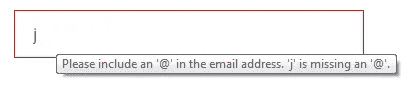
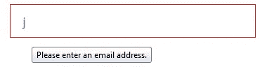

# 用 HTML(和一点 Javascript)进行表单域验证

> 原文：<https://itnext.io/https-medium-com-joshstudley-form-field-validation-with-html-and-a-little-javascript-1bda6a4a4c8c?source=collection_archive---------0----------------------->


[克里斯汀·休姆](https://unsplash.com/@christinhumephoto?utm_source=medium&utm_medium=referral)在 [Unsplash](https://unsplash.com?utm_source=medium&utm_medium=referral) 上发表的“咖啡馆里，一个女人的手放在笔记本电脑的键盘上”

> 爱是伟大的，但不是密码。——[马特·莫楞威格](https://en.wikipedia.org/wiki/Matt_Mullenweg)

防止不良形式信息是猫和猫的致命游戏。作为 web 开发人员，我们希望保护表单字段中填写的信息。糟糕的信息导致糟糕的用户交互、糟糕的分析和糟糕的销售。

以所有重要的“电子邮件”字段为例。电子邮件地址应该始终具有相同的结构:some text @ web domain . extension。一个真实世界的例子是:[legal@medium.com](mailto:%20legal@medium.com)。电子邮件表单字段应该检查用户是否正确输入了电子邮件地址。电子邮件地址包含一些文本，后跟@符号，然后是域名、点(。)最后一个扩展。这需要做很多检查。

一个古老的问题是“我们在哪里检查有效输入:服务器端还是客户端？”服务器端检查需要用户将表单提交给服务器，比如 ASP、C#或 PHP，然后服务器代码进行检查，如果发现错误就返回错误。这是一次漫长而昂贵的旅行。客户端验证通常意味着:JavaScript 在表单提交之前拦截表单以检查错误，可能使用 regex。这省去了到服务器的旅程，但仍然使用了一点代码。虽然我们仍然应该使用服务器端验证，但我将讨论如何充分利用客户端验证来减少服务器请求的数量。

HTML5 给我们带来了“数字”、“日期”、“邮件”等几种`<input>`类型。

```
<input **type="email"** id="emailField">
```

默认情况下，电子邮件输入字段跟踪输入文本的状态，就像我们使用 JavaScript 和 [regex](https://developer.mozilla.org/en-US/docs/Web/JavaScript/Guide/Regular_Expressions) 来检查模式一样。如果您想写出同样的正则表达式，它应该是这样的:

```
/^[a-zA-Z0–9.!#$%&’*+\/=?^_`{|}~-]+@[a-zA-Z0–9](?:[a-zA-Z0–9-]{0,61} [a-zA-Z0–9])?(?:\.[a-zA-Z0–9](?:[a-zA-Z0–9-]{0,61}[a-zA-Z0–9])?)*$/
```

来源:[https://developer . Mozilla . org/en-US/docs/Web/HTML/Element/input/email # Basic _ validation](https://developer.mozilla.org/en-US/docs/Web/HTML/Element/input/email#Basic_validation)

使用 email 类型，我们可以用一个名为… `checkValidity()`的 javascript 函数来检查表单字段的有效性。该函数返回 true|false 值。`checkValidity()`将查看输入类型，以及是否设置了`required`属性和任何`pattern=""`标签。

```
<input **type="email"** id="emailField" **required**>
```

对`checkValidity()`的支持适用于所有浏览器，包括 ie10 和 iOS。[https://caniuse.com/#feat=form-validation](https://caniuse.com/#feat=form-validation)

```
const isValidEmail = emailField.**checkValidity()**;
```

我们可以在提交表单之前检查表单值。

```
if ( **isValidEmail** ) {
  *...submit the form*
} else {
  *...notify user*
}
```

在用户输入时进行检查就是在输入字段中添加正确的事件监听器。当用户在输入字段中输入时，使用`keyup`会立即给出反馈。

```
emailField.addEventListener('**keyup**', function (event) {
  isValidEmail = emailField.checkValidity();
});
```

我们还可以阻止用户提交表单，直到文本有效。将`disabled`添加到`<button>`将阻止提交，在检查有效性后，我们可以重新启用它。禁用状态让用户知道表单需要正确填写，并防止任何不需要的提交。

```
<button id="okButton" **disabled**>OK</button>
```

检查有效性我们可以用`.disabled = true|false`改变按钮的状态:

```
if ( isEmailValid ) {
  okButton**.disabled** = false;
} else {
  okButton**.disabled** = true;
}
```

将所有这些放在一起看起来可能是这样的:

我们不再需要冗长的正则表达式模式来验证表单字段。使用我们现有的 html 属性以及一些努力工作的内置 JavaScript 函数，我们可以进行简单的客户端表单验证。

# **奖金验证—样式**

输入字段有 css 伪类，可以给用户一个可视的提示，表明字段处于错误状态:`:valid`和`:invalid`。

```
.email-field:valid {
  border-color: black;
}.email-field:invalid {
  border-color: red;
}
```

另外，Chrome 和 Firefox 会显示一个错误提示。



Chrome 的邮件工具提示



火狐的电子邮件工具提示

约书亚·斯图德利是凯利蓝皮书的高级用户界面工程师。他拥有超过 15 年的前端 web 开发经验，曾与多个领域的领先交互公司合作，从医疗软件到汽车媒体。Josh 还在 UCI 编码训练营教授全栈 web 开发。乔希不建网站的时候，他就在建网站。说真的。