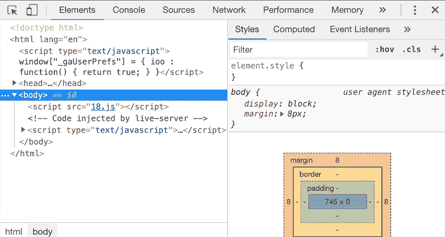
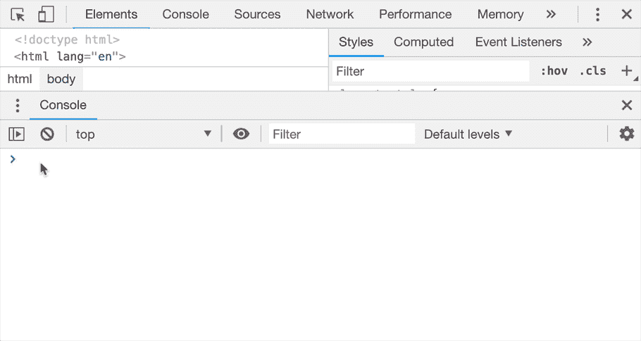

# DevTools 提示——第 18 天:藏在抽屉里

> 原文：<https://itnext.io/https-medium-com-tomsu-devtools-tips-day-18-hidden-in-a-drawer-aee1ba1b7b2e?source=collection_archive---------4----------------------->

## “面向前端开发人员的降临节日历”系列的一部分

*在假期前的 24 天里，我发表了一些短文，介绍如何以更高效、更有趣的方式使用 DevTools。* [*昨天*](https://medium.com/@tomsu/devtools-tips-day-17-back-to-the-console-ac2b97285731) *我们似乎有一些方法可以提高控制台中日志的可读性。今天我们来谈谈隐藏在 DevTools 抽屉里的强大功能:*

# 50.DevTools 抽屉

Chrome DevTools 有大量的设备，分成 9 个标签(*元素*、*控制台*、*源*、*网络*等)，但这实际上只是其中的一部分！有一组“平行的”标签，隐藏在主窗口下面。这套被称为**抽屉**。

要访问它，当您在 DevTools(任何选项卡)中时，按`[esc]`。
再次按下`[esc]`隐藏它:

默认情况下，您会在那里看到一个控制台选项卡。那是与主*控制台*面板完全相同的控制台。这就是为什么它会在每个主标签(*元素、源、网络……*)中显示，除了*控制台*标签之外——对于这些标签来说，它实际上没有意义。

让这样的控制台与*元素*面板同时可见是很方便的。但藏在*抽屉*里的还不止这些。

# 51.抽屉里的其他工具

抽屉里隐藏着许多其他功能，大多数时候你可能不需要它们，这就是它们被隐藏的原因，你可以挑选你想展示的功能。

要打开这些可能性的完整列表，请点击抽屉控制台面板标签前的菜单图标(`⋮`)。或者，您也可以使用[命令菜单](/devtools-tips-day-6-thecommand-menu-449eb3966d9)并输入“抽屉”:

好，让我们再看一遍所有选项:

> `*Animations*`*`*Changes*`*`*Console*`*`*Coverage*`*`*Network conditions*`*`*Performance monitor*`*`*Quick source*`*`*Remote devices*`*`*Rendering*`*`*Request blocking*`*`*Search*`*`*Sensors*`*和************

**唷，真是… `*[counts quickly]*`总共有 **13 个新的探索领域！****

**正如你可能已经猜到的那样，我将展示更多我们可以在这里找到的东西的提示…但是让我们把这个留到明天([这里](https://medium.com/@tomsu/devtools-tips-day-19-drawer-tips-1aa9cc48a1e8))，那时我们将会看到其中最酷的几个。**

**同时，**如果你喜欢这个文章系列**，请 **:****

****→鼓掌👏按钮** below️所以更多人可以看到这个
**→** [**在 Twitter 上关注我**(@ sulco)](https://twitter.com/sulco)所以你不会错过以后的帖子:**

** [## tomek sukowski(@ sulco)|推特

### Tomek sukowski(@ sul co)的最新推文。# TypeScript # JavaScript @ Angular trainer & Angular Tricity…

twitter.com](https://twitter.com/sulco) 

还有，**第 19 天**已经出版了，看这里:

 [## DevTools 提示—第 19 天:抽屉提示

### “面向前端开发人员的降临节日历”系列的一部分

medium.com](https://medium.com/@tomsu/devtools-tips-day-19-drawer-tips-1aa9cc48a1e8)**