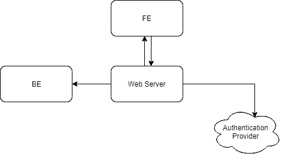
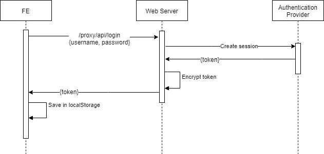
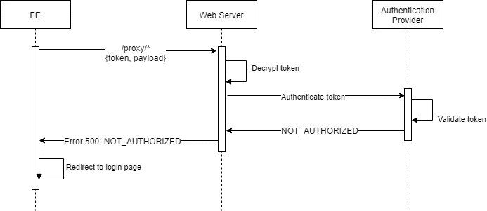
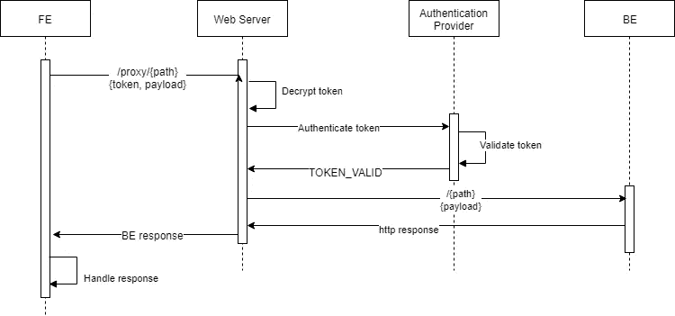

# 使用 Node.js、express 和外部身份验证提供程序进行简单身份验证

> 原文：<https://itnext.io/https-medium-com-yarindeoh-light-authentication-with-nodejs-express-and-external-provider-3ad65e637608?source=collection_archive---------3----------------------->

## 有多少次你被要求“创建一个工具”或“自动化一个过程”？可能很多，从那时起，你是如何管理你的认证的？本指南可以帮助您轻松地将身份验证添加到应用程序中。

# 动机

开发内部工具时，您可能有三种选择:

1.  您的应用程序正在运行，没有用户验证阶段。
2.  你的生态系统已经有了一种认证“微服务”,可以提供你所需要的一切。
3.  您可以使用外部身份验证提供程序(如吉拉)创建轻型身份验证代理，该提供程序支持单个域内多个应用程序的 SSO。(耶，现在谁没有吉拉账户呢？)

当谈到内部工具时，您仍然倾向于采用标准的、安全的身份验证和最佳实践。您可能希望管理权限和访问控制、用户的视图和组，并确保 API 调用是安全的。

你猜对了，我们将讨论选项 3！

使用 Node.js 和外部身份验证提供者创建一个轻量级身份验证服务将允许您避免使用任何类型的存储/数据库组件，您将无需处理组和权限逻辑、令牌化和其他“无聊”的安全特性。

使用外部认证提供商，如 [Atlassian Crowd Rest API](https://developer.atlassian.com/server/crowd/crowd-rest-apis/) 将为您提供一个可视化门户，您可以在其中轻松管理您的用户、组和权限，甚至可以从不同的应用程序导出现有的吉拉帐户/组。

我发现的唯一缺点是你依赖于第三方提供商。但是，当你想到它有多普遍，以及你能得到的所有这些免费和酷的特性时，权衡就很明显了。

# 体系结构

## 高层建筑

我们在游戏中有 4 个玩家:

*   **前端**——代表所有 UI 组件和用户视角。
*   **后端服务器**——响应业务逻辑调用。
*   **Web 服务器** -中间层组件，用作代理，与现场的所有其他组件通信。
*   **认证提供者**——外部提供者，如 [Atlassian Crowd Rest API](https://developer.atlassian.com/server/crowd/crowd-rest-apis/) 。

该系统的目的是在认证问题上提供一个真实的来源，该来源仅由 web 服务器中间件使用。

所有请求将从前端寻址到/代理路由器。/proxy/*请求将根据请求的路径进行管理。代理路由器将接受请求，通过身份验证提供者对其进行身份验证，与后端服务器通信，并将响应发送回前端。

## 序列图

**登录**

一个新用户正在启动登录页面，插入用户名和密码。API 请求正在发送到 web 服务器，该服务器正在使用提供的凭据创建会话。身份验证提供程序使用包含用户令牌的会话对象进行响应。web 服务器将加密的令牌发送到 FE，FE 将其保存在本地存储中。

如果是登录页面中的返回用户，FE 将发送一个包含已保存令牌的身份验证请求，并在验证通过时重定向到应用程序。

**认证失败**

所有 Rest 请求都将使用用户令牌发送到 web 服务器。Web 服务器将发送带有令牌的身份验证请求，并将错误响应发送回 FE，FE 将重定向到登录页面并清除其本地存储。

**认证成功**

当 web 服务器收到经过验证的令牌响应时，它会根据请求的路径 url 和有效负载来处理原始请求。

# 给我看一些代码

server.js

带有代理路由器的基本 Node.js express 服务器。

proxy.js

代理路由器将获得所有方法请求并处理它们，除了/proxy/api 请求，它将由一个名为 login 的子路由器处理。

login.js

你需要创建一个群组服务器([按照吉拉的指示](https://confluence.atlassian.com/crowd/installing-crowd-and-crowdid-191862.html))。并根据您的应用程序需求进行配置。

对于上面的例子，我使用了 [atlassian-crowd-client](https://github.com/ghengeveld/atlassian-crowd-client#atlassian-crowd-client) ，这是一个基于 promise 的客户端库，用于从 Node 与 Atlassian Crowd 服务器通信，用 ES6 编写。它只为我处理响应和错误，如果你愿意，你可以直接与[Crowd REST API](https://docs.atlassian.com/atlassian-crowd/3.1.2/REST/?_ga=2.133030030.1220822418.1564918095-843970779.1553945401#admin/1.0/auditlog-getConfiguration)通信。

# 摘要

这段代码是轻量级的！您可以轻松地为您的内部工具创建认证服务，并获得一些免费的和很酷的功能，这些功能将允许您像专业人士一样以安全的方式管理您的应用程序。

PM 提问和**在 twitter 上关注我**[**@ DekelYarin**](https://twitter.com/DekelYarin)**。**