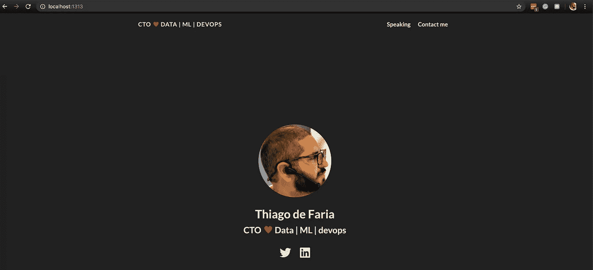

# 在 S3 上使用 SSL 的 Hugo 网站很简单，对吗？Errrrm…

> 原文：<https://itnext.io/hugo-website-with-ssl-on-s3-is-straightforward-right-errrrm-369c0f19ab07?source=collection_archive---------1----------------------->

我是[雨果](https://gohugo.io/)项目的长期粉丝。我第一次接触它是在组织[阿姆斯特丹开发日](https://devopsdays.org/events/2020-amsterdam/welcome/)的时候，我们必须在[https://devopsdays.org](https://devopsdays.org)网站上生成页面。我对使用 Markdown 设置新页面、内容和所有内容的简单性印象深刻！:-D

最近我一直在拖延用 Hugo 为个人使用建立一个简单的静态网站的想法。所以我决定在每次构建之后将它的静态版本推到一个 S3 桶中，并从那里提供服务。如果我知道兔子洞，我会让自己进去…

*现在，我更加尊重* [*马特·斯特拉顿*](https://medium.com/u/cf921a3f7a49?source=post_page-----369c0f19ab07--------------------------------) *和所有志愿者，是他们让世界各地数百名志愿者组织者的体验变得如此无缝和轻松！*

# 雨果

查看[网站](https://gohugo.io/)、文档、快速入门，感受这款速度极快、基于 GO 的网站生成器的强大功能！就我的用法而言，我真的很喜欢极简主题，我发现了这个我想要使用的巨大的 [hugo-coder 主题](https://github.com/luizdepra/hugo-coder)。

在设置了我的`config.toml`并添加了一些带有一些基本减价的内容后，我可以顺利地在本地运行，用`hugo serve`来“查看它”。耶！



在我的机器上运行！

# 把静态文件推给 S3，对吗？

如果你正在做快速入门或者只是玩玩，你可能选择了 Hugo 主题。看到它工作后，你可以用一个简单的`hugo`命令生成你的静态文件(*我通常添加* `-v` *详细标志，因为我…* ) —

现在是上传文件到 S3 的时候了。但是现在，你到处都需要 SSL 证书。如果你研究 AWS 文档，你会发现在 S3 上托管静态站点是多么容易，对吗？这里检查[例如](https://docs.aws.amazon.com/AmazonS3/latest/dev/WebsiteHosting.html)。

然而，如果你想要你的域名，而不是一个通用的*http://<BUCKET _ Name>. s3-website-<AWS _ REGION>. Amazon AWS . com*端点，你可能需要查看一些其他文档，了解一些关于 Cloudfront、DNS、ACM 和 S3 的东西。你想穿过那条路吗？谷歌一下`[aws + s3 + hosting + ssl](https://www.google.com/search?q=hosting+static+website+on+s3+with+ssl)`之类的就行了。

如果你关注了这些精彩的帖子中的一个，你最终会遇到一个问题。为什么？因为像`foo.com/bar/`这样的 Hugo 页面实际上是`foo.com/bar/index.html`，那些奇怪的重定向可以很容易地用你的 Apache 和 Nginx 配置，但我不知道 S3 可以做到这一点——它可以！

现在，您可以将这个配置文件应用到包含静态文件的 bucket 中，瞧！

```
aws s3api put-bucket-website --bucket $BUCKET_NAME --website-configuration file://HugoS3BucketRedirect.json
```

# 为您的证书使用 ACM

我不知道你是否知道，但 AWS 为所有用户免费生成公共 SSL 证书。AWS 证书管理器(ACM)服务非常好，你可以通过控制台或者 API(就像 AWS 上的其他东西一样)来使用它。

您可以通过向您的域中添加记录或通过管理员电子邮件检查来验证您的域中的 SSL 证书。如果您有权访问域管理员电子邮件，您可以快速运行以下代码来获取该邮件并验证它(*注意，我们要求一个对该域和*[*www . domain*](http://www.domain)*版本有效的证书，以便我们稍后可以重定向它*)。

```
aws acm request-certificate --domain-name $DOMAIN_NAME --subject-alternative-names "www.$DOMAIN_NAME" --idempotency-token "`date +%s`"
```

*这里一个微妙的说法是* `*idempotency-token*` *。幂等性是 API 请求的一个特征，它确保请求不会被完成一次以上。对于幂等请求，如果原始请求成功完成，所有后续的重试都将返回原始成功请求的结果，并且它们没有额外的影响。因此，我们将当前时间以秒为单位放在那里，以确保如果我们再次运行该调用，从现在开始，我们将获得该域和 www 版本的相同结果。*

在验证发生和证书颁发之后，您可以获得证书的 ARN，因为我们稍后会用到它(通过控制台或 API 调用，由您决定)。

# Cloudfront FTW！

我不需要一个个人网站的所有数百个边缘位置，但我们需要使用 Cloudfront 在其上启用我的域名和 SSL。那么，让我们来看看 CloudFront 的设置。

Cloudfront 配置文件是一个大的 JSON 文件，其中包含 5 个“部分”:

*   Origin:在这里你指向 S3 网站的托管 URL 来获取`index.html`。这就产生了一个问题，因为如果你把 HTTPS 设置到原点，你将无法与 AWS 为 S3 请求设置的通用 S3 证书匹配…就是 HTTP！
*   缓存行为:SSL 是强制的，所以我们将端口 80 重定向到 443。在这里，您还可以:定义缓存内容的持续时间；转发什么请求；如果你想 gzip 内容；如果你要转发标题和更多。
*   错误处理:定义 4xx 的重定向、错误缓存时间等等。
*   限制:如果您需要对 CloudFront 发行版应用地理或 IP 限制。
*   其他:放置标签、注释和名称的地方。

现在，您可以使用您的变量来调整上面的文件，并通过 API 运行以下命令来创建发行版:

```
aws cloudfront create-distribution --distribution-config file://HugoCloufrontConfiguration.json
```

*如果你愿意，你也可以通过控制台来适应/选择你想要的行为。或者你不想要一个伐木桶。还是不同的 TTL？由你决定！但是，必须通过 HTTP 准确定义 S3 的来源，就像这里一样。*

你可能需要在这里等一会儿。Cloudfront 部署可能需要几分钟的时间，直到您可以访问它的 URI，一切都准备好了。

更多？！是的，更多！

# DNS 设置

正如 Kris Buytaert 总是说的那样:“所有的事情都是一个该死的 DNS 问题！和往常一样，他是对的。确保当有人访问你的域名时，他们被适当地重定向到 CloudFront 发行版；我们得安排一些事情。

我的域在 53 号公路上，所以我必须在我的托管区域上生成两条记录:

*   一个指向我在上面创建的 Cloudfront 发行版的`A`记录— *为您的域使用别名方法—* 。
*   一个`CNAME`记录指向你的 [www.domain.](http://www.domain.) 的同一个 Cloudfront 分布

您可以通过控制台轻松做到这一点，但是如果您想通过 AWS CLI 检查待办事项，您将需要类似于下面的 JSON 文件。

您可能想知道别名部分中的硬编码`HostedZoneId`，对吗？为什么会这样？嗯，因为 AWS 定义了这里的:“指定 Z2FDTNDATAQYW2。当您创建将流量路由到 CloudFront 分发的别名记录时，这始终是托管区域 ID。

现在，您可以在控制台上复制/获取包含您的域的`ZONE_ID`(也总是通过 API)并运行以下命令:

```
aws route53 change-resource-record-sets --hosted-zone-id $ZONE_ID --change-batch file://HugoCloudfrontRoute53.json
```

像往常一样，喝点咖啡，等待一切在 DNS 世界中传播和适当地生成。官方说法是可能需要 24 小时以上，但通常 30 分钟就足够了！完成后，您将拥有一个 Hugo 静态网站，可以通过使用 SSL 的自定义域名访问，该网站由 Cloudfront 托管在 S3 上。:-D