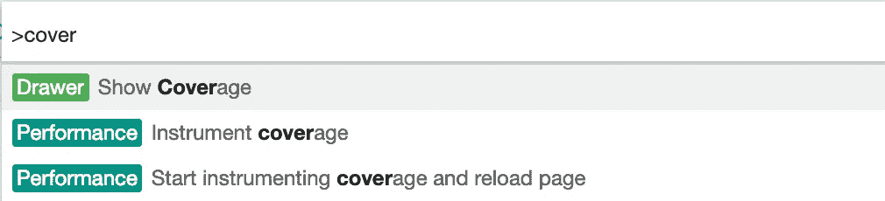
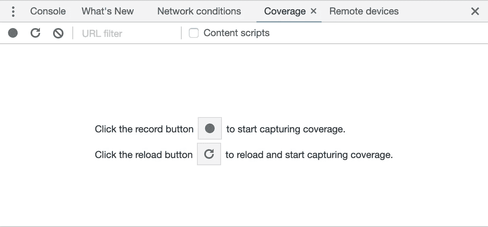
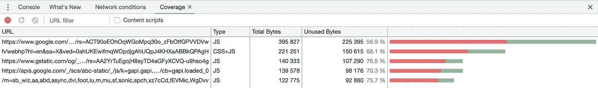
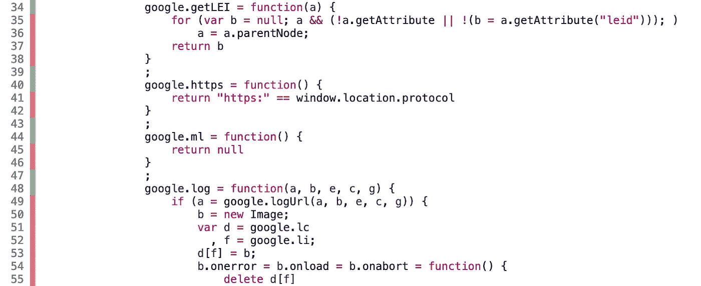

# 搜寻未使用的 CSS 和 Javascript

> 原文：<https://itnext.io/hunting-for-unused-css-and-javascript-57e8d9bc2a67?source=collection_archive---------2----------------------->

Chrome 开发工具提示:代码覆盖抽屉


卡尔·瑟斯特兰德在 [Unsplash](https://unsplash.com?utm_source=medium&utm_medium=referral) 上拍摄的照片

向用户交付快速应用程序的最佳方式是加载更少的代码。听起来很简单，对吗？开发人员总是在寻找工具来帮助缩小、捆绑和组织他们的代码。我们知道感知加载时间的重要性，也明白如果我们的应用程序不能在几秒钟内提供价值，我们就会失去潜在客户。

> 快速加载你的资源是很重要的，但是你的 CSS 是最重要的，因为它是一个阻塞资源。

## 我们团队的 CSS 情况

CSS 会很快失控。没有一个合适的策略，重复的规则会使你的代码混乱，管理你的文件会使开发更具挑战性。

我们的团队最近将几个页面转换成了一个 [React 应用](https://medium.com/@chrisgirard/converting-your-code-base-to-react-1930945dc017)，但是继续使用我们现有的 CSS 基础设施。我们不想重写我们的 CSS，我们对规则的可重用性很满意。我们有许多 SCSS 部分，并把它们按元素和特性分类:变量、图标、按钮、表单、标签等。

我们有一个或两个共享的样式表，包含许多页面共享的规则，如导航、按钮和页脚样式。然后，我们有额外的页面特定风格的 SCSS 文件，如主页，登录页面和定价页面。

当转换我们现有的一些页面来反应时，我们做了一些代码清理，并决定我们可以做得更好，减少加载的 CSS。我们知道我们有许多未使用的规则，并试图使它变得更好。我们遇到的一个工具被方便地内置到 Chrome 中——**代码覆盖抽屉**。

## Chrome 开发工具命令菜单

命令菜单允许您快速运行开发工具命令。打开 Chrome Dev Tools，键入 *command > shift > p* 然后输入搜索，自己尝试一下。您可以快速启用 3G 节流、切换到面板、切换抽屉和许多其他命令。

```
*command > shift > p*
```

## 代码覆盖率抽屉

覆盖抽屉是在 Chrome 59 中引入的，令人惊讶的是它是一个鲜为人知的功能。它显示了每个文件中未使用的 JavaScript 和 CSS 的数量。这显然有很多好处，可以帮助我们使文件尽可能小，并且只加载我们绝对需要的资源。

您需要通过打开命令菜单，然后选择**显示覆盖范围来启用它。**



代码覆盖率标签将出现在 Chrome 开发工具的抽屉部分。要在该部分中切换抽屉和其他选项卡，您可以单击 *esc* 键。



通过单击记录或刷新按钮开始捕获。



如果您正在录制，您可以调整浏览器窗口的大小来触发您的媒体查询，希望您会看到未使用的字节减少。如果你点击其中一个网址，你可以看到哪些代码行正在使用。



## 结果

我们 88%的 CSS 没有被使用。呀。乍一看，这似乎真的很糟糕，直到我们意识到动画关键帧、印刷媒体查询、无数的网格类和其他不常用的规则正在被加载。我们能够确定一些不应该加载的明确规则，并为快速获胜而修正它们。

> Chrome Coverage 抽屉是一个很好的起点，因为它可以快速显示我们是否在个人资料页面加载主页样式。

## 后续步骤

在 JSX 写 CSS。太激烈了？这似乎一直是一个被抛弃的想法，但这个争论每年都变得越来越有意义。一旦您开始使用 React 并希望保存每一个字节，这似乎并不遥远。

我们的团队正在寻找一个更小的基本 CSS 文件，并可能将页面样式导入 React 组件。

Chrome Coverage Drawer 是一个很好的工具，可以帮助识别遗留的 CSS 规则以及隐藏的功能。它甚至可以帮助您将 CSS 文件重组为一个更加模块化和易于管理的系统。

## 继续使用 Chrome 开发工具

下面是 Chrome 团队介绍代码覆盖特性的视频。

我们的团队试图跟上最新的开发变化，以帮助我们更好地调试。Google Chrome 大约每两周更新一次，他们通常会发布一个开发视频，介绍开发工具的所有变化。我建议关注他们，因为他们会定期发布更新，让开发者的生活变得更好。