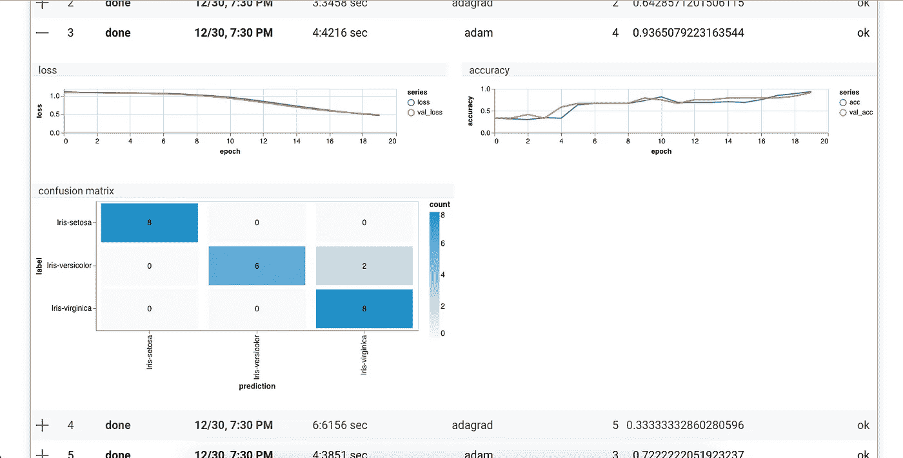

# Javascript 中虹膜数据集的超参数优化

> 原文：<https://itnext.io/hyperparameter-optimization-for-the-iris-dataset-in-javascript-81f81809275e?source=collection_archive---------8----------------------->

# 背景

这学期我一直很忙，但是现在我在放寒假，我想我应该再做一个 [HPJS](https://hyperjs.herokuapp.com/) 的例子。自从我的[上一篇文章](https://medium.com/@martin_stoyanov/a-simple-example-with-hyperparametersjs-3b36edbe838f)以来，JS 机器学习社区有了一些不错的更新。例如，Tensorflow 最近发布了 [tfjs-vis](https://github.com/tensorflow/tfjs-vis) ，它可以让你可视化关于你的模型的信息。在我看来，它与现有的 tfjs 模型配合得非常好，我已经在这个例子中使用了它。

对于这个例子，我将介绍如何使用 [HPJS](https://hyperjs.herokuapp.com/) 来优化用于 [iris](https://en.wikipedia.org/wiki/Iris_flower_data_set) 数据集的 tfjs 模型中的一些超参数(在这个例子中是优化器和层数)。如果你对 [HPJS](https://hyperjs.herokuapp.com/) 不熟悉，我推荐阅读[这篇文章](https://medium.com/@martin_stoyanov/hpjs-hyperparameter-optimization-for-javascript-8f78aa7a3368)了解一些背景知识。继续这个例子。

# 例子

*您可以在* *这里运行示例并查看代码* [*。然而，我也粘贴了下面的代码。如果 trainModel 和 modelOpt 函数令人困惑，我推荐这篇文章*](https://hyperjs.herokuapp.com/tensorflow/iris)[](https://medium.com/@martin_stoyanov/a-simple-example-with-hyperparametersjs-3b36edbe838f)**，在这篇文章中，我一步一步地用 hpjs 创建了一个简单的例子。**

*该示例基于 tensorflow 团队的 iris [示例](https://github.com/tensorflow/tfjs-examples/tree/master/iris)；我刚刚在它上面添加了 hpjs 超参数优化。需要记住的一点是:代码中提到“回调”的任何部分(第 29 行和第 62 行)在我们的例子中只用于用户界面，可以忽略。*

*正如我们在定义的搜索空间(第 52 行)中看到的，我们正在优化的超参数是层数和优化器:*

```
*const space = { 
  optimizer: hpjs.choice([‘sgd’, ‘adam’, ‘adagrad’, ‘rmsprop’]),    
  numLayers: hpjs.quniform(2, 5, 1),
};*
```

*我们在优化函数中实现随机层#如下所示(第 12 行):*

```
*// adding random number of layers  
for (let i = 0; i < numLayers; i += 1) {      
  model.add(tf.layers.dense({
    inputShape: i === 0 ? [4] : [10], // input shape 4 for 1st layer     
    activation: i === numLayers - 1 ? 'softmax' : 'sigmoid', 
    units: i === numLayers - 1 ? 3 : 10, // last layer is 3 units 
  }));  
}*
```

*因为我们从搜索空间传入了随机的“numLayers”变量，所以 for 循环将运行这个次数。*

*第一层的输入形状是 4，因为我们给了每朵花 4 个数据点(萼片长和宽，花瓣长和宽)。*

*对于激活 fn，我们对最后一层使用 softmax，如 tensorflowjs' [示例](https://github.com/tensorflow/tfjs-examples/blob/31fc6150bf8432326f344b12a5627f879486b73d/iris/index.js#L49)所示。*

*最后一层的单位设置为 3，因为我们正在对 3 种花进行分类。*

*对于优化器，我们在编译时从优化器列表中选择(第 22 行),学习率为 0.01:*

```
*model.compile({    
  loss: 'categoricalCrossentropy',    
  metrics: ['accuracy'],    
  optimizer: optimizers[optimizer](0.01), // line 22
});*
```

*在 tfjs 中，您可以将优化器设置为一个字符串或创建一个对象，以便传递学习率等参数。我们做第二个是为了和 tensorflow 团队的例子保持一致。因为在 tfjs 中你设置了一个类似“tf.train. <optimizer>”的优化器，所以我在第 2 行定义了一个对象，当我们在第 22 行调用它时，它会进行适当的转换。</optimizer>*

```
*const optimizers = {    
  sgd: tf.train.sgd,    
  adagrad: tf.train.adagrad,    
  adam: tf.train.adam,    
  adamax: tf.train.adamax,    
  rmsprop: tf.train.rmsprop,  
};*
```

*这就是虹膜的具体内容。*

*您现在可以运行我们的 [iris 示例](https://hyperjs.herokuapp.com/tensorflow/iris)，并看到我们已经使用 [tfjs-vis](https://github.com/tensorflow/tfjs-vis) 来显示每次试验的损失、准确性和混淆矩阵等信息。目前，我们的 tfjs-vis 实现似乎是第一次使用 React，所以如果你正在做一个类似的项目，在这里查看我们的代码。*

**

*在页面底部，点击每个试验的+号，查看损失、准确性和混淆矩阵*

*在[运行模型](https://hyperjs.herokuapp.com/tensorflow/iris)很多次之后，似乎最佳优化器是 adam 和 rmsprop，而最佳层数是 3+。对于更深入的测试，您可以更改试验、时期和种子的数量(所有这些都在[示例页](https://hyperjs.herokuapp.com/tensorflow/iris)中解释)。*

# *结论*

*在本文中，我们使用 [hpjs](https://hyperjs.herokuapp.com/) 在 iris 数据集上优化了 [TensorflowJS](https://js.tensorflow.org/) 模型的一些超参数。优化的超参数是优化器和层数。*

*欢迎留下反馈并查看我们的 [github](https://github.com/atanasster/hyperparameters) 页面和[网站](https://hyperjs.herokuapp.com/)！*