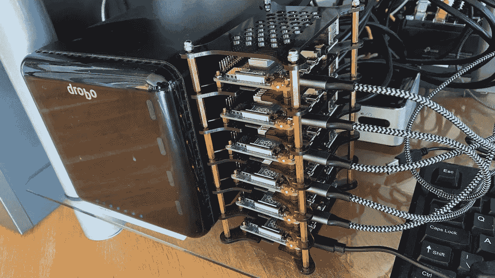
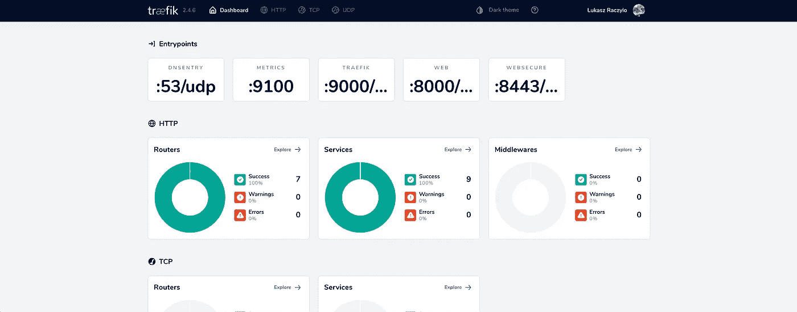
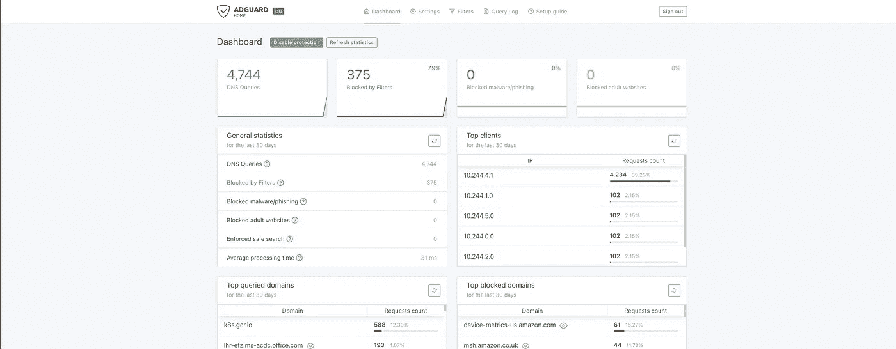
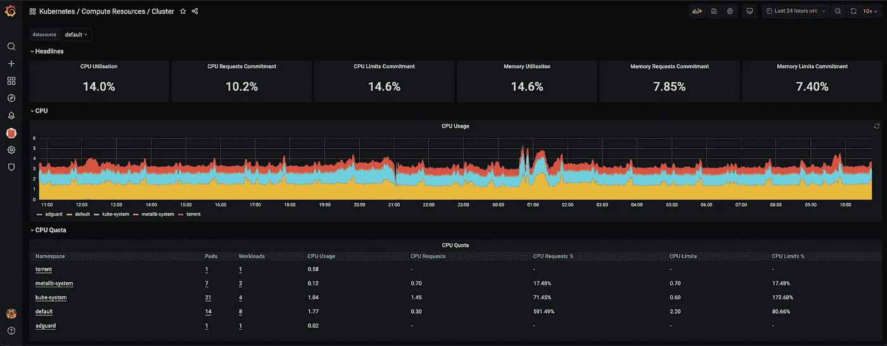
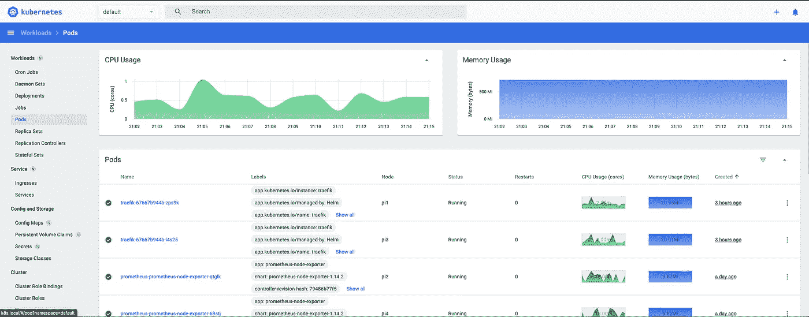

# 我打破了我的 Kubernetes 集群运行在树莓派

> 原文：<https://itnext.io/i-broke-my-kubernetes-cluster-running-on-raspberry-pi-355234a24d?source=collection_archive---------0----------------------->

昨晚我在玩更新——只是比看起来的多了一点，导致了灾难——所有节点突然停止检测网络接口，并且不可能恢复。发表于圆周率日(14/03)的文章附有“吃到饱”代码(在结尾)。



我家的树莓派 Kubernetes 集群(归功于我的妻子忍受它)

随着我的宠物集群增长到总共 6 个节点(感谢我的妻子，她知道我生日的最好礼物是一个馅饼 RaspberryPi)，我有了一个选择——按照我自己的文章从头开始在 Raspberry Pi 上设置 Kubernetes 集群，或者按照 DevOps 和 SRE 的方式来做——完全自动化潜在的重建和集群管理。

这篇文章是对我的上一篇文章[构建您的家庭覆盆子 PI Kubernetes 集群](https://medium.com/swlh/building-your-home-raspberry-pi-kubernetes-cluster-14eeeb3c521e)的直接改进。


人类对机器|信用:在 pixabay 的 comfreak

# 时间和精力想法

那时我有两个选择，我在睡觉的时候仔细考虑过了。这两种方法都很费时间。

***方法#1:***
早起，手动按照我自己的文章重建东西(原文如此！)或许还能找到一些改进的空间。这种方法，正如我已经多次向自己证明的那样，很容易出现错误和失误，主要是打字错误或跳过一两步，然后试图弄清楚接下来的半个小时到底发生了什么，清除一切，并从头开始一遍又一遍。我已经这样做过几次了，但毕竟，再来一次，不要伤害任何人。

***方法二:***
早起，从头开始编码；这次帮我的终极解决方案就是做一次，用一辈子。使整个集群的重建和生产尽可能容易重现。当然，这意味着更多的停机时间。然而，它的好处将是长期的，让我不用担心集群本身，并最终将它视为一个稳定的解决方案，我可以将我的整个家庭基础架构迁移到其中。

# 自动化传奇开始

在开始任何工作之前，我把重点放在基础的基础上，并建立了一些我在整个过程中遵循的原则。这创建了一个有点自以为是的环境，但是在代码的各个部分之间有大量的逻辑分离，所以亲爱的读者，对你来说，更改代码的任何部分或者注释掉整个文件来禁用这里或那里的一些特性应该更容易一些。

***原则#1* :** 在树莓 Pi 上设置 Kubernetes 集群可以分为三个部分。设置存储卡、系统级的节点配置，最后是启动 Kubernetes 资源。

***原则#2* :** 有一个 NFS 服务器运行在我的旧英特尔 NUC 上，连接到 DROBO 存储器。将它用作所有节点的永久共享存储会很好。

**想到这些，我设法坐下来，开始编写这个小科学怪人的代码。要重现结果(或使其发挥作用)，您需要:**

*   ***Mac* (针对卡格式化部分)，以后有时间安装 Linux VM 的时候可能会用平台检测更新脚本。**
*   ***Ansible* (我在 2.10.6 上运行它)**
*   ***地形*(写在 0.13.4 中，也适用于 0.14.8)**
*   **这将有助于所有的运行都不会篡改参数**

# **rPi 集群:步骤 1**

**Raspberry Pi 使用存储卡作为其硬盘。这可能不是最优的，也肯定不会给你最快的读写速度，但是对于游戏和业余爱好项目来说应该足够了。**

****第一步**照顾什么？**

*   **格式化存储卡**
*   **将存储卡分为两个分区— 1GB +存储卡的其余部分**
*   **将 Alpine Linux 映像复制到存储卡上**
*   **创建系统覆盖**

**系统覆盖负责将 **eth0** 设置为 promisc 模式(对于 MetalLB 是必需的),并允许 SSH 连接到您的 Raspberry Pi 主机，无需密码。**

****重要:**检查`001-prepare-card.sh`的来源，确保你刚刚插入的存储卡确实是`/dev/disk5`否则可能会丢失数据。**

****结果**:准备 6 张内存卡大约需要一分钟。**

# **rPi 集群:步骤 2**

**这才是真正有趣的开始。我想你已经将存储卡插入你的黑莓个人电脑，连接所有的电缆(网络和电源)并允许它们启动？你现在需要获得你的设备的 IP 地址——你可以通过连接屏幕到每个设备并执行`ifconfig eth0`或者登录到你的路由器并在那里检查。用合适的值调整`pi-hosts.txt`。**

****重要提示:**未来的一些事情可能需要`pi0`主机名。**

**将以下内容添加到您的`~/.ssh/config`文件中，强制作为根连接到所有 pi*主机。**

```
Host pi?
  User root
  Hostname %h.local
```

**因为我们已经准备好了微型机器(是的，我是最老的那位),我们需要为可能的运行做准备。您可以使用`001-prepare-ansible.sh`脚本轻松做到这一点，该脚本将 ssh 到 pi-hosts 文件中指定的每个服务器，为 NTP 配置 chrony 并安装 Python 解释器。**

****重要提示:**您可能需要检查`rpi.yaml`文件，并根据需要调整 vars 部分。我肯定会的。**

**这一步成功后，您可以执行 Ansible run `ansible-playbook rpi.yaml -f 10`，它将按顺序处理以下内容:**

****常见:****

*   **安装必要的软件包**
*   **对 RPI 存储卡进行分区和格式化**
*   **将“更大”的分区设置为系统盘**
*   **添加所有 fstab 条目**
*   **提交更改**
*   **重启 Pi 从“永久”分区引导**

****KUBEMASTER:****

*   **使用 kubeadm 设置主节点**
*   **在本地存储您的令牌(在`static/token_file`中)**
*   **在 Pi 上设置能够访问 kubectl 的`root`用户**
*   **本地保存 Kubernetes 配置(在`static/kubectl.conf`中)**

****KUBEWORKER:****

*   **将令牌复制到工作节点**
*   **它让工人加入你的主人，用令牌文件**
*   **将`kubectl.conf`复制到工人`root`用户**

****基本:****

*   **从主服务器中删除污点，允许它参与工作负载**
*   **在节点上安装 py3-pip、PyYaml 和 helm**

**如果您还在阅读——祝贺您——您刚刚完成了基本的 Kubernetes 集群，它什么也不做，需要一点爱。我相信，这就像执行几个脚本并等待它们完成一样简单，而且肯定比手工方法好。**

**重要提示:你可以随心所欲地运行它。一旦完成，你的记忆卡就不能重新格式化了。**

****结果**:根据您的互联网连接情况，准备 6 个基本 Kubernetes 安装节点大约需要一两分钟。**

# **rPi 集群:步骤 3**

**在成功执行了前面的两个步骤之后，您应该已经为第一次部署准备好了 Pi 集群。让它按预期工作只需要几个基本的设置步骤，但是你猜怎么着……它们也是自动的，让 Terraform 来处理。**

**我们先来看看配置。**

**您可以看到我正在`192.168.50.0/24`网络中运行群集，但默认情况下，MetalLB 将使用地址为`200-250`的网络地址池的“末端”。因为我有我的主 torrent 服务器和来自 Adguard 的 DNS 我希望它们有特定的地址——以及 Traefik 平衡器服务于仪表板“和其他东西”。**

****重要:** `nfs_*_path`值应与您在**步骤 2** 中更新的设置兼容。
**重要提示(2):** 确保您的 Kubernetes 配置文件`~/.kube/config`更新了来自`static/kubernetes.conf`的访问细节——我使用`home-k8s`作为上下文名称。**

**地形改造有什么作用？**

1.  *****联网***
    安装*绒布*连同`host-gw`的配置补丁；
    安装 *metalLB* 并将网络设置为`var.network_subnet`200–250；**
2.  *****Traefik***
    安装 Traefik 代理，并通过 metalLB 负载平衡器将其暴露给家庭网络。Traefik 仪表板本身可以通过`traefik.local`访问**

****

**在 Pi 集群上运行的 Traefik 仪表板**

1.  *****Adguard***
    使用 NFS 安装具有永久卷声明的 Adguard DNS 服务；
    通过 traefik 暴露 dashboard，并通过家庭网络中的专用 IP 暴露服务本身，如`adguard.local`**

****

**在 Pi 群集上运行的 Adguard 主目录**

1.  *****Prometheus*** 在您的所有节点上安装并部署 Prometheus monitoring stack 和 grafana。修补 Prometheus DaemonSet，移除体积挂载的必要性。它还通过 traefik 暴露 grafana，因为`grafana.local.`默认的 grafana 用户/密码组合被设置为`admin:admin`。Grafana 带来了一个预装的插件[devopspprodigy-kube graf-app](https://grafana.com/grafana/plugins/devopsprodigy-kubegraf-app/)，我发现它是集群监控的最佳插件。**

****

**在 Pi 集群上运行的 Grafana 仪表板**

1.  *****Kubernetes dashboard*** 安装 Kubernetes dashboard，并通过 traefik 在`k8s.local`上公开它**

****

**在 Pi 集群上运行的 Kubernetes 仪表板**

1.  *****Torrent*** 安装并部署具有 Flood web 界面的 Torrent 服务器(rTorrent)。通过`torrent.local`暴露仪表板。它使用大量挂载来保存数据和配置。将复制设置为 1 是有原因的——当前锁定文件有问题，并且因为它使用共享目录，所以如果检测到锁定文件，它就不会启动。rTorrent is(在我的私有配置中)设置为监听端口`23340`。**
2.  *****备份*** 由于 Raspberry Pi 从一个存储卡上运行，由于不断的读写操作，存储卡可能会磨损——我决定将 **etcd** 的定期备份添加到 NFS 中。它们每天运行一次，使用 terraform 应用的配置，每个备份“重量”约为 32 兆字节。**

****运行地形****

**为了使事情稍微简单一些，我创建了 Makefile，它应该可以帮助您进行设置。您可能需要设置以下环境变量。**

```
TRAEFIK_API_KEY // Traefik API key
GH_USER // Github user
GH_PAT // Github Personal Access Token
```

****重要提示:** Github 凭证是 ***而不是现在使用的*** ，但是我打算很快添加从 GHCR 拉私有图片的认证。**

# **整理笔记**

**全部代码都可以在 GitHub 上获得[lukaszraczylo/rpi-home-cluster-setup](https://github.com/lukaszraczylo/rpi-home-cluster-setup)，任何人都可以免费使用和修改(像往常一样，非常欢迎拉取请求)。我还发布了支持 ARM64 处理器的多架构定制 docker 图像(rTorrent 和 Flood)。**

**自动化节省了时间，减少了紧张，并且确实完成了工作。我定期清理整个集群，并使用提到的存储库从头开始构建，以确保它按预期工作。随着新功能和新特性的出现，我将使本文和存储库都保持最新。**