# 我开发了一个工具来监控旧金山的空气质量，并对任何变化发出警报

> 原文：<https://itnext.io/i-built-a-tool-to-monitor-san-francisco-air-quality-and-alert-any-changes-b2a552c23448?source=collection_archive---------4----------------------->


[**旧金山**](https://en.wikipedia.org/wiki/San_Francisco)

如今跟踪天气演变并不困难。你可以通过互联网、收音机包括电视获得天气数据。但是一个个性化的解决方案呢，一个只通知我们想要的城市中我们想要的指标的应用？

我们甚至可以将此与空气质量结合起来，这是这段时间的一个重要话题，尤其是如果你住在旧金山。这将是有趣的，因为空气质量不是那么容易获得的。没有太多的数据提供者，这种类型的数据比天气数据更难获得。

所以让我们为此开发一个应用程序。

我们的应用程序的最终输出将如下所示。每天早上的某个时间，当天的天气预报将通过电子邮件与当前的空气质量值一起发送。

与此同时，当空气质量下降到某个阈值以下时，将会发出警报，指示高于该限值的一个或多个指标。

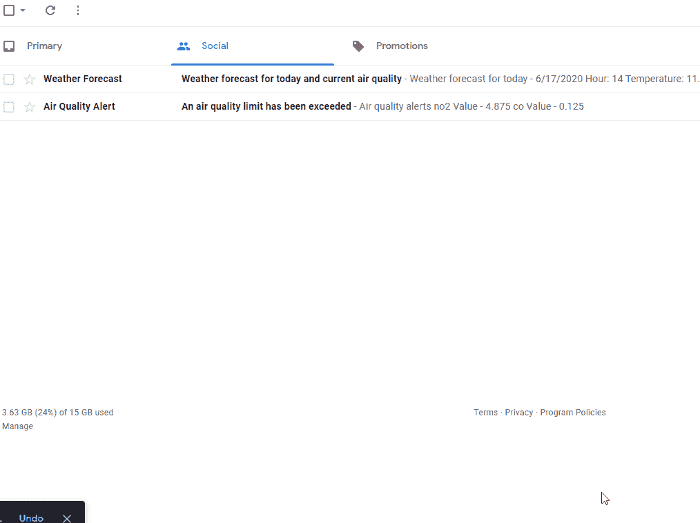

# 让我们编码吧

为了能够获取我们感兴趣的数据类型，我们将使用 [ClimaCell 天气 API](https://www.climacell.co/weather-api/) 。

他们的 API 将允许我们收集可靠的天气和空气质量数据。

在实际开始编码之前，我们需要做的第一步是设置项目，并在 ClimaCell 上创建一个帐户，这样我们就可以接收一个 API 密匙。

# 1.设置项目

1.  运行以下命令来设置`npm`并安装所需的依赖项。

`npm init -y && npm i node-fetch nodemailer pug`

*   `node-fetch`将用于向 ClimaCell API 发送请求；
*   `nodemailer`将用于发送邮件；
*   `pug`会用来写邮件模板；

2.创建一个`config.json`文件来存储您的凭证并填充您的数据。

```
{
  "host": "<email server host>",
  "user": "<email_addr>",
  "pass": "<email_pwd>",
  "cc_key": "<climacell_api_key>"
}
```

*   `host`、`user`和`pass`字段用于配置`nodemailer`。我从我的电子邮件托管服务发送电子邮件。如果你想从你的 Gmail 帐户发送电子邮件，你可以用`service`替换`host`属性，然后按照 StackOverflow 问题中的[指令](https://stackoverflow.com/questions/19877246/nodemailer-with-gmail-and-nodejs)进行操作。
*   `cc_key`是您的私有 ClimaCell API 密钥。

# 2.应用程序设置

第二步，我们必须编写一些强制脚本，这些脚本不是主要逻辑的一部分，但却是应用程序所需要的。

这一步包括定义常数、需要库等等。

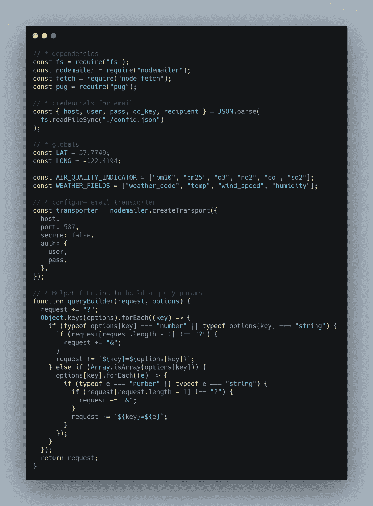

[RAW](https://carbon.now.sh/?bg=rgba(171%2C%20184%2C%20195%2C%201)&t=seti&wt=none&l=javascript&ds=true&dsyoff=20px&dsblur=68px&wc=true&wa=true&pv=56px&ph=56px&ln=false&fl=1&fm=Hack&fs=14px&lh=133%25&si=false&es=2x&wm=false&code=%252F%252F%2520*%2520dependencies%250Aconst%2520fs%2520%253D%2520require(%2522fs%2522)%253B%250Aconst%2520nodemailer%2520%253D%2520require(%2522nodemailer%2522)%253B%250Aconst%2520fetch%2520%253D%2520require(%2522node-fetch%2522)%253B%250Aconst%2520pug%2520%253D%2520require(%2522pug%2522)%253B%250A%250A%252F%252F%2520*%2520credentials%2520for%2520email%250Aconst%2520%257B%2520host%252C%2520user%252C%2520pass%252C%2520cc_key%252C%2520recipient%2520%257D%2520%253D%2520JSON.parse(%250A%2520%2520fs.readFileSync(%2522.%252Fconfig.json%2522)%250A)%253B%250A%250A%252F%252F%2520*%2520globals%250Aconst%2520LAT%2520%253D%252037.7749%253B%250Aconst%2520LONG%2520%253D%2520-122.4194%253B%250A%250Aconst%2520AIR_QUALITY_INDICATOR%2520%253D%2520%255B%2522pm10%2522%252C%2520%2522pm25%2522%252C%2520%2522o3%2522%252C%2520%2522no2%2522%252C%2520%2522co%2522%252C%2520%2522so2%2522%255D%253B%250Aconst%2520WEATHER_FIELDS%2520%253D%2520%255B%2522weather_code%2522%252C%2520%2522temp%2522%252C%2520%2522wind_speed%2522%252C%2520%2522humidity%2522%255D%253B%250A%250A%252F%252F%2520*%2520configure%2520email%2520transporter%250Aconst%2520transporter%2520%253D%2520nodemailer.createTransport(%257B%250A%2520%2520host%252C%250A%2520%2520port%253A%2520587%252C%250A%2520%2520secure%253A%2520false%252C%250A%2520%2520auth%253A%2520%257B%250A%2520%2520%2520%2520user%252C%250A%2520%2520%2520%2520pass%252C%250A%2520%2520%257D%252C%250A%257D)%253B%250A%250A%252F%252F%2520*%2520Helper%2520function%2520to%2520build%2520a%2520query%2520params%250Afunction%2520queryBuilder(request%252C%2520options)%2520%257B%250A%2520%2520request%2520%252B%253D%2520%2522%253F%2522%253B%250A%2520%2520Object.keys(options).forEach((key)%2520%253D%253E%2520%257B%250A%2520%2520%2520%2520if%2520(typeof%2520options%255Bkey%255D%2520%253D%253D%253D%2520%2522number%2522%2520%257C%257C%2520typeof%2520options%255Bkey%255D%2520%253D%253D%253D%2520%2522string%2522)%2520%257B%250A%2520%2520%2520%2520%2520%2520if%2520(request%255Brequest.length%2520-%25201%255D%2520!%253D%253D%2520%2522%253F%2522)%2520%257B%250A%2520%2520%2520%2520%2520%2520%2520%2520request%2520%252B%253D%2520%2522%2526%2522%253B%250A%2520%2520%2520%2520%2520%2520%257D%250A%2520%2520%2520%2520%2520%2520request%2520%252B%253D%2520%2560%2524%257Bkey%257D%253D%2524%257Boptions%255Bkey%255D%257D%2560%253B%250A%2520%2520%2520%2520%257D%2520else%2520if%2520(Array.isArray(options%255Bkey%255D))%2520%257B%250A%2520%2520%2520%2520%2520%2520options%255Bkey%255D.forEach((e)%2520%253D%253E%2520%257B%250A%2520%2520%2520%2520%2520%2520%2520%2520if%2520(typeof%2520e%2520%253D%253D%253D%2520%2522number%2522%2520%257C%257C%2520typeof%2520e%2520%253D%253D%253D%2520%2522string%2522)%2520%257B%250A%2520%2520%2520%2520%2520%2520%2520%2520%2520%2520if%2520(request%255Brequest.length%2520-%25201%255D%2520!%253D%253D%2520%2522%253F%2522)%2520%257B%250A%2520%2520%2520%2520%2520%2520%2520%2520%2520%2520%2520%2520request%2520%252B%253D%2520%2522%2526%2522%253B%250A%2520%2520%2520%2520%2520%2520%2520%2520%2520%2520%257D%250A%2520%2520%2520%2520%2520%2520%2520%2520%2520%2520request%2520%252B%253D%2520%2560%2524%257Bkey%257D%253D%2524%257Be%257D%2560%253B%250A%2520%2520%2520%2520%2520%2520%2520%2520%257D%250A%2520%2520%2520%2520%2520%2520%257D)%253B%250A%2520%2520%2520%2520%257D%250A%2520%2520%257D)%253B%250A%2520%2520return%2520request%253B%250A%257D)

让我们来分解一下:

*   `LAT`、`LONG` —旧金山的地理坐标；
*   `AIR_QUALITY_INDICATOR` —排列我们感兴趣的空气质量指标；
*   `WEATHER_FIELDS` —排列我们感兴趣的天气指标；
*   `nodemailer.createTransport()` —根据我们的凭证连接到电子邮件服务器；为了安全连接，您可以使用`port: 465`和`secure: true`；
*   `queryBuilder()` —这是一个函数的低级实现，可以将查询附加到请求中。我们将使用这个函数来格式化我们的请求的 URLs

# 3.获取天气和空气质量数据

第三步是获取我们感兴趣的天气和空气质量数据。

对于天气预报，我们有:

*   温度
*   风速
*   湿度
*   天气代码(下雨、多云、晴朗等)

对于空气质量，我们有:

*   pm10
*   pm25
*   臭氧
*   no2
*   总裁
*   二氧化硫

这两个都是在`WEATHER_FIELDS`和`AIR_QUALITY_INDICATOR`中声明的。

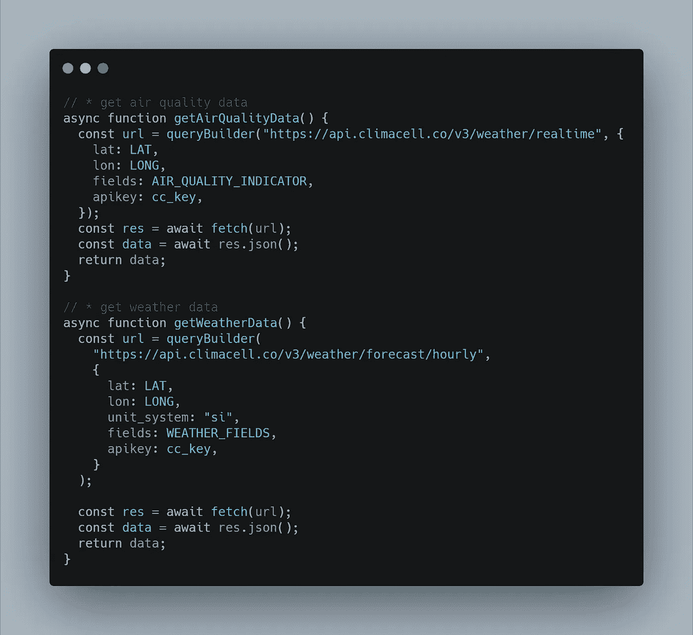

[生](https://carbon.now.sh/?bg=rgba(171%2C%20184%2C%20195%2C%201)&t=seti&wt=none&l=javascript&ds=true&dsyoff=20px&dsblur=68px&wc=true&wa=true&pv=56px&ph=56px&ln=false&fl=1&fm=Hack&fs=14px&lh=133%25&si=false&es=2x&wm=false&code=%252F%252F%2520*%2520get%2520air%2520quality%2520data%250Aasync%2520function%2520getAirQualityData()%2520%257B%250A%2520%2520const%2520url%2520%253D%2520queryBuilder(%2522https%253A%252F%252Fapi.climacell.co%252Fv3%252Fweather%252Frealtime%2522%252C%2520%257B%250A%2520%2520%2520%2520lat%253A%2520LAT%252C%250A%2520%2520%2520%2520lon%253A%2520LONG%252C%250A%2520%2520%2520%2520fields%253A%2520AIR_QUALITY_INDICATOR%252C%250A%2520%2520%2520%2520apikey%253A%2520cc_key%252C%250A%2520%2520%257D)%253B%250A%2520%2520const%2520res%2520%253D%2520await%2520fetch(url)%253B%250A%2520%2520const%2520data%2520%253D%2520await%2520res.json()%253B%250A%2520%2520return%2520data%253B%250A%257D%250A%250A%252F%252F%2520*%2520get%2520weather%2520data%250Aasync%2520function%2520getWeatherData()%2520%257B%250A%2520%2520const%2520url%2520%253D%2520queryBuilder(%250A%2520%2520%2520%2520%2522https%253A%252F%252Fapi.climacell.co%252Fv3%252Fweather%252Fforecast%252Fhourly%2522%252C%250A%2520%2520%2520%2520%257B%250A%2520%2520%2520%2520%2520%2520lat%253A%2520LAT%252C%250A%2520%2520%2520%2520%2520%2520lon%253A%2520LONG%252C%250A%2520%2520%2520%2520%2520%2520unit_system%253A%2520%2522si%2522%252C%250A%2520%2520%2520%2520%2520%2520fields%253A%2520WEATHER_FIELDS%252C%250A%2520%2520%2520%2520%2520%2520apikey%253A%2520cc_key%252C%250A%2520%2520%2520%2520%257D%250A%2520%2520)%253B%250A%250A%2520%2520const%2520res%2520%253D%2520await%2520fetch(url)%253B%250A%2520%2520const%2520data%2520%253D%2520await%2520res.json()%253B%250A%2520%2520return%2520data%253B%250A%257D)

在这一步还有一件事要提，那就是属性`unit_system:"si"` 的值。

si 代表**国际单位制。**

该属性的另一个可能选项是 us 值，它代表**美国习惯单位。**美国习惯单位**可能会让一些读者感到困惑，所以我决定采用**国际单位制**。**

此时，来自 ClimaCell API 的数据如下所示。

函数`getWeatherData()`的输出是一个数组，其中包含下一个 **96 小时的天气预报。**

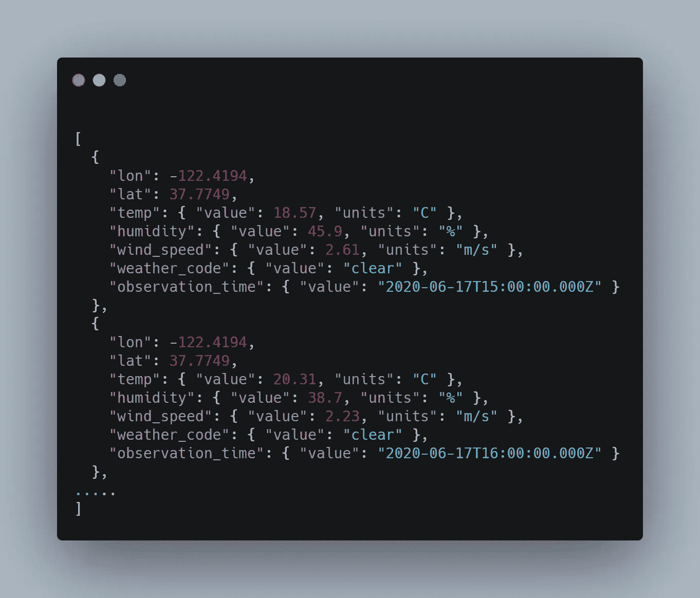

[生](https://carbon.now.sh/?bg=rgba(171%2C%20184%2C%20195%2C%201)&t=seti&wt=none&l=application%2Fjson&ds=true&dsyoff=20px&dsblur=68px&wc=true&wa=true&pv=56px&ph=56px&ln=false&fl=1&fm=Hack&fs=14px&lh=133%25&si=false&es=2x&wm=false&code=%250A%255B%250A%2520%2520%257B%250A%2520%2520%2520%2520%2522lon%2522%253A%2520-122.4194%252C%250A%2520%2520%2520%2520%2522lat%2522%253A%252037.7749%252C%250A%2520%2520%2520%2520%2522temp%2522%253A%2520%257B%2520%2522value%2522%253A%252018.57%252C%2520%2522units%2522%253A%2520%2522C%2522%2520%257D%252C%250A%2520%2520%2520%2520%2522humidity%2522%253A%2520%257B%2520%2522value%2522%253A%252045.9%252C%2520%2522units%2522%253A%2520%2522%2525%2522%2520%257D%252C%250A%2520%2520%2520%2520%2522wind_speed%2522%253A%2520%257B%2520%2522value%2522%253A%25202.61%252C%2520%2522units%2522%253A%2520%2522m%252Fs%2522%2520%257D%252C%250A%2520%2520%2520%2520%2522weather_code%2522%253A%2520%257B%2520%2522value%2522%253A%2520%2522clear%2522%2520%257D%252C%250A%2520%2520%2520%2520%2522observation_time%2522%253A%2520%257B%2520%2522value%2522%253A%2520%25222020-06-17T15%253A00%253A00.000Z%2522%2520%257D%250A%2520%2520%257D%252C%250A%2520%2520%257B%250A%2520%2520%2520%2520%2522lon%2522%253A%2520-122.4194%252C%250A%2520%2520%2520%2520%2522lat%2522%253A%252037.7749%252C%250A%2520%2520%2520%2520%2522temp%2522%253A%2520%257B%2520%2522value%2522%253A%252020.31%252C%2520%2522units%2522%253A%2520%2522C%2522%2520%257D%252C%250A%2520%2520%2520%2520%2522humidity%2522%253A%2520%257B%2520%2522value%2522%253A%252038.7%252C%2520%2522units%2522%253A%2520%2522%2525%2522%2520%257D%252C%250A%2520%2520%2520%2520%2522wind_speed%2522%253A%2520%257B%2520%2522value%2522%253A%25202.23%252C%2520%2522units%2522%253A%2520%2522m%252Fs%2522%2520%257D%252C%250A%2520%2520%2520%2520%2522weather_code%2522%253A%2520%257B%2520%2522value%2522%253A%2520%2522clear%2522%2520%257D%252C%250A%2520%2520%2520%2520%2522observation_time%2522%253A%2520%257B%2520%2522value%2522%253A%2520%25222020-06-17T16%253A00%253A00.000Z%2522%2520%257D%250A%2520%2520%257D%252C%250A.....%250A%255D)

函数`getAirQualityData()`的输出是一个具有以下属性的对象。

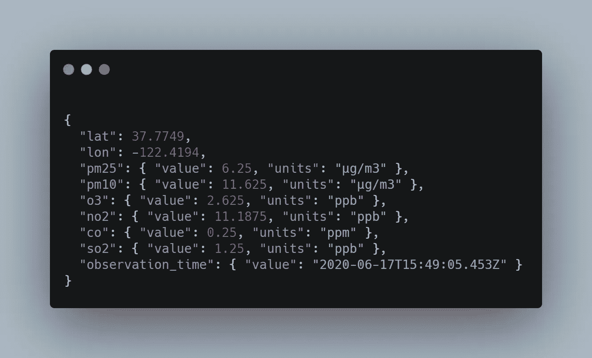

[RAW](https://carbon.now.sh/?bg=rgba(171%2C%20184%2C%20195%2C%201)&t=seti&wt=none&l=application%2Fjson&ds=true&dsyoff=20px&dsblur=68px&wc=true&wa=true&pv=56px&ph=56px&ln=false&fl=1&fm=Hack&fs=14px&lh=133%25&si=false&es=2x&wm=false&code=%250A%257B%250A%2520%2520%2522lat%2522%253A%252037.7749%252C%250A%2520%2520%2522lon%2522%253A%2520-122.4194%252C%250A%2520%2520%2522pm25%2522%253A%2520%257B%2520%2522value%2522%253A%25206.25%252C%2520%2522units%2522%253A%2520%2522%25C2%25B5g%252Fm3%2522%2520%257D%252C%250A%2520%2520%2522pm10%2522%253A%2520%257B%2520%2522value%2522%253A%252011.625%252C%2520%2522units%2522%253A%2520%2522%25C2%25B5g%252Fm3%2522%2520%257D%252C%250A%2520%2520%2522o3%2522%253A%2520%257B%2520%2522value%2522%253A%25202.625%252C%2520%2522units%2522%253A%2520%2522ppb%2522%2520%257D%252C%250A%2520%2520%2522no2%2522%253A%2520%257B%2520%2522value%2522%253A%252011.1875%252C%2520%2522units%2522%253A%2520%2522ppb%2522%2520%257D%252C%250A%2520%2520%2522co%2522%253A%2520%257B%2520%2522value%2522%253A%25200.25%252C%2520%2522units%2522%253A%2520%2522ppm%2522%2520%257D%252C%250A%2520%2520%2522so2%2522%253A%2520%257B%2520%2522value%2522%253A%25201.25%252C%2520%2522units%2522%253A%2520%2522ppb%2522%2520%257D%252C%250A%2520%2520%2522observation_time%2522%253A%2520%257B%2520%2522value%2522%253A%2520%25222020-06-17T15%253A49%253A05.453Z%2522%2520%257D%250A%257D)

我们说过我们将发送两种类型的电子邮件:

*   每天早上一次，显示当前空气质量分数和未来几小时的天气预报(上午 8 点、10 点、12 点、下午 2 点、4 点、6 点、8 点和 10 点)
*   一种是空气质量下降到某个阈值以下

为了不使这篇文章过长，我已经写了这两封邮件的模板。它们都可以在 Github repo 上找到，还有其余的代码。

# 4.格式化天气和空气质量数据以匹配。pug 模板

因为我们使用了一个模板引擎，像`pug`，我们可以利用`for loops`，我们可以插入变量。我们现在需要做的就是格式化我们的数据以匹配写在`weather-forecast-template.pug`和`air-quality-alert.pug`中的`for loops`。

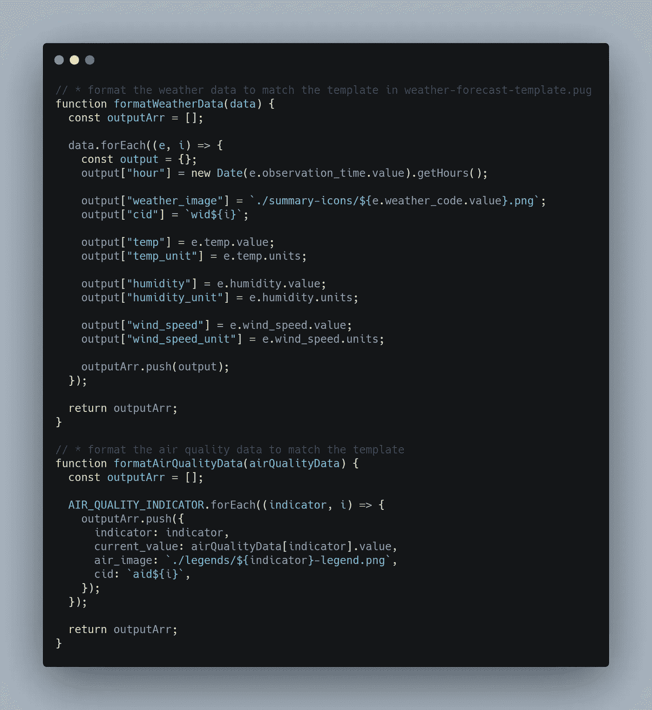

[RAW](https://carbon.now.sh/?bg=rgba(171%2C%20184%2C%20195%2C%201)&t=seti&wt=none&l=javascript&ds=true&dsyoff=20px&dsblur=68px&wc=true&wa=true&pv=56px&ph=56px&ln=false&fl=1&fm=Hack&fs=14px&lh=133%25&si=false&es=2x&wm=false&code=%252F%252F%2520*%2520format%2520the%2520weather%2520data%2520to%2520match%2520the%2520template%2520in%2520weather-forecast-template.pug%250Afunction%2520formatWeatherData(data)%2520%257B%250A%2520%2520const%2520outputArr%2520%253D%2520%255B%255D%253B%250A%250A%2520%2520data.forEach((e%252C%2520i)%2520%253D%253E%2520%257B%250A%2520%2520%2520%2520const%2520output%2520%253D%2520%257B%257D%253B%250A%2520%2520%2520%2520output%255B%2522hour%2522%255D%2520%253D%2520new%2520Date(e.observation_time.value).getHours()%253B%250A%250A%2520%2520%2520%2520output%255B%2522weather_image%2522%255D%2520%253D%2520%2560.%252Fsummary-icons%252F%2524%257Be.weather_code.value%257D.png%2560%253B%250A%2520%2520%2520%2520output%255B%2522cid%2522%255D%2520%253D%2520%2560wid%2524%257Bi%257D%2560%253B%250A%250A%2520%2520%2520%2520output%255B%2522temp%2522%255D%2520%253D%2520e.temp.value%253B%250A%2520%2520%2520%2520output%255B%2522temp_unit%2522%255D%2520%253D%2520e.temp.units%253B%250A%250A%2520%2520%2520%2520output%255B%2522humidity%2522%255D%2520%253D%2520e.humidity.value%253B%250A%2520%2520%2520%2520output%255B%2522humidity_unit%2522%255D%2520%253D%2520e.humidity.units%253B%250A%250A%2520%2520%2520%2520output%255B%2522wind_speed%2522%255D%2520%253D%2520e.wind_speed.value%253B%250A%2520%2520%2520%2520output%255B%2522wind_speed_unit%2522%255D%2520%253D%2520e.wind_speed.units%253B%250A%250A%2520%2520%2520%2520outputArr.push(output)%253B%250A%2520%2520%257D)%253B%250A%250A%2520%2520return%2520outputArr%253B%250A%257D%250A%250A%252F%252F%2520*%2520format%2520the%2520air%2520quality%2520data%2520to%2520match%2520the%2520template%250Afunction%2520formatAirQualityData(airQualityData)%2520%257B%250A%2520%2520const%2520outputArr%2520%253D%2520%255B%255D%253B%250A%250A%2520%2520AIR_QUALITY_INDICATOR.forEach((indicator%252C%2520i)%2520%253D%253E%2520%257B%250A%2520%2520%2520%2520outputArr.push(%257B%250A%2520%2520%2520%2520%2520%2520indicator%253A%2520indicator%252C%250A%2520%2520%2520%2520%2520%2520current_value%253A%2520airQualityData%255Bindicator%255D.value%252C%250A%2520%2520%2520%2520%2520%2520air_image%253A%2520%2560.%252Flegends%252F%2524%257Bindicator%257D-legend.png%2560%252C%250A%2520%2520%2520%2520%2520%2520cid%253A%2520%2560aid%2524%257Bi%257D%2560%252C%250A%2520%2520%2520%2520%257D)%253B%250A%2520%2520%257D)%253B%250A%250A%2520%2520return%2520outputArr%253B%250A%257D)

ClimaCell 的另一个很酷的特性是，它可以在一个名为 weather_code 的属性中返回当前天气的 [*状态*](https://developer.climacell.co/v3/reference) ，同时它还为这些天气代码提供一些公共图像。

在同一个 Github repo 中，有一个名为`summary-icons`的文件夹，其中包含所有可能值的相关`.png`文件。

要在我们的电子邮件中嵌入图像，我们需要将它们作为附件发送，并给它们一个唯一的 id，`cid`，我们将用它来绑定到一个`img`标签。

例如:

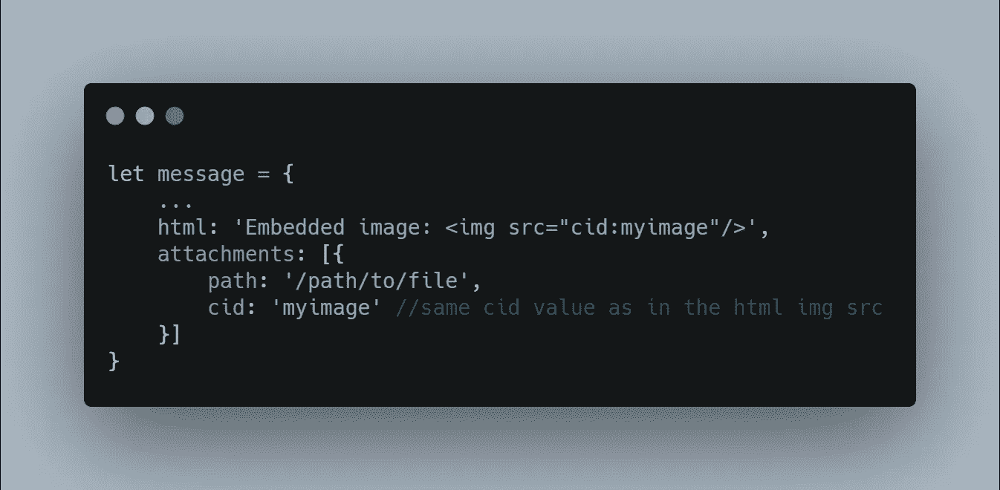

[未加工的](https://carbon.now.sh/?bg=rgba(171%2C%20184%2C%20195%2C%201)&t=seti&wt=none&l=javascript&ds=true&dsyoff=20px&dsblur=68px&wc=true&wa=true&pv=56px&ph=56px&ln=false&fl=1&fm=Hack&fs=14px&lh=133%25&si=false&es=2x&wm=false&code=let%2520message%2520%253D%2520%257B%250A%2520%2520%2520%2520...%250A%2520%2520%2520%2520html%253A%2520%27Embedded%2520image%253A%2520%253Cimg%2520src%253D%2522cid%253Amyimage%2522%252F%253E%27%252C%250A%2520%2520%2520%2520attachments%253A%2520%255B%257B%250A%2520%2520%2520%2520%2520%2520%2520%2520path%253A%2520%27%252Fpath%252Fto%252Ffile%27%252C%250A%2520%2520%2520%2520%2520%2520%2520%2520cid%253A%2520%27myimage%27%2520%252F%252Fsame%2520cid%2520value%2520as%2520in%2520the%2520html%2520img%2520src%250A%2520%2520%2520%2520%257D%255D%250A%257D)

这就是为什么我们使用属性`weather_image`、`air_image`和`cid`。

对于空气质量，我们将使用 ClimaCell 提供的`legends`来显示每个测量指标值的重要性。这些图例可以在同名文件夹中找到。

# 5.发送电子邮件

此时，我们已经可以发送一些电子邮件来查看它们的外观。

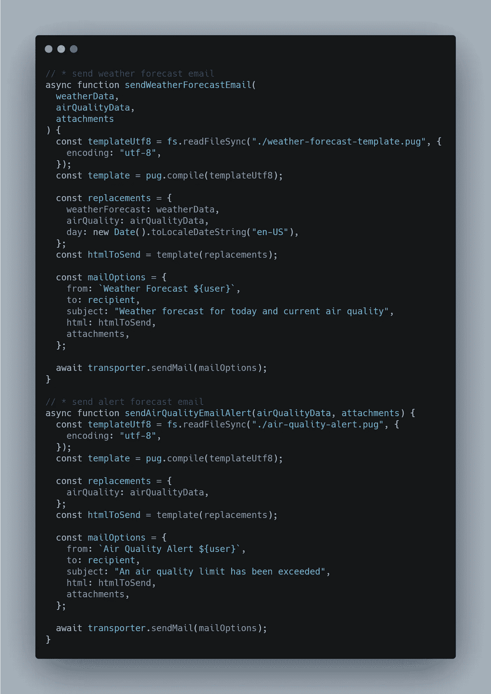

[RAW](https://carbon.now.sh/?bg=rgba(171%2C%20184%2C%20195%2C%201)&t=seti&wt=none&l=javascript&ds=true&dsyoff=20px&dsblur=68px&wc=true&wa=true&pv=56px&ph=56px&ln=false&fl=1&fm=Hack&fs=14px&lh=133%25&si=false&es=2x&wm=false&code=%252F%252F%2520*%2520send%2520weather%2520forecast%2520email%250Aasync%2520function%2520sendWeatherForecastEmail(%250A%2520%2520weatherData%252C%250A%2520%2520airQualityData%252C%250A%2520%2520attachments%250A)%2520%257B%250A%2520%2520const%2520templateUtf8%2520%253D%2520fs.readFileSync(%2522.%252Fweather-forecast-template.pug%2522%252C%2520%257B%250A%2520%2520%2520%2520encoding%253A%2520%2522utf-8%2522%252C%250A%2520%2520%257D)%253B%250A%2520%2520const%2520template%2520%253D%2520pug.compile(templateUtf8)%253B%250A%250A%2520%2520const%2520replacements%2520%253D%2520%257B%250A%2520%2520%2520%2520weatherForecast%253A%2520weatherData%252C%250A%2520%2520%2520%2520airQuality%253A%2520airQualityData%252C%250A%2520%2520%2520%2520day%253A%2520new%2520Date().toLocaleDateString(%2522en-US%2522)%252C%250A%2520%2520%257D%253B%250A%2520%2520const%2520htmlToSend%2520%253D%2520template(replacements)%253B%250A%250A%2520%2520const%2520mailOptions%2520%253D%2520%257B%250A%2520%2520%2520%2520from%253A%2520%2560Weather%2520Forecast%2520%2524%257Buser%257D%2560%252C%250A%2520%2520%2520%2520to%253A%2520recipient%252C%250A%2520%2520%2520%2520subject%253A%2520%2522Weather%2520forecast%2520for%2520today%2520and%2520current%2520air%2520quality%2522%252C%250A%2520%2520%2520%2520html%253A%2520htmlToSend%252C%250A%2520%2520%2520%2520attachments%252C%250A%2520%2520%257D%253B%250A%250A%2520%2520await%2520transporter.sendMail(mailOptions)%253B%250A%257D%250A%250A%252F%252F%2520*%2520send%2520alert%2520forecast%2520email%250Aasync%2520function%2520sendAirQualityEmailAlert(airQualityData%252C%2520attachments)%2520%257B%250A%2520%2520const%2520templateUtf8%2520%253D%2520fs.readFileSync(%2522.%252Fair-quality-alert.pug%2522%252C%2520%257B%250A%2520%2520%2520%2520encoding%253A%2520%2522utf-8%2522%252C%250A%2520%2520%257D)%253B%250A%2520%2520const%2520template%2520%253D%2520pug.compile(templateUtf8)%253B%250A%250A%2520%2520const%2520replacements%2520%253D%2520%257B%250A%2520%2520%2520%2520airQuality%253A%2520airQualityData%252C%250A%2520%2520%257D%253B%250A%2520%2520const%2520htmlToSend%2520%253D%2520template(replacements)%253B%250A%250A%2520%2520const%2520mailOptions%2520%253D%2520%257B%250A%2520%2520%2520%2520from%253A%2520%2560Air%2520Quality%2520Alert%2520%2524%257Buser%257D%2560%252C%250A%2520%2520%2520%2520to%253A%2520recipient%252C%250A%2520%2520%2520%2520subject%253A%2520%2522An%2520air%2520quality%2520limit%2520has%2520been%2520exceeded%2522%252C%250A%2520%2520%2520%2520html%253A%2520htmlToSend%252C%250A%2520%2520%2520%2520attachments%252C%250A%2520%2520%257D%253B%250A%250A%2520%2520await%2520transporter.sendMail(mailOptions)%253B%250A%257D)

我们来分解一下。工作流程很简单:

*将模板作为简单的字符串读取→使用相应的模板引擎编译这些模板的内容。pug →在这个模板中插入所需的变量→输出将是一个 HTML 代码，我们可以使用 nodemailer 发送它→发送电子邮件*

*   `recipent`和`user`变量来自`config.json`

# 6.创造天气预报和空气质量工作

从这一点来说，我们已经有了所有必要的部分，我们所要做的就是把它们放在一起。在这个函数中，我们将为第一封邮件的完整逻辑编写代码，这封邮件带有天气预报和当前时刻的空气质量(发送邮件的那封)。

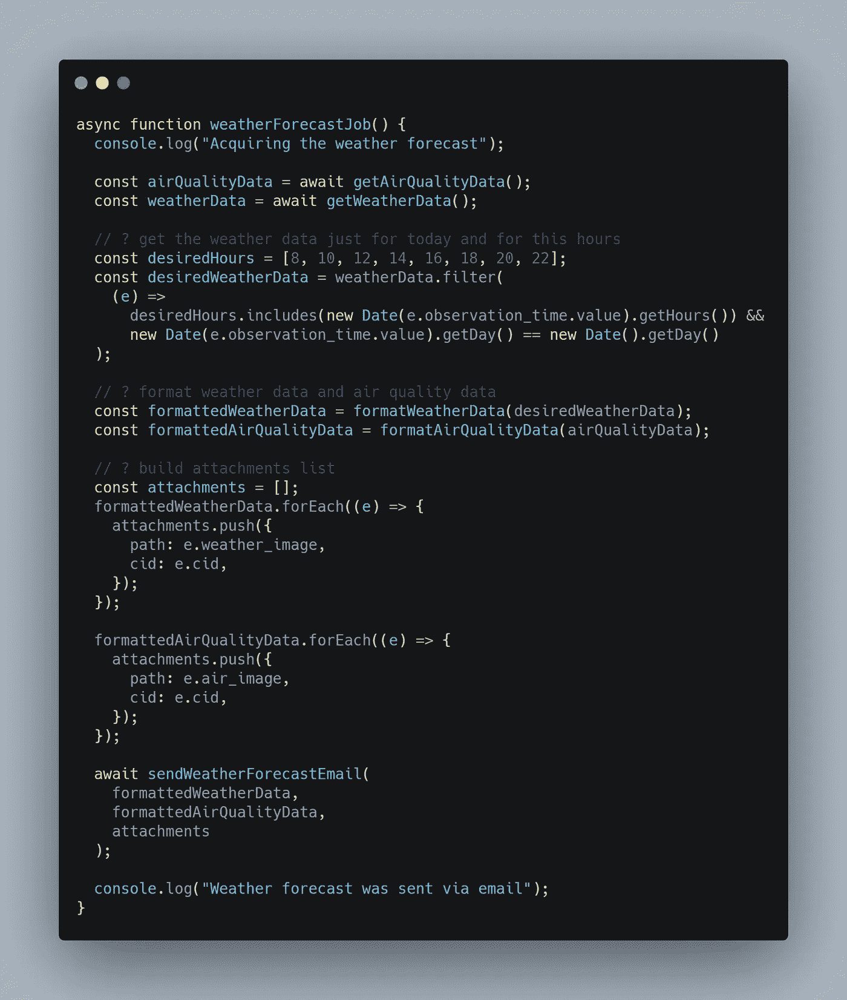

[生](https://carbon.now.sh/)

在这个函数中，我们只是简单地调用我们之前定义的函数，然后做一些简单的构造，就像这样。

天气预报是未来 **96 小时，**的天气预报，但我们只想查看今天的天气数据，而且只查看一些预定义小时的天气数据。为了实现这一点，我们可以简单地从我们收到的所有天气数据中删除不是当天的数据，也不是预定义小时的数据。

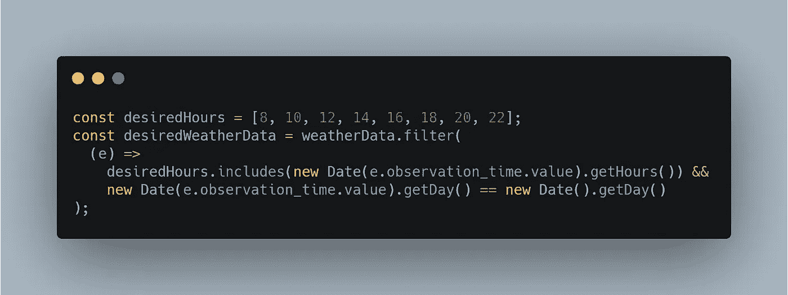

[原始](https://carbon.now.sh/?bg=rgba(171%2C%20184%2C%20195%2C%201)&t=seti&wt=none&l=javascript&ds=true&dsyoff=20px&dsblur=68px&wc=true&wa=true&pv=56px&ph=56px&ln=false&fl=1&fm=Hack&fs=14px&lh=133%25&si=false&es=2x&wm=false&code=const%2520desiredHours%2520%253D%2520%255B8%252C%252010%252C%252012%252C%252014%252C%252016%252C%252018%252C%252020%252C%252022%255D%253B%250Aconst%2520desiredWeatherData%2520%253D%2520weatherData.filter(%250A%2520%2520(e)%2520%253D%253E%250A%2520%2520%2520%2520desiredHours.includes(new%2520Date(e.observation_time.value).getHours())%2520%2526%2526%250A%2520%2520%2520%2520new%2520Date(e.observation_time.value).getDay()%2520%253D%253D%2520new%2520Date().getDay()%250A)%253B)

14、16、18、20、22 小时代表下午 2 点、4 点、6 点、8 点和 10 点。

如果您还记得，早些时候我们格式化了天气和空气质量数据以匹配模板，但是我们为它们中的每一个写了一个额外的属性，`weather_image`和`air_image`。

我们现在将使用这些属性来创建附件数组。在这个数组中，我们将放置图像路径及其 id。

对于空气质量工作，逻辑是相同的。

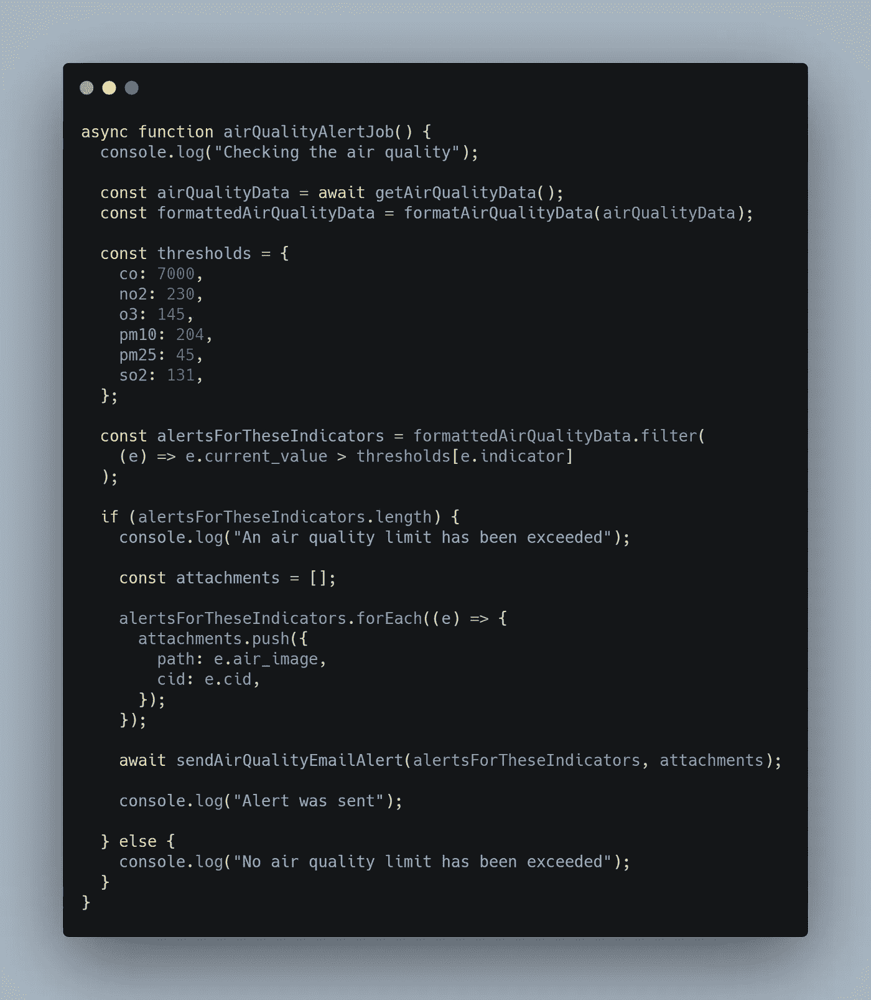

[未加工的](https://carbon.now.sh/)

此功能`airQualityJob()`的目的是检查空气质量是否下降到某个阈值以下，并发送电子邮件警报。

这封电子邮件看起来与第一封相似，只是我们只在其中包含了高于预定义阈值的指标。

# 7.总结和主要逻辑

最后一步是编写我们脚本的主函数，它将调用函数`weatherForecastJob()`和`airQualityJob()`。

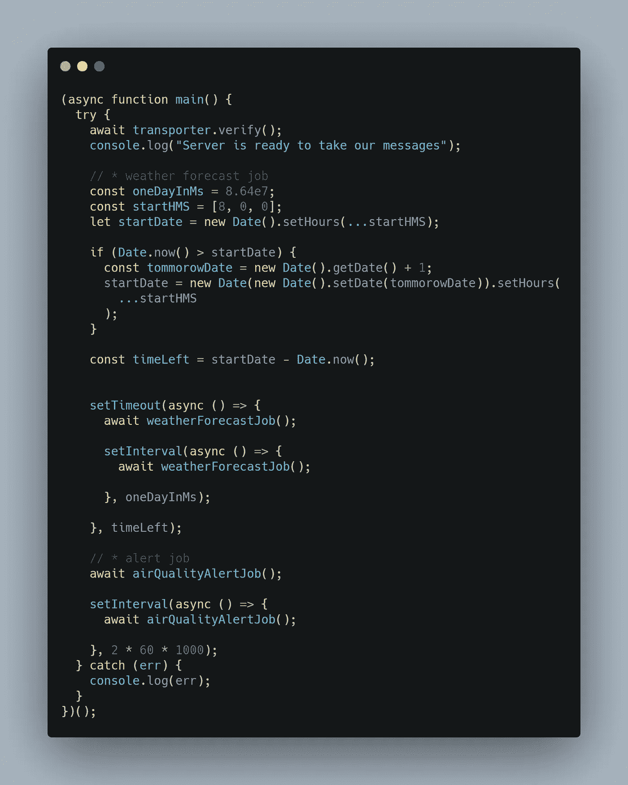

[生](https://carbon.now.sh/?bg=rgba(171%2C%20184%2C%20195%2C%201)&t=seti&wt=none&l=javascript&ds=true&dsyoff=20px&dsblur=68px&wc=true&wa=true&pv=56px&ph=56px&ln=false&fl=1&fm=Hack&fs=14px&lh=133%25&si=false&es=2x&wm=false&code=(async%2520function%2520main()%2520%257B%250A%2520%2520try%2520%257B%250A%2520%2520%2520%2520await%2520transporter.verify()%253B%250A%2520%2520%2520%2520console.log(%2522Server%2520is%2520ready%2520to%2520take%2520our%2520messages%2522)%253B%250A%250A%2520%2520%2520%2520%252F%252F%2520*%2520weather%2520forecast%2520job%250A%2520%2520%2520%2520const%2520oneDayInMs%2520%253D%25208.64e7%253B%250A%2520%2520%2520%2520const%2520startHMS%2520%253D%2520%255B8%252C%25200%252C%25200%255D%253B%250A%2520%2520%2520%2520let%2520startDate%2520%253D%2520new%2520Date().setHours(...startHMS)%253B%250A%250A%2520%2520%2520%2520if%2520(Date.now()%2520%253E%2520startDate)%2520%257B%250A%2520%2520%2520%2520%2520%2520const%2520tommorowDate%2520%253D%2520new%2520Date().getDate()%2520%252B%25201%253B%250A%2520%2520%2520%2520%2520%2520startDate%2520%253D%2520new%2520Date(new%2520Date().setDate(tommorowDate)).setHours(%250A%2520%2520%2520%2520%2520%2520%2520%2520...startHMS%250A%2520%2520%2520%2520%2520%2520)%253B%250A%2520%2520%2520%2520%257D%250A%250A%2520%2520%2520%2520const%2520timeLeft%2520%253D%2520startDate%2520-%2520Date.now()%253B%250A%2520%2520%2520%250A%250A%2520%2520%2520%2520setTimeout(async%2520()%2520%253D%253E%2520%257B%250A%2520%2520%2520%2520%2520%2520await%2520weatherForecastJob()%253B%250A%250A%2520%2520%2520%2520%2520%2520setInterval(async%2520()%2520%253D%253E%2520%257B%250A%2520%2520%2520%2520%2520%2520%2520%2520await%2520weatherForecastJob()%253B%250A%2520%2520%2520%2520%2520%2520%250A%2520%2520%2520%2520%2520%2520%257D%252C%2520oneDayInMs)%253B%250A%2520%2520%2520%2520%2520%2520%250A%2520%2520%2520%2520%257D%252C%2520timeLeft)%253B%250A%250A%2520%2520%2520%2520%252F%252F%2520*%2520alert%2520job%250A%2520%2520%2520%2520await%2520airQualityAlertJob()%253B%250A%2520%2520%2520%2520%250A%2520%2520%2520%2520setInterval(async%2520()%2520%253D%253E%2520%257B%250A%2520%2520%2520%2520%2520%2520await%2520airQualityAlertJob()%253B%250A%2520%2520%2520%2520%2520%2520%250A%2520%2520%2520%2520%257D%252C%25202%2520*%252060%2520*%25201000)%253B%250A%2520%2520%257D%2520catch%2520(err)%2520%257B%250A%2520%2520%2520%2520console.log(err)%253B%250A%2520%2520%257D%250A%257D)()%253B)

这个函数可能很复杂，所以让我们一步一步来。

1.  首先，我们检查与电子邮件服务器的连接

`await transporter.verify();`

2.我们定义了 3 个变量:

```
const oneDayInMs = 8.64e7;
const startHMS = [8, 0, 0];
let startDate = new Date().setHours(...startHMS);
```

*   `oneDayInMs` —天气预报每天只发送一次，因此该变量用于计算我们必须等待多少毫秒才能发送下一封电子邮件；
*   `startHMS` —我们要发送天气预报的时分秒对
*   `startDate` —以毫秒为单位的值，表示当天上午 08:00:00 时的值

当我们第一次启动我们的应用程序时，一个棘手的部分发生了。让我解释一下。

例如，我们有两种情况。

如果我们在晚上 9:00 开始应用程序，那么我们错过了早上 8:00 的第一个目标，一天就要结束了，所以我们不想在这个时候发送天气预报。这就是为什么我们需要计算我们必须等待多长时间，以毫秒为单位，直到第二天早上 8:00，这样我们才能发送天气预报。

因此，所需的值将是明天上午 08:00 点的**减去我们开始应用程序的当前时间 T10。**

另一种情况是，如果我们在`startDate`之前启动应用程序，例如在早上 7:50。我们会比目标早 10 分钟到达。因此，期望值将是`startDate`减去**我们启动应用程序**的当前时间。

要在一个简单的 if 语句中组合这些场景，我们可以编写以下代码:

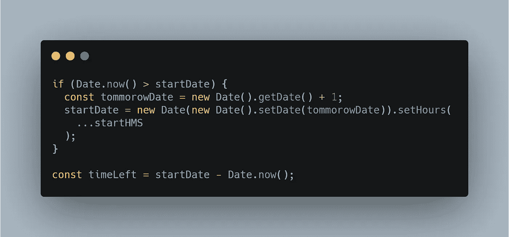

[未加工的](https://carbon.now.sh/?bg=rgba(171%2C%20184%2C%20195%2C%201)&t=seti&wt=none&l=javascript&ds=true&dsyoff=20px&dsblur=68px&wc=true&wa=true&pv=56px&ph=56px&ln=false&fl=1&fm=Hack&fs=14px&lh=133%25&si=false&es=2x&wm=false&code=if%2520(Date.now()%2520%253E%2520startDate)%2520%257B%250A%2520%2520const%2520tommorowDate%2520%253D%2520new%2520Date().getDate()%2520%252B%25201%253B%250A%2520%2520startDate%2520%253D%2520new%2520Date(new%2520Date().setDate(tommorowDate)).setHours(%250A%2520%2520%2520%2520...startHMS%250A%2520%2520)%253B%250A%257D%250A%250Aconst%2520timeLeft%2520%253D%2520startDate%2520-%2520Date.now()%253B)

而`timeLeft`代表程序为了发送天气预报而必须等待的绝对值

在这段时间过后，我们可以发送我们的第一个天气预报，然后我们可以创建一个每天在同一时间运行的计时器。

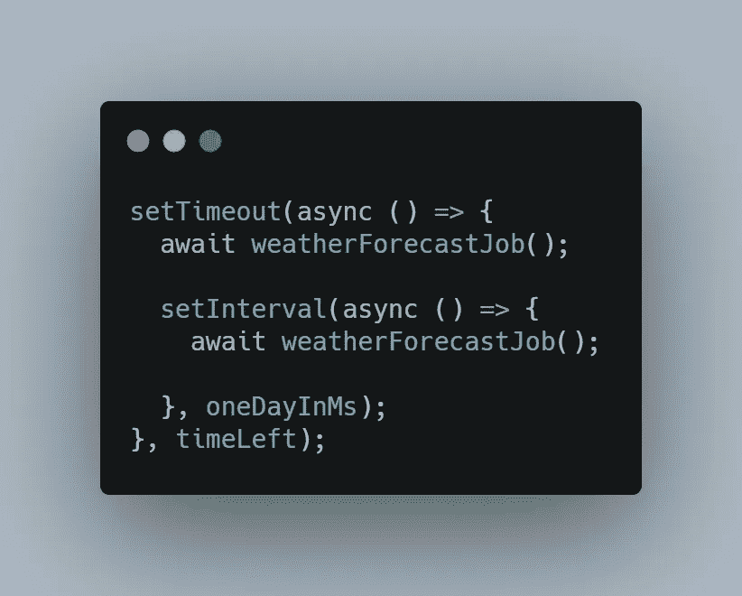

[生](https://carbon.now.sh/?bg=rgba(171%2C%20184%2C%20195%2C%201)&t=seti&wt=none&l=javascript&ds=true&dsyoff=20px&dsblur=68px&wc=true&wa=true&pv=56px&ph=56px&ln=false&fl=1&fm=Hack&fs=14px&lh=133%25&si=false&es=2x&wm=false&code=setTimeout(async%2520()%2520%253D%253E%2520%257B%250A%2520%2520await%2520weatherForecastJob()%253B%250A%250A%2520%2520setInterval(async%2520()%2520%253D%253E%2520%257B%250A%2520%2520%2520%2520await%2520weatherForecastJob()%253B%250A%2520%2520%2520%2520%250A%2520%2520%257D%252C%2520oneDayInMs)%253B%250A%257D%252C%2520timeLeft)%253B)

对于`airQualityAlertJob()`，我们可以在应用启动时运行一次，每两分钟检查一次空气质量。


[生](https://carbon.now.sh/?bg=rgba(171%2C%20184%2C%20195%2C%201)&t=seti&wt=none&l=javascript&ds=true&dsyoff=20px&dsblur=68px&wc=true&wa=true&pv=56px&ph=56px&ln=false&fl=1&fm=Hack&fs=14px&lh=133%25&si=false&es=2x&wm=false&code=await%2520airQualityAlertJob()%253B%250A%250AsetInterval(async%2520()%2520%253D%253E%2520%257B%250A%2520%2520%2520%2520%2520%2520await%2520airQualityAlertJob()%253B%250A%250A%257D%252C%25202%2520*%252060%2520*%25201000)%253B)

ClimaCell 的免费计划每小时有 100 个请求的限制，但我认为每两分钟检查一次空气质量的下降对我们来说是好的。有了这个计划，如果你愿意，你仍然可以把这个时间减少一半到一分钟。

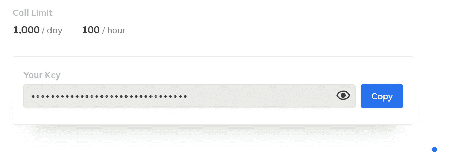

# 结论

您可以扩展这个示例并收集更多数据。根据你的需要，你可以检查花粉值。

如果您想要托管您的应用程序，那么您可以使用一些外部 SasS 或 PasS，它们附带一个免费计划，并且易于设置。一些例子包括 [Heroku](https://www.heroku.com/) 、 [GitHub 页面](https://pages.github.com/)和 [Netlify](https://www.netlify.com/) 。

