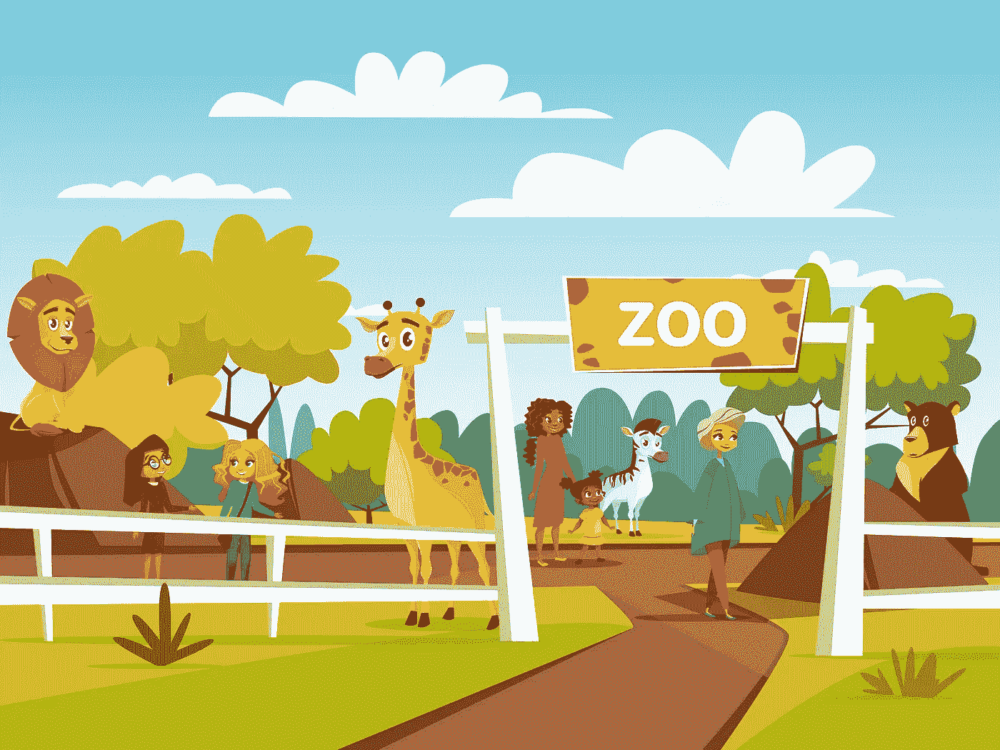
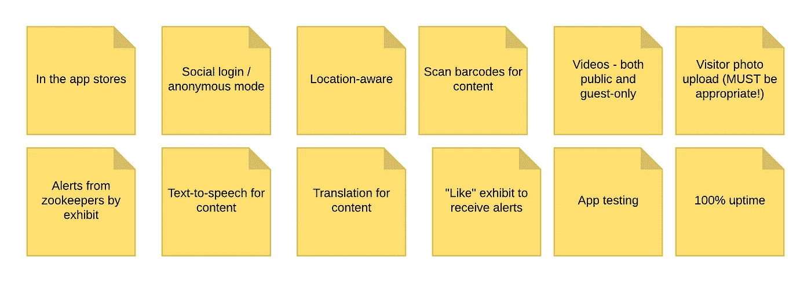
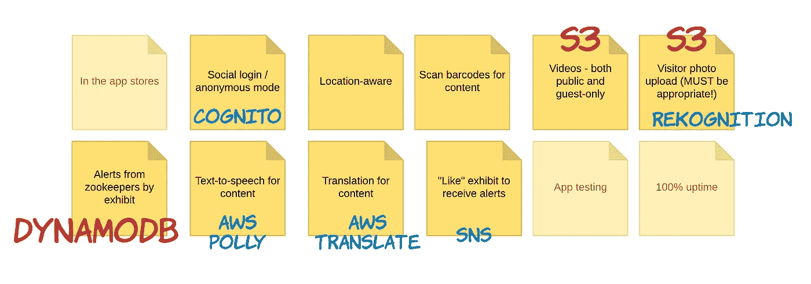
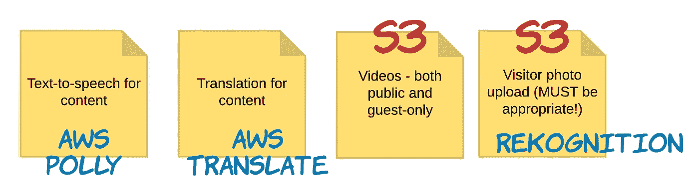
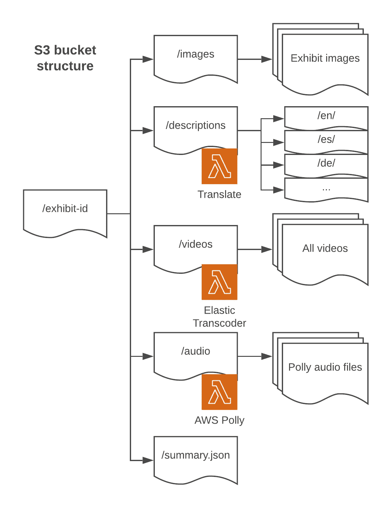
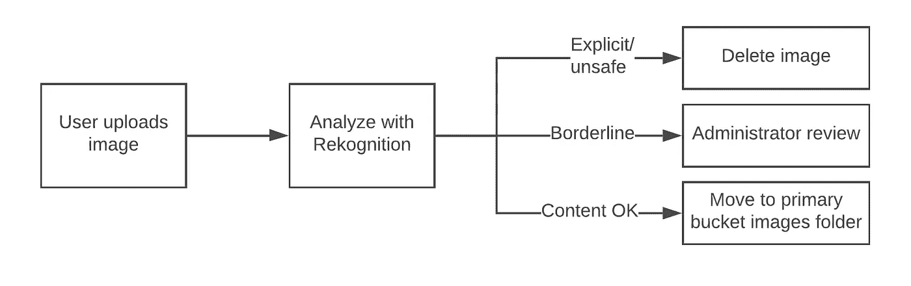
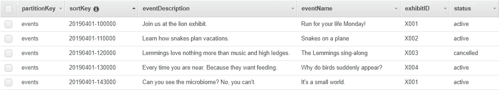
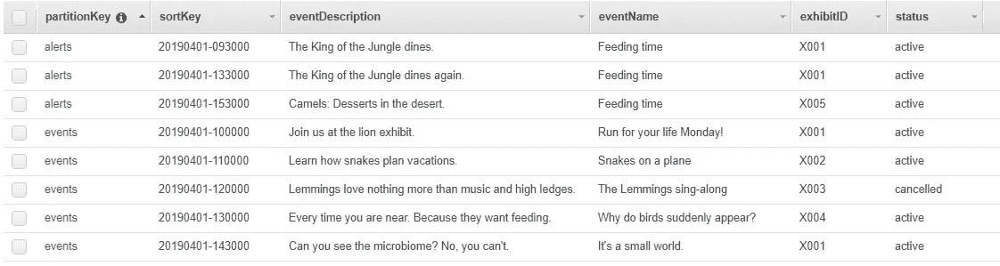
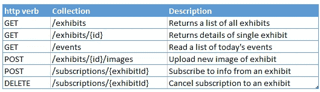
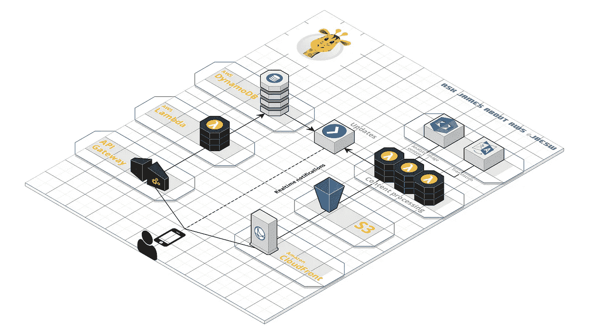

# 我可以不用服务器，你也可以！

> 原文：<https://itnext.io/i-can-serverless-and-you-can-too-f68a8f227461?source=collection_archive---------2----------------------->

了解如何使用无服务器方法为动物园构建复杂的移动应用程序。

图文鸣谢:[https://www . freepik . com/free-vector/zoo-petting-zoo-cartoon-design-open-zoo-wild-animals-visitors _ 2238486 . htm](https://www.freepik.com/free-vector/zoo-petting-zoo-cartoon-design-open-zoo-wild-animals-visitors_2238486.htm)。

走向无服务器的最大障碍之一是克服使用别人的服务来创建你的架构的心理障碍。如果你来自传统的软件开发，并能进行一些实践，这并不总是自然的。但是不要担心——*如果我可以不用服务器，你也可以*——我会告诉你怎么做。

AWS 拥有几乎所有的服务，所以让我们看看如何在构建复杂的移动应用程序时很好地利用这些服务。**前面没有代码**——这纯粹是为那些对无服务器设计感到紧张的人做的架构练习！

不要担心——有无数种方法可以构建相同的应用程序，所以如果你有其他想法，请在评论中告诉我。

## 欢迎来到动物园

我们的客户有一个动物园。它每天有 25，000 名游客，在特殊活动和假日期间多达 50，000 人。该动物园有 100 个独立的展览。

他们需要为访问者创建一个移动应用程序，以提高参与度和重复访问。他们预计大约 50%的游客会使用该应用程序，因为他们将为应用程序用户推广打折机票。

我会见了动物园的主人，这是他们告诉我的:

*   它应该可以从标准应用商店下载。
*   提供匿名和登录模式，支持常见的社会登录，也许自定义电子邮件/密码认证。
*   游客可以利用他们在围栏中的位置来了解动物，并扫描隐藏在周围的条形码来了解动物园中任何一个非人类的客人。
*   所有用户都可以观看与展品相关的视频，但登录用户可以获得独家内容。
*   游客可以上传照片，但我们必须确保内容适当——记住，周围有孩子。
*   当游客在动物园时，他们会收到警报，由动物园管理员推送喂食时间和“遇见动物”讲座。
*   他们希望残障游客能够访问位于设施周围的任何标牌的文本到语音转换。
*   为海外游客翻译将是伟大的(涵盖尽可能多的语言，因为世界上每个人都来这里)。
*   参观者可以“喜欢”一个展览，并在重大事件发生时收到提醒。
*   这需要经过彻底测试并“正常工作”,因为他们可用的 IT 支持有限，并且无法管理每天 25，000 名客人的应用程序问题。当然，他们希望 100%正常运行。

看起来我们的工作已经完成了，所以让我们集思广益，看看无服务器是如何完成这项工作的。我把所有的主要物品都贴在便利贴上，这样我们就可以跟踪了:

## 为什么不用‘老办法’做 app 呢？

如果我们没有无服务器，这将会非常复杂。这个客户没有太多的 IT 帮助，所以这将是一个持续维护的困难项目。我们需要计算出每天需要多少台服务器来支持潜在的 25000 到 50000 用户。我们将需要 iPhone 和 Android 开发团队的测试策略来处理所有最流行的设备。

我们还需要 OAuth 设置与主要的社会提供者和某处的用户数据库，以及所有的密码管理和重置过程。然后是视频托管，但我们不能使用 YouTube，因为有些内容是封闭的。为了构建所有这些，我们必须考虑需要多少开发人员以及这种基础设施的维护开销。

无服务器方法的目标是真正最小化最后两段中的大部分内容。从实践的角度来看，大量的开发预算和人员可能会消失在硬件的组装、授权管理、数据库和移动部署中。

正如[本·凯霍](https://twitter.com/ben11kehoe)所称的，“无服务器思维”的一部分是重新部署所有的资源来构建你的客户可以看到、触摸到和关心的有价值的功能。这是*关于顾客的一切*——我们动物园的游客不太关心我们的基础设施，而更关心长颈鹿什么时候被喂食。

长颈鹿矮子就靠你了！信用:[https://www . free pik . com/free-vector/giraffe-portrait-cartoon-style _ 1195871 . htm](https://www.freepik.com/free-vector/giraffe-portrait-cartoon-style_1195871.htm)

## 广泛的要求

很少有要求不是专门针对无服务器的，但是本着使用托管服务和节约资源的精神，我们应该提前解决这些要求:

我们可以使用像 React 或 Vue 这样的单页应用程序框架将它构建成一个 web 应用程序。但是动物园的主人真的想要一个应用程序，听起来他们会在未来的某个时候发送特别优惠的推送通知(听起来像是一个额外的要求？).

前端工作超出了本练习的范围，但我们应该关注[跨平台移动开发](https://hackernoon.com/getting-started-with-cross-platform-app-development-in-2019-dd2bf7f6161b)以避免为 iOS 和 Android 构建相同的应用程序两次。[反应原生](https://facebook.github.io/react-native/)可能是不错的选择，[颤动](https://flutter.io/)也可以。无论哪种方式，我们都希望前端易于管理和构建。

测试移动应用是很棘手的，而且由于 Android 版本和设备的激增，测试可能会很麻烦。所有者对此并没有说太多，但在最少的 IT 帮助下，自动化这一过程显然会有所帮助。 [AWS Device Farm](https://aws.amazon.com/device-farm/) 使用大量实际设备为这个问题提供了一个自动化解决方案。

这也是找到可能不符合客户预算的服务或需求的好时机。例如，100%的正常运行时间要求对建筑师来说是昂贵的，但如果动物园准备接受 99.99%的正常运行时间(每年不到 1 小时)，这将显著改变我们需要建造的东西，并使成本产生巨大差异。在我们开始构建之前，权衡是非常重要的。

## 我们需要什么服务？

弄清楚这一点的第一步是查看您可能需要的服务，您可以从需求中推断出一些服务。我草草记下了我的即时想法(红色代表与数据相关的项目，蓝色代表其他所有内容):

对于数据相关项目:

*   视频托管只需要 **S3** 进行存储，我们可以通过 **CloudFront** 交付内容。在这种情况下，CloudFront 也可以帮助我们使用签名的 URL 或 cookies 来限制登录用户的一些内容。
*   上传的照片也可以保存在 **S3** 中。一些图像识别将大大有助于我们检测适当的图像——也许是重新识别？
*   将会有来自动物园管理员的每日事件和警报列表——我想我们可以在 **DynamoDB** 中管理这个时间表。我稍后将介绍这些警报。
*   所描述的认证相当普通，可以由 **Cognito** 处理。这也支持对匿名用户的跟踪，因此如果用户后来转换为登录用户，我们可以记住设置和首选项。

对于其他一切:

*   对于文本到语音转换，我们将使用亚马逊 Polly 创建音频，然后存储在 S3 进行播放。
*   语言翻译可以用**亚马逊翻译**实现，目前支持从英语开始的 21 种语言。
*   对于展品提醒，我们可以使用 **SNS** 让参观者订阅展品。

这个阶段是一个粗略的草图，但是它让我们知道我们将连接哪些服务。这些工具中的每一个都是完全托管的服务，所以我们只需要知道它们如何工作以及如何连接它们。

## 处理文本、图像和视频

对于像图像和视频这样的二进制数据，S3 总是显而易见的选择。事实上，通过集成一些在新对象到达时运行的 Lambda 函数，我们可以让 S3 成为这一功能背后的主力。

动物园应用程序可以有一个 S3 桶，每个展览都有文件夹，结构如下:

每个子文件夹代表系统中的内容类型:

*   当动物园管理员保存展品**描述**时，会触发一个 Lambda 函数，该函数调用 AWS Translate 将文本转换为其他语言，并将结果存储在特定语言的文件夹中(' es '，' de '，' it '等)。).这解决了翻译问题，因为每次更新内容时只需要翻译一次(而不是在最终用户切换语言时)。
*   描述的改变也可以触发 Lambda 将文件发送给 Polly——我们可以将生成的语音保存在**音频**文件夹中，并在用户请求时播放。对于多种语言，可以这样做。
*   当**视频**被保存时，该事件触发一个 Lambda，该 Lambda 使用弹性转码器或 [Elemental MediaConvert](https://aws.amazon.com/mediaconvert/) 服务来重新处理不同大小的视频，并准备点播观看。这将有助于降低性能和带宽成本。每个上传的视频只需要发生一次。

最后，对于用户生成的照片，我们将使用一个单独的 bucket 来触发一个 Lambda 来分析 Rekognition 中的照片。我们可以使用这个服务中的[审核标签](https://docs.aws.amazon.com/rekognition/latest/dg/moderation.html)来查找不安全的内容，并且我们可以检测照片是否是动物。我们可以检查来自 Rekognition 的响应，并决定下一步要做什么—如果它是不确定的或可疑的，我们将在添加到主存储桶的 *images* 文件夹之前标记该图像以供版主使用:

## 动物园时间表

对于全天即将发生的事件，让我们使用 DynamoDB 表来存储关于喂食、讲座和其他动物园事件的信息。游客在动物园时只关心当天的事件:

前端应用程序将使用一天中所有事件的时间范围来查询该表。动物园管理员将使用单独的管理工具来设置活动。当事件即将发生时，前端会提醒用户，可能会过滤用户喜欢的展品(使用 exhibitID 属性)。

对于这种数据，DynamoDB 是一个非常快速且可伸缩的存储选项。该时间表同样可以作为平面文件存储在 S3——您可以尝试找到每种方法的优缺点。

## 通知

这个应用程序中有许多通知来源——即将到来的事件、特别警报和“喜欢”的展览上发生的事情——都存储在一个 DynamoDB 表中。当应用程序在启动时检索初始状态时，它必须监听数据的变化(以防事件被取消或日程发生变化)。

有一种简单的方法来处理通知需求。我们可以为整个动物园的每个展览设置一个 SNS 主题。如果访问者“喜欢”一个展览，有效地订阅那里发生的事件，我们只需要为用户订阅那个 SNS 主题。

这种订阅可能只在参观当天有效，因此可以在动物园关闭后重新设置。SNS 可以处理每个主题多达 1000 万次的订阅，所以我们没有超出限制。这种方法避免了管理大量喜欢的展品(每天 25，000 个用户和 100 个展品之间)。

我们怎样才能做到实时呢？DynamoDB 可以发布对流的更改，流可以触发 Lambda 并发布到 SNS 主题。然后，这可以发布到 AWS IoT，以将警报推送到前端。或者，如果我们使用 AppSync 或 Amplify，我们可以利用这些服务探索推送通知。短信也是可以的，尽管要贵得多( [$0.00645 每条](https://aws.amazon.com/sns/sms-pricing/))，或者我们可以通过 SES 使用电子邮件。

## 将这一切结合在一起

通过 API Gateway 连接前端和后端，这是整个无服务器生态系统中最重要的服务之一。我们可以开发一个 API，允许前端获取展品和活动的列表，并订阅展品:

Cognito 将处理授权并负责发放令牌和管理身份，而网关将决定匿名或登录用户是否可以访问某些路由。

当您将所有不同的服务和我们的 Lambda 函数组合在一起时，我们已经开发了一个后端架构，如下所示:

在整个练习中，我们没有提到扩展、负载平衡器或资源调配，而是选择使用可大规模扩展的服务来为我们处理所有这一切。这种设计可以轻松适应动物园预期的流量水平，我们最终可能只需要在后端编写 1000 行代码来支持整个应用程序。

无服务器架构最令人兴奋的部分之一是巨大的灵活性。实际上，应用程序中的特性不断变化，通常会打破传统架构。相比之下，这种设计非常有弹性，可以轻松适应未来的许多变化。

此外，我们专注于构建一个分布式系统，而不是一个整体。许多独立的部分，如语言翻译或图像检测，不知道系统的其余部分，可以独立工作。这是无服务器架构的标志之一，也是它如此有效地扩展的原因之一。

## 我们建了一个动物园

我们已经开发了一个支持初始需求的架构草图。但是想象一下，如果:

*   动物园扩张或开始连锁——我们如何支持多个公园？
*   所有者希望添加“失踪儿童”警报。
*   会员可以赞助一只动物，并通过应用程序付款。
*   我们启用了一个功能，允许公园里的人们找到彼此。
*   游客可以通过应用程序购买午餐，并在美食广场领取。

希望这个练习也展示了无服务器方法如何帮助您将注意力集中在客户端问题上，而不是技术解决方案上。如果您能够理解需求，然后决定使用哪些服务，这将有助于最小化您正在编写的定制代码的数量，从而减少您需要支持和维护的数量。