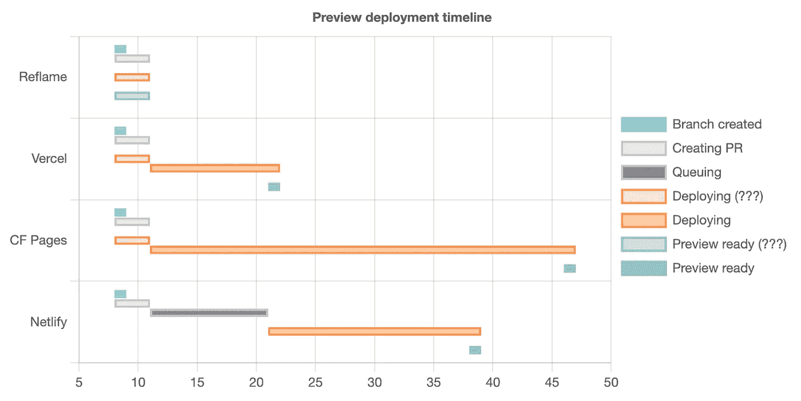
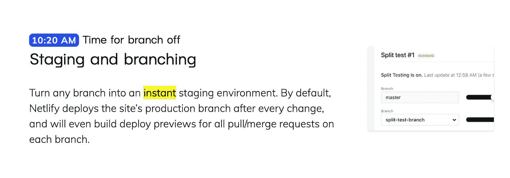
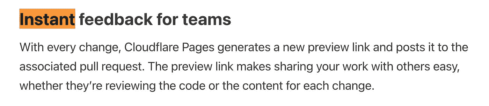

# 我比较了同一 repo 上 Reflame、Vercel、Netlify、Cloudflare 页面的部署速度

> 原文：<https://itnext.io/i-compared-deploy-speeds-for-reflame-vercel-netlify-cloudflare-pages-on-the-same-repo-377f74cdf2e3?source=collection_archive---------1----------------------->

报道的部署速度可能并不全面



# 2022 年 11 月 12 日更新

【Netlify 的 Matt Kane 回复了我的 Twitter 帖子,解释说:

1)这里的部分问题是我的 Netlify 帐户启用了分支构建，这导致每次提交运行两个构建。这导致并发级别为 1 时的排队时间更长，这可以解释这里看到的运行类似长度的分支构建所需的大约 20 秒的排队时间。

2)另一部分是 Netlify 在 PR 创建时运行的预览，而不是像这里测试的所有其他服务一样在每次提交时运行。这解释了在创建分支机构和打开 PR 之间大约 5 秒钟的延迟。

不幸的是，上述总共约 55 秒的排队时间中仍有约 30 秒没有计算在内。关闭分支构建的初始测试显示了更有竞争力的结果，但它是在周日凌晨 4 点执行的，所以我还不能完全排除在繁忙时段额外的排队延迟。将在太平洋标准时间工作时间进一步调查。敬请期待下一次更新！

# 2022 年 11 月 14 日更新

> 【忙的话本更新更短推特线程版本:【twitter.com/lewisl9029/status/1592341968780..】

*我在周一下午 2:20(太平洋标准时间)禁用 Netlify 分支构建的情况下重新运行了原始测试，以调查流量较高时的排队行为。*

*以下是录音:*

*以下是基于这些新时间戳的更新图表:*

*我们可以看到，Netlify 现在更有竞争力了，没有了支持分支部署的双重构建，获得了第二名，以大约 8 分的优势击败了 Cloudflare Pages。*

*然而，与其他测试的服务相比，大约 10 秒的排队时间仍然较高，这是 Netlify 和第二名 Vercel 之间大约 17 秒差异的主要原因。即使我们去掉其他人因为在提交时而不是在 PR 创建时开始而享有的大约 3 秒的领先优势，它仍然会落后大约 14 秒。*

*单次 PR preview 部署的排队时间约为 10 秒，这也为我们早先的结果(启用分支部署的双构建的排队时间约为 55 秒)提供了更强有力的假设:*

*   *初始分支机构部署的排队时间约为 10 秒*
*   *初始分支机构部署需要大约 15 到 20 秒的构建时间*
*   *后续 PR 部署的排队时间约为 10 秒*
*   *后续公关部署需要大约 15-20 秒的构建时间*

*当在并发级别为 1 的情况下连续执行时，总共需要 50-60 秒，这与我们之前观察到的情况完全吻合。*

*我已经将副标题更新为不那么煽动性的内容，试图反映这样一个事实，即大多数用户的排队时间可能不会像我以前经历的那样令人震惊。为了完全透明，这是以前的情况:*

> **最大的收获:Netlify 可能在部署速度上骗了你**

*以下是我更新的内容:*

> **最大的收获:报道的部署速度可能没有描绘出全貌**

# *网络生活的反馈*

*综上所述，以下是根据我到目前为止比较所有这些部署服务的经验，对 Netlify 的一些反馈:*

## *启用分支部署不应该导致带有 PRs 的分支上的双重构建*

*分支机构部署选项目前会显著增加 PR 部署的排队时间和成本。这是一个巨大的 footgun，完全违背了我对该选项工作方式的预期，我怀疑我不是唯一一个在没有意识到其负面影响的情况下随意启用它的人。*

*默认情况下，测试的每个其他部署服务在每个分支上部署每个提交，并且只为 PR 预览重用那些提交部署，没有机会进行双重构建。*

*我不一定期望 Netlify 改变他们当前的缺省值，因为构建所有提交与仅在具有相关 PRs 的分支上构建那些提交在成本上存在权衡，并且完全由他们来决定权衡的哪一方将使大多数用户受益。*

*然而，我希望看到一个选项来启用在每个分支上部署每个提交行为，因为它可以为新推送的分支带来显著更快的部署速度，有时甚至可以在我们创建 PR 时准备好预览。*

*分支部署本来可以是这个选项，但是 PRs 问题上的双重构建使得它不适合于维护长期非默认分支预览之外的任何用例(用于登台、测试等)。*

*很高兴看到这个问题得到解决，无论是通过更新现有选项的行为，还是在需要保留现有行为的情况下引入新选项(我一直想不出当前行为会更好的任何场景，但这可能只是我缺乏想象力)。*

## *交通高峰时段的排队时间需要改善*

*正如我们在这里看到的，Netlify 的实际构建速度实际上与 Vercel 相差无几，但是花费大量时间排队使得它从现实世界用户的角度来看没有竞争力。*

*从我迄今为止的有限测试来看，在低流量时段排队时间似乎要好得多(上一次测试是在周日凌晨 4 点左右)，所以我敢打赌这是一个容量问题，Netlify 可能会投入更多资金来改善。但是我这里没有全貌，所以可能没那么简单。*

## *让排队时间更透明、更容易获得*

*理想情况下，每个部署服务都应该为了透明而这样做，但是在我的测试中，Netlify 是我发现的唯一一个排队时间过长的服务。对于其他所有事情，与总部署时间相比，排队时间是一个舍入误差。*

*有人可能会说，如果 Netlify 将排队时间改善到足以与其他测试服务相匹配，那么这可能就没有必要了。我会让他们决定先处理哪一个。*

> *甚至有一种利润观点支持为 Netlify 等提供者提供更好的队列时间洞察力，这些提供者销售更高的并发限制(至少如果你有多余并发的构建的队列时间是有竞争力的)。我确信这对于容量规划来说是很方便的，例如，决定购买多少并发性以在成本和团队生产力之间取得最佳平衡。*
> 
> **也就是说，除了 Reflame *之外，这只是对这里测试的所有东西的关注，因为我们不会根据你付给我们多少钱来人为地限制并发。我们可以做到这一点，因为我们已经建立了一种技术，每次部署只需要几毫秒的计算时间，而不是几十秒，因此我们可以在少数简单的多租户 web 服务器上运行这些部署，而不是在具有大量调度、排队和启动开销的复杂计算集群上运行，并且在相同硬件上的部署比所有其他服务多 100 倍。***
> 
> **这种 100 倍的技术，加上简单、统一的每月每用户价格(无 BS ),确保 Reflame 的激励措施符合我们客户的利益。我们总是被鼓励为您更快地进行部署，因此我们可以获得更多收入作为利润。**

*以上是我计划的所有更新。以下是原文，考虑到 Netlify 的结果被双重构建问题严重扭曲，请带着大量的盐阅读。*

> **我还把这个帖子做了一个删节版，作为* [*的推特帖*](https://twitter.com/lewisl9029/status/1591530406909997056) *。如果你只是想要一份执行摘要，就去看看吧。**
> 
> **HN 在这里讨论:*[*news.ycombinator.com/item?id=33576753*](https://news.ycombinator.com/item?id=33576753)*

# *动机*

*自 [Reflame 在](https://blog.reflame.app/reflames-launch-was-a-great-success)[秀 HN](https://news.ycombinator.com/item?id=33134059) 上推出以来，已经过去了大约一个月。在发布之前，我们在 Reflame 上的所有东西都是一些小的爱好项目(以及 [reflame.app](https://reflame.app) 本身，它仍然很小，大约有数百个模块)。这些天，我开始看到越来越大的项目出现，这很令人兴奋！但同时也很可怕。*

*虽然 Reflame 的大图架构旨在能够为任意规模的项目部署毫秒级延迟的更新，但它缺少一系列重要的微优化，这些微优化可能会给足够大的项目带来灾难性的影响(想想在单个节点上运行太多繁重的计算，耗尽内存/临时磁盘空间，遇到第三方速率限制等)。这是让我夜不能寐的众多事情之一。*

*所以，自从[上一次更新](https://blog.reflame.app/new-in-reflame-create-apps-in-1-click)以来，我一直在做这件事。*

# *设置*

*首先，我已经使用我们全新的一键式应用程序创建功能建立了一个新的[部署基准报告](https://github.com/reflame/deployment-benchmark):*

> **配备 React、Vite 和 Reflame 的全新 repo 在 30 秒内完成设置和部署！这是在互联网上创建和部署生产就绪的 Vite React repo 的最快方法。*[](https://reflame.app/dashboard/create-app?foundationName=vite-react)**下次你开始一个新项目的时候，自己试一试吧！***
> 
> ***Vercel 和 Netlify 的回购都是现成的，因此，如果您想在决定之前进行自己的比较，您需要做的只是通过他们的仪表板添加回购，以便开始同时部署。Cloudflare 页面需要稍微多一点的设置，更多关于这个* [*后面的*](https://blog.reflame.app/i-compared-deploy-speeds-for-reflame-vercel-netlify-cloudflare-pages-on-the-same-repo#heading-cloudflare-pages) *。***

**在接下来的几周和几个月中，我还需要做更多的基准测试和优化，但在进行更复杂的设置之前，我认为首先花一些时间为这个回购建立一个基线部署速度是有用的，因为它仍然是一个很小的、接近库存的 Vite React 应用程序，总共只有不到 10 个源文件。**

**为了让自己诚实地了解 Reflame 的亮点和不足，我还连接了一些其他的客户端渲染 React 应用程序的部署服务，人们可能已经在使用这些服务了。首先，我添加了 Vercel、Netlify 和 Cloudflare 页面。**

**如果你还有其他想看的，请在评论中告诉我！任何可以部署股票 Vite React 应用程序应该是公平的游戏。**

# **结果呢**

**事不宜迟，下面是我创建新 PR 并等待所有预览部署完成的未经编辑的屏幕记录:**

**如果你有足够的耐心想看完整部电影，我强烈推荐以两倍的速度观看。需要一段时间。**

**或者，继续滚动查看一个漂亮的图表，以及一些对结果的评论。**

> **我意识到这不太科学，因为我们只看了一次运行，但我在过去几周重复了几十次，没有看到任何显著的变化足以实质性地影响这里的评论。在接下来的几周/几个月里，我计划对回购进行改进，以在持续的基础上进行更复杂和统计上更严格的基准测试，用作健康检查和检测性能回归。请留意这个博客的更新！**
> 
> ***我还想邀请任何足够好奇的人通过创建一个新的 Vite React repo 并将所有这些部署服务连接到它来尝试复制这里的结果。不要脸的塞:为此创建回购最简单的方法是通过 Reflame 的* [*一键式应用创建*](https://reflame.app/dashboard/create-app?foundationName=vite-react) *功能。如果你走这条路，整个过程不会超过 30 分钟。***

# **细节**

**我使用视频中的粗略时间戳制作了上面的图表，以帮助可视化每个部署最终需要多长时间，以及涉及的各种组件。**

# **🥇重烧**

**这里 Reflame 的结果并不那么有趣，因为它在我完成创建 PR 以查看状态检查之前就已经完成了。自我报告的延迟是 1.071 秒，但不可能仅从视频中测量任何进一步的粒度。**

**也就是说，我们希望通过这个练习来测量真实世界用户体验到的延迟，因此这个结果足够快，可以被认为是用于该目的的*瞬间*(在最后我还有很多关于这个[的话要说)。对于任何一直关注此事的人来说，这并不奇怪。毕竟，这是雷弗拉姆的面包和黄油。](https://blog.reflame.app/i-compared-deploy-speeds-for-reflame-vercel-netlify-cloudflare-pages-on-the-same-repo#heading-parting-words)**

**然而，其他服务的结果实际上比我预期的要有趣得多。让我们按照他们的排名逐一查看。**

# **🥈韦尔塞尔**

**Vercel 排在第二位，从创建分支开始，端到端部署延迟约为 16 秒。**

**考虑到 Vercel 只是在容器/VM 中克隆 repo 和运行 Vite，这实际上是一个非常值得尊敬的展示。这正是 Netlify 和 Cloudflare Pages 所做的，所以理论上，这三种服务之间实际上没有太大的差异空间*。他们在实践中存在如此巨大差异的事实让我大吃一惊，我将在稍后的[章节](https://blog.reflame.app/i-compared-deploy-speeds-for-reflame-vercel-netlify-cloudflare-pages-on-the-same-repo#heading-netlify)中深入探讨主要的贡献者。***

> ****尽管我们在这里部署了一个 Vite 应用程序，但与这里比较的其他应用程序不同，Reflame 实际上并不在其部署管道中的任何地方运行 Vite。实际上运行 Vite 需要旋转一个容器/VM，运行*`*git clone*`*`*npm install*`*`*vite build*`*，然后最终部署结果。这些操作中的每一个都具有整数秒量级的延迟下限，这将使各种延迟完全无法反映目标。******
> 
> ****相反，Reflame 只获取实际上已经改变的模块，对它们执行最小的转换以去除 JSX 和类型脚本语法，并将它们部署为独立的 es 模块。然后，我们在顶部加入一些定制的依赖性分析和积极的预取，以拉平模块加载瀑布，从而保持合理的初始加载性能，同时优化最小的写入放大(这是减少部署速度与代码库大小的正常线性扩展的关键)和最大的缓存粒度。****
> 
> ****对于 Reflame 所面向的应用类型而言，缓存粒度尤其可以说比初始加载性能更重要(想想人们反复登录的没有公开可索引内容的产品仪表盘)，但它在很大程度上被业界忽视了，他们更喜欢追求更高的 Lighthouse 分数，这是为测量初始访问的性能而优化的。在以后的文章中，我会有更多关于这个话题的内容。****

***在我继续之前，我想指出，如果你看一下屏幕记录，你可以看到我实际上直到很久以后才意识到部署已经完成，因为 GitHub UI 的一个错误没有及时更新状态检查。我们可以看到屏幕顶部的评论在大约 30 秒的标记处更新[，但是我在状态检查上努力地进行隧道视觉，直到大约 10 秒钟后才意识到。](https://youtu.be/TXQx64SlQI8?t=30)***

***很有可能，我们以前都可能在 GitHub 上看到过这种情况。这里 Vercel 显然没有错，所以我使用注释的时间戳来计算部署时间。然而，当这种情况在现实世界中发生时，无论是谁的错，都会导致糟糕的用户体验。***

***当在 GitHub 上为任何部署服务创建新的 PR 时，除了 Reflame 之外，都会发生这种情况，因为 Reflame 部署实际上保证总是在任何人可以从他们的分支完成创建 PR 之前完成部署(事实上，如果这里涉及的 GitHub API 调用比 Reflame 部署花费的时间更长，即使在考虑人的瓶颈之前，我也不会感到惊讶)。PR 创建时的状态检查将在初始页面加载时完成，所以不会受到 GitHub 的 WebSockets 更新的影响。***

> ****有趣的事实:我实际上不得不完全为了 Reflame 停止发送正在进行的状态检查。正在进行的和已完成的状态检查总是以如此快的速度连续发送，以至于有时会导致竞争，导致状态检查永远不会被标记为完成。幸运的是，Reflame 部署得如此之快，以至于即使我们发送了状态检查，用户也不会看到正在进行的状态检查，所以忽略它是相当安全的。****

# ***🥉Cloudflare 页面***

***第三名是 Cloudflare Pages，完成时间约为 37 秒，比 Vercel 晚约 21 秒。***

***快速浏览一下 Vercel 和 CF 页面之间的构建日志，可以发现一些差异所在:***

***以下是 CF 页面:***

```
***2022–10–25T09:50:17.630287Z Cloning repository…
2022–10–25T09:50:18.520063Z From https://github.com/reflame/deployment-benchmark
2022–10–25T09:50:18.520692Z * branch 733417b754cefeff2ff56d88d35ae9fe9f36fb8d -> FETCH_HEAD
2022–10–25T09:50:18.520901Z 
2022–10–25T09:50:18.56086Z HEAD is now at 733417b Update App.jsx
2022–10–25T09:50:18.5614Z 
2022–10–25T09:50:18.698318Z 
2022–10–25T09:50:18.724411Z Success: Finished cloning repository files
2022–10–25T09:50:21.814043Z Installing dependencies
2022–10–25T09:50:21.824443Z Python version set to 2.7
2022–10–25T09:50:24.931283Z Downloading and installing node v16.18.0…
2022–10–25T09:50:25.339846Z Downloading https://nodejs.org/dist/v16.18.0/node-v16.18.0-linux-x64.tar.xz...
2022–10–25T09:50:25.796972Z Computing checksum with sha256sum
2022–10–25T09:50:25.929794Z Checksums matched!
2022–10–25T09:50:30.286701Z Now using node v16.18.0 (npm v8.19.2)
2022–10–25T09:50:30.694917Z Started restoring cached build plugins
2022–10–25T09:50:30.707332Z Finished restoring cached build plugins
2022–10–25T09:50:31.215194Z Attempting ruby version 2.7.1, read from environment
2022–10–25T09:50:34.746392Z Using ruby version 2.7.1
2022–10–25T09:50:35.099867Z Using PHP version 5.6
2022–10–25T09:50:35.251971Z 5.2 is already installed.
2022–10–25T09:50:35.281233Z Using Swift version 5.2
2022–10–25T09:50:35.281962Z Started restoring cached node modules
2022–10–25T09:50:35.297622Z Finished restoring cached node modules
2022–10–25T09:50:35.807495Z Installing NPM modules using NPM version 8.19.2
2022–10–25T09:50:36.217549Z npm WARN config tmp This setting is no longer used. npm stores temporary files in a special
2022–10–25T09:50:36.217889Z npm WARN config location in the cache, and they are managed by
2022–10–25T09:50:36.218149Z npm WARN config [`cacache`](http://npm.im/cacache).
2022–10–25T09:50:36.618472Z npm WARN config tmp This setting is no longer used. npm stores temporary files in a special
2022–10–25T09:50:36.619103Z npm WARN config location in the cache, and they are managed by
2022–10–25T09:50:36.619309Z npm WARN config [`cacache`](http://npm.im/cacache).
2022–10–25T09:50:38.795358Z 
2022–10–25T09:50:38.795652Z added 85 packages, and audited 86 packages in 2s
2022–10–25T09:50:38.795817Z 
2022–10–25T09:50:38.795937Z 8 packages are looking for funding
2022–10–25T09:50:38.796062Z run `npm fund` for details
2022–10–25T09:50:38.797004Z 
2022–10–25T09:50:38.797278Z found 0 vulnerabilities
2022–10–25T09:50:38.807557Z NPM modules installed
2022–10–25T09:50:39.386013Z npm WARN config tmp This setting is no longer used. npm stores temporary files in a special
2022–10–25T09:50:39.386411Z npm WARN config location in the cache, and they are managed by
2022–10–25T09:50:39.386585Z npm WARN config [`cacache`](http://npm.im/cacache).
2022–10–25T09:50:39.405024Z Installing Hugo 0.54.0
2022–10–25T09:50:40.188585Z Hugo Static Site Generator v0.54.0-B1A82C61A/extended linux/amd64 BuildDate: 2019–02–01T10:04:38Z
2022–10–25T09:50:40.192651Z Started restoring cached go cache
2022–10–25T09:50:40.211269Z Finished restoring cached go cache
2022–10–25T09:50:40.358634Z go version go1.14.4 linux/amd64
2022–10–25T09:50:40.37351Z go version go1.14.4 linux/amd64
2022–10–25T09:50:40.376529Z Installing missing commands
2022–10–25T09:50:40.376768Z Verify run directory
2022–10–25T09:50:40.376908Z Executing user command: npm run build
2022–10–25T09:50:40.853109Z npm WARN config tmp This setting is no longer used. npm stores temporary files in a special
2022–10–25T09:50:40.853487Z npm WARN config location in the cache, and they are managed by
2022–10–25T09:50:40.853695Z npm WARN config [`cacache`](http://npm.im/cacache).
2022–10–25T09:50:40.869037Z 
2022–10–25T09:50:40.86927Z > example-vite-react@0.0.0 build
2022–10–25T09:50:40.869412Z > vite build
2022–10–25T09:50:40.869531Z 
2022–10–25T09:50:41.510958Z vite v3.1.7 building for production…
2022–10–25T09:50:41.547569Z transforming…
2022–10–25T09:50:42.531186Z ✓ 38 modules transformed.
2022–10–25T09:50:42.645557Z rendering chunks…
2022–10–25T09:50:42.651676Z dist/assets/react.35ef61ed.svg 4.03 KiB
2022–10–25T09:50:42.651924Z dist/assets/vite.4a748afd.svg 1.46 KiB
2022–10–25T09:50:42.652091Z dist/assets/icon.2129a660.svg 4.62 KiB
2022–10–25T09:50:42.654023Z dist/index.html 0.44 KiB
2022–10–25T09:50:42.655668Z dist/assets/index.1d2a7c20.css 1.80 KiB / gzip: 0.92 KiB
2022–10–25T09:50:42.660648Z dist/assets/index.c65a176d.js 140.69 KiB / gzip: 45.44 KiB
2022–10–25T09:50:42.694059Z Finished
2022–10–25T09:50:42.694677Z Note: No functions dir at /functions found. Skipping.
2022–10–25T09:50:42.695099Z Validating asset output directory
2022–10–25T09:50:43.554269Z Deploying your site to Cloudflare's global network…
2022–10–25T09:50:48.117372Z Success: Assets published!
2022–10–25T09:50:48.584581Z Success: Your site was deployed!***
```

***这是维尔塞尔:***

```
***[02:50:18.866] Cloning github.com/reflame/deployment-benchmark (Branch: edit, Commit: 733417b)
[02:50:19.250] Cloning completed: 383.076ms
[02:50:19.652] Looking up build cache…
[02:50:20.970] Build cache downloaded [11.34 MB]: 1057ms
[02:50:21.009] Running "vercel build"
[02:50:21.507] Vercel CLI 28.4.12–05a80a4
[02:50:22.086] Installing dependencies…
[02:50:22.728] 
[02:50:22.729] up to date in 315ms
[02:50:22.729] 
[02:50:22.729] 8 packages are looking for funding
[02:50:22.729] run `npm fund` for details
[02:50:22.740] Detected `package-lock.json` generated by npm 7+…
[02:50:22.741] Running "npm run build"
[02:50:23.040] 
[02:50:23.040] > example-vite-react@0.0.0 build
[02:50:23.040] > vite build
[02:50:23.041] 
[02:50:23.487] [36mvite v3.1.7 [32mbuilding for production…[36m[39m
[02:50:23.525] transforming…
[02:50:24.662] [32m✓[39m 38 modules transformed.
[02:50:24.778] rendering chunks…
[02:50:24.782] [90m[37m[2mdist/[22m[90m[39m[32massets/react.35ef61ed.svg [39m [2m4.03 KiB[22m
[02:50:24.783] [90m[37m[2mdist/[22m[90m[39m[32massets/vite.4a748afd.svg [39m [2m1.46 KiB[22m
[02:50:24.783] [90m[37m[2mdist/[22m[90m[39m[32massets/icon.2129a660.svg [39m [2m4.62 KiB[22m
[02:50:24.784] [90m[37m[2mdist/[22m[90m[39m[32mindex.html [39m [2m0.44 KiB[22m
[02:50:24.785] [90m[37m[2mdist/[22m[90m[39m[35massets/index.1d2a7c20.css [39m [2m1.80 KiB / gzip: 0.92 KiB[22m
[02:50:24.790] [90m[37m[2mdist/[22m[90m[39m[36massets/index.c65a176d.js [39m [2m140.69 KiB / gzip: 45.44 KiB[22m
[02:50:24.833] Build Completed in /vercel/output [3s]
[02:50:25.479] Generated build outputs:
[02:50:25.480] - Static files: 9
[02:50:25.480] - Serverless Functions: 0
[02:50:25.480] - Edge Functions: 0
[02:50:25.480] Deployed outputs in 1s
[02:50:26.134] Build completed. Populating build cache…
[02:50:28.818] Uploading build cache [11.34 MB]…
[02:50:29.688] Build cache uploaded: 870.16ms
[02:50:29.718] Done with "."***
```

***我首先注意到的是长度上的差异。***

***仔细看，Cloudflare Pages 似乎正在初始化 Ruby，PHP，Python，Swift，在一个除了 Node.js 之外不使用任何东西的项目中。它似乎也在下载 Node.js，而 Vercel 似乎已经将其烘焙到映像中。***

***将开始的设置步骤和其他各种不相关的步骤加在一起(为什么是 Hugo？？？)，这似乎是造成 17 秒整体延迟的原因。去掉所有这些缺点将会把延迟降低到 20 秒左右，这将使 CF 页面与 Vercel 只有一步之遥。***

***与 Vercel 和 Netlify 相比，CF Pages 仍然是一个年轻的产品，根据他们的记录，我毫不怀疑他们会在适当的时候尝试优化这个 cruft，变得更有竞争力。***

> ****快速补充说明:Cloudflare Pages 是唯一需要额外配置来部署这个接近库存的 Vite 项目的服务。没有针对 Vite 的预置，初始部署因股票设置而失败，我必须查找他们的文档来使用正确的命令和环境变量进行设置。****
> 
> ****如果您设置这个来验证您自己的结果，只需确保将构建命令手动设置为* `*npm run build*` *，将构建输出目录设置为* `*/dist*` *，并将* `*NODE_VERSION*` *env 变量设置为* `*16*` *以使其正确构建。****
> 
> ****我一连接，Vercel 和 Netlify 就能部署回购，无需任何手动配置。****
> 
> ****这与我们对部署速度的调查无关，但我想我应该标记一下，以防 Cloudflare 的人对这种快速取胜感兴趣。****

# ***🐢网络生活***

***最后，也是最令人失望的，我们一无所获。***

***Netlify 在这里的表现糟透了。它甚至没有设法发布一个进行中的提交状态，直到在其他一切都已经完全部署好之后的整整 24 秒。然后又花了大约 19 秒才完成，总计大约 80 秒的端到端延迟。***

***然而，Netlify 状态检查自豪地声称部署时间为 15 秒。如果我们相信他们的话，这将使他们与 Vercel 和 Cloudflare 相提并论。但实际上，它严重歪曲了我们实际经历的端到端延迟，误差超过 5 倍。***

***以任何标准来看，这都是一个令人震惊的错误陈述，我认为在报告结果中不包括如此重要的排队时间是彻头彻尾的欺骗。更糟糕的是，这种排队时间甚至在他们自己的构建结果页面上也找不到，因此用户无法了解他们的部署实际需要多长时间。***

> ****说得更细致一点，GitHub 应用不可能实际测量和报告用户体验的确切端到端延迟，因为我们最早可以开始测量的时间是我们收到 webhook 的时候。****
> 
> ****(也就是说，至少如果我们想要抗时钟漂移的测量，这可能会导致非常不准确，有时甚至是像 Reflame 这样的负延迟测量，因为它始终在 2 秒内完成)****
> 
> ****Vercel 报告的持续时间为 9 秒，因此被关闭了 7 秒。****
> 
> ****Cloudflare 页面报告的持续时间为 33 秒，因此关闭了 4 秒。****
> 
> ****对于 Reflame，所报告的 1.071 秒可能仍有一些偏差，但它低于本练习可能的最小测量阈值，因为在我们能够看到提交状态时部署已经完成。****
> 
> ****另一方面，Netlify 报告的持续时间为 15 秒，但端到端的潜伏期为 80 秒，因此延迟了 65 秒。从收到 webhook 开始，它有足够的时间来测量和报告整个排队时间，但是为了让自己看起来更好，它选择不这样做，只报告花费在构建上的时间。****

***我的假设是，这么长的排队时间是过于激进的成本/容量管理策略的结果。在真空中，这种程度的积极排队可以被认为是完全合理的，特别是对于免费计划的用户，作为一种节省成本的措施。但在我们生活的现实世界中，有多个竞争对手提供功能相当的免费计划，排队时间几乎为零(特别是 Reflame，端到端部署时间几乎为零)。***

***因此，如果我是一个网络用户，并且关心部署速度，我会*认真考虑*许多伟大的替代品，如果他们不尽快解决这个问题的话。如果这确实是我假设的节约成本的措施，Netlify 应该能够这样做，只要扳动开关，在这个问题上投入更多的钱，就能与其他所有人竞争。如果他们仍然选择不这样做，坦白地说，他们不配拥有你这个用户。***

***如果您只是部署一个简单的由静态资产组成的客户端渲染应用程序，那么转换成本应该可以忽略不计，作为回报，您将在项目的剩余生命周期中减少 50%以上的部署成本(或者如果您选择 Reflame，实际上是整个 80%的部署成本)。如果你需要这方面的帮助，请随时在 Twitter 上发消息给我，即使你打算换成 Reflame 以外的东西。我只是不能忍受看到 Netlify 继续拥有用户，同时在我如此热爱的领域提供如此糟糕的体验。***

> ***根据记录，在我运行这个测试的所有几十次中，Netlify 总是表现出相似的性能特征，并且从未在其他人完成之前发布过一次正在进行的检查。***
> 
> ****我再次邀请任何足够好奇的人在新的 Vite React 应用程序上亲自尝试一下，独立验证这些结果。特别感兴趣的是在 Netlify 上看到付费计划的结果，这可能不会遭受类似程度的排队时间。毕竟，在 99 美元/会员的商业计划中，他们出售的是他们称之为“优先构建环境”的东西。并不是说我会推荐每个会员支付 99 美元来获得其他人免费提供的基本体验。****

***如果我们考虑到 Netlify *如果没有这么长的排队时间，它本可以在这场比赛中获得第二名，那么这些结果就特别令人沮丧。从状态检查出现开始，它实际上只花了~ 19 秒就完成了部署，这将使它与 Vercel 并驾齐驱。相反，因为它花了 50 多秒才开始，它以令人捧腹的优势最后结束。****

# ***离别赠言***

***最后，请允许我结束这次咆哮:***

***术语“即时”在部署工具领域已经失去了所有的意义。除了 Reflame 之外，这里测试的所有服务目前都使用“即时”一词来描述它们的预览部署:***

******************

***这尤其具有讽刺意味，因为正如我们在这个练习中看到的，只有 Reflame 实际上足够快，可以提供一种真正“即时”的体验，这是这个词唯一有用的定义:一种足够快，永远不会让你等待的体验，即使是短暂的一秒钟。***

***我越来越多地有意避免使用“即时”这样模糊的术语来描述 Reflame 的部署速度。相反，我喜欢用冷冰冰的硬数字来表示:100 毫秒—500 毫秒来自 VSCode 扩展，0.5 秒—3 秒来自 GitHub 应用程序。***

***这不仅更诚实，让我的良心更轻松，我发现它在更深层次上与用户建立了联系，更好地激起了他们对 Reflame 如何快速部署的好奇心，这是让他们入门的好方法。然而最重要的是，它帮助我提醒自己，总有改进的空间。***

***Vite 本地开发的更新延迟最好用[10 毫秒](https://github.com/yyx990803/vite-vs-next-turbo-hmr#numbers)来衡量。Reflame 在每次更新时都部署到互联网上，以实现可共享的、类似本地开发的、支持 HMR 的实时预览，因此光纤中的光速意味着 Reflame 可能永远无法以其当前的架构击败它(尽管我对 Reflame 的未来版本有一些令人兴奋的想法，这可能在遥远的未来实现！)，但这不会阻止我试图让它尽可能接近宇宙的物理极限。***

***你也不必相信我的话。***

***我选择每个用户每月固定费用作为 Reflame 部署产品的定价模式，正是为了确保 Reflame 业务将始终受到财务激励，以使您的部署更快，使我们能够在相同的硬件上服务更多的客户，并将差额作为利润收入囊中。这与几乎所有其他 CI/CD 提供商形成了鲜明的对比，这些提供商依赖于基于使用的定价，最终在财务上不愿做任何可以为他们的用户更快部署的事情([问我我是如何知道这一点的](https://www.linkedin.com/in/lewisl9029/#:~:text=Senior%20Product%20Engineer))。将来我可能也会在这个话题上有更多的话要说…***

***…但是，在此之前，真的很感谢你花时间阅读到这一点！***

***如果这篇文章激起了你对 Reflame 的兴趣，并且你正在构建一个客户端渲染的 React 应用程序，请到 [reflame.app](https://reflame.app/) 免费尝试一下！我们非常乐意通过确保您再也不必等待部署来回报您所花费的时间。🙂***

****原载于*[*https://blog . ref lame . app*](https://blog.reflame.app/i-compared-deploy-speeds-for-reflame-vercel-netlify-cloudflare-pages-on-the-same-repo)*。****