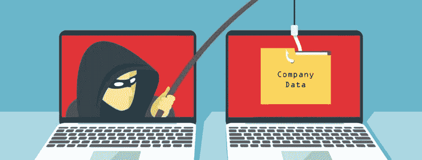
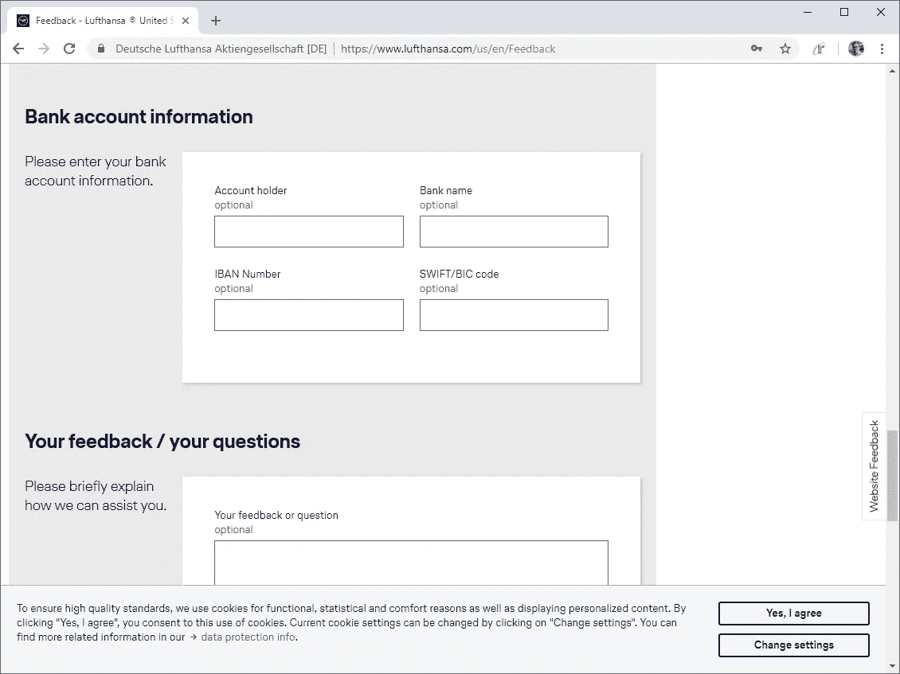
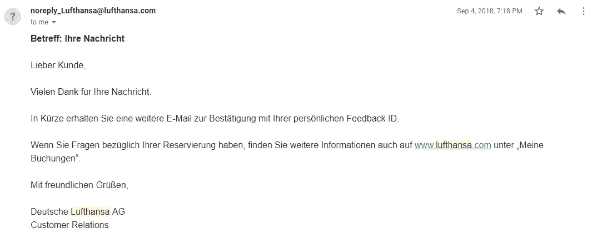
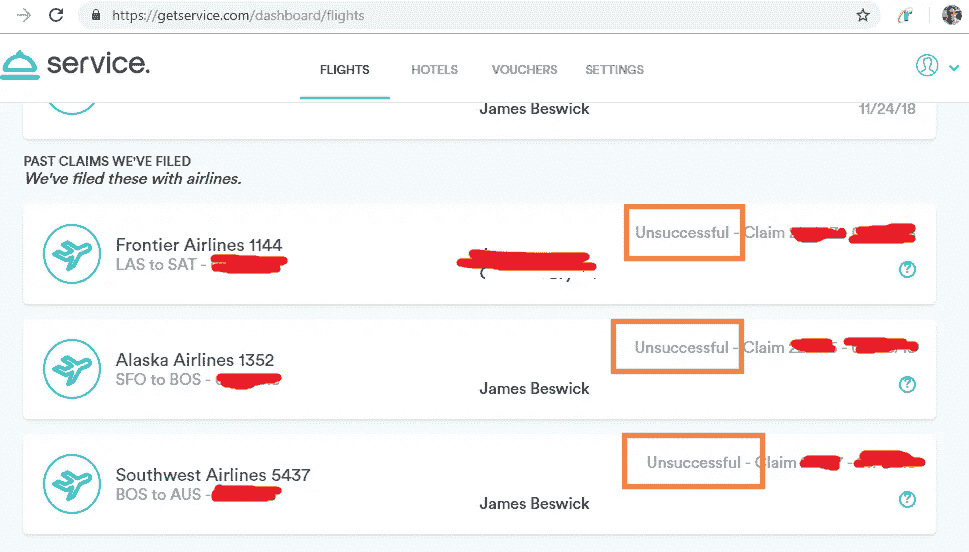
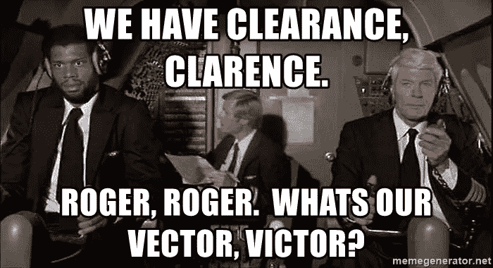

# 我向汉莎航空投诉。然后钓鱼就开始了。

> 原文：<https://itnext.io/i-complained-to-lufthansa-then-the-phishing-started-542412297f3e?source=collection_archive---------1----------------------->

*现在，IT 安全如何影响我们生活中的每一笔交易，尤其是与 GDPR 的交易。*

一个月前我去了意大利，在汉莎航空公司经历了一次真正可怕的飞行经历。正常情况下，我可能什么都不会做，但我的妻子一个月前乘汉莎航空公司的飞机出差，也有一次可怕的经历。所以我想是时候给航空公司写一封抱怨信了，在现代的大卫和歌利亚之战中，我们都经常会输。

不管怎样，汉莎航空公司有一个糟糕的网站，是 21 世纪初网络技术的纪念碑。在移动上效果不好，不能使用前进和后退按钮，容易失去状态，从而成就了让大多数抱怨者都想放弃的平庸用户体验的神圣三连胜。不要像在亚马逊这样的公司做一个简单的反馈表，这是一个很好的午餐时间来解决如何给这些人传递信息的问题。

事实上，这是我见过的唯一一家要求你提供“银行账户信息”的公司，只是为了传递一个信息:

很自然地，我用伪造的银行账户信息填写了这张表格，并寄出了我的详细投诉的其余部分…但没有得到任何回应。接下来，我研究了如何向汉莎航空投诉，有人在一个旅游论坛上发现了一个可以引起他们注意的电子邮件地址，所以我用我的 Gmail 账户向那个电子邮件发送了一封同样投诉的简短版本。

具有讽刺意味的是，我对他们服务的主要抱怨是当他们取消航班时完全缺乏沟通。我真的强调了**沟通不畅**是一个问题，所以他们在 24 小时后给我发来了这封邮件回复:

然后，我花了 3 个月的时间在德语班上晚自习，以了解他们有多抱歉。或者也许我只是用了谷歌翻译，我不记得了，但结果是我很快就会收到回复。然后好戏开始了。

# “我们想退 800 欧元。”

大约两周后，我接到一个来自汉莎航空公司的电话。他详细回复了我投诉中的项目，道了歉，并说公司想退还 800 欧元，大约是机票费用的三分之一。他需要的只是我的银行账户信息，他注意到反馈表上没有提供。

保持住。的。电话。

字面上。我把手机从脸上拿开，查看来电显示，然后在谷歌桌面搜索中快速点击——这是一个德国电话号码，来历不明。他有口音。但是我也有口音。我不知道这是德国的还是别的什么。

我问他为什么需要银行账户。“这是我们提供自主退款的唯一方式，但当我们存储您的银行账户数据时，您受到德国银行法的保护。”

我又问了几个问题，他似乎对此有所准备。但是让我们坦白地说，我绝不会给你我的银行账户信息。永远不会。

# 这不正常的第一个线索。

这不是我第一次被钓鱼，当然也不会是最后一次。网络钓鱼者已经从批量电子邮件业务转向批量电话垃圾邮件，并且由于假冒电话号码和更便宜的 IP 语音，更容易通过电话欺骗许多人发布个人信息。

第一个线索可能是一家航空公司想要退款。我使用一个名为 [Service](https://getservice.com) 的网站，当航班延误或取消时，该网站自动向航空公司投诉，据说是为了从航空公司那里获得退款。在经历了许多航班延误的真正特殊的一年后，我没有看到他们中任何一个人的一分钱或一句好话:

航空公司不在乎。他们没有。如果他们中的任何一个人想给你现金退款(他们没有先打你)，那就大错特错了。如果我在心情不好的时候增加我的投诉引擎，我只能从康卡斯特得到 5 美元，但从航空公司得到免费饮料券的机会比我学习任何德语的机会都要小得多。

# 汉莎航空如何帮助骗子？

无论骗子是嗅探他们投诉邮箱的电子邮件流量，还是以某种方式访问存储在他们系统中的“安全表格”的内容，谁知道呢。可能都是因为我和 Phisher 先生的聊天内容。但是，无论这个蠕虫罐中存在什么安全问题，汉莎航空公司应该解决更大的问题，任何公司都可以从中吸取教训。

最重要的是:不要在公开的网络表单中询问敏感信息。就是不要。首先，您设定了一个预期，即可以广播订单 id、客户 id 甚至信用卡号，并且猜猜如果这些被泄露了，您的客户会责怪谁？其次，也是更重要的一点，你为 Phisher 先生的社会工程努力提供了武器弹药。

理解这一点很重要，因为很少有人知道。如果一个陌生人随机打电话给你，问你的工作电脑密码，你绝对不会上当。但如果陌生人说，“我是 IT 部门的汤姆，我们的 Mercury 打印机服务器出了点问题，在本周末施工期间要进行全面重置，你能给我你的密码吗，这样我们就能让你周一重新登录？”现在怎么办？您可能知道其中有一个 Tom，打印机服务器名为 Mercury，构建工作已安排好——这似乎是合理的。这就是社会工程的工作方式，它是网络钓鱼者众多选择中最普遍的工具。所以不，不要给汤姆密码。

汉莎航空的流程也不清楚在你提交反馈后，公司将采取什么步骤——我应该期待一封电子邮件、一个电话，还是通过登录的门户网站进行安全通信？通过让这一点保持开放，客户更有可能接受任何类型的响应，而不会产生怀疑。信用卡公司通常是很好的例子——他们设定这些期望，通常只会通过私人门户网站中的安全邮箱做出响应。

您的客户知道您的认证流程吗？无论你打电话给银行还是租车公司，所有的电话都会验证你的身份。Luftansa 的流程没有明确设定客户应该期待什么，这使得 Phisher 先生可以利用从社交工程中收集的有限信息进行“虚假筛选”,使呼入电话看起来合法。

最后，公司应该为客户提供公开的反馈方式，这样他们就不会收到带有私人信息的随机电子邮件。电子邮件不安全。尽管浏览器窗口中有挂锁，但你应该假设任何人都可以读取你发送的任何内容。你的顾客知道吗？如果你经常在你的行业中期待反馈(阅读:投诉)(对于航空公司来说，这将是经常发生的)，你应该为你的客户实现一个清晰、安全、易于查找和提交的表格。

清晰的交流。只是不在汉莎航空。

# 航空公司的无线电静默。

作为好的技术撒玛利亚人，在写这篇文章之前很久，我就给汉莎航空发了一封电子邮件，里面有钓鱼信息。我什么也没收到，甚至连一句礼貌的德国“走开”的回应都没有。我想知道，如果我提供了银行账户的详细信息，被骗了，然后被要求补救，事情会变成怎样。

一个迫在眉睫的问题是 GDPR 新规的影响。如果 Lufthansa 的邮箱或在线表格有漏洞，这可能是一种违规行为，可能会损失其全球年收入的 2%。虽然我怀疑欧盟是否会征收这种罚款，但所有公司都必须更加小心网络钓鱼欺诈，这种欺诈已经从一个小麻烦变成了一个潜在的法律事件。

IT 业务的要点非常明确，我们必须加倍努力教育最终用户，建立支持良好安全实践的流程，并设定与客户沟通的预期，以阻止诈骗和不良行为。