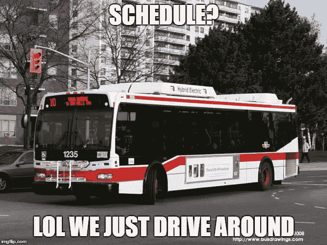

# 我创造了一个“机器人”,在每天早上公共汽车来的时候发送信息

> 原文：<https://itnext.io/i-created-a-bot-to-send-a-message-when-the-bus-comes-every-morning-7469d00a72cf?source=collection_archive---------0----------------------->



嗯，我不确定如何称呼这个过程，所以我决定称它为“机器人”。

事情是这样的:每天早上，在出门之前，我必须给 TTC 发信息或者查看谷歌地图，看看公交车什么时候来。

我厌倦了这种平凡的任务，所以我写了一个公交车调度器给我发 iMessage 通知公交车什么时候来，这样我就可以有时间享受生活了——不仅仅是因为我懒。

如果你想试试，这里有你需要的: **python** 和一台 **MacOS** 机器。

为了成全我的“懒惰”，我还创建了一个 python 包名:[**bustracker**](https://github.com/dalenguyen/bustracker)——它将有助于获得公交时刻表的预测。请查看 [**代理列表**](http://webservices.nextbus.com/service/publicXMLFeed?command=agencyList) 查看该包是否支持您的本地总线系统。

**入门**

安装 bustracker python 包

```
pip install bustracker
```

**准备信息**

创建一个***bus _ reminder . py***文件来处理公交调度请求

```
# bus_reminder.pyfrom bustracker import BusTrackeragency = 'ttc'
bus = BusTracker(agency)# get prediction for bus stops
stops = [
    {'routeTag': 506, 'stopTag': 3292}
]result = bus.get_predictions(stops)incomings = result['predictions']['direction']['prediction']bus_name = result['predictions']['routeTag']next_buses = ''for bus in incomings:
    next_buses += str(bus['minutes']) + ','message = bus_name + ' will come in ' + next_buses + ' minutes'
```

如果您打印该消息，您将得到如下内容

```
print(message)
# 506 will come in 4,7,9,15,21, minutes
```

**通过 iMessage 发送信息**

你已经准备好了一条信息，如果你不想通过 iMessage 发送，你可以找到适合你的。

[sendiMessage](https://gist.github.com/aktau/8958054) 脚本来自 **aktau** 。你可以从要点中读出细节。

```
# bus_reminder.py"""
Start sending bus reminder
"""import subprocess
args = ['**your-phone-number**', message]scpt = '/Users/dnguyen/Documents/projects/bus-reminder/sendiMessage.scpt'p = subprocess.Popen(
        ['/usr/bin/osascript', scpt] + [str(arg) for arg in args], 
        stdout=subprocess.PIPE, stderr=subprocess.PIPE)out, err = p.communicate()if p.returncode:
    print ('ERROR:', err)
else:
    print (out) # 4
```

该脚本将调用 **sendiMessage.scpt** 将消息发送到您的手机号码。请确定您的 Mac 上有 iMessage，并且您已经使用该号码进行了对话，否则您的信息将不会被发送。

**附表部分**

现在，我想让我的“机器人”在周一到周五的早上 7:30 给我发消息，这样我就不用这么做了。这简直是一个 cron 的工作；)

开始编辑您的 cron 作业: **crontab -e**

```
30 7 * * 1-5 /usr/local/bin/python3 /Users/dnguyen/Documents/projects/bus-reminder/bus_reminder.py # bus reminder
```

从现在开始，我每个工作日都会收到一条信息，显示下一辆公交车什么时候来，这样我就可以“冲”了——我甚至不需要拿出手机，我的 Fitbit 总是会给我显示这条信息。

以防你偷懒，这里有来自 [**github**](https://github.com/dalenguyen/bus-schedule-autoalert) 的完整工作项目。

[](https://github.com/dalenguyen/bus-schedule-autoalert) [## dalen guyen/公交-时刻表-自动报警

### 每天早上上班前发送 iMessage 提醒公交时刻表。-dalen guyen/公交-时刻表-自动报警

github.com](https://github.com/dalenguyen/bus-schedule-autoalert)