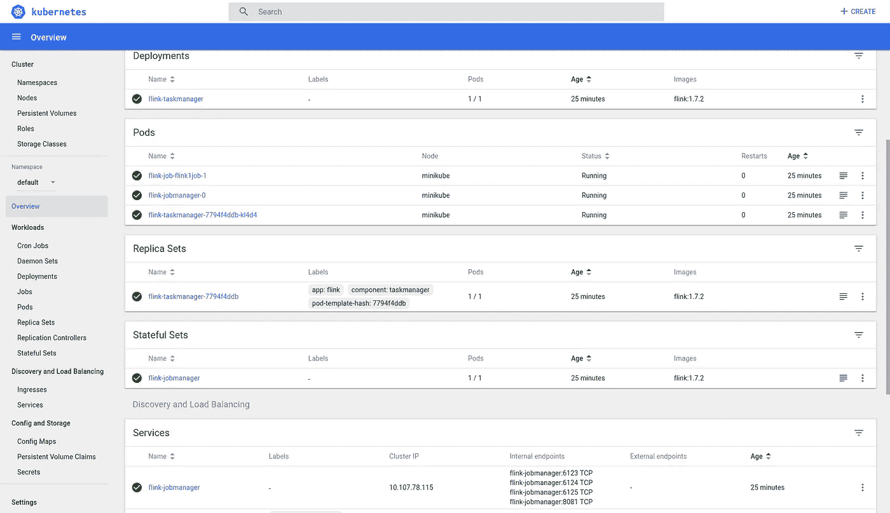
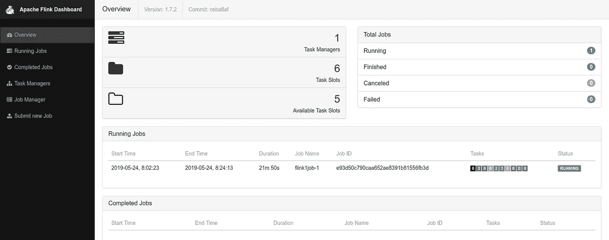
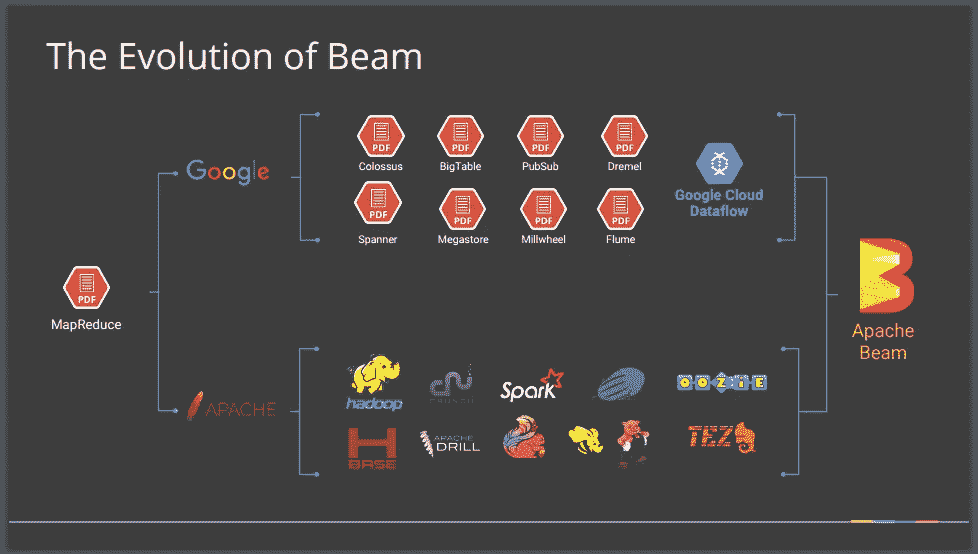

# 我觉得你很奇怪，我很喜欢你！

> 原文：<https://itnext.io/i-flink-you-freaky-and-i-like-you-a-lot-68554f7629df?source=collection_archive---------3----------------------->

## 或者……如何为 Flink jobs 建立自己的 Kubernetes 运营商

TL；DR —你可以在这里找到所有的代码和文档！

…但让我们回到一切开始的地方

[淡出…淡入…]六个月前…

# "库伯内特:去了又回来！"

像大多数公司一样——当我们在 [DAV](http://dav.network/) 开始创建后端时，我们采取了一些可能会极大影响我们产品的架构决策。

我们对 [K8S](https://kubernetes.io/) 足够成熟非常有信心，[卡珊德拉](http://cassandra.apache.org/)和[卡夫卡](https://kafka.apache.org/)也是一个确定无疑的赌注。

选择流处理器不是一个容易的选择。Apache BEAM 是一个显而易见的解决方案，但是即使 BEAM 允许我们相当容易地将相同的代码迁移到一个新的 runner 上，runner 也是一个选择。

经过初步筛选后，选择了 [Apache Spark](https://spark.apache.org/) 和 [Apache Flink](https://flink.apache.org/) 。两者都在 Apache 的保护伞下，既快速又可伸缩。斯帕克更成熟、更普通，而弗林克是街区里的新人。

因为内心年轻，我们选择了弗林克。

# 弗林克

*如果您已经熟悉 K8S 上的 Flink，请跳到下一部分。*

在 K8S 上设置 Flink 集群非常容易。我们为 JobManager(Flink 主机)提供了一个 pod Statefulset，为 task manager(Flink workers)提供了一个部署，为 job manager 提供了一个服务。您只需将 TaskManagers 指向 JobManager URL，集群就设置好了。该服务公开了一个 8081 端口，您可以在浏览器中打开该端口，了解 Flink 集群的当前状态。它显示作业管理器配置、连接的任务管理器及其配置以及作业——正在运行、已完成等..您还可以通过 UI 执行大多数操作，例如部署新的工作负载、停止或取消正在运行的作业、查看作业日志等。

K8S 仪表板视图—简单的 Flink 集群(单个工人)

Flink 还有一个 RESTful api 和一个 CLI 可以与之交互。我选择使用 CLI 从我的配置项/光盘中自动执行任务。我们需要的是能够向 Flink 提交作业，检测作业正在运行，并能够停止/取消正在运行的作业。

Flink UI(概览页面)

# 阿帕奇波束

*如果您已经熟悉射束管道，请跳到下一部分。*

Apache BEAM 是一个 API，它可以生成管道工作流，并且能够在多个运行器上运行这些工作流(例如 Spark、Flink、Airflow 等)。它以几乎相同的接口支持批处理和流式管道，使得在两种模式下运行相同的代码非常简单。它由 Google 发布，基本上是他们第一个数据流 API 的重新设计——自从发布以来，它已经得到了广泛的改进，在原始的 Java API 中添加了 Python API。

波束管道是非循环有向图，其中每个节点是数据元素的集合(有界或无界)，每个边是从一个集合到不同集合的转换(可能在类型、大小等方面不同)

管道由使用 API 的代码定义。然后，API 根据给定的管道和各种管道选项(包括运行程序的类型)生成图形，并将其发送给运行程序执行。

BEAM 中元素集合的基本形式是“p 集合”。它表示元素的集合，可以是有界的，即具有有限的大小，也可以是无界的，即可能具有无限的大小。这允许编写处理流和批处理数据收集的代码。

波束变换的基本形式称为“p 变换”。它定义了从一个 p 集合到另一个 p 集合的转换。将 PTransforms 应用于 PCollections 以创建新的 PCollections，从而形成管道图。

更高级的用法可能包括辅助输入和辅助输出、聚合、窗口和连接，但那是以后的事情了。

管道通常从应用特殊的 PTransform 开始，该 p transform 表示要拉入管道的数据源。这些被称为“源”。类似地，它们常常通过应用“Sink”p transform 将数据发送到某个外部端点(即数据库、存储甚至 API)来结束。

使用 Flink 作为流道的简单射束管道

# 开始退缩了！

*如果你只是对我感到非常厌烦，想开门见山，请跳到下一部分。*

现在我们有了一个工作的 BEAM 管道和 K8S 中的 Flink 集群，我们需要做的就是运行它。

*flink run-m<JOB manager _ URL>JAR _ PATH>-c<JOB _ class name>*

会把工作交给弗林克。然后，您可以在 Flink Web UI 中看到它的运行。

但是如果工作失败了会怎么样呢？如何才能确保重启？

最直接的解决方法是，只要检测到作业没有运行，就运行“flink”CLI。一个简单的狂欢就能做到。但是，我们如何确保这个脚本保持运行。我们需要为我们监控和管理的资源。想到了一个 K8S pod。

我们为每个 Flink 作业创建了一个 K8S 部署，其中一个 Pod 运行一个 bash 脚本，该脚本提交作业、监控作业并在作业失败时重新提交。pod 运行一个 Docker 映像，其中包含 JAR 形式的代码。

一个缺点是，当我们必须部署新版本的代码时，我们必须手动停止 Flink 作业，以使新的 pods 检测到它，并使用最新的代码重新提交作业。

当我们开始有更多的工作时，另一个不利因素就很明显了。创建 K8S 清单脚本的开销变成了一项非常耗时的任务。

我们需要将它提升到一个新的水平，并在最大限度地减少配置量的同时完全自动化这一过程。

# 权力越大，责任越大

今天的主角是 K8S 和一个不太常见的附加组件—“[元控制器](https://metacontroller.app/)”。

Metacontroller 出自 Google。它利用了一个名为“[customresourcediation](https://kubernetes.io/docs/concepts/extend-kubernetes/api-extension/custom-resources/#customresourcedefinitions)”的 K8S 对象，简称为 CRD。CRD 是在 K8S 中定义新的(自定义)对象的对象，因此允许您自定义和扩展 K8S。扩展 K8S 的另一种方式是使用 [API 服务器聚合](https://kubernetes.io/docs/concepts/extend-kubernetes/api-extension/custom-resources/#api-server-aggregation)——这可能更强大，但需要更多的工作。

Metacontroller 提供了两个元对象——定义新对象的对象——[decorator controller](https://metacontroller.app/api/decoratorcontroller/),这是向现有对象(以及更多)添加功能的好方法，以及 [CompositeController](https://metacontroller.app/api/compositecontroller/) ,它定义包含/拥有子资源的对象。

要创建自己的 CompositeController，首先需要定义一个 CRD。CRD 定义您的自定义对象以及它将如何显示给用户。它必须声明名称(复数和单数—大小写很重要)。它还使用 [OpenAPI](https://www.openapis.org/) 声明定制属性的模式(有一些限制)。它允许您定义对象将如何出现在 K8S CLI 中，以及许多其他选项来控制它在 K8S 上的行为。我们 Flink Jobs 的 CRD 看起来有点像[这个](https://github.com/srfrnk/k8s-flink-operator/blob/master/components/crd.jsonnet):

一份 K8S CRD 的工作清单

最重要的挂钩是“同步”挂钩。Metacontroller 调用这个钩子来检查子资源的状态，并在父对象定义改变时创建/删除。此时它可以是一个 WebHook，这意味着您需要创建一个 HTTP 服务来处理这些调用。

任何支持 HTTP 的服务都可以在这里使用，但是由于我们使用 K8S，创建该服务的最佳方式是使用带有服务的 Deployment/Statefulset。

我们使用了一个由 Statefulset 部署的 [NodeJS ExpressJS](https://expressjs.com/) 服务器。

[服务器代码](https://github.com/srfrnk/k8s-flink-operator/tree/master/controller-app)监听”。/sync "调用并通过发送包含“状态”的 JSON 对象和 childreen 资源的 K8S 清单对象列表进行响应。“状态”可以是任何东西，但你可以看到其他 k8 如何报告状态，以符合惯例。服务器代码如下所示:

控制器 index.js 的框架结构

与所有 K8S 清单脚本一样，Metacontroller 使用声明性声明——这意味着您的 sync hook 应该只响应**期望的**状态，metacontoller 将处理其余部分。不需要审问当前状态。事实上，如果给定了相同的父规范，你的代码应该总是返回完全相同的子资源清单。

在我们的例子中，我们选择创建一个 Statefulset 来处理每个作业。我们还创建了一个 ConfigMap，它将一个启动 shell 脚本注入其中一个容器。

当用户创建 FlinkJob 对象时，他们将定义 Flink JobManager URL 以及在哪里找到要运行的类的信息。为了定义这一点，他们需要创建一个 Docker 映像，其中包含一个带有编译代码的 JAR。他们还将指定副本数量。

对于一个特定的 FlinkJob，我们将创建一个 Statefulset，其副本数量与 FlinkJob 规范中指定的一样多。这将导致 K8S 为每个副本创建一个 pod。每一个 pod 负责一个运行在 Flink 上的任务。它需要在创建 pod 时启动作业，监视作业，并在 pod 完成时停止作业。

为了能够读取包含作业代码的 jar，pod 运行“JAR”容器——它的唯一目的是将 JAR 挂载到与主“作业”容器共享的卷中。

“作业”容器然后通过运行 flink CLI 提交作业来启动。然后，它将等待，直到被中断停止作业，然后退出:

这负责启动和停止作业。为了监控停止或崩溃的作业，我们尽可能地使用 K8S 内置机制。

当我们想要确保一个崩溃的任务重新启动时，我们现在需要做的就是让 K8S 用一个新的 pod 替换它。当 pod 意外终止时，这由 Statefulset 自动处理。为了使 pod 在作业终止时退出，我们使用了一个[容器活性探测器](https://kubernetes.io/docs/concepts/workloads/pods/pod-lifecycle/#container-probes)。我们定义了“作业”容器的活性探测，以使用 Flink CLI 来检查作业是否是活动的。如果它在运行作业列表中找不到作业，它将使活性探测失败，导致容器报告它已死亡，最终触发 pod 回收。定义的[代码如下所示:](https://github.com/srfrnk/k8s-flink-operator/blob/master/job-app/check.sh)

“作业”容器规格

check.sh

# 运行库贝克运行…

要开始使用新的 CRD，我们首先需要将元控制器部署到我们的集群中。

为此，我们只需运行:

然后，要部署 k8s-flink-operator CRD，只需运行以下命令:

完整的源代码和文档可以在[这里](https://github.com/srfrnk/k8s-flink-operator)找到。

最后，要将您的工作部署为 FlinkJob，您现在需要做的是:

1.  创建一个 BEAM 管道并编译到一个 JAR 中。
2.  创建一个包含 JAR 的 Docker 映像。
3.  为 FlinkJob 对象部署清单。

您可以看到用一个 JAR 创建 Docker 图像的代码，这个 JAR 包含一个简单的 BEAM 管道[这里是](https://github.com/srfrnk/k8s-flink-operator/tree/master/test)。

部署它的清单就像 [this](https://github.com/srfrnk/k8s-flink-operator/blob/master/test/flink-streaming-job.json) 一样简单:

# 和弗林克一起开心吗？

使用 k8s-flink-operator，我们现在可以更快地创建在 k8s 上运行的 flink 作业，并安全地维护更多作业。

但更重要的是，使用元控制器来添加 CRD，我们可以扩展 K8S 和许多其他方式来促进开发过程和维护更好的系统。