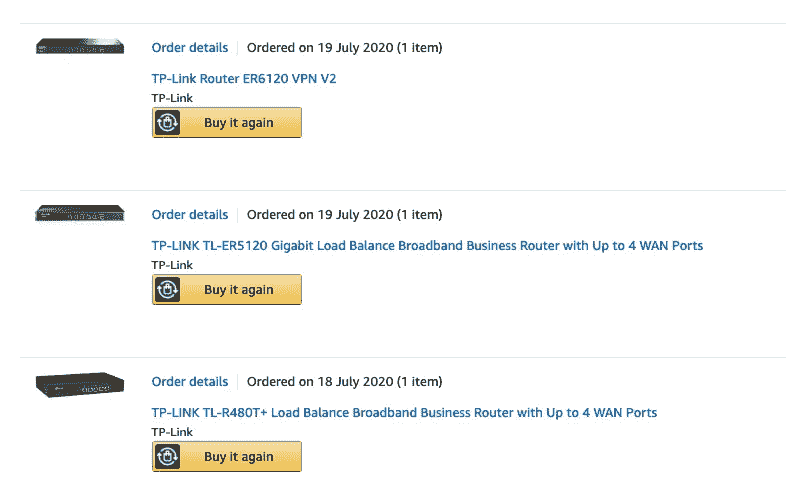
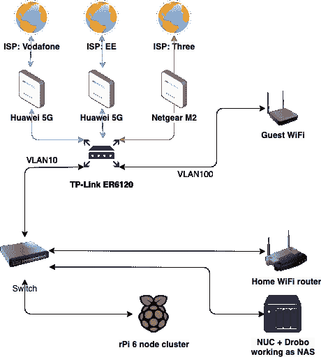

# 我上网很快。最后。

> 原文：<https://itnext.io/i-made-my-internet-fast-finally-cb97f55361d9?source=collection_archive---------1----------------------->

## 困难时期需要更多的硬件

我们呼吸着互联网，鸣谢:fancycrave1 @ pixabay

欢迎来到未来的世界，那时每个人都在家工作，或者至少尝试在家工作，稳定的互联网连接就像空气一样重要。没有稳定的连接和合理的速度，我无法参加会议，我的工作也不像我希望的那样高效。晚上，我甚至不能和家人视频通话，也不能在众多流媒体平台中的任何一个上看东西。在进入恐慌模式之前，你可以做些事情。

# 他们说，在家工作

我有幸住在伦敦市中心，那里道路施工或损坏互联网电缆等事件时有发生，而且不可避免。作为一名承包商，我不允许自己长时间离线，通过手机上网可以暂时解决这个问题。然而，它只能为我的笔记本电脑提供互联网接入，而不是我家里所有其他需要网络的设备。

互联网提供商方面的中断也时有发生——我们已经看到了多个移动和传统提供商失败的例子，原因可能是洪水、火灾、设备失窃或简单的配置错误。

我遇到的另一个问题是你不能超越的带宽和限制——例如，我的大楼与交易所相连，它正在被伦敦最受欢迎的地铁站之一使用；因此，对它的任何升级(如光纤)将最后到达(根据英国电信提供的信息，我没有时间等待他们将 2000 年的 16 兆比特/秒的速度提升到 2020 年的速度)。

# 准备和研究

由于上面提到的速度限制，我决定最大限度地利用我住的地方。伦敦市中心通常意味着“巨大的移动网络覆盖”。我买了几个移动互联网路由器进行测试，还买了所有主要供应商的外置天线和 sim 卡，连续两周每天进行多次速度和 ping 测试，并记录结果。然后，我比较了每个提供商的一年合同成本和他们提供的速度，寻找并同意潜在的折衷方案，毕竟，以每年 100 英镑的额外成本，2mb 的差异是什么？

在与多家路由器和提供商进行了周末测试阶段后，我决定继续使用**网件 M2** ，因为它提供了两者——速度快、电池寿命长(如果需要，还有额外的好处——可拆卸电池)、端口转发和漂亮的配置界面。

**重要端口转发注意:** 英国几乎所有的移动互联网提供商都利用 CGNAT，破坏了从你内部网络进行端口转发的想法。唯一拥有端口转发功能的移动运营商是三移动运营商(我个人对此有意见，尽管没有其他选择)。

**第二互联网连接** M2 让我了解了 4G/LTE 连接。尽管如此，我仍然很幸运地生活在所有主要供应商都优先购买 **5G** 的地区，我的选择是——与竞争对手相比价格有点高，但绝对惊人的稳定和快速的 EE 互联网。

作为沃达丰英国的客户，我已经有十年了——我继续使用另一个移动路由器，并插入了我的打折 sim 卡，里面有无限的数据。

# 让这一切一起工作

三个连接，一个 WiFi 路由器和在亚马逊上几个小时的研究导致了一些购买(感谢他们慷慨的退货政策！)进行进一步测试。

我尝试测试的 WAN 负载平衡器列表

我最终保留了 **TP-Link ER6120** ，因为

*   支持千兆位连接(TL-ER5120 缺乏广域网速度，这在小字体中)
*   内置的 VPN 服务器和客户端(我在移动设备和云基础设施中使用)

我想到的下一步是尽可能合理地规划网络，并限制数据包在内部通信时需要经过的潜在跳数。

**设置要求:**

*   Raspberry Pi Kubernetes 集群主要与自身(节点之间)和 NUC 进行通信，以共享 NFS 资源；因此，将其连接到千兆位交换机可能会改善上述连接本身。
*   家庭 WiFi 被用来访问互联网，但我也经常在集群周围闲逛——轻松访问共享资源(传输和流媒体)。
*   访客 WiFi 应该可以访问互联网，但不能访问任何内部资源。
*   rPi 群集可能会暴露几个端口，它们应该通过 M2 建立隧道，因为这是唯一允许端口转发的连接。

我当前的家庭网络图

# **最终结果和提示**

从提供的“惊人的”16 兆比特/秒，我已经成功地迁移到欢呼 400-600 兆比特/秒的连接(当然，这取决于风)。这让我可以舒适地工作、构建、创建和使用娱乐，而不必担心缓冲或掉线。我在将近一年的实验和测试之后写了这篇文章，就我个人而言，我不认为我会再回到单一提供商连接上来。

如果在操作员级别出现潜在故障，WAN 平衡器将自动检测这些故障，并以无缝方式暂时禁用此连接，以便在恢复服务时恢复连接。伦敦市中心三大移动网络瘫痪的可能性几乎为零，如果发生这种情况，寻找食物供应和抗击僵尸将比接入互联网更重要。

**旅途中我学到的一些小技巧和事情**

*   **启用应用优化路由**如果您想充分利用您的互联网连接的潜力(总和),应该关闭。这可能会时不时地给 FaceTime 带来一些问题，但没有什么太大的破坏性。
*   **动态 DNS** —我强烈建议使用内置的动态 DNS 客户端，因为你的 ISP 可以随时强制改变你的外部 IP，尤其是如果你运行 VPN 或端口转发的话。
*   默认情况下，华为路由器会努力让你的家庭网络 **IPV6** 友好。你真的不希望它作为转换 IPV4 — IPV6 和回到 IPV4 往往会减慢速度。