# 我想要我的 MT(v)

> 原文：<https://itnext.io/i-want-my-mt-v-6d7c691fb308?source=collection_archive---------3----------------------->

## 或者在 golang 中使用 Actor 模式的多线程

*那没用，那是你做的方式
免费的频道和免费的线程*

*(本博客授权**所有代码授权*[*https://www.apache.org/licenses/LICENSE-2.0*](https://www.apache.org/licenses/LICENSE-2.0)*)*

吉他图片来自[https://flyclipart . com/electric-guitar-clip art-free-download-clip-art-electric-guitar-clip art-729992](https://flyclipart.com/electric-guitar-clipart-free-download-clip-art-electric-guitar-clipart-729992)

我最近和一位工程师一起审查代码，在那里我提出了一个消息队列的 golang 抽象。他们发现我的界面很奇怪，因为我本质上是使用 goroutines 和 channels 执行同步动作。考虑以下接口:

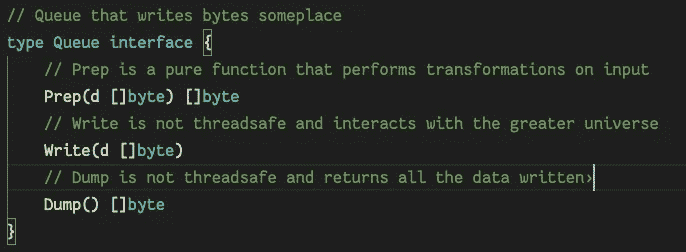

目标接口

我想在这个接口上写一个抽象，接受各种实现(例如写到一个保持打开的文件的末尾)，解决线程安全问题，并允许我的程序一次处理任意数量的队列。

# 标准解决方案

我的同事提出了以下抽象接口:

golang 的 Java

*写*和*转储*功能是同步的，并且至少在某种程度上是上下文感知的(稍后将详细介绍)。这是一个非常合理的抽象，您可以用标准的面向对象的方式来使用:

1)创建编写器。

2)打电话写一些路线。

3)调用 goroutines 中的 Dump。

4)使用某种内存屏障来保证这些操作不会竞争。

下面是一个实现示例:

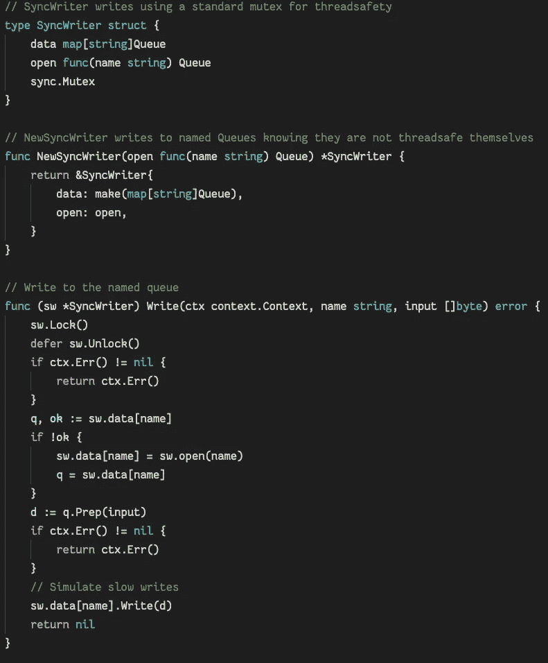

互斥使它变得安全

互斥体用于保护这两个映射结构。这些映射包含对非线程安全对象的引用。即使对映射的访问是在临界区内完成的，也不能在内存屏障之外的队列对象上调用任何方法。这是不幸的，因为我们不能利用 *Prep* 函数的纯粹性，并且在没有潜在竞争条件的情况下并行使用它。

该实现可以同步使用，如下所示:

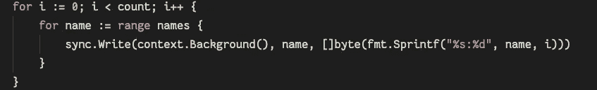

简单而优雅

异步地:

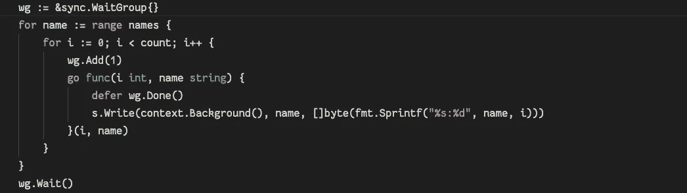

叉和加入，就像过去一样

这个界面很简单。只要它与相对较少的并发写入者一起使用，并且队列的写入时间/CPU 成本相对较低，这种解决方案就能很好地发挥作用。不幸的是，当编写库抽象时，创建抽象的人对如何使用它几乎没有控制。理想的做法是避免为了写入一个队列而必须锁定所有命名队列，并且理想的做法是在系统中引入弹性，以处理突发流量/在*准备* / *写入*时的可变等待时间。

# 演员解决方案

下面的接口将编写器本身呈现为一个响应任意信号的参与者，而不是一个单独的“ *Write* 方法。此结构代表用户行事，但间接这样做:

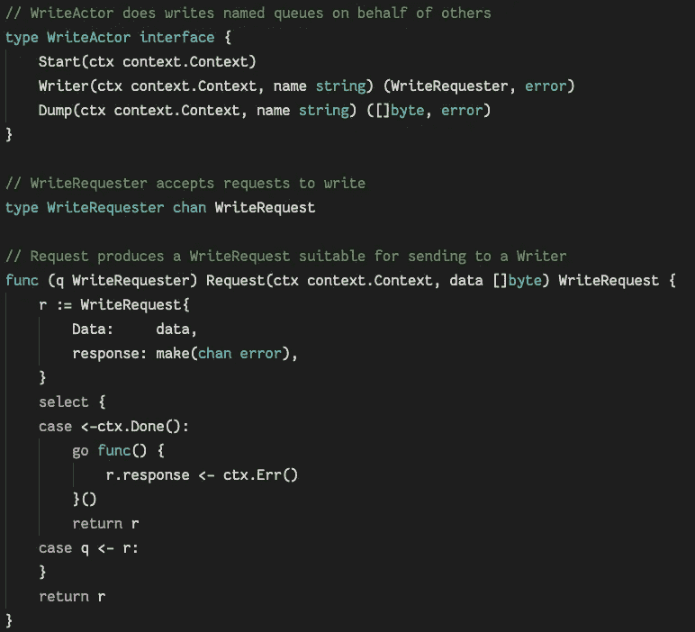

它使用信道，所以它必须很快

这很大程度上是不言自明的。actor 必须在可以使用之前被" *Started* "，一旦完成，就可以创建作为写通道(隐式线程安全)的 Writers。虽然它不接受纯字节，但是它有一个新的用户可以用来交互的对象，即 *WriteRequest* :

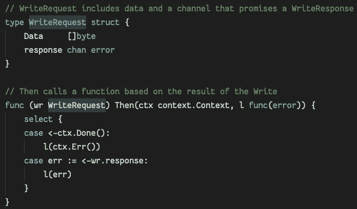

golang 的 Javascript

这个对象是简单地从一个字节片输入中创建的，但也作为一个承诺。当调用者希望知道写操作的结果时，只有当写操作完成时(或者上下文已经过期)，才能使用“*”方法发出回调。*

了解了这一点，我们可以看看这些演员是如何构成的:

队列在哪里？

请注意， *AsyncWriter* 中的一切都是线程安全的，假设 *open* 函数不会对不同的命名队列产生副作用。还要注意，与前面的编写器不同，结构中没有存储打开队列的位置。相反，它们存在于函数堆栈中。在我们开始之前，首先让我们看一下公共编写器函数，因为它也说明了 golang 中这个 actor 模式的一个关键特性:

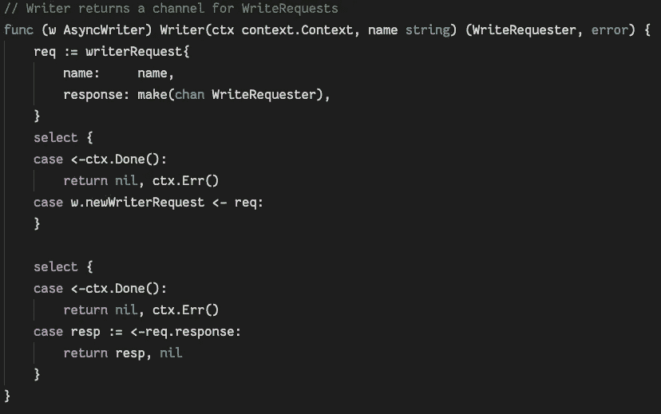

这里没有排队，你忘了吗？

引用我同事的话:“什么是 *chan chan* ？”。由于每个命名队列的通道必须由 actor 线程创建，因此通道的通道用于与调用者通信。 *Writer* 方法是从“线程 0”中调用的，因此用于任何给定队列的通道通信也必须通过一个通道。此外，请注意，上下文不再以同样的方式使用。go 上下文的 *Done()* 通道在每个 select 中使用，而不是检查临界区中的错误条件(以避免关机时的睡眠理发师问题)。在上下文过期(关闭等)的情况下，内部通道上的接收/发送决不会阻塞。).

现在，考虑到公共接口，这里是演员本身:

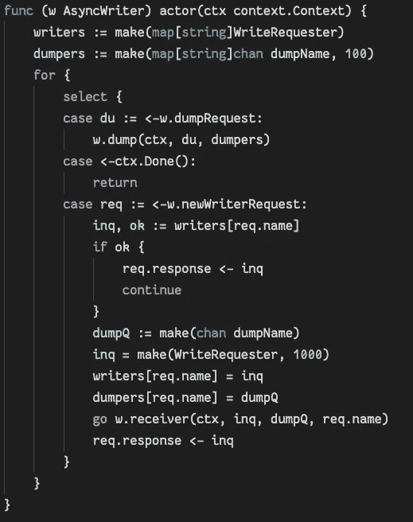

说真的，我想你忘了实际的队列…

“ *actor* ”方法是私有的，并且像该实现中的所有方法一样，不是指针接收器(接收结构的副本，不能直接改变任何成员)。actor 方法包含两个映射，但是同样，队列本身也不存在。actor 的主循环包含关闭上下文 2 种情况:

1)接收一个转储请求，将其发送给“*转储*方法。

2)接收“作者”请求。

关注主路径，我们看到返回给*作者*的调用者的通道图在这里被管理，还有转储数据的逻辑。每当一个新的队列被打开时，另一个线程就开始代表 actor，一个" *receiver* "来实际读取给调用者的通道。进入*接收器*后，我们终于在堆栈上找到了开放队列:

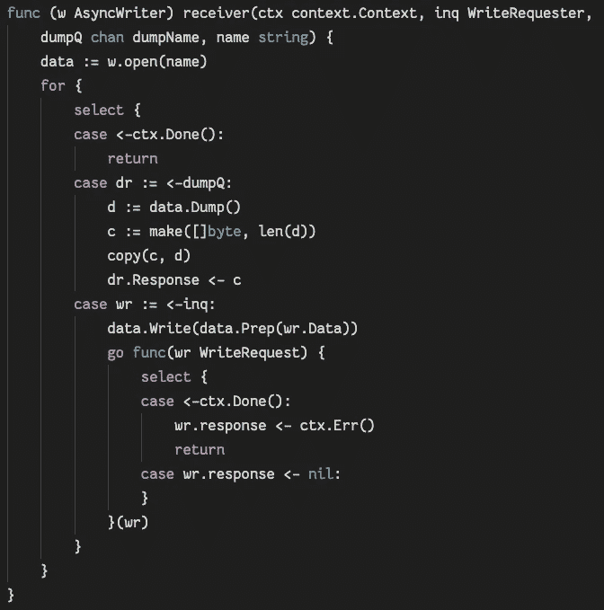

最后，但为什么它只在堆栈上？

像它的父 goroutine 一样，这个接收器只是一个用于 - *选择*循环的*。接收并处理转储队列的请求。这里进行非线程安全的" *Write* "调用，结果交给一个 goroutine 来处理。响应承诺是无缓冲的，因此在没有立即调用“ *Then* ”的情况下，这是必要的。*

有了这些，问题可能是，我们为什么要烦恼呢？看这个演员是怎么用的有帮助。从测试中我们看到了一个原型函数:

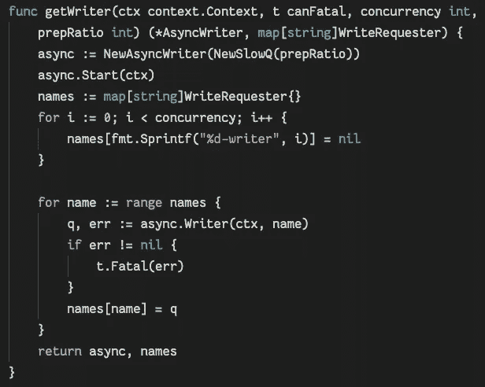

想象一下在 Initialize()方法或构造函数中使用它

创建并开始编写器(暂时忽略间谍 *NewSlowQ* )。收集了几个命名队列供以后写入。

对于同步操作，由于承诺和对上下文的处理，代码比第一个实现稍微复杂一些:

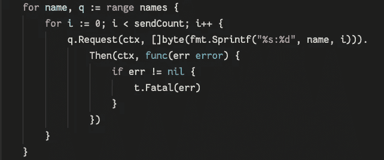

现在看起来很像 Javascript

更复杂，但是我们已经获得了一个优于面向对象方法的优势:它的核心是上下文感知的。与其他会阻塞 *Prep* 和 *Write* 的实现不同，当上下文结束时，主执行将立即被释放，一旦这些调用异步完成，相关的 goroutines 将自动终止。

不甘示弱的异步实现稍微复杂一些，但大多数是锅炉板线程管理:

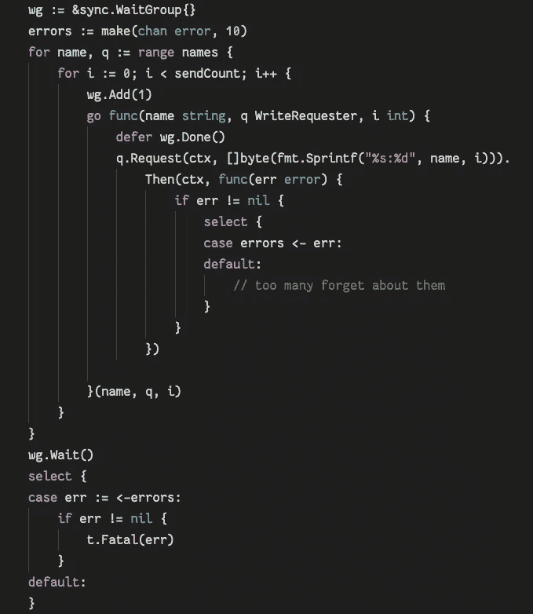

…更深入一点

这将利用通道收集错误，依赖于 actor 本身的相同技术。唯一值得注意的区别是*错误*通道相对较短，如果它已满，额外的错误将被丢弃(没有"*零*"错误可能会浪费资源和队列深度)

# 证明它

解释了这个机制之后，我们又回到了根本问题:为什么要这么麻烦？已经说明了，除了更好地处理上下文，标准的面向对象解决方案可以异步使用。证明演员是更好的方法的唯一方法是测量它。我用以下场景构建了基准:

1.  两种实现的同步操作。
2.  两种实现的异步操作。
3.  猝发操作，其中停滞期的持续时间与流量洪流之间的写入时间大致相同。
4.  10、100 和 500 同时打开队列。

队列的“实现”如下:

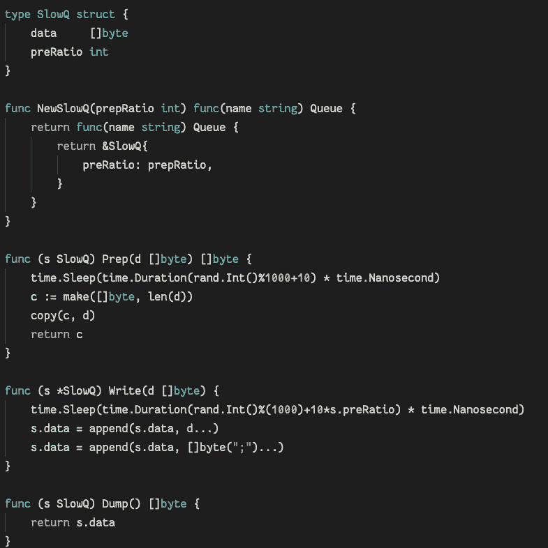

一个纯粹的“Prep”函数通过输入的一个副本，对于这些测试 preRatio==1

原始数据:

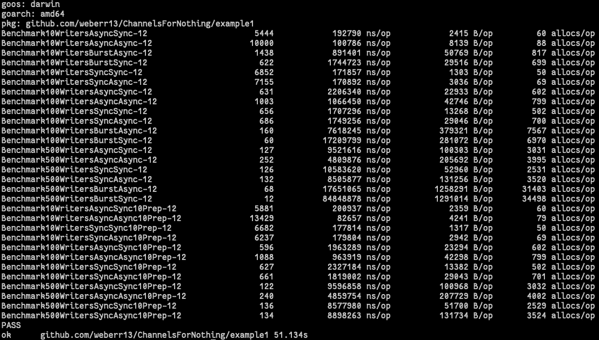

还有漂亮的照片:

有许多功能会立即跳出来:

1.  当同步使用时，传统的互斥方法在某些情况下比 actor 执行得更好(~%10)。
2.  异步使用时，actor 始终比基于互斥的解决方案高出 40%左右。
3.  对开放队列的引用的非线程安全性迫使互斥方法保护整个写操作。由于这个关键部分，异步线程的性能无法产生更好的结果。
4.  参与者处理突发流量的效率要高得多，而且随着管理的队列越来越多，这种效率会显著提高(速度提高 4 倍)。

# 结论

在说明行动者模式的过程中，还应该清楚的是，通过在 golang 中以不同的方式思考问题，可以获得很大的效率收益。“*陈*”和“*走*”关键词应该被当作一等公民对待，因为他们是。正确使用时，它们应该像 go 代码中的“ *if* ”和“ *for* ”控制结构一样常见。

通道不仅仅是一个通信缓冲区。这个实现说明了它们可以实现其他同步抽象，比如承诺。反过来，Goroutines 可以负责管理只能通过通道访问并存储在堆栈上的动态资源。它们不仅需要使程序的各个部分异步。最后，通过这两个核心关键字，golang“context”与 actor 模式协同工作，在多线程代码中创建快速取消和关闭行为。

示例都是在 Apache 2.0 许可下获得许可的，可在[https://github.com/weberr13/ChannelsForNothing/](https://github.com/weberr13/ChannelsForNothing/)获得