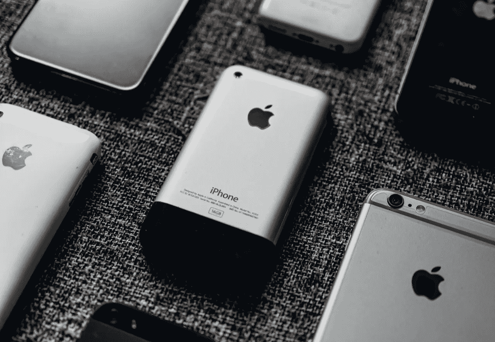
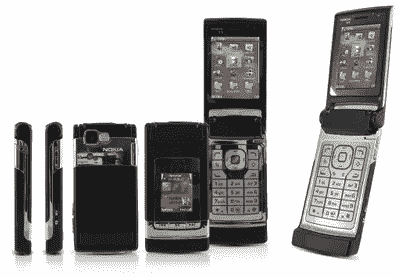
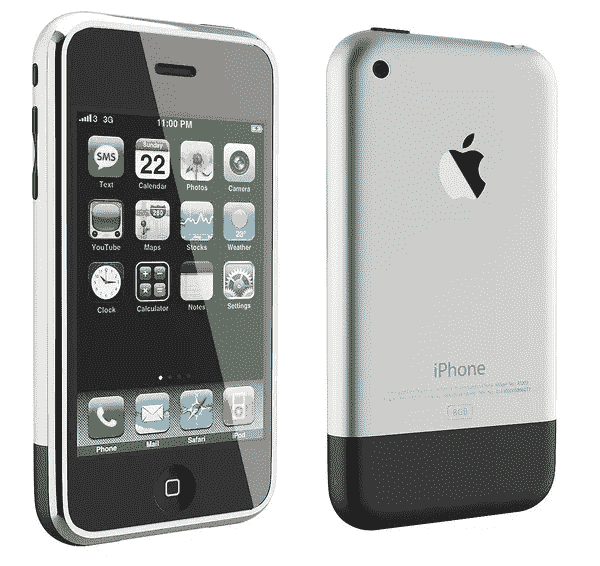
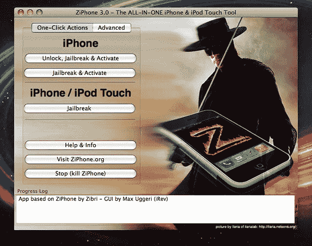
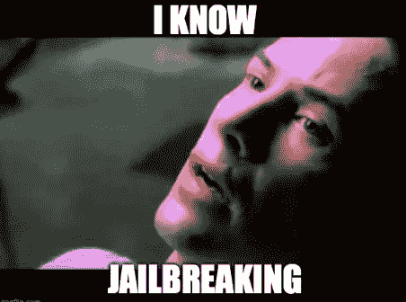
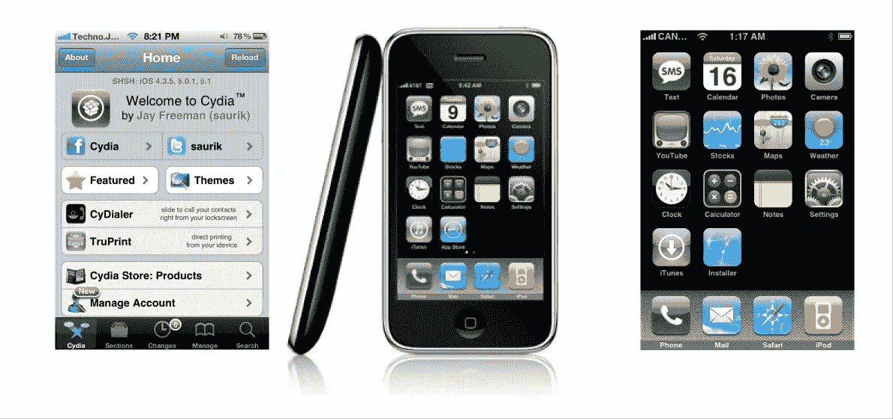
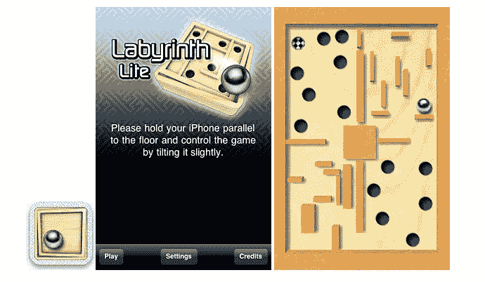

# 2008 年，我在黑苹果手机

> 原文：<https://itnext.io/i-was-hacking-iphones-in-2008-7edb4790b1b2?source=collection_archive---------2----------------------->

图为 [Unsplash](https://unsplash.com?utm_source=medium&utm_medium=referral) 上的 [Tron Le](https://unsplash.com/@tronle_sg?utm_source=medium&utm_medium=referral)

你好👋

我叫 Luke，是一名软件开发人员。早在 2008 年，我还是一个好奇的书呆子少年，热爱新技术。事实证明，这种好奇心让我成为了一名软件开发人员。

# iPhone 发布时我在摇什么🤘

iPhone 于 2007 年发布，全世界为之疯狂！当时我 14 岁，我认为这是有史以来最酷的事情！有趣的是，当时我并不是很书呆子，但有什么东西把我推向了苹果的新手机。

现在，让我们回到 14 年前。

我是一个口袋里装着诺基亚 N76 的胖小子。我认为这是一项看起来非常时髦的技术，但事实是我所有的同学都取笑我说:*你不能为男生找到一部手机吗？*或者*这是一款女生用的手机！哈哈！他有一部给女孩用的手机！是啊…孩子们🤷‍♂️*

诺基亚 N76 是一款翻盖手机，在镜子后面有第二块更小的屏幕:

作为一个坚强的孩子，我试着忽略他们，不屈服于他们的欺凌。让我告诉你这并不容易😂

然后 iPhone 发布了。不幸的是，它在我的国家不可用。真扫兴。尽管如此，我还是想让我的父母在我 15 岁生日的时候给我买一个 iPod touch，它看起来几乎和 iPhone 一样酷。

> 对于那些认为我被宠坏了的人来说，我可能会让你们失望，因为我在父母的公司里积极地帮助他们😉

在做了一些调查后，我发现本地 iPod 和英国进口 iPhone 的价格几乎相同。差价约为 20 美元。但是有一个问题 iPhone 被锁定了。它只能通过任何方式与英国承运商一起使用…

# 做研究🧑‍💻

通常，周末我会和我最好的朋友在一起。我们去了一家又一家的手机店，看那些很酷的新手机。我们在业余时间没有更好的事情可做。

为什么我们不直接用谷歌搜索这些手机呢？因为那时候我们口袋里还没有谷歌！你现在想起来真是疯了！

在我们的一次旅行中，我问柜台后面的人，他们是否可以让 iPhone 与我们当地的运营商合作。

是的，当然，他说。太好了！我被陷害了！我可以用 iPhone 当手机！

压力很大，因为我在生日前一个月找到了我的生日礼物。作为一个有耐心的孩子，我把它放在了发现它的地方。我不想破坏父母给我的惊喜，因为我不是 100%确定他们会给我买 iPhone。

在我的脑海中，我仍然不确定我是否有可能在我的国家使用电话。基本上有太多未知的变量，他们中的大多数都倾向于不太令人满意的选择——不工作的 iPhone。

很高兴我们家里有谷歌😂我想好好利用它，并决心找到答案。所以…我花了几个小时在谷歌上搜索，学习越狱、解锁和激活 iPhone 的技巧。我学到的东西比最初预想的要多得多。它从基础开始:使用一个名为 Ziphone 的程序来解锁和越狱手机。

ZiPhone 的新版本

于是，就有了这个“可能出错的事情”的兔子洞。我了解到，当你在越狱期间破坏了什么东西(我相信我会)，你需要将 iPhone 置于两种模式之一，以便恢复手机操作系统。恢复模式–恢复 iPhone OS 的用户友好模式，当然还有 DFU 模式(设备固件升级模式)。第二个很吓人。手机看起来好像关机了，所有的按钮都没有反应。唯一让手机放弃 DFU 模式的是，它被 iTunes 应用程序识别为一个坏设备。

你们中的一些人可能甚至不记得 iTunes——唯一可以更新和恢复 iDevices 固件的应用程序。几年后，OTA 空中更新出现了。

到我生日的时候，我知道了所有关于越狱和解锁 iPhones 的事情。

在聚会上，我把它从盒子里拿出来，立即连接到我的电脑上，3 分钟后一切都设置好了。

> 我是一名 iPhone 用户。

# 工资单上的黑客💸

凯文·Ku 在 [Unsplash](https://unsplash.com?utm_source=medium&utm_medium=referral) 上的照片

我对我的新手机非常满意，但我还是和我的朋友去了那些手机店。这一次不使用他们的服务——只是闲逛😎

在那里的一天，手机店来了一个拿着 iPhone 的家伙。

我特别记得那个时刻，因为它塑造了我的未来。

他有一部安装了 1.1.2 版 iPhone OS 的 iPhone，他想解锁它。老板对他说，这是不可能的，现在没有人有能力做到这一点。

> 有我。
> 
> 站着。
> 
> 口袋里装着解锁越狱的 iPhone。

我说这可能吗，如果他愿意，我可以为他做。显然，他们不相信我，但当我给他们看我的 iPhone 时，他们改变了主意。

起初他们不信任我，我不得不把我的笔记本电脑拖到那里，这样我就可以施展我的“魔法”了。我做了我应该做的，他们甚至要求我再做一次！我记得在我下一份“工作”的时候，iPhone 3G 已经发布了，这是第一款与当地运营商合作的 iPhone。解锁不再需要那么多，但越狱仍然需要，因为那时的 iphone 与现在的 iphone 完全不同。稍后会详细介绍。

这还不是结束。店主最终信任了我，开始给我 iPhones，这样我就可以在家使用它们了。今天回想起来，这确实是一件非常愚蠢和不负责任的事情。

我当时 15 岁，没有驾驶执照，坐公交车去学校，让我告诉你——我的公交车站不在安全的街区。有一次我收到了 10 部 iPhones。就这样。

等公共汽车时，我差点尿裤子。很高兴，没有坏事发生在我身上，但我不建议任何人这样做。

# 为什么我今天没有听说越狱？

答案很简单。iPhone OS，或者更广为人知的 iOS，成为了一个好得多的操作系统。作为一个在 iPhone OS 1.1.2 上开始旅程的 OG iPhone 用户，我可以告诉你，iPhone 在当时并没有那么有用。甚至与其他“哑巴手机”相比。这是革命性的——不要误会我的意思，但在他最初的形式中，它缺乏……很多。

没有 AppStore 这种东西，所以没有后来出现的应用程序或游戏。你不能改变主屏幕壁纸——它只是黑色背景。你可以用 iPhone 拍照，但没有录制视频的选项。发送彩信也不是一个选择。甚至重新排列图标也是不可能的。

如果你有一个越狱设备，所有这些都是可能的。一开始越狱之后，你有了 Installer——一个允许我们安装第三方程序和软件包的应用。后来弹出了类似的包安装程序——cy dia。

左起:Cydia 屏幕、iPhone 2g 和带安装程序的 iPhone 2g

我在安装程序上有自己的存储库，在那里我有让 iPhone 更有用所需的一切。我正在安装允许发送和接收彩信，录制视频，等等。过了一段时间，我甚至安装了第一个使用陀螺仪的应用程序——迷宫。

我在 iPhone 上的第一个(非官方)游戏——孢子不是第一个😉

我看了越狱今天的样子。还是个东西！在我看来，现在没有必要。除非你想控制你的设备上的所有东西，并且你想损害你的安全😉

我们不必破解手机来发送和接收图像，我们有更多的游戏可以玩。

什么都有 app！

# 我今天黑的是什么/结论

我再也不越狱了。即使是对于我自己的手机，但是对于这段历史，我心里有一个特殊的位置。

几年后，在选择大学时，我妈妈对我说:

> 也许你应该试试计算机科学？你似乎很了解电脑。

她是对的！我从来没有像我的朋友一样玩过电子游戏，现在仍然没有。比起使用它们，我总是对某些东西如何工作更感兴趣。她的建议是我得到的最好的建议！现在，10 多年过去了，当我开始在我的职业中做或学习一些新的东西时，我仍然觉得自己像一个圣诞夜的小孩。可以肯定地说:

> 我的工作是我的激情。我的激情就是我的工作。我做我喜欢的事。

越狱这一集是达到这种精神状态的旅程的一个重要部分。记住，永远不要低估你在生活中做的任何事情，即使它看起来很小。你永远不知道它什么时候会引导你！

*让代码与你同在！*

卢克(男子名)