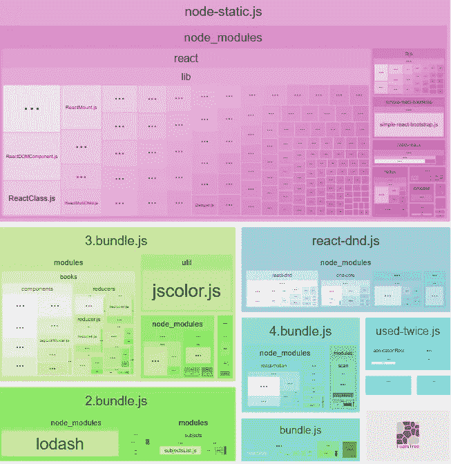
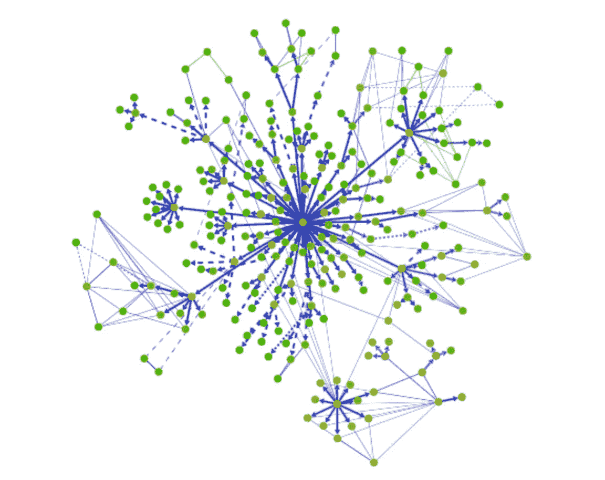
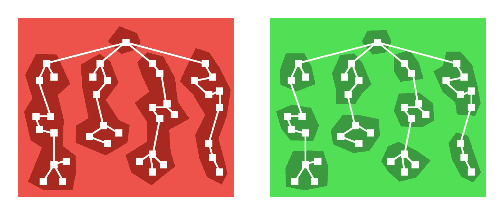
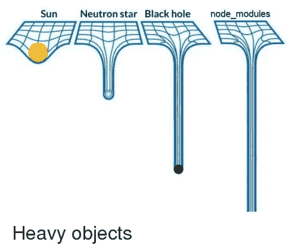
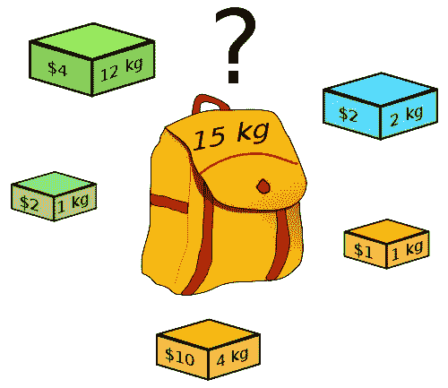
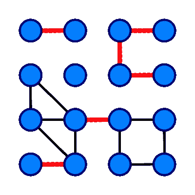

# 我会把你撕成碎片！

> 原文：<https://itnext.io/i-will-spilt-you-into-the-pieces-dfa1ae97bede?source=collection_archive---------0----------------------->

> 640 kB 对任何人来说都足够了。


剪刀手爱德华，高级分裂者。

[*点击这里在 LinkedIn 上分享这篇文章*](https://www.linkedin.com/cws/share?url=https%3A%2F%2Fitnext.io%2Fi-will-spilt-you-into-the-pieces-dfa1ae97bede)

代码分裂是最近流行的谣言。更清楚地说

> 代码分割不是你应该知道的事情。
> 
> 代码分割是你应该使用的东西。

这里我们遇到了一个问题——从一个角度来看——现代的代码分割很容易做到——只需使用动态`import`。从另一个角度来看，您实际上想要归档什么？

> 你想分什么。你需要推迟什么？

有两个答案——JavaScript 代码和资产。你知道，现在资产也可以是 javascript 代码。

但换句话说，区别更简单——*web pack 控制资源*和不控制资源，就像静态图像一样。

> 现在我们将忘记第二部分，只要处理它是 CDN 的职责。

那第一部分呢？关于 JS-bundles 的代码拆分？我可以说——你弄错了。不要误解这个想法——你只是忘记检查一些实现的细节。

> 剧透——你使用代码分割越多，你可能实现的代码分割就越少。

而根本问题是**代码重复**，或者说代码去重复，你也想实现。

让我告诉你一个你从未听过的故事。以前…其实以前没有问题。

# 之前。

以前没有模块。无模块==无忧。只有脚本标签。

每个人都在创建一个巨大的 javascript 文件，或者在源 HTML 中一个接一个地包含十几个小文件。

> “模块”是后来发明的。至少在 JS 诞生 10 年后。

我几乎不记得 google closure 编译器或 dojo 的“模块”是什么意思了。但是第一个“普通的”commonjs 模块是 nodejs 自带的，没有办法在浏览器中使用它们。

点击此链接，简要了解 JavaScript 模块——

[](https://medium.com/sungthecoder/javascript-module-module-loader-module-bundler-es6-module-confused-yet-6343510e7bde) [## JavaScript 模块简史

### 你是 JavaScript 新手，对模块、模块加载器和模块捆绑器感到困惑吗？或者你一直在为一个…

medium.com](https://medium.com/sungthecoder/javascript-module-module-loader-module-bundler-es6-module-confused-yet-6343510e7bde) 

因此，前端有两种生存选择:

*   使用 browsery(gulp，webpack)将所有资源打包成一个大文件。
*   使用 AMD/RequireJS/SystemJS 并要求模块作为模块，从前端一个接一个。

而第二条路却不是这样。它慢了很多。比单个包慢 N 到 M 倍，其中 N 是模块数量，M 是*嵌套*层级。M 更重要，我们可以并行加载十几个模块，但是我们不能加载它们的依赖关系。为什么？我们不认识他们。

在中位数项目中，M 约为 10。所以要求至少慢 10 倍。使用 HTTP/2。不要试图在没有 HTTP/2 的情况下使用 Require.js。

记住，HTTP/2 在 Require.js 出现时还不存在——所以 BUNDLERS 赢了！

 [## webpack & HTTP/2

### 让我们从一个关于 HTTP/2 的神话开始:

medium.com](https://medium.com/webpack/webpack-http-2-7083ec3f3ce6) 

# 一捆就能统治所有人！


整体捆绑包装

Webpack 是当今事实上的标准。接受吧。有无数不同的文章介绍如何正确设置它，然后处理它。最复杂的是关于长期缓存、提取公共/供应商数据块以及将整个应用程序拆分成一组“异步”数据块。

也许我在 webpack 上读到的关于“CommonChunking”的最好的文章是 Adam Rackis 的文章，你也必须读一读。

[](https://medium.com/@adamrackis/vendor-and-code-splitting-in-webpack-2-6376358f1923) [## webpack 2 中的供应商和代码拆分

### Webpack 是一个雄心勃勃的强大工具，用于捆绑现代 web 应用程序。不幸的是，它的复杂性会使它…

medium.com](https://medium.com/@adamrackis/vendor-and-code-splitting-in-webpack-2-6376358f1923) 

所以——答应我，你会读它。但简而言之，这篇文章解释了如何将应用程序切割成碎片。**适当的**切成**正确的**块。



Adam 从入口点提取了所有的东西，接下来他可以只加载他“现在”需要的代码。这是手工杰作的惊人范例。

> 你能看出这里的问题吗？

问题的名称是“使用两次”。在本例**中，它将包含在异步块**中多次使用的所有依赖关系。

其实这样挺好的。零重复。但是你可能会下载一些你现在不需要的代码，因为另一个程序块需要它，你迟早会需要的。

您仍然可以手动提取大的“依赖项”作为单独的块(如本例中的 *react-dnd* )，您可以调优公共块的创建，尝试控制模块和块之间的依赖项..

> 但是你会失败的

迟早你会失去控制。应用程序代码可能非常混乱，不同的模块经常访问相同的模块。

[](https://github.com/webpack/webpack/issues/690) [## 展示你的模块树问题#690 网络包/网络包

### web pack-JavaScript 和朋友的捆绑器。将许多模块打包成几个捆绑资产。代码分割允许…

github.com](https://github.com/webpack/webpack/issues/690) 

[Webpack bundle analyzer](http://webpack.github.io/analyse/) 可以可视化您的应用。你可能会发现，它看起来像…一个图表。



结果——在没有特殊控制的情况下，“使用两次”或普通的“CommonChunkPlugin”将在每次引入新的分割点时增长。

例如，React-loadable 鼓励你添加尽可能多的吐丝点，如果你觉得有必要的话。这是正确的，但有时不是“必要的”。



使用 react-loadable 进行代码拆分

您将从坚如磐石的应用程序开始，要求用户在页面加载时下载 10Mb。接下来，您将第一次拆分应用程序，第二次拆分应用程序，推迟所有可以推迟的组件，结果会是什么呢？

> 您拥有的块越多，使用相同模块的块就越多。使用两次的模块越多——越多的模块是公共的并被提取为公共的。

这可能会导致将所有 node _ modules 或应用程序的大部分代码移动到 CommonChunk 中。或者两者都有。



这可能有点不公平，也不是你想要的结果。

> 代码分割就像可变状态或多重继承——方便的工具，已经有数百万人使用过。但是可能会给你带来麻烦

# 哦不

它仍然很容易修复。只需运行 bundler analizer，引入更多的公共块，考虑添加或删除一些分割点。

> 保留你的手工杰作——杰作。

你能看出这里的问题吗？这是手工制作的中的一个错别字。应该是#0CJS。

> 但是 default webpack 的 automagics 会让事情变得更糟。

其实不是“会”，而是“曾”。与此同时，CommonChunkPlugin 很方便，但在 web pack 2–3 中很难处理——它刚刚从 Webpack 4 中删除了。

争取你阅读这篇文章的时间——它可能已经过时了。完全过时了。

Webpack v4 重新思考了大部分事情，不仅会自动将你的代码分割成块，还会自动分割块，并解决我上面描述的大部分问题。

> 正如我所说的——web pack 是当今事实上的标准。接受吧。

我对新方法没有足够的信息和信心，但它应该在没有任何配置的情况下接近完美。你仍然可以通过一些配置来完善它。

这里唯一的问题是——默认配置。如果出现以下情况，将会出现附加块:

*   可以共享新的块或来自`node_modules`文件夹的模块
*   新块将大于 30kb(在 min+gz 之前)
*   按需加载块时的最大并行请求数将小于或等于 5
*   初始页面加载时的最大并行请求数将小于或等于 3

它可能产生比你需要的更多的块，也可能产生比你需要的更少的块。应该对 99.9%的情况起作用，但它仍然是一个好主意，在它之后观看。

你可能没有注意到这个问题，但是 webpack 要解决这个问题，俗称**背包问题**或者**背囊问题。**



现在——打包！

你唯一应该知道的是—

> 背包问题的[决策问题](https://en.wikipedia.org/wiki/Decision_problem)形式是[NP-完全](https://en.wikipedia.org/wiki/NP-complete)，因此不存在在所有情况下都正确且快速(多项式时间)的已知算法。

# 另一种方式。

另一种方法是研究出图论，并在[桥](https://en.wikipedia.org/wiki/Bridge_(graph_theory))上进行拆分。



一个有 16 个顶点和 6 个桥的图(用红色突出显示)

只需分析包，找到“可切割”的部分…并切割它们。

好的方面是——这是 100%纯的#0CJS。

糟糕的是，没有办法实际控制分割过程。应用程序通常是如此复杂，以至于可能根本没有桥梁。

# 另一种方式

在“又一个指数”(Yandex)中，我们开发了另一种方法来解决这个问题。我们从 2011 年开始在生产中使用它，我仍然不明白为什么没有其他人也这样做。

我们的问题很简单——我们正在开发地图 API，类似于你可能会使用的谷歌地图，而且那个 API 非常庞大。和“一个大文件”。

仅供参考:地图 API 通常包括

1.  “地图”。几十个服务和瓦片引擎。
2.  “图形”。SVG，画布，VML，WebGL
3.  “模板”。像一个反应或反应王国
4.  “魔法”。至少有点魔力。

当你的站点正在加载时，你不需要这个列表中的 3/4。你不需要这个列表中的 2/4..你只是通常不需要大部分的东西。此外，我们必须在现代浏览器中支持 IE6–7–8，并且不希望向现代客户提供多填充和简化的模板。或者反过来。

我们找到的解决方案简单明了。它不需要任何火箭科学或图形计算。我们只是把所有的依赖暴露给 frontend，让 frontend 计算它需要加载另一个模块列表的模块列表，即顶层逻辑所需要的。

> 如果模块 A 依赖于模块 B 并作出反应——我们必须加载模块 A、B 并作出反应，才能得到模块 A。

这个问题(这不是问题)被 **ym、**或者仅仅是 [Yandex 模块](https://github.com/ymaps/modules)解决了。这只是 AMD 模块系统，类似于 SystemJS。事实上这不是 AMD，而是 LMD(懒惰)，但这不算文章。

```
['geoXml.util', '4e', '5!'],
['graphics.csg', '4f', '*_8!4T8H'],
['islets.traffic.layout.settings.slider.html', '4g', '1)1w14'],
['theme.islands.control.layout.routePanel.Button.css', '4h', '7u'],
['graphics.render.abstract.shape', '4k', ''],
['graphics.renderManager.canvasTile', '4l', '*X*18H4m4p'],
```

> 曝光的[模块图](https://api-maps.yandex.ru/2.1.60/map.js?callback=ym_map_fallback_url=https___api-maps_yandex_ru_2_1_60_map_js_filter=*&filter=*)表，一小部分。

第二个问题是实际加载所需的模块。不是作为一个包，因为我们的目标不是这样做。而不是小块，因为它们根本不存在。

我们没有找到更好的方法，只是将“模块组合器”暴露在互联网上。如果你需要 A、B 和 React——只需加载“`combine?module=A,B,React"`”，它就会把需要的模块串联起来并发回。还有什么比这更简单的呢？

```
[https://api-maps.yandex.com/2.1.60/](https://api-maps.yandex.ru/2.1.60/)combine.js?load=0d9c0h,j1Q(M9d1Z2b2f(L(H2h9f(K2n2p9k2s2w361n5k$C1h3$1v2,2j0b0e9r2C9m9o9u9v9x2H9p2F9t0u0n2S9A9C9D9F9G9K2Y9L219M25(N(O(P(R9O9P272$2_2(2)2:2@2I9U9T9V2q9X9Y91929396979R2i2Q2J993a0k9_9$3c9.3d9!9(3g3h(V(S(T(U(W9)&callback_prefix=ymaps_loader
```

> 这是一个真实的网址。“模块”被重命名为 2 符号长度的别名。

具有**完美异步分块和零复制**的模块系统已经完成。只要在它前面放一个小代理层，它就会**承受任何负荷**。

模块映射创建由 [**ymb**](https://www.npmjs.com/package/ymb) 处理，而服务器和客户端代码生成(又名“webpack-internals”)由 [**yms**](https://www.npmjs.com/package/yms) 处理。这两个包在几年前都是开源的。但是你不能用它们！🙀！

# 瓦特？

令人惊讶的是，你可能会发现 yms 实际上没有任何文档。而且 ymb 的 README 也不是一个(可以理解的)东西。

> 它们不是为你设计的。所以没有人真正使用它们。

这些工具不支持 babel、源地图、长期缓存、TypeScript、CommonJs(这就是为什么”🙀”)，以及所有这些东西，使 word class bundler 成为世界级的 bundler。

即使 ym/ymb/yms 是一个方便的东西——它们从未在我们构建的产品之外使用过。我们的构建工具从来没有“外部”客户。从未想过其他团队的要求。

> 我希望你明白我的意思——永远不要用它。

我写这些，只是为了让你更好地理解事情是如何运作的。

> package 的普通分块是如何工作的？

PS:但是我还是不明白，为什么每个人都“捆绑”静态捆绑包，而没有人使用“主动”服务器端。为什么不呢？