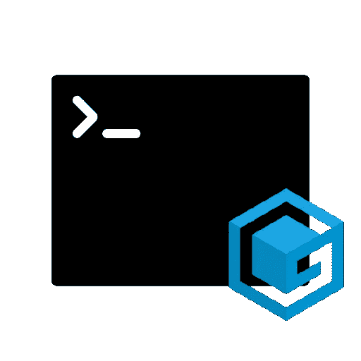
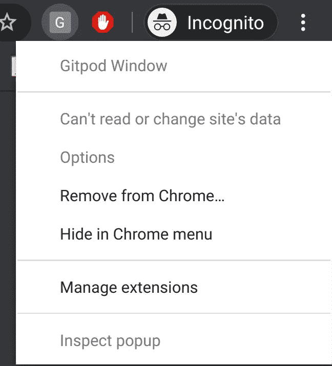
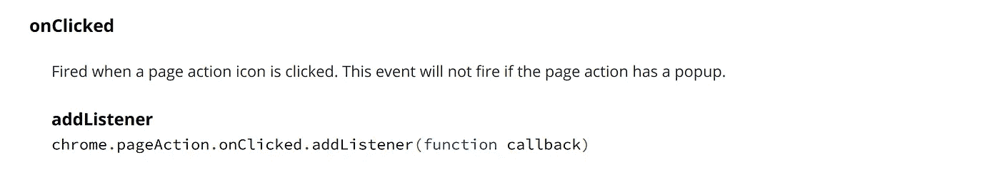
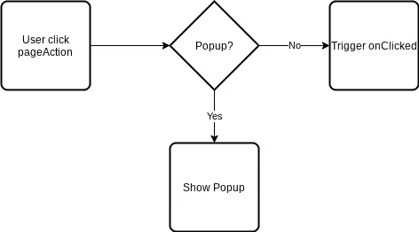
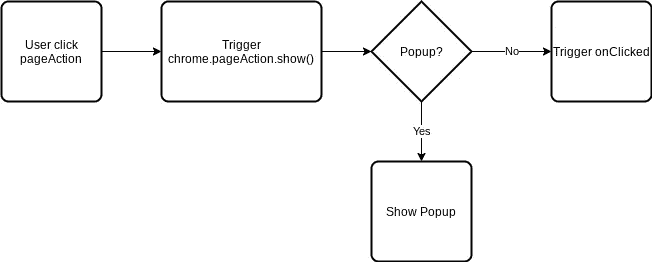
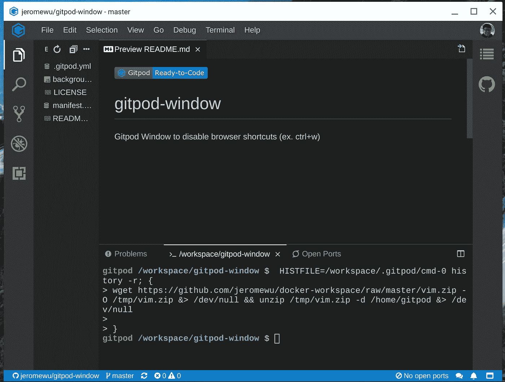

# 我写了一个 Chrome 扩展(Gitpod Window)。以下是我学到的东西。

> 原文：<https://itnext.io/i-wrote-a-chrome-extension-gitpod-window-here-is-what-i-learned-8583a3a179dd?source=collection_archive---------4----------------------->

Gitpod 是一个用于 GitHub 和 GitLab 的在线 IDE，它很棒，当我的笔记本电脑没有足够的资源时，它让我的生活变得更容易。但是作为一个 VIM 用户，当我点击 Ctrl+w(这通常用于在不同的 VIM 窗口之间导航)时，整个 Gitpod 标签页就关闭了，我不得不再次重新打开它，这很烦人。

这就是为什么我开始开发 Chrome 扩展(Gitpod Window ),让使用 Gitpod 的整体体验更好。我列出的要求是:

1.  当用户点击 GitHub 或 GitLab 页面上的扩展图标时，在弹出的 Chrome 窗口中打开 Gitpod 工作区
2.  禁用 Chrome 快捷键

由于我几乎没有构建 Chrome 扩展的经验，所以我写了这个故事来记录这个过程，并希望它能帮助像我这样的新手。😃

# 开始使用 Chrome 扩展

谷歌在这里提供了很好的官方教程:[https://developer.chrome.com/extensions/getstarted](https://developer.chrome.com/extensions/getstarted)

关键组件的快速总结:

*   提供了重要的信息
*   后台脚本:扩展在其后台脚本中监控事件，然后根据指定的指令做出反应

在这里，我们了解到后台脚本是我们可以监控事件的地方，它是实现我们目标的良好起点。

> 我建议那些想进行下一步的人先完成上面链接中的教程。

# 当用户点击 GitHub 或 GitLab 页面上的扩展图标时，在弹出的 Chrome 窗口中打开 Gitpod 工作区

可以想象，点击扩展图标是一个事件，所以我们可以在后台脚本中完成。

为了处理事件，有两种类型的动作可以选择: [pageAction](https://developer.chrome.com/extensions/pageAction) 和 [browserAction](https://developer.chrome.com/extensions/browserAction) ，因为我们的扩展只在特定的网站上工作，所以我们在这里使用`pageAction`。下面一个初级`manifest.json`:

在`permissions`中，我们添加了 GitHub 和 GitLab URLs 来限制这个扩展只能在存储库页面上工作。(例如。[https://github.com/jeromewu/gitpod-window)](https://github.com/jeromewu/gitpod-window))我们还添加了一个关键字`page_action`来标识我们将在这个扩展中使用`pageAction`API。

解决了`manifest.json`之后，接下来我们需要更新`background.js`来弹出带有[窗口](https://developer.chrome.com/extensions/windows) API 的窗口:

理想情况下，当我们点击扩展图标时，我们应该能够看到一个新的弹出窗口，但是如果你尝试编写上面的代码，你将会看到一个上下文菜单。

该行为与我们预期的不同，如果您仔细查看 chrome . page action . onclicked . addlistener()，您会看到一个有趣的语句:

[https://developer . chrome . com/extensions/page action # event-on clicked](https://developer.chrome.com/extensions/pageAction#event-onClicked)

> 如果页面操作有弹出窗口，则不会触发此事件。

由于我们没有对弹出菜单做任何事情，这意味着弹出菜单不存在，对吗？答案是肯定的，但是 onClicked 有一个奇怪的行为，通常应该是这样的:

但实际上，决定是在 chrome.pageAction.show()之后做出的

所以如果不先触发 chrome.pageAction.show()就不会触发 onClicked，我是在这里[查样本的时候发现这个答案的](https://developer.chrome.com/extensions/examples/api/pageAction/set_icon.zip)使用 onClicked 的时候真的是陷阱。

为了解决这个问题，我们需要在我们手动单击扩展图标的选项卡上触发 chrome.pageAction.show()。我们需要在[选项卡](https://developer.chrome.com/extensions/tabs) API 中使用 onUpdated 和 onActivated。在我们开始使用标签之前，不要忘记先更新`manifest.json`中的`permissions`:

然后让我们更新`background.js`:

这里的想法是在 GitHub 和 GitLab 页面上调用 chrome.pageAction.show()来触发 onClicked。

现在我们已经完成了我们的第一个要求！这是一个好看的弹出窗口，使 Gitpod 更接近于一个 IDE，但没有 IDE 可以用 Ctrl+W 关闭，让我们继续下一部分禁用快捷键。

# 禁用键盘快捷键

为了禁用快捷方式，我计划使用[命令](https://developer.chrome.com/extensions/commands) API，但最后我发现你不需要做任何事情，因为让我们讨厌的快捷方式是默认禁用的。(包括 Ctrl+W，Ctrl+N，Ctrl+T)所以我们在这里使用弹出窗口来完成这个问题！

希望你喜欢这个故事，如果你想了解更多关于这个 Chrome 扩展，你可以访问:

*   GitHub 库:[https://github.com/jeromewu/gitpod-window/tree/v1.0.1](https://github.com/jeromewu/gitpod-window/tree/v1.0.1)
*   Chrome 网络商店:[https://chrome . Google . com/Web Store/detail/git pod-window/jhpkpbhdoenpnfnnkelgpikndadikogdl](https://chrome.google.com/webstore/detail/gitpod-window/jhpkbhdoenpnfnnkelgpikndadikogdl)