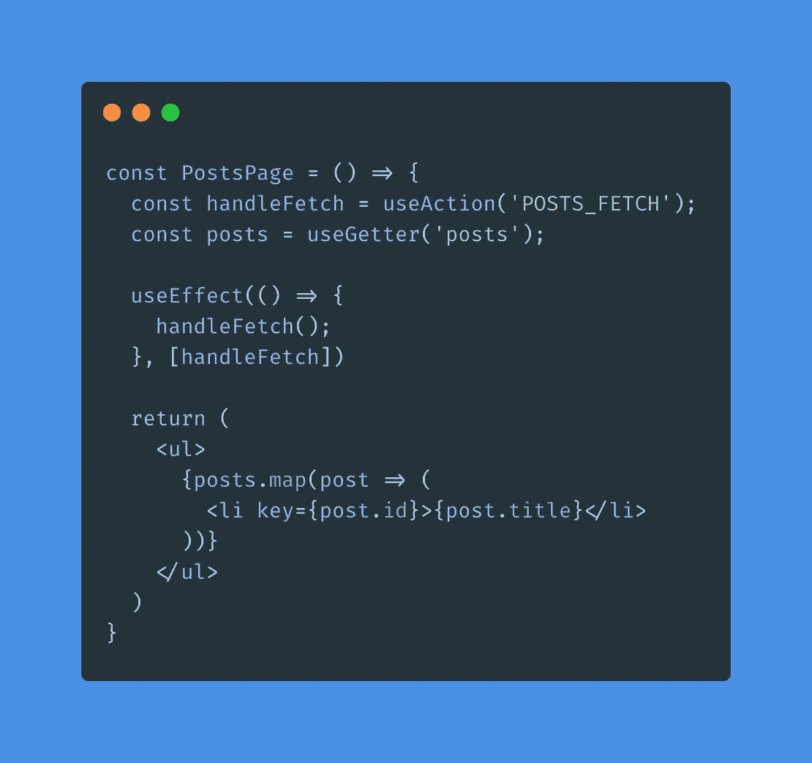
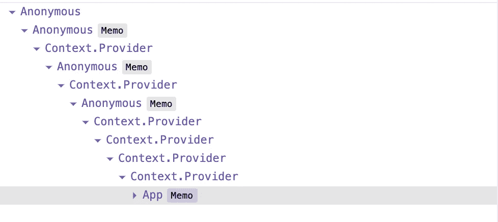
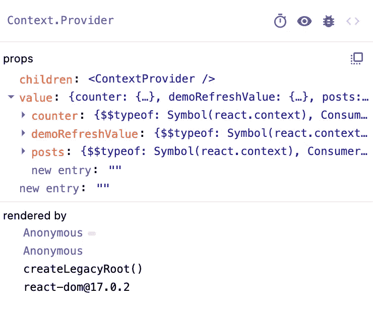

# 我写的是 vuex——但是对于 React！我所面临的挑战以及您可以从哪里获得这些挑战

> 原文：<https://itnext.io/i-wrote-vuex-but-for-react-the-challenges-i-faced-and-where-you-can-get-it-d465985d8a5?source=collection_archive---------1----------------------->



vuex-但是-for-react

发布后编辑:

> 让我澄清一件可能被误解的事。我知道 React 还有其他的状态管理库。这篇文章的重点不是假装我是唯一创建这样一个库的人。
> 
> 重点是让读者知道我在创建一个类似 vuex 的*用法*的库背后的想法和斗争，并解释我如何在每次值更新时使用 React 的上下文 API 和不必要的渲染来解决这个问题，同时尽可能地为用户保留样板文件。
> 
> 如果现有的状态管理解决方案非常适合您，并且您没有兴趣尝试任何新的东西，请继续阅读这篇文章，因为它可能不是为您编写的。

—

我是一个前端工程师，在 Vue.js 和 React 之间左右为难。如果你让我说 Vue 在哪些方面优于 react，我肯定会说全局状态管理选项(和 v-model！)，因为`vuex`已经接近完美了，至少从我的开发者的角度来看是这样的。我在 React 中使用过几个状态管理库，总是怀念`vuex`的简单性。

到目前为止，我认为 React 状态管理不可能达到同样的效果。不久前，我曾试图编写一个类似的实现，但是我的知识还不够。突然，我有了用我现在所知道的再次尝试的想法。

—

# 让我们从配置开始

我有一个想法，将一个类似于`vuex`的配置提供给我的库提供的一个更高级的组件，它会处理所有的逻辑，所以最终用户只需要做很少的工作。

我还不知道我是否能让它工作，但我知道这是我希望用户编写的初始化类型。

—

# 数据之争

当我传递配置和根组件时，我开始考虑架构。

**我知道我希望用户使用*一个*钩子**来使用 getters。

我还不知道如何提供数据。

## 如果我为数据使用一个上下文，每次我们的 getters 改变时更新它，然后使用一个定制的钩子来访问这个上下文，这是不够的。

这是因为所有连接到 getter 的组件都会因为上下文变化而重新呈现，即使与它们无关。这通常可以通过使用更高阶的组件来解决，消费那里的值，并将子组件包装在`memo()`中，或者使用类似的解决方案来存储和更新它。

**在这一点上，用户的实现比仅仅使用一个钩子要困难得多。**我不得不让他们用一个 getter 把每个组件包装在一个 hoc 中，这不仅对程序员不友好，而且

*   引入不必要的样板文件
*   让 React 在不必要的时候执行`memo()`操作(记住，这也要付出代价)

# 解决方案想法

当我处理我知道不会经常改变的值时，我已经知道要拆分上下文，并且我不想重新呈现整个组件树。此时，在花了一些时间思考之后，我知道我想要为每个 getter 创建一个*新的上下文和一个提供者。**我知道由** `**useGetter()**` **钩子**(它将在内部使用`useContext()`)**获得的值** **将保持不变**，假设我们将它连接到它自己的上下文，即使其他 getter’提供的值可能已经改变。*

现在的问题是——我能编码吗？我可以创建一个函数，将它的输出包装在一个新的上下文提供者中，直到到达 getters 的末尾吗？

# 怎么做

让我们回到配置。这里有四个区域:`state`、`actions`、`mutations`和`getters`。

该库正在创建和包装几个上下文:

*   用于**动作**的上下文提供者，包装在`memo()`中以防止重新创建
*   用于**突变**的上下文提供者，包装在`memo()`中以防止重新创建
*   一个用于 **getter 上下文**集合的上下文提供者，被包装在`memo()`中以防止重新创建
*   为*的每个 getter*动态创建上下文(和提供者)。
*   在这些上下文中，有提供的`App`组件，它被包装在`memo()`中以防止重新创建。



动态生成的提供程序

这意味着用`useAction()`钩子执行一个动作或者用`useMutation()`钩子执行一个变异会返回一个不能重新创建的函数。

动作不能访问当前状态(你可以通过突变来改变它),而突变在内部使用 React 的`useState()`,它总是为我们提供先前的状态参数。

由于这一点，我们能够把它们放在组件树的顶层，确信它们被记忆了。

这同样适用于 getter 上下文的集合。它是一个对象，具有与 getter 名称相同的键，每个键都有一个存储的上下文实例——没有它的值。



有上下文的提供者？？？

接下来是动态部分，对于每个 getter，您将获得当前返回值，并将其存储在 getter 的提供程序中。

`withStore()` hoc 内部存储两种状态:

*   数据的当前状态
*   当前 getter 值

**每次状态更新时，我们运行配置 getter 函数来确定要更新哪个 getter 的提供者。**

—

# 魔力

这就是你使用吸气剂的方式。幕后发生的事情是，您访问具有 getters 上下文集合的上下文，并根据键名选择您的上下文。

```
export const *useGetter* = (getterName) => {
  const getters = *useContext*(gettersContext);
  const value = *useContext*(getters[getterName])

  return value;
}
```

由于这一点，当有两个独立的组件— `<Counter />`和`<Posts />`并且每个都连接到自己的 getter 时，当另一个 getter 更新它的值时，它不会导致其他组件重新呈现。

## 没有备忘录。没有高阶元件。简单地消费并仅在变化时呈现。

—

# 和其他图书馆有什么区别？

我要说的是，用户为了让这一切正常工作，必须付出多少努力。

config 会处理你需要的一切，库会处理剩下的事情。用户实际上只需要 3 个钩子——`useAction`、`useMutation`和`useGetter`，同时由于库和上下文是如何设计的，保护了他们的组件免于不必要的渲染。

它也是轻量级的——它唯一的依赖项是`react`、`@types/react`和`typescript`。您获得了对异步操作的本机支持，因此无需添加任何其他内容。

—

# 使用

`yarn add vuex-but-for-react`或`npm install vuex-but-for-react --save`

你可以在这里观看快速编码视频:

如果你对更深一步感兴趣，你可以在我的 GitHub 中找到源代码和例子:[https://github.com/DJanoskova/vuex-but-for-react](https://github.com/DJanoskova/vuex-but-for-react)

—

让我以这样一句话来结束这篇文章:编写这个库是一种乐趣，我希望你使用它也是一种乐趣——我知道我会的！

在将库发布到 NPM 时，我发现这篇文章非常有帮助:[https://prateeksurana . me/blog/react-library-with-typescript/](https://prateeksurana.me/blog/react-library-with-typescript/)

感谢您的阅读，祝您编码愉快！