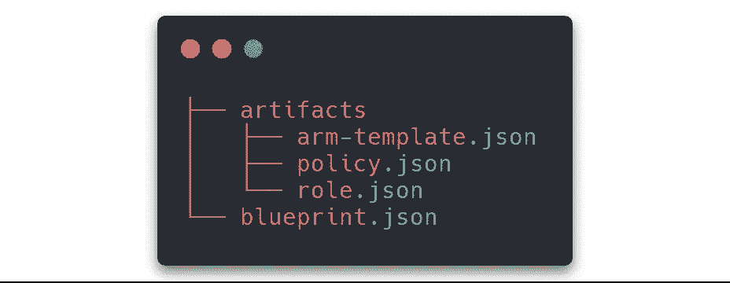
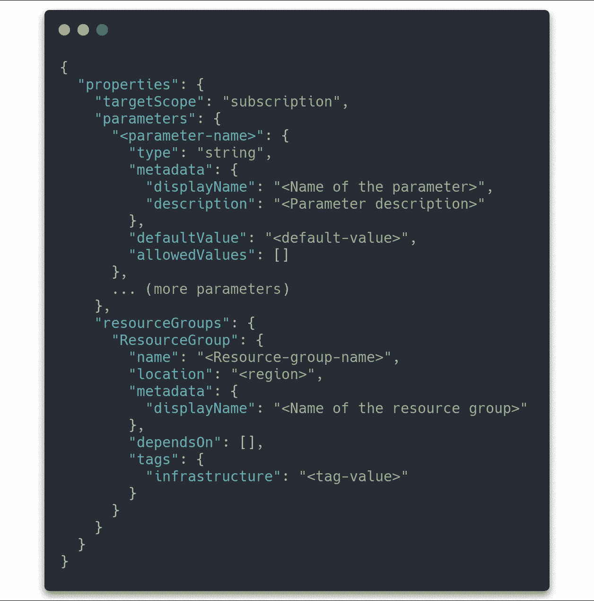
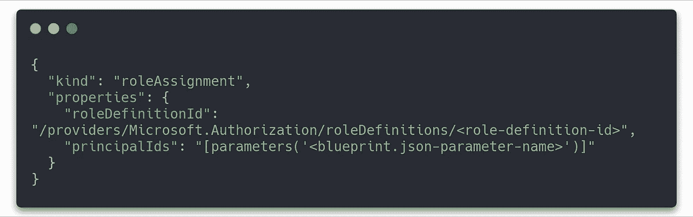
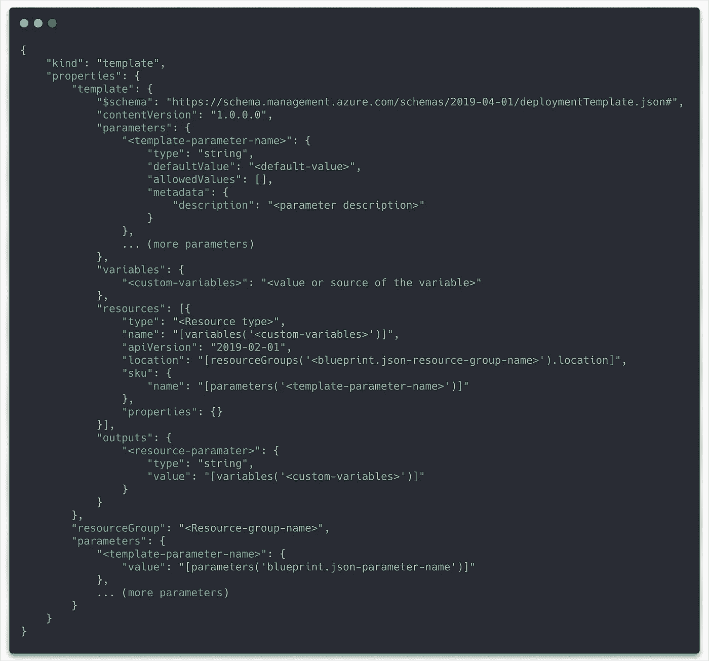
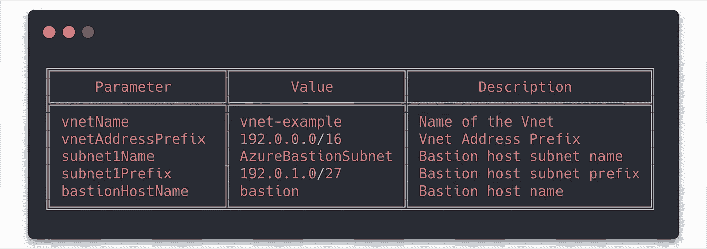
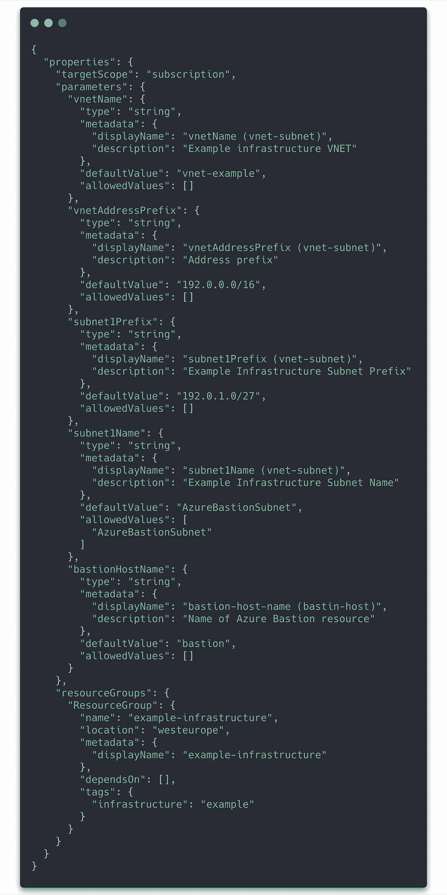
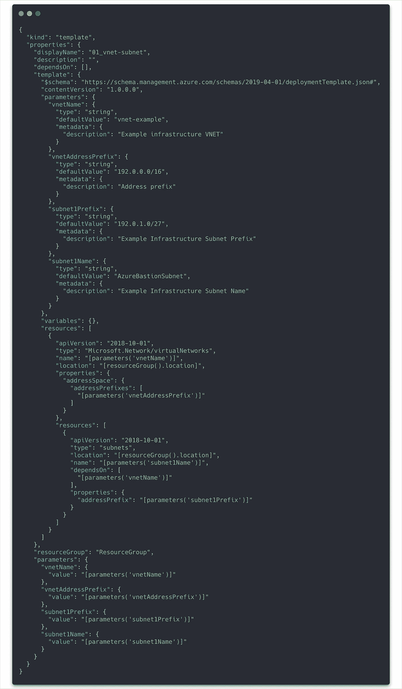
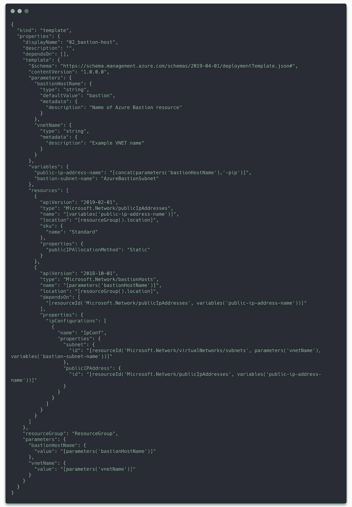

# 基础设施作为带有 Azure 蓝图的代码，它是一个平台替代方案吗

> 原文：<https://itnext.io/iac-azure-blueprints-and-terraform-7349ecf8d61c?source=collection_archive---------1----------------------->

来自 [Pixabay](https://pixabay.com/de/photos/blaupause-herrscher-architektur-964630/) 的 [Wokandapix](https://pixabay.com/de/users/wokandapix-614097/) 的照片

云基础设施的部署不再是令人困惑的 GUI 中的点击式冒险。相反，工具用于将基础设施描述为代码。各种提供商为他们的云服务提供专有解决方案，如亚马逊网络服务(AWS)的 CloudFormation 或 OpenStack 的 Heat。另一方面，还有 Terraform 等解决方案，支持多个云提供商。微软在这个领域也很活跃，并为他们的 Azure 云提供蓝图服务，目前仍处于预览状态。

本文描述了如何使用 Azure 资源管理(ARM)模板通过 Blueprint 服务在 Azure 中创建基础设施，并列出了常见的陷阱。

# 介绍

在我的微软 Azure 蓝图之旅的开始，我对蓝图可能如何工作有一些期望。它能与 Terraform 相媲美吗？它会错过一些地形特征吗？经过几天对服务的熟悉，我对如何使用它和它的可用特性集感到有点惊讶。

# 蓝图架构

蓝图的架构基于两个主要组件:蓝图文件和工件。工件可以是角色、策略和 ARM 模板。所有这些文件都是以 json 格式编写的。一般来说，文件的结构如下:“blueprint.json”文件位于根目录中，工件位于工件文件夹中。下面的目录树说明了这一点。文件的内容描述如下。

## blueprint.json

该文件描述了要创建的所有资源组以及蓝图级别的参数。

## 政策. json

在策略工件中，有必要指定类型。在这种情况下，使用“policyAssignment”和属性“policyDefinitionId”。

## role.json

首先，这个文件指定了它是哪种工件。对于角色分配，这是具有“角色定义 Id”和“原则 id”属性的“角色分配”。

## arm-模板. json

术语 ARM-template 代表 Azure 资源管理器模板。它描述了要在指定的资源组中创建的资源。微软在其[文档](https://docs.microsoft.com/en-us/azure/azure-resource-manager/templates/template-syntax)中描述了模板的确切结构和语法。

# 示例创建虚拟网络子网堡垒

以下示例描述了如何创建一个包含虚拟网络(vnet)、子网和堡垒主机的资源组，以便以更高的安全性管理组中的资源。文件夹结构如下树所示。注意工件 json-files 开头的数字。其原因将在下一章中描述。

首先，我们从定义蓝图级参数开始。下面的列表对它们进行了概述。

利用参数描述和蓝图的文件结构，我们能够创建“blueprint.json”文件。

有不同的方法来组合工件，将所有的资源放在一个 ARM 模板文件中。这对于小型部署是有意义的，但是对于大型部署，我推荐另一种方法:在单独的文件中定义每个资源。这提供了一个更好的概览，并更容易地改进您的部署结构。这就是我们在这个故事中要遵循的方式。我们为网络资源创建一个工件文件，并为堡垒主机创建一个单独的文件。第一个文件是“01_network.json”文件，它包括虚拟网络和子网定义。

部署的第二部分包括创建堡垒主机、公共 IP 地址并将其分配给主机。这将在“02_bastion.json”文件中定义。

正如我们所看到的，资源部分包含两个资源。首先是公共 IP 地址资源，其次是分配了虚拟网络和公共 IP 地址的堡垒主机。

# 蓝图处理和工作流程

现在我们已经准备好在微软 Azure 中通过 Rest API 或 PowerShell 创建蓝图。两种方式都使用不同的命令执行相同的过程。以下步骤描述了该过程:

*   使用 blueprint.json 文件创建蓝图
*   将您的工件一个文件一个文件地添加到蓝图中(不可能用一个命令导入多个工件)
*   发布您的蓝图
*   分配蓝图

这些步骤在针对 [Rest API](https://docs.microsoft.com/en-us/azure/governance/blueprints/create-blueprint-rest-api) 和 [PowerShell](https://docs.microsoft.com/en-us/azure/governance/blueprints/create-blueprint-powershell) 的 Azure 文档中有更详细的描述。

正如已经提到的，工件的命名很重要。当蓝图被分配时，工件以字母数字的顺序被执行。因此，在命名工件文件时，您必须考虑对资源的依赖性。我建议在文件名的开头使用数字顺序。

重要的是要知道，大多数 API 和 PowerShell 特性在 Web-UI 上不可用，并且在创建过程中云服务不会检查蓝图上的更改。错误只会在分配过程中显示。这是一个巨大的缺点，因为它使得蓝图的开发更加困难和耗时。

# 使用 PowerShell 导入和导出蓝图

如果您已经创建了一个蓝图，您可以导入或导出整个蓝图定义。微软的[文档](https://docs.microsoft.com/bs-latn-ba/azure/governance/blueprints/how-to/import-export-ps)中也描述了这个过程，在那里你也可以找到这些命令。

首先，您需要蓝图对订阅的引用，这可以通过下面的命令来完成。

要导出蓝图，您可以使用导出命令。

并且可以使用 import 命令完成导入。

# 蓝色蓝图和地形

最后，我将描述这两种技术的关键特征和优势。

蓝图服务提供以下功能:

*   该服务包括版本控制，这使得处理一个蓝图的多个状态变得更加容易。
*   blueprints 服务与微软 Azure 的集成是高层次的，可以通过 API、PowerShell 和部分 Web-UI 来管理。
*   蓝图可以在管理组级别使用。
*   微软为这项服务提供了复杂的文档，包括示例和附加信息。它分布在许多页面上，这使得对服务进行概述和熟悉变得不必要的复杂。
*   Blueprints 是一项专有服务，仅适用于 Azure cloud。

另一方面，Terraform 具有以下特征:

*   它可以用于多个云部署。
*   它有一个很大的社区，为开发提供了很多例子和帮助。
*   Terraform 自动管理依赖关系。
*   语法和部署检查包括在内，这大大提高了开发速度。
*   文档结构良好，形状稳定。

# 结论

我建议将 Blueprint 服务仅用于管理组级别的特殊 Azure 功能，例如为订阅(如策略和角色)提供框架。对于复杂的基础设施，我更喜欢使用 Terraform，它提供了更多的灵活性。

Azure Blueprints 可能会成为一项可靠的服务。微软需要开发更容易描述资源依赖和共享变量的特性。该服务需要更高效的开发流程来检查语法和依赖关系，以提供更快的上传蓝图更改的解决方案，并与 Terraform 竞争。