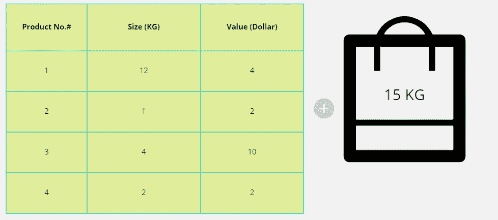
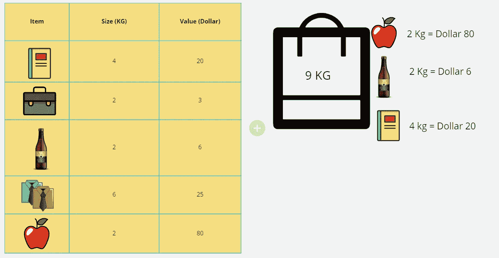

# 背包模式——模式识别与动态规划求解

> 原文：<https://itnext.io/identify-knapsack-pattern-solve-with-dynamic-programming-b673bed3324f?source=collection_archive---------2----------------------->

# 介绍

**组合优化**是一种优化方法，包括从有限的一组对象中找到一个最佳对象。它有许多著名的问题，如旅行推销员问题、最小生成树问题和背包问题。

**背包问题**是一个组合优化问题。它也被称为**背包问题**。它的名字来源于下面的最大化问题，即选择最合适的必需品放在一个包里，以便在旅行中携带。

> 给定一组项目，每个项目都有一个重量和一个值，确定集合中每个项目的数量，使总重量小于给定的限制，并且总值尽可能大。

示例:

假设有一个包，它的最大容量为 **15 公斤**重，可以携带物品。有几组给定的项目，每一组都有一个利润值。因此，背包问题决定了每一个项目，以最大限度地增加收入。



图 1:背包示例

# 背包问题的类型

背包问题有三种类型:

*   0/1 背包问题
*   有界背包问题
*   无界背包问题

## 0/1 背包问题

这是一个非常常见的背包问题。它将每种项目的数量限制为零或一。

示例:

假设阿米尔希望在旅行中携带 ***n*** 件物品，并且它具有以下条件:

*   ****I****项的重量是 ***作业指导书*** *项和项都不一样。***
*   **物品放在一个载重量为 c 的背包中携带: *(a)当物品重量之和≤ c 时，n 件物品都可以放在背包中。* *(b)当物品权重之和> c 时，某些物品必须被留下。***

**如果不允许我们取小数，那么这就是 0/1 背包问题。**

****

**图 2:背包 0/1**

## **有界背包问题**

**有界背包问题将每个物品的数量限制在一个特定的值。它取消了每种项目只有一个的限制，而是将每种项目的拷贝数***【Xi】****限制为最大非负整数值 ***c*** *。****

## **无界背包问题**

**无界背包问题对每个物品的数量没有限制。项目可以重复。**

# **0/1 背包问题——有界**

## **最大化小偷的利润**

**一个小偷拿着一个包走进一家商店，开始从商店里偷东西。他包的最大容量是 10 公斤。他不能在包里放超过 10 公斤的东西。他只想把那些他能从中获得更多利润的东西放进他的包里。*(这里盗贼不能分也不能啄物品，要么拿一个物品要么不拿(0–1 属性)。***

```
**price = [ 20, 5, 10, 40, 15, 25 ]
weight = [ 1, 2, 3, 8, 7, 4 ]
bagWeight = 10 kg**Output: 60**price = 20 + 40 = 60
total weight = 1 + 8 = 9 < bagWeight**
```

****解决方案****

**这个问题可以通过使用两种不同的可能性来解决:**

*   **包括背包中的当前物品，对剩余物品重复，然后减少重量。**
*   **不要将当前物品放入背包，并重复剩余物品。**

**通过使用递归:**

```
**def getMaxProfitForThief(price, weight, n, bagCapacity):
    if bagCapacity < 0:
        return float('-inf')

    if n < 0 or bagCapacity == 0:
        return 0exclude = getMaxProfitForThief(price, weight, n-1, bagCapacity)
    include = getMaxProfitForThief(price, weight, n-1, bagCapacity - weight[n]) + value[n]

    return max(exclude, include)if __name__ == '__main__':
  price = [ 20, 5, 10, 40, 15, 25 ]
  weight = [ 1, 2, 3, 8, 7, 4 ]
  bagCapacity = 10 getMaxProfitForThief(price, weight, len(price) - 1, bagCapacity)**
```

**通过使用动态编程(记忆化):**

```
**def getMaxProfitForThief(price, weight, n, bagCapacity, memo):
    if bagCapacity < 0:
        return float('-inf')

    if n < 0 or bagCapacity == 0:
        return 0

    key = str(n) + '-' + str(bagCapacity)
    if key in memo:
        return memo[key]exclude = getMaxProfitForThief(price, weight, n-1, bagCapacity, memo)
    include = getMaxProfitForThief(price, weight, n-1, bagCapacity - weight[n], memo) + value[n]

    memo[key] = max(exclude, include)
    return memo[key]if __name__ == '__main__':
  price = [ 20, 5, 10, 40, 15, 25 ]
  weight = [ 1, 2, 3, 8, 7, 4 ]
  bagCapacity = 10getMaxProfitForThief(price, weight, len(value) - 1, bagCapacity, {})**
```

**通过使用动态编程(制表):**

```
**def getMaxProfitForThief(price, weight, bagCapacity):
    n = len(price)
    dp = [[0 for _ in range(W + 1)] for _ in range(n + 1)]

    for i in range(1, n + 1):
        for j in range(1, bagCapacity + 1):
            if weight[i - 1] > j:
                dp[i][j] = dp[i-1][j]
            else:
                dp[i][j] = max(dp[i-1][j], dp[i-1][j-w[i-1]] + v[i-1])

    return dp[n][bagCapacity]if __name__ == '__main__':
  price = [ 20, 5, 10, 40, 15, 25 ]
  weight = [ 1, 2, 3, 8, 7, 4 ]
  bagCapacity = 10getMaxProfitForThief(price, weight, bagCapacity)**
```

## **子集和问题**

**存在一组非负整数，目标值和确定是否存在给定集合的和等于给定目标和的子集。**

```
**arr = [3, 34, 4, 12, 5, 2]
target = 9**Output:** True**Explanation:** There is a subset (4, 5) with target sum 9.**
```

****解决方案****

**通过使用递归:**

```
**def getSubset(arr, n, target):
    if target == 0:
        return True

    if n == 0:
        return False

    if arr[n-1] > target:
        return getSubset(arr, n-1, target)

    return getSubset(arr, n-1, target - arr[n-1]) or getSubset(arr, n-1, target)if __name__ == '__main__':
   arr = [3, 34, 4, 12, 5, 2]
   target = 9
   getSubset(arr, len(arr)-1, target)**
```

**通过使用动态编程(制表):**

```
**def getSubset(arr, target):
    n = len(arr)
    dp = [[False for _ in range(target + 1)] for _ in range(n+1)]
    for i in range(n+1):
        dp[i][0] = True

    for i in range(1, n+1):
        for j in range(1, target+1):
            if arr[i-1] > j:
                dp[i][j] = dp[i-1][j]
            else:
                dp[i][j] = dp[i-1][j] or dp[i-1][j-arr[i-1]]

    return dp[n][target]if __name__ == '__main__':
  arr = [3, 34, 4, 12, 5, 2]
  target = 9
  getSubset(arr, target)**
```

## **划分相等子集和**

**给定非空正整数，找出数组是否可以分成两个子集，使得两个子集的元素之和相等。**

```
****Input:** nums = [1,5,11,5]
**Output:** true
**Explanation:** The array can be partitioned as [1, 5, 5] and [11].**
```

****解决方案:****

```
**def canPartition(nums):
    n = len(nums)
    total = sum(nums)

    if total % 2 != 0:
        return False

    W = total // 2
    dp = [[False for _ in range(W + 1)] for _ in range(n + 1)]

    for i in range(n + 1):
        dp[i][0] = True

    for i in range(1, n + 1):
        for j in range(1, W + 1):
            if nums[i-1] > j:
                dp[i][j] = dp[i-1][j]
            else:
                dp[i][j] = dp[i-1][j] or dp[i-1][j-nums[i-1]]

    return dp[n][W]if __name__ == '__main__':
  nums = [1,5,11,5]
  canPartition(nums)**
```

## **总和等于目标值的子集计数**

**给定一个包含元素和一个目标的非空数组，找出和等于目标的子集数。**

```
****Input:** arr = [1, 2, 3, 3] target = 6 
**Output:** 3**Explanation:** All possible subsets are = [1, 2, 3], [1, 2, 3], [3, 3]**
```

****解决方案:****

```
**def getCountOfSubset(nums, target):
    n = len(nums)
    dp = [[0 for _ in range(target + 1)] for _ in range(n + 1)]
    dp[0][0] = 1

    for i in range(1, n + 1):
        for j in range(target + 1):
            if nums[i-1] > target:
                dp[i][j] = dp[i-1][j]
            else:
                dp[i][j] = dp[i-1][j] + dp[i-1][j-nums[i-1]]

    return dp[n][target]if __name__ == '__main__':
  nums = [ 3, 3, 3, 3 ]
  target = 6 getCountOfSubset(nums, target)**
```

**另一种方法:**

```
**def getCountSubsets(arr, target):
    n = len(arr)
    dp = [[0 for _ in range(target + 1)] for _ in range(n + 1)]
    dp[0][0] = 0

    for i in range(1, n + 1):
        for j in range(target + 1):
            if arr[i-1] > j:
                dp[i][j] = dp[i-1][j]
            else:
                dp[i][j] = max(dp[i-1][j], dp[i-1][j-arr[i-1]] + 1)

    return dp[n][target]arr = [1, 2, 3, 3]
target = 6
getCountSubsets(arr, target)**
```

## **目标总和**

**给定一个整数数组`nums`和一个整数`target`。**

**您希望通过在 nums 中的每个整数前添加符号`'+'`和`'-'`中的一个来构建 nums 中的**表达式**，然后连接所有的整数。**

*   **举个例子，如果`nums = [2, 1]`，你可以在`2`前加一个`'+'`，在`1`前加一个`'-'`，串联起来构建表达式`"+2-1"`。**

**返回您可以构建的不同**表达式**的数量，其计算结果为`target`。**

```
****Input:** nums = [1,1,1,1,1], target = 3
**Output:** 5
**Explanation:** There are 5 ways to assign symbols to make the sum of nums be target 3.
-1 + 1 + 1 + 1 + 1 = 3
+1 - 1 + 1 + 1 + 1 = 3
+1 + 1 - 1 + 1 + 1 = 3
+1 + 1 + 1 - 1 + 1 = 3
+1 + 1 + 1 + 1 - 1 = 3**
```

****解决方案:****

```
**def findTargetSumWays(nums, target):
    n = len(nums)
    total = sum(nums)

    if target > total:
        return 0

    if (target + total) % 2 != 0:
        return 0

    s1 = (total + target) // 2dp = [[0] * (s1 + 1) for i in range(n + 1)]
    if len(dp) <= 0 or len(dp[0]) == 0:
        return 0

    dp[0][0] = 1

    for i in range(1, n + 1):
        for j in range(s1+1):
            if nums[i-1] > j:
                dp[i][j] = dp[i-1][j]
            else:
                dp[i][j] = dp[i-1][j] + dp[i-1][j - nums[i-1]]

    return dp[n][s1]if __name__ == '__main__':
    nums = [1,1,1,1,1]
    target = 3
    findTargetSumWays(nums, target)**
```

## **最后一石重量 II**

**给你一个整数数组`stones`，其中`stones[i]`是`ith`宝石的重量。**

**我们在用石头玩游戏。在每一轮，我们选择任意两块石头，然后一起打碎它们。假设石头有重量`x`和`y`和`x <= y`。这次粉碎的结果是:**

*   **如果`x == y`，两块石头都被摧毁，并且**
*   **如果`x != y`，重量`x`的石头被破坏，重量`y`的石头有了新的重量`y - x`。**

**游戏结束，最多剩下**一块**石头。**

**返回*左侧宝石*的最小可能重量。如果没有剩余的石头，返回`0`。**

```
****Input:** stones = [2,7,4,1,8,1]
**Output:** 1
**Explanation:**
We can combine 2 and 4 to get 2, so the array converts to [2,7,1,8,1] then,
we can combine 7 and 8 to get 1, so the array converts to [2,1,1,1] then,
we can combine 2 and 1 to get 1, so the array converts to [1,1,1] then,
we can combine 1 and 1 to get 0, so the array converts to [1], then that's the optimal value.**
```

****解决方案:****

```
**def lastStoneWeightII(stones):
    n = len(stones)
    total = sum(stones)
    target = total // 2
    dp = [0  for i in range(target + 1)]

    for stone in stones:
        for w in range(target, stone-1, -1):
            dp[w] = max(dp[w], dp[w-stone] + stone)

    return (total - (2 * dp[target]))if __name__ == '__main__':
   stones = [2,7,4,1,8,1]
   lastStoneWeightII(stones)**
```

## **完美的正方形**

**给定一个整数`n`，返回*与*和`n`之和的最小的完美平方数。**

**一个**完美平方**是一个整数，它是一个整数的平方；换句话说，它是某个整数与自身的乘积。例如，`1`、`4`、`9`和`16`是完美的正方形，而`3`和`11`不是。**

```
****Input:** n = 12
**Output:** 3
**Explanation:** 12 = 4 + 4 + 4.**
```

****解决方案:****

```
**import mathdef numSquares(n):
    square_nums = [i ** 2 for i in range(1, int(math.sqrt(n)) + 1)]
    dp = [float('inf')] * (n + 1)
    dp[0] = 0

    for i in range(1, n + 1):
        for square_num in square_nums:
            if i < square_num: 
                break

            dp[i] = min(dp[i], dp[i - square_num] + 1)

    return dp[-1]if __name__ == '__main__':
  n = 12
  numSquares(n)**
```

## **1 和 0**

**给你一个二进制字符串数组`strs`和两个整数`m`和`n`。**

**返回*`*strs*`*的最大子集的大小，使得**`m`*`0`*和* `n` `1` *的子集*中最多有****的。*********

*如果`x`的所有元素也是`y`的元素，则集合`x`是集合`y`的子集**。***

```
***Input:** strs = ["10","0001","111001","1","0"], m = 5, n = 3
**Output:** 4**Explanation:** The largest subset with at most 5 0's and 3 1's is {"10", "0001", "1", "0"}, so the answer is 4.
Other valid but smaller subsets include {"0001", "1"} and {"10", "1", "0"}.
{"111001"} is an invalid subset because it contains 4 1's, greater than the maximum of 3.*
```

***解决方案:***

```
*def findMaxForm(strs, m, n):
    dp = [[0] * (n + 1) for _ in range(m + 1)]

    for s in strs:
        zeros = s.count("0")
        ones = s.count("1")

        for i in range(m, zeros-1, -1):
            for j in range(n, ones-1, -1):
                dp[i][j] = max( 1 + dp[i - zeros][j- ones], dp[i][j] )

    return dp[m][n]if __name__ == '__main__':
   strs = ["10","0001","111001","1","0"]
   m = 5
   n = 3
   findMaxForm(strs, m, n)*
```

## *整数分隔符*

*给定一个整数`n`，将其分解为`k` **个正整数**之和，其中`k >= 2`，最大化那些整数的乘积。*

*返回*你能得到的最大产品*。*

```
***Input:** n = 2
**Output:** 1
**Explanation:** 2 = 1 + 1, 1 × 1 = 1.*
```

***解决方案:***

```
*def integerBreak(n):
    dp = [0]*(n+1)
    dp[2] = 1

    for i in range(3, n+1):
        for j in range(1, i-1):
            dp[i] = max(dp[i], j*max(i-j, dp[i-j]))

    return dp[-1]if __name__ == '__main__':
  n = 2
  integerBreak(n)*
```

# *0/1 背包问题——无界*

## *硬币零钱*

*给你一个整数数组`coins`代表不同面额的硬币，一个整数`amount`代表钱的总数。*

*返回你需要的最少数量的硬币来补足这个数目。如果硬币的任何组合都无法补足该金额，则返回`-1`。*

*你可以假设每种硬币都有无限个。*

***解决方案:***

```
***Input:** coins = [1,2,5], amount = 11
**Output:** 3**Explanation:** 11 = 5 + 5 + 1*
```

***解决方案:***

```
*def coinChange(coins, amount):
  dp = [float("inf")] * (amount + 1)
  dp[0] = 0

  for a in range(1, amount + 1):
     for coin in coins:
         if a - coin >= 0:
             dp[a] = min(dp[a], 1 + dp[a - coin])

  if dp[amount] != float("inf"):
        return dp[amount]

  return -1if __name__ == '__main__':
  coins = [1,2,5]
  amount = 11
  coinChange(coins, amount)*
```

## *硬币零钱 2*

*给你一个整数数组`coins`代表不同面值的硬币，一个整数`amount`代表钱的总数。*

*返回组成该金额的组合数。如果硬币的任何组合都无法补足该金额，则返回`0`。*

*你可以假设每种硬币都有无限个。*

*答案是**保证**适合一个带符号的 **32 位**整数。*

```
***Input:** amount = 5, coins = [1,2,5]
**Output:** 4**Explanation:** there are four ways to make up the amount:
5=5
5=2+2+1
5=2+1+1+1
5=1+1+1+1+1*
```

***解决方案:***

```
*class Solution(object):
    def change(self, amount, coins):
        """
        :type amount: int
        :type coins: List[int]
        :rtype: int
        """
        dp = [0] * (amount + 1)
        dp[0] = 1

        for coin in coins:
            for i in range(coin, amount + 1):
                dp[i] += dp[i-coin]

        return dp[-1]if __name__ == '__main__':
  amount = 5
  coins = [1,2,5]
  change(amount, coins)*
```

***组合和四***

*给定一个由**个不同的**个整数`nums`和一个目标整数`target`组成的数组，返回*加起来等于* `target`的可能组合数。*

*测试用例被生成，以便答案可以适合一个 32 位的**整数。***

```
***Input:** nums = [1,2,3], target = 4
**Output:** 7
**Explanation:**
The possible combination ways are:
(1, 1, 1, 1)
(1, 1, 2)
(1, 2, 1)
(1, 3)
(2, 1, 1)
(2, 2)
(3, 1)
Note that different sequences are counted as different combinations.*
```

***解决方案***

```
*class Solution(object):
    def combinationSum4(self, nums, target):
        """
        :type nums: List[int]
        :type target: int
        :rtype: int
        """
        dp = [ 0 for _ in range(target+1) ]
        dp[0] = 1

        for i in range(target):
            for num in nums:
                if i + num < target + 1: dp[i+num] += dp[i]

        return dp[-1]if __name__ == '__main__':
   nums = [1,2,3]
   target = 4
   combinationSum4(nums, target):*
```

## *最低票价*

*你已经提前一年计划了一些火车旅行。一年中你将要旅行的日子以整数数组`days`的形式给出。每天是从`1`到`365`的整数。*

*火车票以三种不同的方式出售:*

*   *一张**一日**通行证售价`costs[0]`美元，*
*   *一张 **7 天**通行证售价`costs[1]`美元，以及*
*   *一张 **30 天**通行证售价`costs[2]`美元。*

*通行证允许多日连续旅行。*

*   *例如，如果我们在`2`日获得 **7 天**通行证，那么我们可以旅行`7`天:`2`、`3`、`4`、`5`、`6`、`7`和`8`。*

*返回*在给定的天数列表中*你每天需要旅行的最小美元数。*

```
***Input:** days = [1,4,6,7,8,20], costs = [2,7,15]
**Output:** 11**Explanation:** For example, here is one way to buy passes that lets you travel your travel plan:
On day 1, you bought a 1-day pass for costs[0] = $2, which covered day 1.
On day 3, you bought a 7-day pass for costs[1] = $7, which covered days 3, 4, ..., 9.
On day 20, you bought a 1-day pass for costs[0] = $2, which covered day 20.
In total, you spent $11 and covered all the days of your travel.*
```

***解决方案:***

```
*class Solution(object):
    def mincostTickets(self, days, costs):
        """
        :type days: List[int]
        :type costs: List[int]
        :rtype: int
        """
        dp = [0 for _ in range(days[-1] + 1)]

        for i in range(1, days[-1] + 1):
            if i in days:
                if i < 7:
                    dp[i] = min(dp[i - 1] + costs[0], dp[0] + costs[1], dp[0] + costs[2])
                elif i < 30:
                    dp[i] = min(dp[i - 1] + costs[0], dp[i - 7] + costs[1], dp[0] + costs[2])
                else:
                    dp[i] = min(dp[i - 1] + costs[0], dp[i - 7] + costs[1], dp[i - 30] + costs[2])
            else:
                dp[i] = dp[i-1]

        return dp[-1]if __name__ == '__main':
    days = [1,4,6,7,8,20]
    costs = [2,7,15] mincostTickets(days, costs)*
```

# *背包问题的复杂性分析*

*一般来说，背包问题是 NP 难的。这意味着对于这个问题没有已知的多项式时间算法。这里，我们采用贪婪的启发式方法，它不能保证最优解。*

## *结论*

*背包问题是组合优化中的一个问题。有许多基于背包问题模式的问题陈述。一旦完全理解了背包问题，就可以通过使用动态规划方法来轻松解决这些问题。*