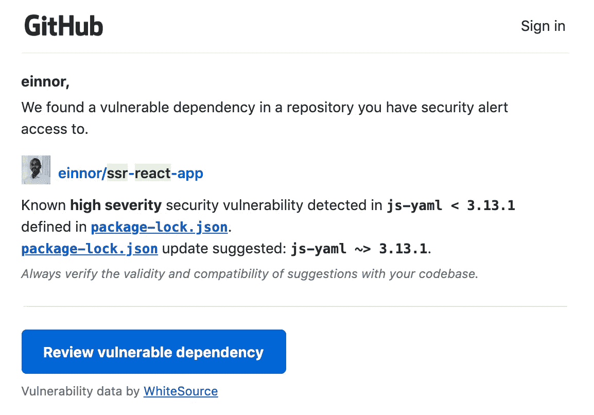
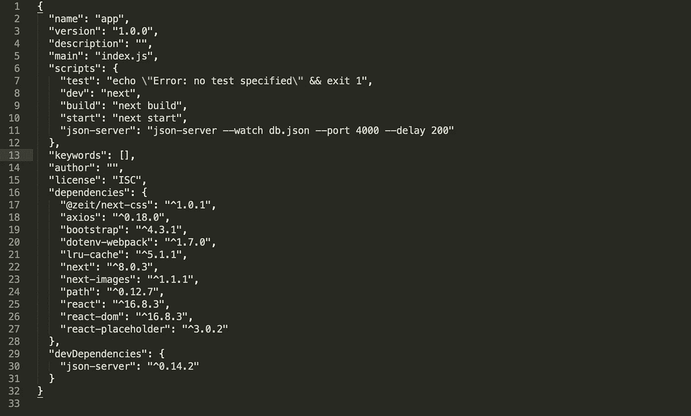
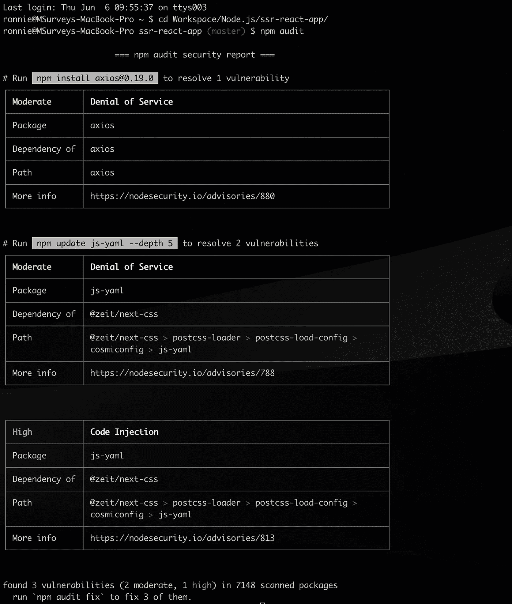
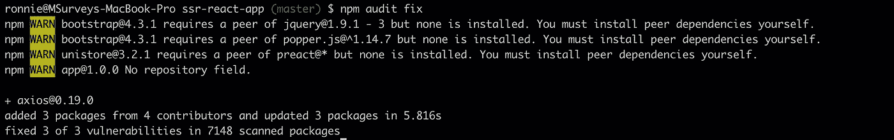
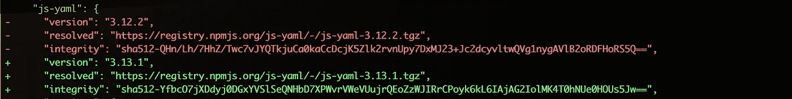

# 使用 NPM 审计识别安全漏洞

> 原文：<https://itnext.io/identifying-security-vulnerabilities-using-npm-audit-9c590eec9615?source=collection_archive---------1----------------------->

我最近收到了一封来自 Github 的电子邮件，通知我我的一个回购存在一定的安全漏洞。

Github 邮件的主题

这不是我第一次收到这样的邮件。过去，一收到这封邮件，我会立即着手消除检测到的漏洞。但是在这一次，我想分享一下是个好主意，也许可以解释一下我通常是如何解决这个问题的。

上面报道的 repo， ***ssr-react-app*** ，是我用来摆弄 [Next.js](https://nextjs.org/) 及其服务器端渲染实现的一个测试 repo。这是很久以前的事了。因为这篇文章不是关于这些的，所以我不会深究细节。我们将严格遵循手头的主题，即下面的问题。

Github 安全漏洞电子邮件正文

在已安装的 **js-yaml** 版本中检测到一个已知的**高严重性**安全漏洞。

在我们开始讨论如何解决这个问题的各种方法之前，我们需要了解这样的事情是如何发生的。为了对开源社区做出贡献，许多开发人员出去寻找可用解决方案中的差距，或者还没有发布解决方案的其他开发人员所面临的挑战。

我们大多数人使用其他开发者以库的形式构建的大量代码。使用所述库的原因各不相同——构建定制解决方案的时间限制、没有必要重新发明轮子的感觉、某些库作者的简单欣赏等等。不管是什么原因，在软件开发的过程中，我们经常发现自己将库拉入到代码库中。在 Javascript 环境中，就像我的例子，包是从 NPM(节点包管理器)中提取的。

NPM 是不同作者发布的数千个软件包的注册表。由于这些包解决了特定的问题，有时它们可能会在代码中引入漏洞。这可能来自包本身，或者它所使用的依赖关系——我们称之为级联依赖关系。例如，安装 Node.js web 应用程序框架 [Express](https://expressjs.com/) ，会额外安装它所依赖的 40 多个其他包！安全性是一个很大的问题，尤其是当我们谈论将软件产品交付生产时。视而不见的反响很大。

漏洞的例子从跨站点脚本问题(占所有安全问题的 80%以上)到拒绝服务问题，如事件循环阻塞、内存耗尽和正则表达式安全攻击。这些安全漏洞可能导致服务器崩溃和数据被盗。

像 [Snyk](https://snyk.io/test/) 这样的在线服务可以用来测试 Github repos、npm 包和 docker 映像中的已知漏洞。但是在我们的例子中，我们将直接跳到终端，探索 *npm audit* 和 *npm audit fix* 命令。

# NPM 审计

npm 审计用于跟踪并报告您环境中的 NPM 模块的安全漏洞。每个漏洞都有严重级别(低、中、高、严重)。不言而喻，但标记为高或关键的问题需要立即解决。检测到问题后，NPM 审计会为您提供一个选项，通过将软件包升级到已修复已识别问题的已发布版本来修复这些问题。

回到 ***ssr-react-app*** 。下面是 package.json 文件。记下*依赖关系*属性。

ssr-react-app package.json

Github 报告的检测到的包 js-yaml 在我们的 package.json 中指定的依赖项中丢失了！奇怪吗？我们很快会回到这个话题。

下一步是导航到我的应用程序文件夹的根目录，并运行 *npm audit* 命令。下面是结果。

国家预防机制审计的结果

我们来剖析一下这个。我们检测到三个漏洞(两个严重性中等，一个严重性高)。

每个漏洞都有一个**严重性级别**和**类型的漏洞**、**包的名称**、**对**的依赖性(这表明该包是否是另一个已安装的包的依赖性)以及一个**更多信息**列，该列提供了一个链接，该链接提供了关于漏洞性质的更多详细信息。我强烈推荐你点击更多信息链接。如果我们的目标是解决一个问题，那么我们必须首先理解它。

上述输出中报告的第二个漏洞是 **js-yaml** 。但如果你仔细观察，你会发现这是一个 **zeit/next-css** 的依赖。这是级联依赖的结果——我们之前提到过。

*npm 审计*命令有一个 *json* 标志，以 json 格式输出相同的信息。该输出可以选择性地写入文件。

将 npm 审核导出到 JSON 文件

JSON 输出可以被输入到可视化工具或解析器中，在持续集成(CI)过程中，解析器会提取出问题的总数。

运行 *npm 审计修复*命令尝试修复这些漏洞。

npm 审核修复命令的结果

我们走吧。3 个问题中的 3 个得到解决。 *axios* 包已经从 0.18.0 升级到 0.19.0。此外，还添加了来自 4 个贡献者的 3 个包，并更新了 3 个包。这似乎已经修复了漏洞。但是哪里都没有提到 js-yaml。它真的升级了吗？嗯，看起来可能不是这样，但是一个快速的 *git diff package-lock.json* 将会证明事实并非如此。

git diff package-lock.json 命令的代码片段

这毫无疑问地证明了 js-yaml 包确实从 3.12.2 版升级到了 3.13.1 版，其中实现了漏洞修复。

在运行 *npm audit fix* 命令时，语义版本控制是需要注意的。如果升级是补丁或次要版本，则升级会自动进行。然而，如果升级需要转换到主版本，那么必须传递一个 *force* 标志。小心这面旗。与具有向后兼容性的次要版本和补丁版本不同，主要版本通常具有突破性的变化。因此，在运行该命令之前，请参考软件包文档。

如果您只是想看看在运行 *npm 审计修复*时可能会升级什么，而不一定会影响更改，那么*试运行*标志就是您所需要的。

npm 审核修复—模拟运行命令

fix 命令还提供了一个仅用于*的*标志，用于定位环境包，即 *dev* 或 *prod* 。 *prod* 参数将指向 package.json 文件中 *dependencies* 属性中的包，而 dev 参数将指向 *devDependencies* 。

npm 审核修复—仅=产品

# 如果没有发布的修复程序呢？

有时可能会报告某些问题，但没有发布可用的修复程序。在这种情况下:

1.  通过发现所报告风险的根源并通过创建问题来报告它，来帮助包的维护者。您甚至可以继续使用您实现的解决方案进行拉取请求。
2.  使用包的分叉版本并对其进行修复。然后，您可以在应用程序中引用分叉版本。

# NPM 审计的好处

1.  利用开源社区中其他贡献者的工作
2.  问题被清楚地识别出来，并标上严重程度
3.  如果发布了解决方案，则提供现成的选项来修复检测到的漏洞

# 包扎

手动检查所有依赖项及其级联依赖项来寻找安全漏洞是一项乏味的工作。我们必须依靠社区来发现安全问题，报告/解决它们。这就是 npm audit 的意义所在——利用这个庞大的社区，它不仅编写我们使用的代码，还识别和修复所有代码中的漏洞。

需要注意的是，通过对输入数据进行适当的清理，也可以降低触发这些漏洞的可能性。

使用 npm audit 消除漏洞并不能消除代码本身(即应用程序开发人员编写的代码)中存在的漏洞。适当的编码标准和设计模式也对此有很大帮助。