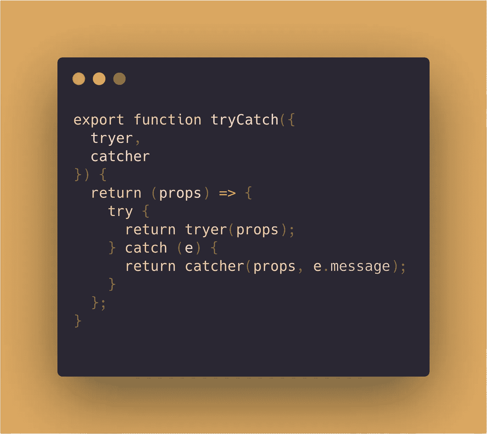

# Javascript if-else 和 try-catch 作为函数构造

> 原文：<https://itnext.io/if-else-and-try-catch-as-functional-constructs-da5c6a749f8c?source=collection_archive---------2----------------------->

在[编写更多函数式 Javascript 实用指南](https://medium.com/@nadeesha/a-practical-guide-to-writing-more-functional-javascript-db49409f71)中，我们介绍了如何用函数式编程术语推理我们的代码。在本指南中，我们将讨论几个我喜欢用来推理这些概念的实用程序，并帮助我们浏览 JavaScript 本身提供的命令式结构。

## 小心处理

我认为让语言中的命令式结构(if-else/try-catch)更具声明性将会提高代码的可读性和可测试性。这是一个不太坚定的观点，因为我也能理解它的隐性成本。

正确的抽象很难，因为它迫使你和你的团队达成共识。达成一致很难——尤其是当你试图将简单的语言结构重写为功能抽象时。这加倍困难，因为什么样的代码可读性更好，什么水平的单元测试也是非常主观的。

## 功能结构#1:有条件地

在我之前的文章中，我论证了函数构造的必要性。让我们考虑一个基本的语言结构:if-else。如果我们能把 if-else 表达成一个函数构造会怎么样？

实现是这样的:

直截了当地说，有条件地问这样一个问题:我能以这样一种方式写 if-else 吗，即在 true 条件或 false 条件下，总是通过计算一个函数来返回值？或者换句话说，如果我可以表达 if-else 在一个纯函数中的作用，它看起来是什么样的？

它需要一个配置，有三个功能:`if()`、`then()`和`else()`。它构造了一个可以接收你的`props`参数的函数。

当`if(props)`评估为真时，它触发`then(props)`，否则触发`else(props)`。所有这三个函数接收相同的输入，并且通常产生相同类型的结果。

*如果使用 Typescript，我们可以用泛型来强制输入类型和结果。如果这看起来很复杂，或者你没有使用 Typescript* *中* [*泛型的经验，可以随意跳过下面的例子。*](https://medium.freecodecamp.org/how-to-wrap-your-head-around-typescript-generics-8d243f7de78)

让我们考虑一个普通的 if-else 条件。

上面的例子是一个几乎完美的写作方式。但是我们可以做得更好。现在我们考虑用`conditionally`来写这个。

这可能看起来有点冗长。但是让我们稍微分析一下…

不同的问题现在由两个不同的职能部门处理。`conditionally`已经温柔地迫使你**分开你的顾虑**。这反过来又给了你选择**测试所有这些关注点**，并有条件地模拟它们——遵守单元测试的大部分 F.I.R.S.T 原则。

当其他人阅读你的代码来理解`getCarConfig`是做什么的时候，他们不需要去看`priceChange`和`getDescription`的实现细节，因为你已经恰当地命名了事物。你的提取现在有了一个单一的责任，恰当的命名为读者创造了最少的惊奇。

这就是我提倡在 Javascript 中使用 FP 的原因。它迫使你将问题分解成称为函数的小原子部分。这些功能:

1.  分开你的顾虑
2.  提高可测试性
3.  自然坚持[单一责任原则](https://en.wikipedia.org/wiki/Single_responsibility_principle)
4.  通过一点命名的练习，最小惊讶原则被保留了下来

## 功能结构#2: tryCatch

在许多语言中，异常是一个强大的工具。它们提供了一个躲避未知的、不合理的和不安全的系统边界的避难所。

在 Javascript 中，您可以使用 try-catch:

但是 try-catch 有点冗长。如果你想记录状态(就像这里的`storedSuccessfully`，你必须声明一个 let 来表示一个可能的状态突变，就像例子一样。此外，从语义上讲，try-catch 表示控制流中断，使得代码更难阅读。

让我们试着创建一个功能实用程序来减轻这些问题。

这里，我们将 try-catch 构造封装在一个函数中。tryCatch()将接收一个带有两个函数的配置对象。然后它返回一个接受单个`props`对象的函数。

1.  `tryer(props)`将被评估，并返回结果。
2.  在做`tryer(props)`的时候，如果出现异常，就会调用 catcher(props)。

同样，使用 Typescript，您可以使用泛型来强制这个构造的输入类型和输出类型。如果这里的泛型看起来有点令人生畏，我已经写了一篇泛型初学者入门，以及为什么你应该使用它们 [*这里*](https://medium.freecodecamp.org/how-to-wrap-your-head-around-typescript-generics-8d243f7de78) *。*

记住这一点，让我们试着重构我们之前的例子。

*如果你对 pipe 的用法不熟悉，可以看看我之前的文章* [*编写函数式 javascript 的实用指南*](https://medium.freecodecamp.org/a-practical-guide-to-writing-more-functional-javascript-db49409f71) *。TLDR 认为这是一个反* `*compose()*` *。*

我们可以再次看到，我们的函数构造迫使我们将代码中不安全的部分分解成不同的函数。此外，我们最终得到了 3 个离散的函数，我们可以通过管道()将它们连接在一起以获得最终结果。

我前面解释的好处在这里也适用。其中最重要的是可读性。现在，当有人阅读您的 setUserLangage 函数时，他们不必承担预先解析 try-catch 的认知负担，因为它被封装在一个恰当命名的`storeLanguageCode`函数中。

## 结束语

我不提倡为了写东西而在`conditionally`和`tryCatch`写东西。有时，一个简单的三元运算或一个普通的 if-else 使事情保持完全可读。但是，我个人会尽可能地遵循惯例。惯例允许开发人员做出更少的决定并节省脑力。

而`conditionally`和`tryCatch`默认为我做了很多好的决定。

[被认为有害的小函数](https://medium.com/@copyconstruct/small-functions-considered-harmful-91035d316c29)列出了与这种方法相反的观点。我不完全同意那篇文章中的一些东西，其中一些在 FP 范式中根本站不住脚。尽管如此，我恳求你去读一读。

软件工程中没有绝对。不，[连](https://www.sandimetz.com/blog/2016/1/20/the-wrong-abstraction)都没干。一如既往，不断探索并运用你的最佳判断力。