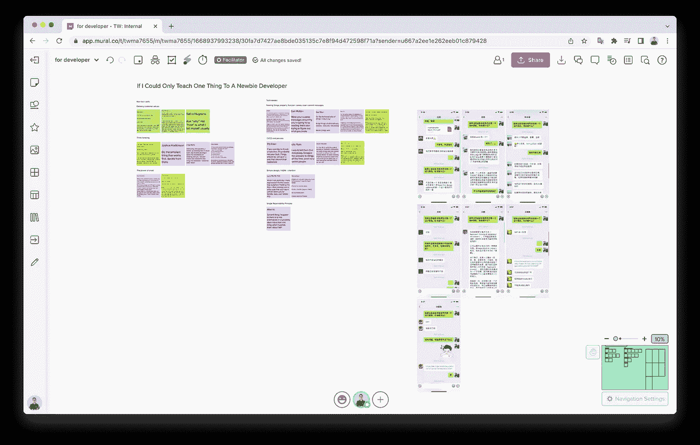
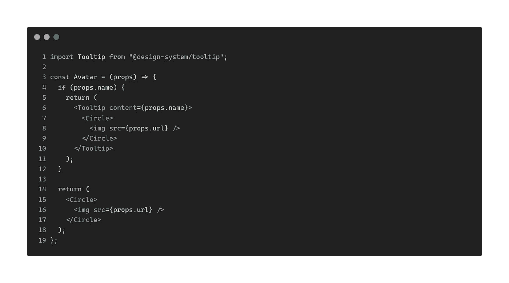
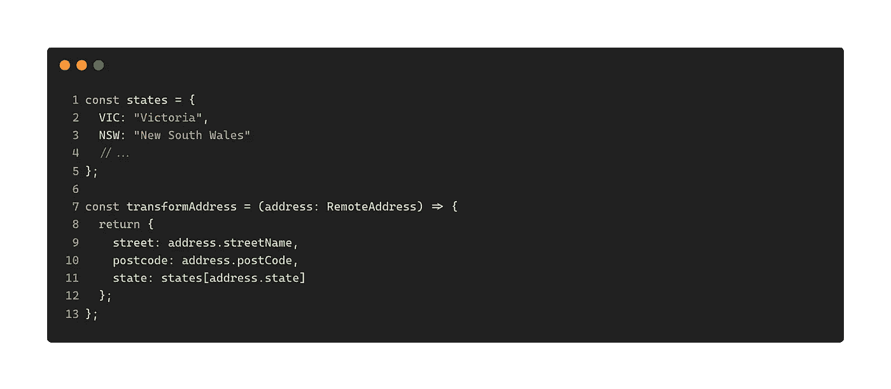
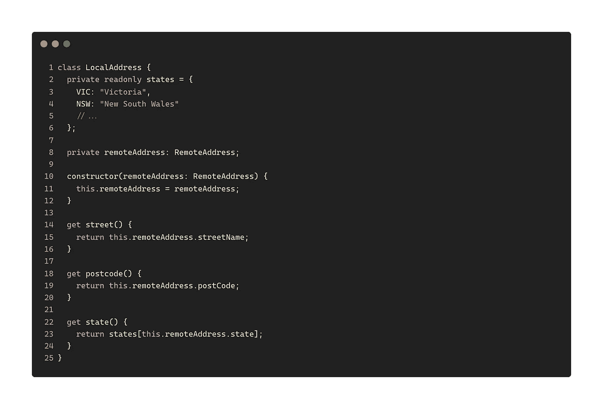
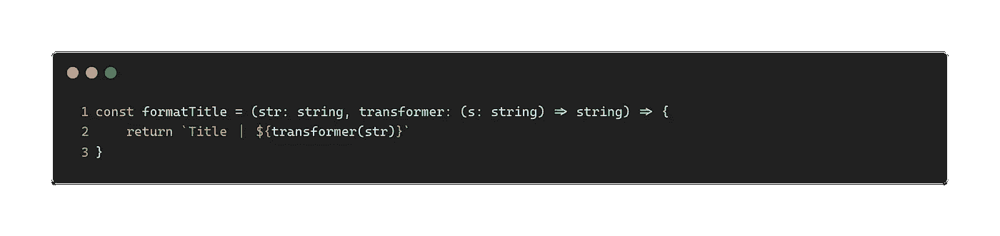
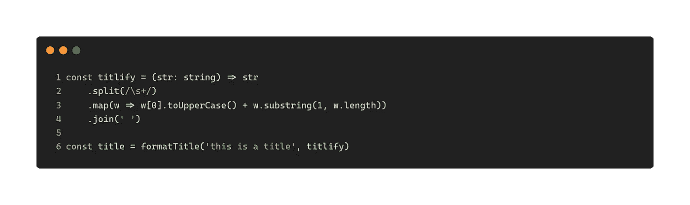

# 如果我只能教一个初学者一样东西

> 原文：<https://itnext.io/if-i-could-only-teach-one-thing-to-a-beginner-developer-1f98d4ff6cb7?source=collection_archive---------0----------------------->

照片由[印尼 UX](https://unsplash.com/@uxindo?utm_source=medium&utm_medium=referral)在 [Unsplash](https://unsplash.com?utm_source=medium&utm_medium=referral) 上拍摄

几周前，当我写一篇关于如何[抽象你的代码](/how-to-write-more-reusable-code-73f936283eff)使之更容易重用的博文时，我有了一个有趣的想法。我想知道其他开发人员认为他们应该教给新手开发人员的最重要的原则是什么，以及为什么他们会选择这个设计原则。

所以我做了一些不同的“采访”，一些是通过微信，一些是通过谷歌表单，其余的是通过内部的谷歌聊天 T21。

数据收集和分析

# 单一责任原则

结果超级刺激。首要原则是“单一责任原则”，简称 SRP。尽管有其他的解释，通常，SRP 意味着你应该保持你的函数，类或者模块尽可能的简单和一致。

一个具体的例子是我在谷歌聊天线程中使用的:

> *…* ***我建议他们给自己的函数起一个有意义的名字(与第一点有关)，看看他们是否必须使用连词 like 和/或来定义函数正在做什么。如果是这样的话，他们应该拆分那个功能…***

它也适用于代码的不同层次。例如，一个类不应该做两件不同的不相关的事情。一个数据类`Person`可能有`name`、`address`和`dob`，但是方法`deliver`就太多了。

例如，下面是我在本文中讨论的一个例子[，一个`Avatar`组件包含一个`Tooltip`，当`props.name`被提供时就会显示出来。通过应用 SRP，您可能希望将与`Tooltip`相关的代码分发给消费者，并确保`Avatar`只关心与角色相关的逻辑。](https://medium.com/javascript-in-plain-english/did-someone-say-composition-c7843d898b2)

通过应用 SRP 简化您的代码

# 包装

第二高的主题是封装。天真地说，这可能意味着不要使用分散的数据或函数，它们需要封装在一个类中。但是除此之外，这也意味着您需要知道什么数据和方法需要放在哪里。

我将在这里使用我的另一篇文章中的例子，并展示我们如何使用`class`来轻松封装这些公开的数据。

这些小的数据转换函数和 React 组件是很常见的，随着前端使用这些数据的方式发生变化(映射缩写为全名或在需要时添加 if-else 逻辑)，这些小的顶级函数开始难以维护。

转换地址功能

然后我们可以为所有的数据和转换函数准备一个`class`。如果转换逻辑发生变化，我们只需在一个地方进行修改。设置测试也更容易——您可以定义一些变化的输入，并验证该类的公共方法的输出。

将地址逻辑封装到一个类中

# 不要重复你自己

单子上的第三条是干的——不要重复。我们都讨厌在编码时做重复的工作，尤其是当我们必须手工做的时候。一般来说，三个的[法则适用于大多数情况，这意味着你只能接受少于三个的重复实例。](https://en.wikipedia.org/wiki/Rule_of_three_(computer_programming))

这里要注意的一件事，就像软件开发中的其他原则一样，就是你应该首先寻求理解复制背后的目的，然后拆除那个复制。有一些有趣的阅读资料(我已经把它们放在底部的参考资料部分)说明了在什么情况下不应该删除重复的内容。

我发现不同的编程语言提供了使工作变得更容易或更困难的机制。例如，在函数式编程语言中，你可以像传递变量一样传递它们，因为函数是一级的，这在纯面向对象语言中是不可能的。

高阶函数

然后你可以传入**任何**函数来避免重复，比如:

像变量一样传入函数

而在 Java 中，例如(如果我的 Java 知识需要更新，请评论让我知道)，你必须首先创建一个接口，并传入实现该接口的类来实现它，这相当麻烦。

# 摘要

这三大原则根植于大多数开发人员的头脑中，尽管因人而异的解释略有不同。

SRP 确保你只专注于一件事，并把它做得完美，如果做得好，可测试性和可组合性都会随之而来。虽然封装有助于将连贯的内容、算法、数据和逻辑放在一个中心位置，但它也有助于更容易理解代码。最后，DRY 使代码始终保持简单和简洁的状态。还有，修改的时候也不用担心忘记更新其他地方。

# 参考资料:

*   [不要重复自己](https://www.plutora.com/blog/understanding-the-dry-dont-repeat-yourself-principle)
*   [再见干净代码](https://overreacted.io/goodbye-clean-code/)
*   [错误的抽象](https://sandimetz.com/blog/2016/1/20/the-wrong-abstraction)

**如果你喜欢阅读，请** [**报名参加我的邮件列表**](https://icodeit.com.au/#subscribe) **。我每周通过** [**博客**](https://juntao-qiu.medium.com/)**[**书籍**](https://leanpub.com/u/juntao) **和** [**视频**](https://www.youtube.com/@icodeit.juntao) **分享干净代码和重构技术。****

**我希望你喜欢读这篇文章。如果你愿意支持我成为一名作家，可以考虑注册[成为](https://medium.com/@juntao-qiu/membership)中的一员。每月只需 5 美元，你就可以无限制地访问我在 Medium 上的所有文章——以及上述作者和其他人的所有文章！**