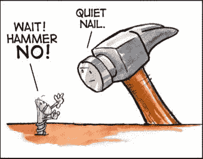
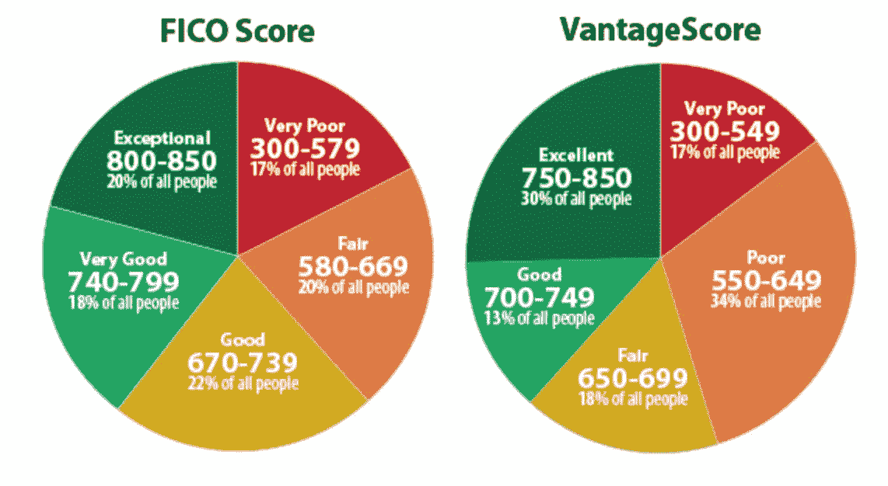

# 如果你唯一拥有的工具是人工智能，那就把一切都当成预测吧！

> 原文：<https://itnext.io/if-the-only-tool-you-have-is-artificial-intelligence-treat-everything-as-if-it-were-a-prediction-3beeeedc9314?source=collection_archive---------6----------------------->

[*点击这里在 LinkedIn* 上分享这篇文章](https://www.linkedin.com/cws/share?url=https%3A%2F%2Fitnext.io%2Fif-the-only-tool-you-have-is-artificial-intelligence-treat-everything-as-if-it-were-a-prediction-3beeeedc9314)

[JavaScript 之锤](http://cek.io/blog/2016/02/08/javascript-hammer/)

可能没有一句格言比“*”更能说明商业行为的好坏，这句格言出自 [**亚伯拉罕·马斯洛**](https://en.wikipedia.org/wiki/Abraham_Maslow,) “我想，如果你唯一的工具是一把锤子，把一切都当成钉子，这是很有诱惑力的。”*

*这个短语是马斯洛在《科学心理学》(1966)和他的早期著作《存在心理学》(1962)中提出的。Sharlyn Lauby 从法律中吸取了以下教训:“我们需要谨慎选择我们使用的工具。”一些工具是适应性的，而另一些工具应该“仅用于其预期目的”。*

*然而，这可能不是经济学家看待锤子用途的方式。从经济学家的角度来看，你能找到的钉子越多，制造锤子的单位成本就越低，所以套用莎士比亚的话，经济学家最有可能说“世界上的我的钉子，我用锤子将它敲打。”*

*不管它的起源如何，这句简单的格言正在对所有地方的人工智能(AI)的前卫世界产生影响。人工智能在过去几年里取得了巨大的进步，主要是因为执行人工智能的方法发生了重大变化。最初，人工智能研究人员认为他们会使用“基于逻辑的”人工智能，但这变得难以处理，所以他们转向了“统计”人工智能。从那时起，进步是戏剧性的，并被广泛采用。人工智能产品的制造商现在正在寻找尽可能多的“统计问题”。*

*机器学习是统计人工智能的一种重要类型，被用于一系列计算任务中，在这些任务中，设计和编程具有良好性能的显式算法是困难的或不可行的。机器学习的例子包括电子邮件过滤、检测网络入侵者或恶意内部人员破坏数据、[6]光学字符识别(OCR)、学习排序和计算机视觉。*

*机器学习模型的目标是识别“输入数据”和“目标变量”或结果的某些特征之间的统计可靠关系。*

*[**牛顿归纳原理**](http://apex.ua.edu/uploads/2/8/7/3/28731065/four_rules_of_reasoning_apex_website.pdf) 是机器学习的第一条不成文的规则。我们尽可能归纳出最广泛适用的规则，只有当数据迫使我们这样做时，才缩小它们的范围。*

*现在，“ [**《机器智能的简单经济学》**](https://hbr.org/2016/11/the-simple-economics-of-machine-intelligence) ”的作者在机器学习可以应用的范围方面提供了更多信息。根据多伦多大学罗特曼学院教授 Ajay Agrawal、Joshua Gans 和 Avi Goldfarb 的说法，机器智能技术本质上是一种依靠统计和概率的" ***预测技术*** "。所以，就像那些锤子和钉子以及“剑和牡蛎”一样，我们需要预测的东西越多，人工智能和机器学习应用程序就变得越有价值。*

*美国计算机游戏和人工智能领域的先驱亚瑟·塞缪尔(Arthur Samuel)1959 年在 IBM 工作时创造了术语“**”。在数据分析领域，机器学习是一种用于设计模型和算法以进行预测的方法；在商业用途上，它被称为“ [**预测解析** s](https://en.wikipedia.org/wiki/Predictive_analytics) ”。这些分析模型允许研究人员、数据科学家、工程师和分析师“产生可靠的、可重复的决策和结果”，并通过从历史关系中学习来揭示“隐藏的见解”。***

***概率的计算自 15 世纪以来就已经存在，当时布莱士·帕斯卡被要求解决一些法国贵族之间的赌博纠纷，但它产生了许多变体，并被广泛应用于大多数人工智能应用。以下是普遍接受的机器学习技术。一般统计/预测技术的采用应该是显而易见的:***

*   ***回归分析***
*   ***聚类分析***
*   ***降维支持***
*   ***向量机***
*   ***人工神经网络***
*   ***决策树***
*   ***联想分析***
*   ***推荐系统***

***《机器智能的简单经济学》**的作者表示，“与人工智能应用相关的经济转变将围绕预测成本的下降，这将反过来产生两个关键影响:*****

*   *****随着机器智能降低预测的成本，我们将开始使用它作为我们以前从未做过的事情的输入。(即锤子和钉子、剑和牡蛎等。)*****
*   *****与预测相关的其他输入的价值，如判断力和创造力，将根据它们对预测的补充或替代程度而增加，补充的价值将增加，替代的价值将减少。*****

*****人类真的不擅长预测未来。在预测方面，我们需要一切可能的帮助。这包括专家。在对专家预测准确性的最大和最著名的测试中，Philip Tetlock 的书 ***中的一项研究报告了专家的政治判断:有多好？怎么才能知道呢？普通的专家被发现仅仅比投掷飞镖的黑猩猩稍微准确一点。如果许多专家进行随机猜测，他们会做得更好。即使是最好的预测者也被武断的规则打败了，比如“*永远预测不变*”。********

*****不管用来产生智能的技术是基于逻辑的还是统计的，人工智能的范围都集中在实现一个目标或目标状态上。*****

*****一个简单的计算机开发行为以达到目标状态的例子是经常被诽谤但被广泛使用的“信用评分”模型。信用评分几乎拥有人工智能的所有特征，机器可以使用这些特征来评估实现目标的行动过程。这就是它的工作原理。*****

**********

*****[两种最常见的信用评分类型是 FICO 评分和 VantageScore 评分](https://www.experian.com/blogs/ask-experian/credit-education/score-basics/what-is-a-good-credit-score/)*****

*****信用评分的第**步**是建立一个目标或目标状态。在信用评分的情况下，目标状态是 ***“违约概率”(PD)*** 。信用报告机构热衷于“大数据”。大数据实际上只不过是包含大量结构化数据的数据库，这些数据用于识别关系、模式和趋势。*****

*****在信用评分的情况下，以大数据为基础，计算不同消费群体的违约概率。虽然“大数据”可能相对较新，但概率的计算自 15 世纪以来就已存在。第二步可能是信用评分计算中最重要的一步，是确定与 PD 相关的变量。然后，根据消费者信用历史中与违约概率相关的一个或多个变量，将消费者群体从违约概率最高到最低进行分层。分数被分配给不同的阶层。对于大多数信用评分模型，等级及其分值如下所示:*****

*   *****优秀 815–850*****
*   *****非常好 755–814*****
*   *****良好 666–754*****
*   *****公平 562–665*****
*   *****差 504–561*****
*   *****极差 300–503*****

*****一旦分层到位，**根据申请人数据与 PD 相关变量的匹配程度，将信贷申请人**分配到一个或另一个分层就很简单了。申请人的数据与违约概率相关的数据越匹配，机器对申请人的评价就越差，得分也就越少。因此，信用评分应用程序的一般规则是:*****

*   *****识别客观状态(如违约概率)*****
*   *****识别与客观状态相关的变量(与违约概率相关的变量)*****
*   *****确定与输入相关的变量(即信贷申请人)*****
*   *****找出与输入(信贷申请人)相关的变量与目标状态(PD)变量的相关性。*****
*   *****如果相关性高，则信贷申请人的 PD 高。*****

*****让我们来看另一个例子，它更抽象一些，比如“美”。 [**Paralleldots Inc**](https://paralleldots.xyz/) 。最近，他们宣布开发了一种[**深度卷积神经网络(CNN)**](https://en.wikipedia.org/wiki/Convolutional_neural_network) ，可以“训练识别图像的“美学质量”，就像识别违约概率一样。他们提供了一个[演示，展示了如何应用 CNN 进行可视化分析](https://www.paralleldots.com/visual-analytics)。*****

*****根据 Paralleldots 研究人员的说法，“*视觉审美分析是将图像分类为人类认为有吸引力或无吸引力的任务。*“在这方面，各种标准的 CNN 架构已经在 ImageNet 数据集上进行了预训练，并作为开源软件随时可用。ImageNet 是根据 WordNet 层次结构组织的图像数据库，其中层次结构的每个节点由成百上千的图像描述。*****

*****以下是谷歌 AVA 数据集的样本。Paralleldots 的研究人员使用这些对象以及谷歌 AVA 数据集**中的数百个其他对象，使他们的 CNN 能够通过识别“在互联网上疯传”的 AVA 图像来进行“视觉美学分析”(即 Paralleldots 团队定义的“视觉美学”)。*******

**************

*******[谷歌 AVA](https://research.google.com/ava/explore.html)*******

*******病毒检测 API 是通过在一个巨大的图像语料库(即谷歌 AVA 数据集)上训练一个超深度神经网络而构建的，它们的分数是从公开的网络中爬取的。您得到的输出分数是输入照片的病毒分数，满分为 100 分。Paralleldots 团队表示，他们的内部实验表明，他们的算法预测图像病毒率的准确率高达 85%。*******

*******例如，当我通过活力检测 API 运行下面这张亚利桑那州日落的照片时，它得到了 92%的分数。布拉格查理大桥的图片获得了 34%的评分。*******

**************

*******迈克·库普森 & [摄于亚利桑那州塞多纳的日落](https://www.dreamstime.com/stock-photo-prague-charles-bridge)*******

*******因此，Paralleldots 病毒检测 API 正在“预测”人类会发现亚利桑那州的日落比查尔斯桥更有吸引力，这是基于两者都将在互联网上“病毒式传播”的可能性。
虽然病毒检测应用程序可能看起来比普通的信用评分应用程序复杂得多，但两者所基于的预测原理是相同的:*******

*   *******确定客观状态(例如，在互联网上传播的可能性)*******
*   *******确定与客观状态相关的变量(与在互联网上疯传的照片相关的变量)*******
*   *******识别与输入相关的变量(如名画)*******
*   *******找出与输入(名画)相关的变量与客观状态变量(互联网上的病毒式传播)的相关性。*******
*   *******如果相关性高，则名画(例如亚利桑那州日落)的“美”(即在互联网上迅速传播)就高。(即亚利桑那州的日落比查尔斯桥“更美”)*******

*******所有这些可能会让艺术评论家感到不安，许多人可能会说，人工智能人只是把所有艺术评价都视为“钉子”，因为他们现在有了人工智能锤子。然而，根据多伦多大学的研究人员的说法，与预测艺术品之美有关的其他投入的价值，如判断力和创造力，将根据它们对预测艺术品之美的赞美或替代程度而增加，赞美将增加价值，替代将下降价值。*******

*******艺术评论家可能会考虑在多伦多大学的研究人员发现人类擅长而机器难以胜任的任务上发展他们的技能，比如:*******

*   *********学会学习** —人类善于学会学习——他们可以学习一项与他们当前的技能集完全无关的新技能，可以决定学习什么并相应地寻找和收集数据，可以隐式/下意识地学习，可以从多种指令格式中学习，可以提出相关问题来增强学习。今天的机器才刚刚开始学会学习。*******
*   *******常识**——人类擅长运用“常识”，即以普遍的方式进行判断，而不需要扩展思考或需要大量数据集。*****
*   *******直觉&【归零】**——人类的大脑擅长运用直觉和归零，即从一个非常庞大、复杂、模糊的选项集中找到一个事实、想法或行动过程。*****
*   *****创造力——真正的创造力需要能够对以前没有见过的问题提出新颖的解决方案，或者创造出真正创新的艺术作品*****
*   *****移情——保持人类独有的技能*****
*   *******多功能性** —机器和机器人仍然是为特定任务而制造的*****

*****虽然随着机器智能的增加，人类预测技能的价值会下降，就像机器对算术的影响一样，但这不应该给人类艺术评论家带来厄运。那是因为艺术评论家的判断技巧的价值会增加。*****

*****用经济学家的话来说，艺术评论家的判断可以作为预测美丽的自动化的补充，因此，当预测美丽的成本下降时，对具有良好判断的艺术评论家的需求将会上升。随着人工智能制造商将艺术品变成钉子或牡蛎或任何其他他们可以围绕其形成预测的东西，对更多具有良好人类判断力的艺术评论家的需求将会上升。*****

*****_______________________________________________________________*****

*******备注:*******

1.  *****《温莎的风流娘儿们》第二幕第二场威廉·莎士比亚的手枪。"*****
2.  *****多明戈斯佩德罗。大师算法:对终极学习机器的探索将如何重塑我们的世界(第 66 页)。基础书籍。Kindle 版。*****
3.  *****《温莎的风流娘儿们》第二幕第二场威廉·莎士比亚的手枪。"*****
4.  *****奥利弗·西奥博尔德，《面向初学者的机器学习》，2017 年*****
5.  *****Philip E. Tetlock，专家政治判断，普林斯顿大学出版社，2005 年*****
6.  *****人工智能——人类扩增就是此时此地*****

******感谢阅读！我的工作完全是读者资助的，所以如果你喜欢这篇文章，请帮助我们传播人工智能的进化，并在* [*Paypal*](http://PayPal.Me/BeidhSmith) 上做出贡献，*****