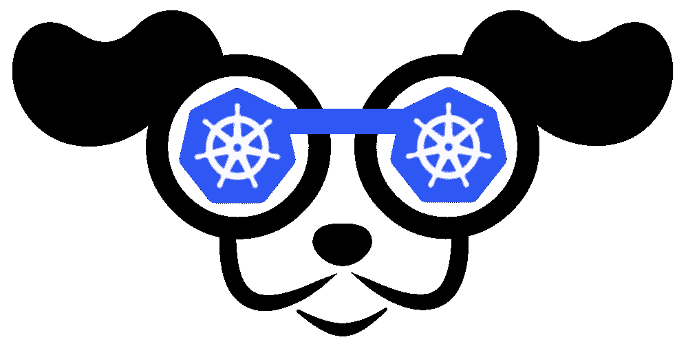
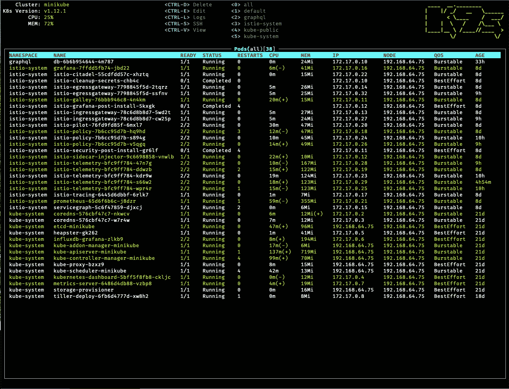

# 如果你 K8s，请尝试 K9s…

> 原文：<https://itnext.io/if-you-k8s-please-try-k9s-82ea30eb9aa3?source=collection_archive---------1----------------------->

K9s Kubernetes CLI 以时尚的方式管理您的集群！

让我们面对现实吧，Kubernetes 及其周围的生态系统越来越复杂，难以操作。人们必须使用多种工具来管理集群。当我在一个集群上工作时，我需要能够观察我所使用的各种 Kubernetes 资源，深入了解配置和设置，以及在事情不尽如人意时跟踪问题。这个流程通常需要别名化过度使用的命令，安装/操作单一用途的 CLI 工具和定制的 bash 脚本，以保持一定的理智，更不用说一定程度的健康手腕...

我知道这种技术正在变得有争议，但是我通常在本地开发代码，并且针对我的本地 minikube 实例，最后进行 dockerize。我通常不需要在我的集群上部署整个应用程序来处理任何给定的服务。我发现磨练我的代码以及我的配置和资源是一个连续的过程，而不是独立的活动。因此，我每天的 Kubernetes 例行程序是打开一个或多个终端窗口，分成不同的选项卡/窗格，用几个 watch 命令监视资源 *du jour* 以及打开 CLI 来发出 kubectl 和 build 命令。

有一天，我正在思考这个洗脑流程，并意识到如果有一个简单的 CLI 实用程序来查看 K8s 资源、在它们之间切换、检查清单、日志、监控事件并执行到 pods 中，从而消除我的大部分不动产终端面板，那将会很酷…

所以，我写了一个工具！它叫做[**【K9s】**](https://k9ss.io)**而且确实如此。**

****

**K9s Pod 视图**

**这个基于终端的 UI 以给定的时间间隔(默认为 2 秒)监控 Kubernetes 资源，并允许我查看我的集群的情况。我可以使用 **ctx < enter >** 命令在开发和生产集群之间快速导航。CLI 允许我按名称空间过滤，并对大多数 Kubernetes 资源执行只读操作(仍在进行中……)。如果我卡住了**？<输入>** 列出所有支持的资源。**

**当然，我发现它很有用，愿意与您分享，看看您的想法……这里是[回购](https://github.com/derailed/k9s)和安装说明的链接。**

**🐶感谢您的宝贵时间！**