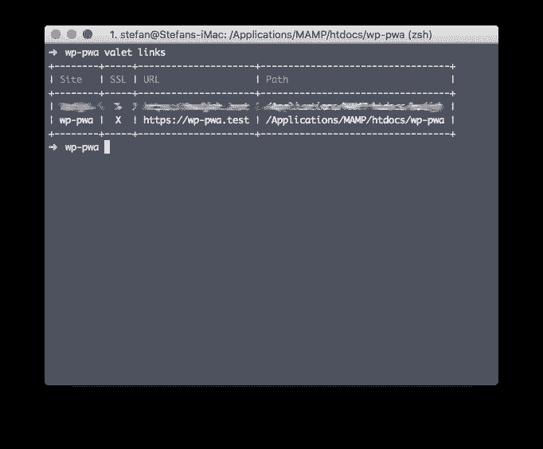
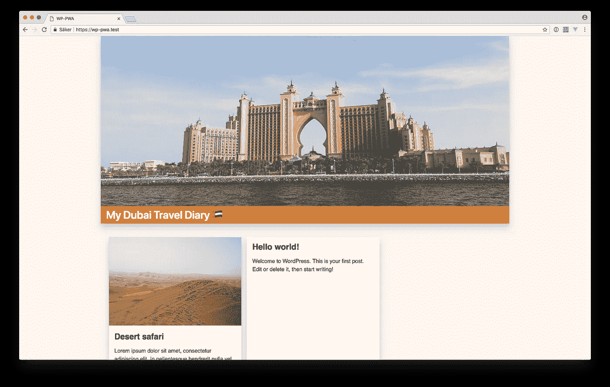
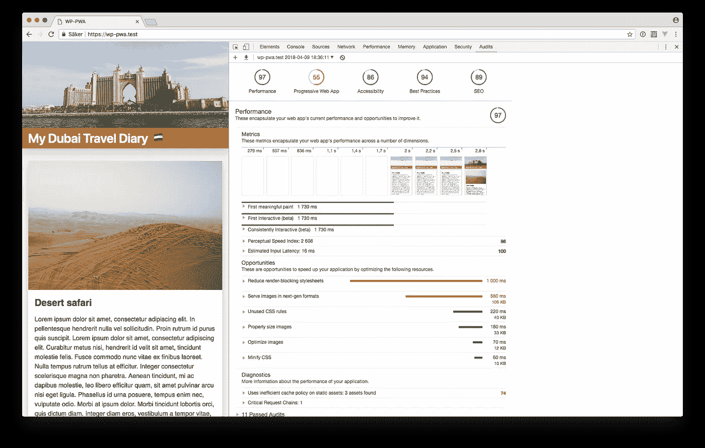

# 我正在制作一个离线的第一个 WordPress PWA，第一部分

> 原文：<https://itnext.io/im-making-an-offline-first-wordpress-pwa-part-1-6ae90ea672a4?source=collection_archive---------1----------------------->

## HTTPS

这是一系列有可能变得很长的博客文章的第一部分。你看，我要试着把一个普通的 WordPress 博客转换成一个渐进式网络应用程序(PWA。)

这是我去年秋天写的类似系列文章的后续，当时我试图做一个 Laravel PWA。

[](https://medium.com/@stefanledin/im-trying-to-make-a-progressive-web-app-part-0-d326333ee18e) [## 我在努力做一个进步的 Web App！(第 0 部分)

### 这是我要写的一系列文章中的第一篇，当我试图做一个 PWA(进步…

medium.com](https://medium.com/@stefanledin/im-trying-to-make-a-progressive-web-app-part-0-d326333ee18e) 

这一次的不同之处在于，我将尝试从那以后学到的新技术。我也将使用 WordPress 而不是 Laravel，因为那是我主要在工作中使用的。

结果应该是一个常规的 WordPress 博客首先离线，这意味着用户应该能够访问博客，即使他或她离线，或者连接不好。这也会让博客加载非常快。
谈到性能，我会尽可能多地应用最佳实践。

> 虽然这不是一个教程，但是类似于我将要经历的步骤和我肯定会遇到的问题的文档。

# 介绍

根据经验，我知道我必须使用维修工人来建造公共工程区。根据经验，我也知道 TLS，或者让我只说 HTTPS，将是需要的，以便与服务人员一起工作。

最简单的方法就是使用[拉勒维尔的贴身男仆](https://laravel.com/docs/5.6/valet)，在本地启动并运行 HTTPS。在这种情况下，忘掉 MAMP/WAMP 吧！

[](https://laravel.com/docs/5.6/valet) [## 面向 Web 工匠的 PHP 框架

### 面向 web 工匠的 PHP 框架。

laravel.com](https://laravel.com/docs/5.6/valet) 

下面的命令创建了一个新的目录，WordPress 使用 [WP-CLI](https://wp-cli.org/) 下载到这个目录。然后，使用 Valet 创建本地域`https://wp-pwa.test`。

```
$ mkdir wp-pwa && cd $_
$ wp core download
$ valet link
$ valet secure
```



WordPress 现在可以通过浏览到那个 URL 来安装，但是这一步我想你已经很熟悉了。

# 博客

这是我将要使用的 WordPress 博客:



嘿，别评判我，我不是设计师！但是我真的很想推荐一个非常好的实用框架，叫做 Tailwind CSS。

[](https://tailwindcss.com) [## 顺风 CSS

### 实用程序优先的 CSS 框架，用于快速构建自定义用户界面。

tailwindcss.com](https://tailwindcss.com) 

无论如何，这个博客使用了一个非常简单的主题，这是我从零开始做的，并且可以完全控制。

# 灯塔

让我们通过查看灯塔报告来结束这个系列的第一篇博文。这可以在 Chrome 开发者工具的审计标签下生成。

这是我们开始旅程时报告的样子:



博客已经有相当不错的评分了！例如，97/100 作为性能分数！但就 PWA 而言，只有 55/100，但这并不令人惊讶。毕竟我还没有做什么让它变得更好！

让我们看一下清单:


根据经验，我知道用一个`manifest.json`文件可以很容易地解决这些问题。这就是我将在本系列的第 2 部分中介绍的内容！