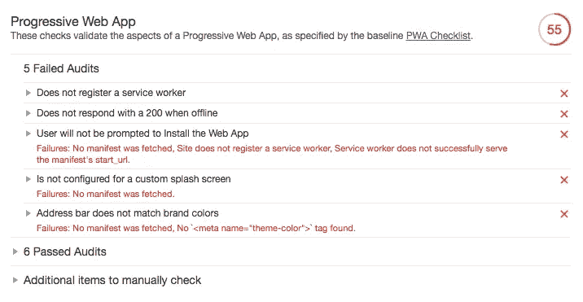
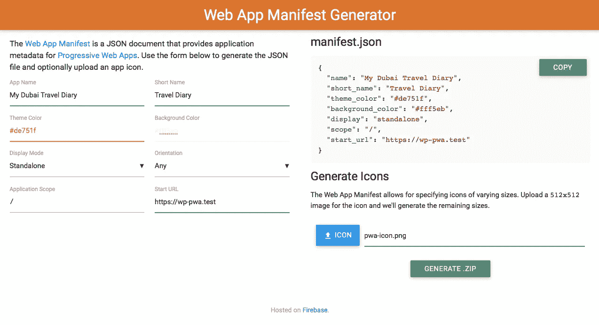
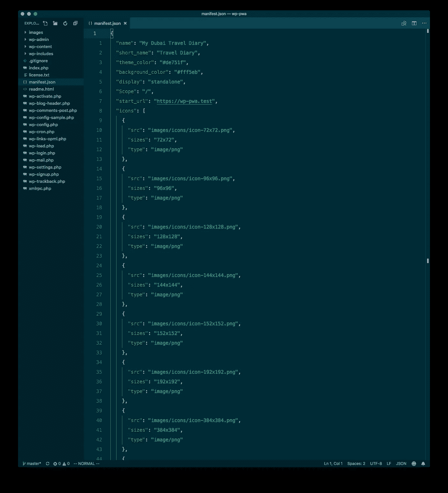
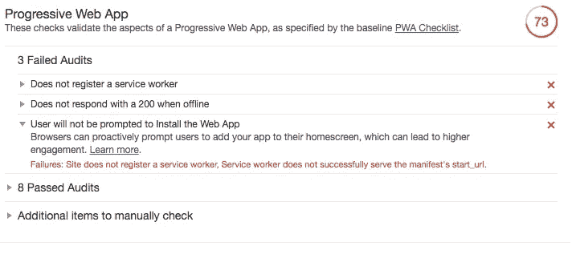

# 我正在制作一个离线的第一个 WordPress PWA，第二部分

> 原文：<https://itnext.io/im-making-an-offline-first-wordpress-pwa-part-2-b313659bfc9c?source=collection_archive---------3----------------------->

## Manifest.json

在本系列的第一部分，我使用了 Laravel Valet 让 HTTPS 使用本地域名。使用 SSL/TLS 是渐进式网络应用(PWA)的需求之一。)

除此之外，这是我目前为止使用的一个正规的 WordPress 博客吗？灯塔报告对此有如下说法:



在我把博客称为 PWA 之前，必须解决五个问题。其中三个是容易实现的目标，用`manifest.json`文件就能轻松解决:

*   不会提示用户安装 Web 应用程序
*   没有为自定义闪屏配置
*   地址栏与品牌颜色不匹配

# 生成 manifest.json 文件

Google 有一个非常清晰和好的文档[来描述一个`manifest.json`文件应该是什么样子以及它应该包含什么。但是既然有这么多在线工具可以为你生成一个，为什么不使用其中一个呢？](https://developers.google.com/web/fundamentals/web-app-manifest/)

我使用这个网站是因为它可以让你上传一个图标，然后为你生成一堆不同大小的版本。



生成的 JSON 文件如下所示:

这个文件和包含所有图标的文件夹放在项目的根目录下。



下一步是在链接到`manifest.json`文件的`<head>`中添加一个`<link>`标签。

```
<link rel="manifest" href="/manifest.json">
```

浏览器也必须被告知网站的“主题颜色”。这是通过一个`<meta>`标签完成的:

```
<meta name="theme-color" content="#de751f">
```

这些相当简单的动作给了我们下面的灯塔报告:



两个问题已经修复，但我认为`manifest.json`文件将解决的一个问题仍然存在:

*   不会提示用户安装 Web 应用程序

但是如果你仔细看看问题的描述，它实际上说需要一名服务人员。

> 失败:站点没有注册服务人员。服务工作程序未成功提供清单的 start_url。

但这是我将在下一部分解决的问题！

以前的零件:

*   [第一部分:HTTPS](https://medium.com/@stefanledin/im-making-an-offline-first-wordpress-pwa-part-1-6ae90ea672a4)